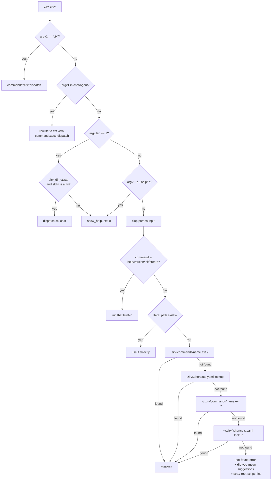

# Script Resolution

## Quick Reference

- Resolution order: **1)** `ctx` interception on raw argv, **2)** `chat`/`agent` top-level alias interception on raw argv, **3)** bare invocation (`argv.len() == 1`) — chat or help, **4)** top-level `--help`/`-h` interception on raw argv, **5)** clap-parsed built-ins (`help`, `version`, `init`, `create` and their short aliases), **6)** literal file path, **7)** local `.zirv/commands/` (direct extension match, then `.zirv/.shortcuts.yaml`), **8)** global `~/.zirv/commands/` (same two steps).
- Supported script extensions, in match order: `yaml`, `yml`, `json`, `toml` (`utils::SUPPORTED_EXTENSIONS`). Script directory root is always `.zirv` (`utils::SCRIPT_DIR_NAME`); invocable scripts live in its `commands/` subdirectory (`utils::COMMANDS_DIR_NAME`, issue #212, zirv 3.0). `.shortcuts.yaml` and the rest of zirv's config (`ctx.toml`, `.settings.toml`, `verify.toml`, `system-prompt.md`, `context/`, `memory/`) stay at the `.zirv` root, not in `commands/`.
- **If changed:** update [[Architecture Overview]]'s flow diagram and [[Shortcuts]] if the shortcut fallback logic changes; update [[Utilities]] if `candidate_names_in_dir`/`suggest_matches` change.
- **Gotchas:** the reserved built-in names (`help`, `h`, `version`, `v`, `init`, `i`, `create`, `c`, `ctx`, `chat`, `agent` — `utils::RESERVED_COMMANDS`) are matched *before* any script lookup, in `main.rs`. A script or shortcut sharing one of these names is permanently unreachable; `zirv help` flags this in its listing as "shadowed by a built-in command, unreachable", but nothing prevents creating the file in the first place. A bare `zirv` (no arguments) is itself now an alias for `zirv ctx chat` or `zirv help`, not a usage error — see step 3 below; this is a deliberate exit-code change from clap's own required-positional error (exit 2) to exit 0. **Hard cutover (zirv 3.0, issue #212):** a script left at the `.zirv` root (the pre-3.0 layout) does not resolve any more — there is no transitional root lookup. When nothing resolves and the `.zirv` (or `~/.zirv`) root still has script-like files (`*.yaml|*.yml|*.json|*.toml`, excluding the config set), `not_found_error` names up to 10 of them and says they need to move into `commands/`.

## Order of resolution

### 1. `ctx` interception (before clap)

`main.rs` checks `argv.get(1) == Some("ctx")` against raw `argv`, before `Input::parse()` ever runs. If it matches, control passes straight to `commands::ctx::dispatch(&argv[1..])` and the process exits with its return code — script lookup never happens. This is why a `.zirv/commands/ctx.yaml` (or `.json`/`.toml`) script is shadowed: see [[Ctx Subsystem]].

### 2. `chat`/`agent` top-level alias interception (before clap)

`top_level_ctx_alias` checks whether `argv[1]` is exactly `"chat"` or `"agent"`. When it matches, `rewrite_ctx_alias_args` rebuilds argv as `["ctx", <verb>, ...everything after the alias]` and hands it to the same `commands::ctx::dispatch` step 1 uses — so `zirv chat --resume` and `zirv ctx chat --resume` are handled by literally the same code path from this point on, including `--help` exiting 0 and the same parse-failure classification. This is also why a `.zirv/commands/chat.yaml` or `.zirv/commands/agent.yaml` script is shadowed the same way `.zirv/commands/ctx.yaml` is.

### 3. Bare invocation (before clap)

When `argv.len() == 1` (no arguments at all), `bare_invocation_target(zirv_dir_exists, stdin_is_tty)` decides between two outcomes: `BareTarget::Chat` routes to `ctx::dispatch(["ctx", "chat"])`, exactly like an explicit `zirv chat`; `BareTarget::Help` runs `show_help` and **exits 0**. `zirv_dir_exists` comes from `zirv_dir_present`, true when either `./.zirv` or `~/.zirv` exists as a directory; `stdin_is_tty` comes from `std::io::IsTerminal` on stdin, so a piped or redirected invocation (`echo hi | zirv`, a CI job) always falls back to help rather than opening a chat session nothing is there to drive. Before this step existed, `Input::command` being clap's required positional meant a bare `zirv` was a usage error exiting 2 — this is a deliberate behavior change, not a bug fix.

### 4. Top-level help interception (before clap)

`is_top_level_help` checks whether `argv[1]` is exactly `--help` or `-h` (not a script's own `--help` parameter — `zirv build --help` does *not* match, since the flag isn't in the command slot). When it matches, `show_help` runs and returns immediately, so clap's auto-generated help for the `Input` struct is never reached. This step only ever sees `argv` of length 2 or more (`argv[1]` has to exist to compare), so it never overlaps with the bare-invocation check above.

### 5. Clap-parsed built-ins

`Input::parse()` runs, then `main.rs` matches on `input.command`:

| Command | Aliases | Handler |
|---|---|---|
| `help` | `h` | `commands::help::show_help` |
| `version` | `v` | `commands::version::get_version` |
| `init` | `i` | `commands::init::init_zirv` |
| `create` | `c` | `commands::create::create_script` |

Each returns/exits before script resolution begins. Before this match, `main.rs` also rejects `--name`/`--shortcut`/`--global` when the command isn't `create`/`c` — those flags live on the shared `Input` struct (so clap accepts them for every command) but only make sense for `create`; letting them through silently would eat the next positional argument as their value.

### 6–8. `Input::get_file_path`

Anything that isn't a built-in falls through to `input.get_file_path()`:

1. **Literal path**: if `input.command` is itself an existing file path (e.g. `zirv path/to/script.yaml`), it is canonicalized and used directly — no `.zirv/` involved.
2. **Local `.zirv/commands/`**: `find_script_in_dir(".zirv", name)` joins in `utils::COMMANDS_DIR_NAME` and tries `<name>.yaml`, `<name>.yml`, `<name>.json`, `<name>.toml` in that order inside `.zirv/commands/`. First existing file wins. Before checking existence, each candidate file name is skipped if it matches `utils::RESERVED_ZIRV_FILES` (`.shortcuts.yaml`, `ctx.toml`, `.settings.toml`, `verify.toml`), compared case-insensitively via `utils::is_reserved_zirv_file` — so `zirv .settings` cannot resolve `.zirv/.settings.toml` (zirv's own agent-gate config, see [[Ctx Adapters]]) as if it were a script, the same way it's already excluded from script *listing* (`help.rs`).
3. **Local shortcuts**: if no direct extension match, and `.zirv/.shortcuts.yaml` exists (still read from the `.zirv` **root**, not `commands/` — it's config), it's parsed and looked up by `name`. A malformed shortcuts file is *not* fatal here — it's warned about and ignored for this lookup, so a direct match elsewhere can still succeed. The mapped value is tried first as a literal path relative to `.zirv/commands/`, then with each supported extension appended there.
4. **Global `~/.zirv/commands/`**: steps 2–3 repeat against `home_dir().join(".zirv")` (`home_dir` reads `$HOME`, falling back to `%USERPROFILE%`), joining `commands/` the same way.
5. **Not found**: `not_found_error` builds a message enriched with up to 3 "did you mean" suggestions — Levenshtein distance over the union of local and global script stems (from `commands/`) plus shortcut keys (from the root) — plus a pointer to `zirv help`. **Hard-cutover check (issue #212):** it also calls `utils::script_like_files_at_root` against the local then global `.zirv` root; if either still has script-like files sitting there (the pre-3.0 layout, not `commands/`), the message names up to 10 of them (as `.zirv/<name>` / `~/.zirv/<name>`) and says zirv 3.0 moved scripts into `.zirv/commands/`. There is no transitional fallback to the root — this is a hard cutover, not a deprecation warning.

Local scripts effectively shadow global scripts of the same name, since the local directory is always checked first.

### 9. Parsing the resolved file

Once a path is resolved, `file_to_script` reads it and dispatches on its extension to `serde_yaml_ng`, `serde_json`, or `toml`, producing a `Script` (see [[Script Files]]).

## Diagram

See also [[Shortcuts]] for `.shortcuts.yaml` mechanics in detail, and [[Utilities]] for `suggest_matches`/`candidate_names_in_dir`.
