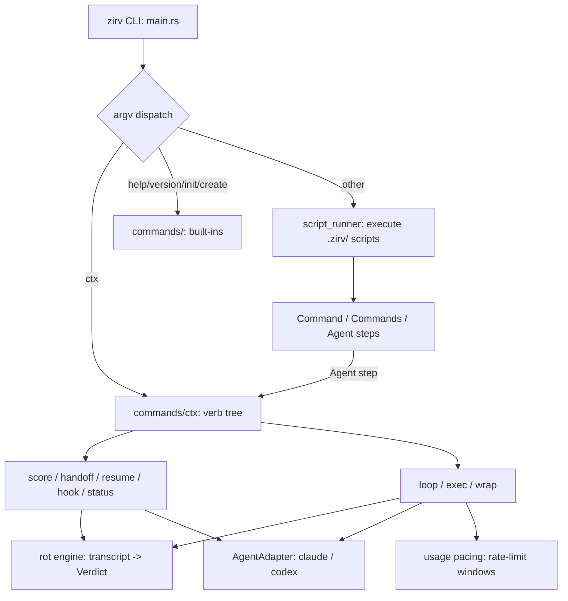

# Home

`zirv` is a cross-platform CLI that executes developer-defined YAML/JSON/TOML scripts and, through `zirv ctx`, supervises long-running AI-agent coding sessions so they don't rot.

## Quick Navigation

### Architecture

- [[Architecture Overview]] — module map and the top-level dispatch flow from `main.rs` through to script execution.
- [[Technology Stack]] — crate dependencies, release profile, and why `panic = "abort"` matters.
- [[Script Resolution]] — the full order a command name resolves through: built-ins (now including a bare-`zirv`/`chat`/`agent` alias), literal path, local/global `.zirv/`, shortcuts.

### Modules

- [[Script Runner]] — parses and executes a `Script`: context building, step dispatch, shell/concurrent/agent steps.
- [[Built-in Commands]] — `main.rs` dispatch table: `help`/`version`/`init`/`create`/`ctx`, the `chat`/`agent` top-level aliases, and the bare-`zirv` alias.
- [[Ctx Subsystem]] — the `zirv ctx` hub: verb tree (including `chat`/`agent`/`send`/`inbox`), dispatch, layered config, state directory, decision log.
- [[Ctx Supervisors]] — `loop`/`exec`/`wrap`, the three process supervisors, turn-signal sockets, raw-mode terminal handling, and the chat session's role/mail advisory/terminal chrome.
- [[Ctx Adapters]] — the `AgentAdapter` trait, the claude/codex implementations, and the registry/`resolve_default` selection logic.
- [[Rot Engine]] — the pure, deterministic transcript-scoring core that produces a `Verdict`.
- [[Usage and Pacing]] — rolling rate-limit windows, the pacing gate, and the statusline tee.
- [[Utilities]] — shared file-parsing/name-matching helpers, plus `zirv ctx optimize` and the injected session prompt.

### Concepts

- [[Script Files]] — the YAML/JSON/TOML script format: params, secrets, command steps, chaining.
- [[Shortcuts]] — `.shortcuts.yaml` short-key-to-script mapping and when it's consulted.
- [[Context Management]] — why `zirv ctx` exists: the rot problem, the scoring approach, how the supervisors act on it, and zirv as a meta-harness (chat, delegation, mailbox).
- [[Untrusted Configuration]] — the trust boundary around repo-provided config and prompt text, and around agent-authored mail.

### Development

- [[Active Work]] — in-progress work and handoff context for the next session.
- [[Work Journal]] — a running log of completed work, newest first.
- [[Decision Log]] — non-obvious architectural decisions, with rejected alternatives.
- [[Known Issues]] — live gotchas that have cost debugging time.
- [[Getting Started]] — build/test/lint commands and where scripts live.
- [[Testing Guide]] — how the test suite is organized and how to re-record fixtures.

---

Agents: start at [[_system-context]] (agent entry point) instead of this page. Specs, plans, and dated verification notes live outside this vault, under `docs/superpowers/`.
