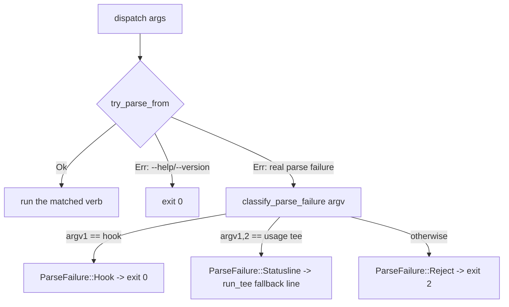

# Ctx Subsystem

## Quick Reference

- **Files:** `src/commands/ctx/mod.rs`, `src/commands/ctx/config.rs`, `src/commands/ctx/state.rs`, `src/commands/ctx/log.rs`, `src/commands/ctx/score.rs`, `src/commands/ctx/handoff.rs`, `src/commands/ctx/resume.rs`, `src/commands/ctx/hook.rs`, `src/commands/ctx/status.rs`, `src/commands/ctx/chat.rs`, `src/commands/ctx/agent.rs`, `src/commands/ctx/mail.rs`, `src/commands/ctx/sessions.rs`, `src/commands/ctx/memory.rs`, `src/commands/ctx/memory_cli.rs`, `src/commands/ctx/memory_optimize.rs`, `src/commands/ctx/retrieval.rs`, `src/commands/ctx/surface.rs` (the harness-neutral context-surface model `optimize.rs` collects onto — see [[Untrusted Configuration]]), `src/commands/ctx/context.rs` (the canonical `.zirv/context/` instruction layer and its precedence rules, since 2026-08-20 — see [[Untrusted Configuration]]'s "zirv ctx optimize" section), `src/commands/ctx/drift.rs` (deterministic duplicate/contradiction/precedence-shadowing findings across instruction surfaces, issue #42 — report-only, no CLI verb of its own yet; `analyze(surfaces)` is consumed by a later `zirv context status`/`inspect` task for duplicate/conflict counts), `src/commands/ctx/policy.rs` (zirv's canonical permissions policy and its per-harness translation — see below and [[Ctx Adapters]]); the dashboard's own `dash/{mod,pane,ui,spawnreq,roster}.rs` are covered on [[Ctx Supervisors]], not here
- **Used by:** the `zirv ctx <verb>` CLI surface; intercepted directly in `src/main.rs` (`argv[1] == "ctx"` calls `ctx::dispatch` and exits) before any `.zirv/` script lookup runs. `zirv memory <verb>` is a sibling top-level surface with its own verb tree, intercepted the same way (`argv[1] == "memory"` calls `ctx::memory_cli::dispatch`) — see [[Built-in Commands]] and the "Sessions and Memory" section below. [[Workflows]] reuses `StateDir`'s private-file primitives and adds sibling workflow state below the same root without changing `ctx` supervision semantics.
- **Depends on:** [[Ctx Supervisors]] (`loop`/`exec`/`wrap` verbs live there), [[Ctx Adapters]] (`AgentAdapter` used by score/handoff/resume/hook), [[Rot Engine]] (`rot`/`event` scoring that `score` and `hook Stop` call into), [[Usage and Pacing]] (`usage` verb and the `pace` config block), `src/settings.rs` (`AgentGate`, loaded into `CtxConfig.agents` and surfaced by `status`)
- **Tests:** inline `#[cfg(test)] mod tests` in every file listed above — `mod.rs` covers dispatch/argv parsing/exit-code classification, `config.rs` covers layering and the `REPO_FORBIDDEN` boundary, `state.rs` covers path resolution and unix permissions, `log.rs` covers JSONL append/tail, and each verb module tests its own `run_with`
- **If changed:** [[Ctx Supervisors]], [[Ctx Adapters]], [[Rot Engine]], [[Usage and Pacing]], [[Untrusted Configuration]], [[Context Management]], [[Decision Log]]
- **Gotchas:**
  - A `.zirv/ctx.yaml` script literally named `ctx` is unreachable — `main.rs` intercepts the `ctx` verb before script resolution ever runs (see `ctx_is_intercepted_before_script_lookup` in `mod.rs`). `.zirv/ctx.toml` and `.zirv/.settings.toml` are config files, not scripts: both are in `utils::RESERVED_ZIRV_FILES` (compared case-insensitively, since NTFS/APFS would otherwise honor a differently-cased file the guard missed) and excluded from script listing (`help.rs`) and invocation (`input.rs`'s `find_script_in_dir`) alike.
  - A Stop hook must **never** exit non-zero: Claude Code reads hook exit 2 as "block the stop," so a mistyped `zirv ctx hook Stop --bogus` still exits 0.
  - The statusline tee (`ctx usage tee`) must never fail loudly either — a broken invocation still prints a fallback line via `usage::run_tee` instead of exiting with nothing.
  - `REPO_FORBIDDEN` is a real security boundary, not a style preference — see below.

## Purpose

`zirv ctx` is the AI-agent-context-management side of the CLI: a supervisor and toolkit for keeping a long-running coding-agent session from rotting as its context window fills. Claude Code and Codex are both supported adapters (see [[Ctx Adapters]]). Codex direct launches receive composed developer instructions and can run lifecycle hooks, but its rollout event parser and therefore rot scoring/structural context remain degraded until issue #11 is implemented. This page is the hub for the whole area — the verb tree, config layering, on-disk state, and the decision log. Deeper mechanics live on the sibling pages linked above.

## The Verb Tree

`CtxCli` is a `clap::Parser` with `disable_help_subcommand`, wrapping the `CtxVerb` subcommand enum:

- **`score`** — rot-score a transcript and print JSON (one-shot; see [[Rot Engine]])
- **`handoff`** — distill a transcript into a stored handoff document
- **`resume`** — start a clean interactive session with the latest handoff injected
- **`hook`** — agent hook entrypoints (`Stop`, `Prompt`, `PreCompact`, `Pretool`, `Notify`)
- **`status`** — show supervised sessions, scores and handoffs
- **`loop`** (renamed from the Rust keyword via `#[command(name = "loop")]`) — stateless loop runner, a fresh headless session per cycle
- **`exec`** — supervise one headless run
- **`wrap`** — supervise an interactive TUI through a PTY
- **`usage`** — report usage windows, or tee the statusline to record them
- **`optimize`** — report-only analysis of the configuration surfaces that steer every session; since 2026-08-20 its collector (`src/commands/ctx/surface.rs`'s `Provider`/`Kind`/`Scope`/`Trust` model) enumerates Codex's `AGENTS.md`/`config.toml` alongside Claude's `CLAUDE.md`/`settings.json`, plus zirv's own canonical `.zirv/context/common.md`/`claude.md`/`codex.md` layer (`context.rs`, issue #41) — see [[Untrusted Configuration]]'s "`zirv ctx optimize`" section for the full model, trust derivation, and the canonical layer's precedence rule against native CLAUDE.md/AGENTS.md. Builds on the same collector: `drift.rs`'s `analyze(surfaces)` (issue #42) is a separate, deterministic, report-only pass over `collect_surfaces`'s output that finds exact/near duplicates, contradictions (opposite-polarity near-duplicates within the same provider, or against the harness-neutral canonical layer), precedence/shadowing across `context::PrecedenceTier`, canonicalization candidates (a rule duplicated across harness-specific files with no canonical common copy yet), cross-harness opposite-polarity pairs downgraded to the informational `"differs-per-harness"` kind by design (intended per-harness customization, not a bug), and a `"near-duplicate-scan-truncated"` finding when the pairwise scan hits its `MAX_PAIR_FINDINGS` cap — every kind is `Severity::Info` except `"contradiction"` (`Severity::Warning`, the one behavior-changing kind). Lexical/structural only, no model call; not wired into `optimize`'s own report or a CLI verb yet, awaiting `zirv context status`/`inspect`.
- **`chat`** — start an interactive orchestrator session on the resolved adapter, driven through `wrap`; refuses to start inside an existing agent session unless `--allow-nested`/`ZIRV_ALLOW_NESTED=true` (see [[Ctx Supervisors]]) (also reachable as the top-level alias `zirv chat`, or bare `zirv` in a repo with a local `.zirv` directory and both stdin and stdout attached to a real terminal — see [[Built-in Commands]]). On a large-enough real terminal (both streams a tty, VT available, `cfg.dash.enabled`, not `--simple`), this opens the dashboard session multiplexer instead of a plain `wrap` passthrough — see [[Ctx Supervisors]]'s "The dashboard (`dash`)" section.
- **`agent`** — one-shot delegation of a task to a supervised headless worker on another enabled harness, driven through `exec` (also `zirv agent <name> <prompt>`). When this process is itself running inside a dashboard pane (`spawnreq::DASH_REQUESTS_ENV` set and still live), it asks the dashboard to spawn the delegated agent as a fresh pane instead of running headless in its own subshell — see [[Ctx Supervisors]]. **The ack decides what happens next, and `ok: false` is two different answers**: a `SpawnAck` carrying `retryable: false` is a *policy* refusal (the agent gate, the argv guard, the pane cap, an unresolvable adapter) and ends the delegation with exit 1 — falling back to headless would route straight around a refusal this operator's own configuration just made. `retryable: true` is a *channel-level* failure (the request named another repo, the pty spawn failed) which says nothing about whether the task may run, so the reason is printed and the ordinary headless path runs; it serde-defaults to `false`, so an ack written by an older build still reads as the refusal it was. An ack that never arrives for a **claimed** request gets 10s more (`DASH_CLAIM_EXTENSION`) and then fails with `dashboard claimed the request but never confirmed; check zirv ctx status / the dashboard` — deliberately *not* a headless fallback and no longer the exit 0 "accepted" it used to report, because the dashboard may still be spawning the pane and a double-run is worse than a clear failure. The harness prompt layer (`prompt::HARNESS_PROMPT`) describes both shapes to an orchestrator, since inside a dashboard `zirv agent` returns a pane's short id immediately rather than a finished result.
- **`send`** / **`inbox`** — leave or read short markdown notes between agent sessions on this machine, scoped to the current repo; `send --to-session <prefix>` addresses one live session instead of every session for an agent. `inbox` consumes the caller-visible mail it displays by default (2026-08-18); `--peek` keeps the old broad, non-consuming read
- **`nudge`** — wake a live session early with a message, resolved against the live session registry by short-id prefix (at least four characters, or a whole short id — see `sessions.rs` below)
- **`remember`** / **`recall`** / **`forget`** — read and write the repo-scoped cross-session memory bank (durable facts, not task state — see the Sessions and Memory section below). The newer, scope-aware top-level `zirv memory status`/`list`/`recall`/`remember`/`forget`/`verify` (issue #33, `memory_cli.rs`) is a sibling surface, not a `zirv ctx` verb — see [[Built-in Commands]].

`loop`/`exec`/`wrap` are covered in depth on [[Ctx Supervisors]]; `usage` on [[Usage and Pacing]]; `score`'s internals on [[Rot Engine]].

## dispatch() and Parse-Failure Classification

`dispatch(args: &[String])` (called with `args[0]` as the literal `"ctx"`) reparses argv under the name `"zirv ctx"` via `CtxCli::try_parse_from`. clap represents both genuine parse errors *and* `--help`/`--version` as an `Err`, so `dispatch` first special-cases `DisplayHelp`/`DisplayVersion` to exit 0 (matching top-level `zirv --help`), then falls through to `classify_parse_failure` for everything else:

`classify_parse_failure` reads argv positions directly (not the clap error) because by the time parsing has failed, clap can no longer tell you which verb was meant. Only two shapes get special treatment, because only they have a downstream reader that a raw exit code would hurt:

- `ctx hook ...` → `ParseFailure::Hook` → exit 0, because Claude Code treats a Stop hook's exit 2 as "block the stop."
- `ctx usage tee ...` → `ParseFailure::Statusline` → the same fallback line `usage::run_tee` prints when its own chained command is missing, because Claude Code renders whatever the statusline command prints and a silent failure looks like a broken terminal.
- Everything else → `ParseFailure::Reject` → exit 2, the ordinary clap convention.

A verb's own successful run maps `Ok(code)` straight through and `Err(e)` to `crate::output::error(e)` plus exit 1.

## Layered Configuration (`CtxConfig`)

`CtxConfig::load(repo, env)` merges three layers, in this precedence (later wins):

1. `~/.zirv/ctx.toml` (home layer — the operator)
2. `<repo>/.zirv/ctx.toml` (repo layer — the checkout, untrusted)
3. `ZIRV_CTX_*` environment variables (operator, via `ENV_MAP`), applied last so they override both files

Flags passed on the command line are applied by each verb after `load()` returns, so they win over all three. Merging is a recursive TOML-table merge (`merge()`); env vars are inserted by dotted path (`insert_path()`) and type-coerced per `EnvKind` (`Str`/`Int`/`Float`/`Bool`). Unknown keys anywhere are rejected loudly (`deny_unknown_fields` on every config struct), and a missing file is not an error.

The config covers `agent`/`agent_bin`, and per-verb blocks: `score` (rot thresholds), `wrap` (debounce/inject timeouts), `supervise` (restart/backoff/`on_failure`), `handoff` (model, tail items, timeout), `pace` (usage pacing — see [[Usage and Pacing]]), `optimize` (report cadence and its own model), `prompt` (the injected session-prompt layer, enable flag, repo-layer toggle, byte cap, and — 2026-08-16 — `harnesses`, the derived per-adapter roster layer's own on/off switch; see [[Ctx Adapters]]'s `harness_prompt_lines`), (2026-08-18) `review` — `review.claude`/`review.codex`, optional per-agent overrides for which model runs code review, `REPO_FORBIDDEN` as a whole table; see [[Ctx Adapters]]'s `review_model_below`/`resolve_review_model` and [[Untrusted Configuration]] — and (2026-08-18) `worker` — `worker.claude`/`worker.codex` (envs `ZIRV_CTX_WORKER_MODEL_CLAUDE`/`_CODEX`), optional per-agent overrides for which model a delegated headless worker (`zirv ctx agent`, and the dashboard's own spawn-request pane) launches on, `REPO_FORBIDDEN` as a whole table, unconfigured falling back to `AgentAdapter::default_worker_model()` (claude: `"sonnet"`; codex: its own CLI/config default, untouched); see [[Ctx Adapters]]'s "The delegated-worker model default".

`CtxConfig` also carries `agents: AgentGate` (`#[serde(skip)]`, populated at the end of `load()` from a separate file — `.zirv/.settings.toml`, not `ctx.toml`; see `src/settings.rs` and [[Ctx Adapters]]'s selection section). This is the per-adapter enable/disable gate `adapters::select` consults before every `ready()` call. `zirv ctx status` prints an `agents:` block, one line per known adapter, showing whether it's enabled and — when not — which file or environment variable disabled it; if the gate itself cannot be loaded, `status` prints `agents: (settings unreadable: <err>)` instead of failing the whole command.

### The `REPO_FORBIDDEN` security boundary

Before the repo layer is merged in, `reject_untrusted_keys` walks a fixed list, `REPO_FORBIDDEN`, of dotted key paths a repo-committed `.zirv/ctx.toml` is **not** allowed to set. If a repo file sets any of them, `load()` returns a hard error naming the offending key and the alternative (an env var, or `~/.zirv/ctx.toml`):

| Forbidden repo key | Operator escape hatch |
|---|---|
| `agent_bin` | `ZIRV_CTX_AGENT_BIN` |
| `agent` | `ZIRV_CTX_AGENT` |
| `supervise.on_failure` | `ZIRV_CTX_ON_FAILURE` |
| `handoff.model` | `ZIRV_CTX_MODEL` |
| `optimize.model` | `ZIRV_CTX_OPTIMIZE_MODEL` |
| `prompt.enabled` | `ZIRV_CTX_PROMPT` |
| `prompt.repo_layer` | `ZIRV_CTX_PROMPT_REPO` |
| `prompt.max_repo_bytes` | `ZIRV_CTX_PROMPT_MAX_REPO_BYTES` |
| `prompt.harnesses` | `ZIRV_CTX_PROMPT_HARNESSES` |
| `mail.enabled` | `ZIRV_CTX_MAIL` |
| `mail.max_delivered_bytes` | `ZIRV_CTX_MAIL_MAX_DELIVERED_BYTES` |
| `chrome.events` | `ZIRV_CTX_QUIET` (inverted — see `config.rs`'s `EnvKind::NegatedBool`) |
| `memory.enabled` | `ZIRV_CTX_MEMORY` |
| `memory.harvest` | `ZIRV_CTX_MEMORY_HARVEST` |
| `memory.max_entries` | `ZIRV_CTX_MEMORY_MAX_ENTRIES` |
| `memory.max_entry_bytes` | `ZIRV_CTX_MEMORY_MAX_ENTRY_BYTES` |
| `memory.max_injected_bytes` | `ZIRV_CTX_MEMORY_MAX_INJECTED_BYTES` |
| `memory.shared_enabled` | `ZIRV_CTX_MEMORY_SHARED` |
| `memory.core_max_bytes` | `ZIRV_CTX_MEMORY_CORE_MAX_BYTES` |
| `memory.retrieval_max_bytes` | `ZIRV_CTX_MEMORY_RETRIEVAL_MAX_BYTES` |
| `memory.retrieval_max_entries` | `ZIRV_CTX_MEMORY_RETRIEVAL_MAX_ENTRIES` |
| `dash.enabled` | `ZIRV_CTX_DASH` |
| `dash.sidebar_cols` | `ZIRV_CTX_DASH_SIDEBAR_COLS` |
| `dash.roster_max_age_secs` | `ZIRV_CTX_DASH_ROSTER_MAX_AGE_SECS` |
| `dash.max_panes` | `ZIRV_CTX_DASH_MAX_PANES` |
| `dash.mouse` | `ZIRV_CTX_DASH_MOUSE` |
| `pace.use_credits` | `ZIRV_CTX_PACE_USE_CREDITS_CLAUDE` (table-node match also blocks `pace.use_credits.codex` alone) |
| `pace.poll_enabled` | `ZIRV_CTX_PACE_POLL` |
| `pace.poll_min_interval_secs` | `ZIRV_CTX_PACE_POLL_MIN_INTERVAL_SECS` |
| `review` (`review.claude`, `review.codex`) | `ZIRV_CTX_REVIEW_MODEL_CLAUDE` / `ZIRV_CTX_REVIEW_MODEL_CODEX` |
| `worker` (`worker.claude`, `worker.codex`) | `ZIRV_CTX_WORKER_MODEL_CLAUDE` / `ZIRV_CTX_WORKER_MODEL_CODEX` |

The rationale (from the source comment on `REPO_FORBIDDEN`): cloning a repository must not be enough to choose the binary zirv launches (`agent_bin`), which vendor account it spends against (`agent` — added once codex shipped ready out of the box, since a repo `agent = "codex"` reaches `resolve_default`'s *configured* arm, which never consults the repo-narrowing guard the no-`agent`-configured fallback loop already had), the shell command it runs on failure (`supervise.on_failure`), or the model it spends tokens on (`handoff.model`, `optimize.model`). The `prompt.*` entries close a related hole: without capping `max_repo_bytes` from the repo side, the untrusted prompt layer could raise its own size limit, making the cap decorative; `prompt.harnesses` (2026-08-16) closes the same hole for the derived harness-roster layer — a repo checkout must not be able to force that layer back on for an operator who turned it off. `mail.*`/`chrome.events` close the same hole for mail delivery and the announcement channel: a repo must not be able to raise its own delivered-mail cap, re-enable delivery an operator disabled, or silence `zirv ▸`'s own degradation notices. `memory.*` closes it again for the memory bank (N6/N7): a repo checkout must not be able to see…12180 tokens truncated…`score_one` is additive/subtractive on one running score with a `reasons: Vec<String>` trail (the "why was this entry selected" diagnostics issue #35 asks for): exact key match (+100) beats a partial/substring key match (+50); each query word found in the body or a tag adds +10; a stored `paths` entry relating to `cwd_path` or any `changed_paths` entry (simple string-prefix match either direction) adds +30; `importance`/`confidence` of `"high"` add (+15/+10), `"low"` subtract (−5 each); staleness subtracts one point per week since `verified`. Private-outranks-shared is enforced the same structural way `prompt::select_memory_within_cap` enforces it for the core layer: `rank` partitions candidates by `shared` and places every private one ahead of every shared one regardless of score, so a shared entry's own (attacker-supplied) `importance`/`confidence`/tags can only compete with *other* shared entries. `select(candidates, ctx, max_bytes, max_entries) -> RetrievalSelection` greedily fills the budget in rank order and reports two independent omission counts (`below_relevance`, `over_budget`); a candidate scoring below `MIN_RELEVANCE_SCORE` (1) is never selected regardless of budget headroom — the mechanism behind issue #35's "empty/weak queries degrade safely (never inject the whole bank)": with no query text and no path context, nothing scores above zero, so `select` returns nothing rather than an arbitrary top-N. `candidates_for_scope`/`candidates_for_repo` are the impure store-reading half (reusing `memory::list_scoped` verbatim, computing `verified_age_days` from a caller-supplied `now`); `candidates_for_repo` (both scopes merged) is `#[allow(dead_code)]` today — a later task's session-startup wiring (the context compiler, issue #44) is its intended caller, the same "dormant read primitive, wired in later" pattern `MemoryScope`/`list_scoped` followed before issue #33 gave them a consumer. `zirv memory recall <query>` (`memory_cli.rs`) is the first live consumer: it replaced its old "exact key match via `get_scoped`, else substring over key/body" pair with `candidates_for_scope` + `select`, budgeted by `cfg.memory.retrieval_max_bytes`/`retrieval_max_entries` — a deliberate behavior change (an exact key match now ranks first rather than suppressing every other hit) — and both the JSON (`RankedEntry`, `#[serde(flatten)]`-ed `Entry` plus `scope`/`score`/`reasons`) and human-readable output now carry the selection reasons. `get_scoped`/`get` (private-scope) lost their only production caller to this change and are `#[allow(dead_code)]` again, same dormant-primitive pattern, kept as public store API for a future task.

  **Read/write contract for the canonical file itself (fix rounds 2–3):** `get_scoped`/`verify_scoped` refuse (report `None`/`false`, touch nothing) when the canonical path is a symlink rather than a regular file (`is_regular_file`, `std::fs::symlink_metadata(path).is_ok_and(|m| m.is_file())`) — a single-path `read_to_string` follows a symlink transparently, unlike a `read_entries`-based directory scan, which already filters symlinks out; note that an arbitrary target with no `## Memory` heading (a literal `/etc/passwd`) parses to an empty phantom entry rather than leaking its actual bytes, but a target an attacker specifically crafts to look like a well-formed, key-matching entry is not so limited, which is why the refusal exists regardless. Both functions additionally require the parsed entry's own `key` to equal the requested key: a mismatch (a hand-edited/merged file whose header disagrees with its file name, or any readable non-entry file, which parses to `key == ""`) is refused and logged — `get-key-mismatch` for `get_scoped`, `verify-key-mismatch` for `verify_scoped` — naming both the requested key and the header's actual key, never masked by overwriting the parsed key. `forget_scoped` needs neither check: removing a symlink is safe by construction (`remove_file` unlinks the directory entry itself, never follows it), and it already matches by file name, not by trusting parsed content. **`verify_scoped`'s write is in-place, not a re-render (fix round 3, data-loss fix):** `stamp_verified_in_place(text, verified)` locates the `## Memory` header block using the exact same boundary rule `parse_markdown` uses (ends at the first blank line, or the first non-bullet/non-`key: value` line if there is none), replaces an existing `Verified:` bullet in place or appends one at the end of the header if none exists, and leaves every other byte — including header bullets `parse_markdown` doesn't recognize and any later `## ` section — untouched. The parse-then-`to_markdown` re-render this replaced silently dropped both, violating issue #32's "readable and editable without Zirv" contract for a hand-edited shared entry; `Private`'s `verify` is unchanged and still re-renders, since the private bank is never hand-edited repository content.

  **The handoff-vs-memory boundary is deliberate**: a handoff is task continuity (what *this* task was doing, useful only to the session that resumes it); memory is repository facts (true regardless of which task is running). Issue #37's durable harvest makes this explicit rather than assumed, and funnels every call site through ONE entry point, `memory::harvest_durable`, so a session never makes two competing harvest model calls at the same boundary: a *distilled* handoff at a rot/timeout restart (`Action::Restart`/the rot-restart arm, in both `exec` and `wrap`, never the mechanical structural fallback, which has nothing durable to offer) hands its already-distilled note straight to `harvest_durable`; a genuinely clean session end (also both `exec` and `wrap`, a seam that did not exist before issue #37) has no handoff yet, so `memory::harvest_at_session_end` distills the just-ended transcript itself under the exact same "distilled only" rule before calling the same `harvest_durable`. A nudge relaunch gets neither — it is not rot and not a real session end. Opt-in via `cfg.memory.harvest` (default **false**) and, since the write target moved from the private bank to the SHARED one, also requires `cfg.memory.shared_enabled`. The model call reuses `handoff::run_model` with its own prompt (`memory::durable_harvest_prompt`, drawn only from the handoff's `Gotchas learned`/`Files touched` sections, never `Task`/`Done`/`Remaining`/`Next step`) that names issue #37's reject list verbatim — task progress and temporary TODOs, debugging narration, speculative ideas, generic session summaries, and facts cheaply discoverable from source — and instructs the model to answer with nothing when nothing qualifies. The answer is parsed strictly as `key: body` lines (`memory::parse_harvest`, unchanged), then run through `memory::filter_durable_candidates` — a PURE, deterministic function with no model and no filesystem that pattern-matches every candidate against the same reject categories, truncates a body to `cfg.memory.max_entry_bytes`, and enforces two new conservative per-session caps, `cfg.memory.harvest_max_entries` (default 5) and `cfg.memory.harvest_max_bytes` (default 2048, cumulative) — the model proposes, the filter disposes. Survivors are stored via `upsert_scoped(Shared, ...)` with `source = "harvest"`, upserting by key — but **N4 carries over unchanged in spirit**: before each write, `write_durable` reads the existing shared entry for that key (`memory::get_scoped`) and skips it, logging `harvest-skipped` with the key, if its `Source` is `"explicit"` — a human or a session deliberately asked to remember it, and that deliberate entry keeps the stronger claim to be right regardless of what a cheap distiller model proposes next. A key that already belongs to a *previously-harvested* entry is still refreshed normally (that is what "existing keys updated, not duplicated" means); only a deliberate `"explicit"` entry is protected. Git-diff reviewability remains a second, independent safety net on top of this check, never a substitute for it. Never touches git either way: a harvest leaves nothing but an ordinary, unstaged working-tree change for the operator's own `git add`/`git diff`/commit. Any failure or timeout from the model call propagates internally but is always discarded with `let _ =` at every one of the four call sites, so a harvest failure can never turn a successful restart or a clean exit into a failed one. Harvesting defaults off because a cheap model can be confidently wrong, and an unreviewed guess landing in a bank every future session reads is worse than simply not harvesting — see [[Untrusted Configuration]] and [[Ctx Supervisors]] (for the two new clean-session-end seams).

  **Lifecycle states (2026-08-20, issue #38, `retrieval.rs`)**: `Lifecycle { Active, Stale, Archived }` is a NEW field on `RetrievalCandidate`, computed by the pure `classify_lifecycle(entry, verified_age_days)` and never stored on disk — it is recomputed fresh from an entry's own current `verified`/`importance`/`confidence`/`source` on every read, so re-verifying an entry (which resets `verified_age_days`) restores `Active` on the very next read with no migration. Age alone never demotes anything: `importance: high` keeps an entry `Active` unconditionally, however long ago it was verified; otherwise an entry fresher than `STALE_AFTER_DAYS` (180) is `Active`, one at or beyond `ARCHIVE_AFTER_DAYS` (365) that is ALSO low-value (`importance: low` or `confidence: low`) AND not `Source: explicit` becomes `Archived`, and everything else past `STALE_AFTER_DAYS` is `Stale` — an `explicit` entry can still go `Stale` with age but is never `Archived`, mirroring the N4 protection `memory::write_durable` already gives an explicit entry on the write side. `score_one` wires this straight into ranking, no parallel path: an `Archived` candidate is excluded outright (score forced to `i64::MIN`) before any other signal is scored, UNLESS the caller sets the new `RetrievalContext::include_archived` (`zirv memory recall --include-archived`); a `Stale` candidate is never excluded, only takes a further fixed `STALE_DOWNRANK_PENALTY` (5) on top of the pre-existing one-point-per-week gradual staleness penalty, so a real match still normally clears `MIN_RELEVANCE_SCORE` and stays selectable — "down-ranked, not excluded" in practice, not just in name.

  **`zirv memory optimize` (2026-08-20, issue #38, `memory_optimize.rs`)**: analyzes the SHARED bank only (the private bank has no git-diff reviewability to apply changes against) for duplicate/near-duplicate entries, lexical contradictions, stale/archived entries, obsolete (dead) `paths`, oversized or low-value bodies, and a core-regeneration opportunity. REPORT-FIRST always: a bare run or `--dry-run` (which always overrides `--apply`, even given together) only prints a report; a dedicated test snapshots the whole `.zirv/memory/` tree before and after a report-only run and asserts it is byte-identical, mirroring `optimize.rs`'s own `the_verb_never_modifies_an_analysed_file` precedent. `analyze(candidates: &[OptimizeCandidate], cfg) -> Vec<Finding>` is the pure detection engine — no clock, filesystem, or `HashMap`-iteration-order dependence anywhere in its output (duplicate grouping goes through a `BTreeMap` keyed on normalized body text specifically to keep that true) — over `OptimizeCandidate`s an impure `gather_candidates` precomputes (`verified_age_days`, `lifecycle` via `retrieval::classify_lifecycle`, and `dead_paths`, each `entry.paths` entry checked against the filesystem), the same read/clock/fs boundary `retrieval::candidates_for_scope` already draws. Every `Finding { kind, severity, keys, paths, detail }` carries the affected keys/files as evidence, never bare prose. Duplicates are exact-normalized-body matches (whitespace/case collapsed); near-duplicates and contradictions are lexical/structural, no model involved: Jaccard word-overlap above a fixed threshold for near-duplicates, and — for contradictions — subject word-overlap above a lower threshold PLUS one of a fixed list of opposite-polarity word pairs (`"always"`/`"never"`, `"enabled"`/`"disabled"`, etc.) each appearing in one of the two bodies. `regenerate_core_proposal(candidates, cap_bytes)` greedily keeps candidates in core-priority order (importance descending, confidence descending, freshest-verified first, key as the final tiebreak) within `cap_bytes`, skipping rather than truncating an entry that would not fit — a `core-regen-opportunity` finding only appears when the bank's current core-eligible size already exceeds `cfg.memory.core_max_bytes`, and a dedicated property test asserts the proposal's own rendered size never exceeds an arbitrary cap. `--apply` runs the ONE model-driven pass this module has, consolidation: `consolidation_groups` builds one `ConsolidationGroup` per already-reported duplicate/near-duplicate finding (reusing `analyze`'s own detection, never re-running it), picking a survivor deterministically (highest importance, then most-recently-verified, then smallest key); `apply_consolidation` then asks the model (`handoff::run_model`, same distiller mechanism harvest/init already use) for one merged body per group WITHOUT an explicit-source member, validates the answer exactly like `init`'s proposals (`memory::parse_harvest`, rejected if the answered key disagrees with the chosen survivor's, truncated to `cfg.memory.max_entry_bytes`), re-reads the survivor fresh via `get_scoped` right before writing (mirroring `write_durable`'s own "fresh read right before each write" rule, so a concurrent promotion to `Source: explicit` is still respected), and upserts only the survivor — every OTHER member of the group is left completely untouched on disk. This module has no delete/forget path at all: consolidation never discards anything, and the operator removes a now-redundant loser by hand with `zirv memory forget` after reviewing the group's own finding. `--no-model` skips the consolidation pass even under `--apply`, reporting findings only. `memory_cli::run_optimize_with` resolves the adapter/model lazily, only once a consolidation pass is actually about to run, so a plain report — the common case — never fails just because no agent is configured, mirroring `optimize::run_with`'s own graceful degradation. No new `memory.*` config keys were added: the near-/contradiction-detection thresholds and the two lifecycle-age constants are plain `pub const`s on `retrieval.rs` (the same precedent `retrieval::MIN_RELEVANCE_SCORE` already set), and consolidation reuses the existing `memory.max_entry_bytes`/`core_max_bytes` caps rather than introducing parallel ones.

## See Also

- [[Ctx Supervisors]] — `run_loop`/`exec`/`wrap` process supervision, plus `signal`/`supervise`/`term` primitives
- [[Ctx Adapters]] — the `AgentAdapter` trait and the claude/codex implementations these verbs dispatch through
- [[Rot Engine]] — `event.rs`/`rot.rs` scoring internals that `score` and `hook Stop` call into
- [[Usage and Pacing]] — `pace`/`usage`/`window`, the `usage` verb, and the statusline tee
