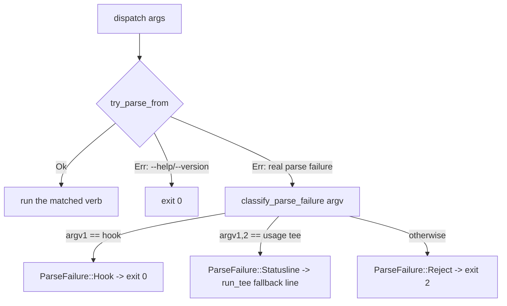

# Ctx Subsystem

## Quick Reference

- **Files:** `src/commands/ctx/mod.rs`, `src/commands/ctx/config.rs`, `src/commands/ctx/state.rs`, `src/commands/ctx/log.rs`, `src/commands/ctx/score.rs`, `src/commands/ctx/handoff.rs`, `src/commands/ctx/resume.rs`, `src/commands/ctx/hook.rs`, `src/commands/ctx/status.rs`
- **Used by:** the `zirv ctx <verb>` CLI surface; intercepted directly in `src/main.rs` (`argv[1] == "ctx"` calls `ctx::dispatch` and exits) before any `.zirv/` script lookup runs
- **Depends on:** [[Ctx Supervisors]] (`loop`/`exec`/`wrap` verbs live there), [[Ctx Adapters]] (`AgentAdapter` used by score/handoff/resume/hook), [[Rot Engine]] (`rot`/`event` scoring that `score` and `hook Stop` call into), [[Usage and Pacing]] (`usage` verb and the `pace` config block), `src/settings.rs` (`AgentGate`, loaded into `CtxConfig.agents` and surfaced by `status`)
- **Tests:** inline `#[cfg(test)] mod tests` in every file listed above — `mod.rs` covers dispatch/argv parsing/exit-code classification, `config.rs` covers layering and the `REPO_FORBIDDEN` boundary, `state.rs` covers path resolution and unix permissions, `log.rs` covers JSONL append/tail, and each verb module tests its own `run_with`
- **If changed:** [[Ctx Supervisors]], [[Ctx Adapters]], [[Rot Engine]], [[Usage and Pacing]], [[Untrusted Configuration]], [[Context Management]], [[Decision Log]]
- **Gotchas:**
  - A `.zirv/ctx.yaml` script literally named `ctx` is unreachable — `main.rs` intercepts the `ctx` verb before script resolution ever runs (see `ctx_is_intercepted_before_script_lookup` in `mod.rs`). `.zirv/ctx.toml` and `.zirv/.settings.toml` are config files, not scripts: both are in `utils::RESERVED_ZIRV_FILES` (compared case-insensitively, since NTFS/APFS would otherwise honor a differently-cased file the guard missed) and excluded from script listing (`help.rs`) and invocation (`input.rs`'s `find_script_in_dir`) alike.
  - A Stop hook must **never** exit non-zero: Claude Code reads hook exit 2 as "block the stop," so a mistyped `zirv ctx hook Stop --bogus` still exits 0.
  - The statusline tee (`ctx usage tee`) must never fail loudly either — a broken invocation still prints a fallback line via `usage::run_tee` instead of exiting with nothing.
  - `REPO_FORBIDDEN` is a real security boundary, not a style preference — see below.

## Purpose

`zirv ctx` is the AI-agent-context-management side of the CLI: a supervisor and toolkit for keeping a long-running coding-agent session (Claude Code today; codex is scaffolded but not implemented, tracked in issue #11) from rotting as its context window fills. This page is the hub for the whole area — the verb tree, config layering, on-disk state, and the decision log. Deeper mechanics live on the sibling pages linked above.

## The Verb Tree

`CtxCli` is a `clap::Parser` with `disable_help_subcommand`, wrapping the `CtxVerb` subcommand enum:

- **`score`** — rot-score a transcript and print JSON (one-shot; see [[Rot Engine]])
- **`handoff`** — distill a transcript into a stored handoff document
- **`resume`** — start a clean interactive session with the latest handoff injected
- **`hook`** — agent hook entrypoints (`Stop`, `Prompt`, `PreCompact`, `Notify`)
- **`status`** — show supervised sessions, scores and handoffs
- **`loop`** (renamed from the Rust keyword via `#[command(name = "loop")]`) — stateless loop runner, a fresh headless session per cycle
- **`exec`** — supervise one headless run
- **`wrap`** — supervise an interactive TUI through a PTY
- **`usage`** — report usage windows, or tee the statusline to record them
- **`optimize`** — report-only analysis of the configuration surfaces that steer every session

`loop`/`exec`/`wrap` are covered in depth on [[Ctx Supervisors]]; `usage` on [[Usage and Pacing]]; `score`'s internals on [[Rot Engine]].

## dispatch() and Parse-Failure Classification

`dispatch(args: &[String])` (called with `args[0]` as the literal `"ctx"`) reparses argv under the name `"zirv ctx"` via `CtxCli::try_parse_from`. clap represents both genuine parse errors *and* `--help`/`--version` as an `Err`, so `dispatch` first special-cases `DisplayHelp`/`DisplayVersion` to exit 0 (matching top-level `zirv --help`), then falls through to `classify_parse_failure` for everything else:

`classify_parse_failure` reads argv positions directly (not the clap error) because by the time parsing has failed, clap can no longer tell you which verb was meant. Only two shapes get special treatment, because only they have a downstream reader that a raw exit code would hurt:

- `ctx hook ...` → `ParseFailure::Hook` → exit 0, because Claude Code treats a Stop hook's exit 2 as "block the stop."
- `ctx usage tee ...` → `ParseFailure::Statusline` → the same fallback line `usage::run_tee` prints when its own chained command is missing, because Claude Code renders whatever the statusline command prints and a silent failure looks like a broken terminal.
- Everything else → `ParseFailure::Reject` → exit 2, the ordinary clap convention.

A verb's own successful run maps `Ok(code)` straight through and `Err(e)` to `crate::output::error(e)` plus exit 1.

## Layered Configuration (`CtxConfig`)

`CtxConfig::load(repo, env)` merges three layers, in this precedence (later wins):

1. `~/.zirv/ctx.toml` (home layer — the operator)
2. `<repo>/.zirv/ctx.toml` (repo layer — the checkout, untrusted)
3. `ZIRV_CTX_*` environment variables (operator, via `ENV_MAP`), applied last so they override both files

Flags passed on the command line are applied by each verb after `load()` returns, so they win over all three. Merging is a recursive TOML-table merge (`merge()`); env vars are inserted by dotted path (`insert_path()`) and type-coerced per `EnvKind` (`Str`/`Int`/`Float`/`Bool`). Unknown keys anywhere are rejected loudly (`deny_unknown_fields` on every config struct), and a missing file is not an error.

The config covers `agent`/`agent_bin`, and per-verb blocks: `score` (rot thresholds), `wrap` (debounce/inject timeouts), `supervise` (restart/backoff/`on_failure`), `handoff` (model, tail items, timeout), `pace` (usage pacing — see [[Usage and Pacing]]), `optimize` (report cadence and its own model), and `prompt` (the injected session-prompt layer, enable flag, repo-layer toggle, byte cap).

`CtxConfig` also carries `agents: AgentGate` (`#[serde(skip)]`, populated at the end of `load()` from a separate file — `.zirv/.settings.toml`, not `ctx.toml`; see `src/settings.rs` and [[Ctx Adapters]]'s selection section). This is the per-adapter enable/disable gate `adapters::select` consults before every `ready()` call. `zirv ctx status` prints an `agents:` block, one line per known adapter, showing whether it's enabled and — when not — which file or environment variable disabled it; if the gate itself cannot be loaded, `status` prints `agents: (settings unreadable: <err>)` instead of failing the whole command.

### The `REPO_FORBIDDEN` security boundary

Before the repo layer is merged in, `reject_untrusted_keys` walks a fixed list, `REPO_FORBIDDEN`, of dotted key paths a repo-committed `.zirv/ctx.toml` is **not** allowed to set. If a repo file sets any of them, `load()` returns a hard error naming the offending key and the alternative (an env var, or `~/.zirv/ctx.toml`):

| Forbidden repo key | Operator escape hatch |
|---|---|
| `agent_bin` | `ZIRV_CTX_AGENT_BIN` |
| `supervise.on_failure` | `ZIRV_CTX_ON_FAILURE` |
| `handoff.model` | `ZIRV_CTX_MODEL` |
| `optimize.model` | `ZIRV_CTX_OPTIMIZE_MODEL` |
| `prompt.enabled` | `ZIRV_CTX_PROMPT` |
| `prompt.repo_layer` | `ZIRV_CTX_PROMPT_REPO` |
| `prompt.max_repo_bytes` | `ZIRV_CTX_PROMPT_MAX_REPO_BYTES` |

The rationale (from the source comment on `REPO_FORBIDDEN`): cloning a repository must not be enough to choose the binary zirv launches (`agent_bin`), the shell command it runs on failure (`supervise.on_failure`), or the model it spends tokens on (`handoff.model`, `optimize.model`). The `prompt.*` entries close a related hole: without capping `max_repo_bytes` from the repo side, the untrusted prompt layer could raise its own size limit, making the cap decorative.

Note what is *not* forbidden: `agent` (picking between the claude/codex adapters, not naming an executable) and per-verb thresholds like `handoff.tail_items` are still repo-settable, since they don't hand the checkout control over what zirv executes.

This is the same trust boundary documented in [[Untrusted Configuration]] and reiterated in this repo's own `CLAUDE.md`: repo-provided config and prompt text is untrusted input — capped, labeled, and unable to enable itself.

## State Directory (`StateDir`)

`StateDir::resolve(env)` picks its root in this order: `ZIRV_CTX_STATE_DIR` env override, else the OS state directory (`dirs::state_dir()`), else the OS local-data directory (macOS and Windows have no separate state dir), then appends `zirv/ctx`. Subpaths hang off that root:

- `handoffs()` — stored handoff documents, one subdirectory per `repo_slug`
- `sockets()` (`s/`, deliberately short — unix socket paths cap near 104 bytes on macOS) — one socket per supervised session, named by the first 8 hex chars of the session id (`socket_for`)
- `logs()` — holds `decisions.jsonl`
- `usage()` — a single machine-wide `usage.json` (shared across sessions, since usage windows are per-account, not per-session)
- `scoring()` — per-transcript incremental-scoring checkpoints, since the Stop hook is a fresh process every turn and needs somewhere to leave its parse position

On unix, directories are created `0700` and files `0600` (`create_private_dir_all`, `open_private_append`, `write_private`); both are no-ops on Windows, which has no equivalent single call. `write_private` re-applies `0600` even when overwriting a file that already existed with looser permissions, closing a gap where `--out` onto a pre-touched path would otherwise stay world-readable. `prune_to_newest` caps per-session directories at `KEEP_NEWEST` (200) files, best-effort in every direction — a housekeeping failure must never be the reason a session fails to start.

## Decision Log

`log.rs` appends one JSON line per decision to `<state>/logs/decisions.jsonl` via `append()`, using the same private-file helpers as the rest of the state dir. Each `Decision` record carries a timestamp, session id, verb, rot verdict, numeric score, action taken, and free-text detail. `tail(state, count)` reads the whole file and returns the last `count` lines (oldest of the tail first) — used by the `status` verb. The log is append-only; nothing in this module rewrites or rotates it.

## Verb Modules (score / handoff / resume / hook / status)

These five are the "read a transcript, decide, maybe write state" verbs; the deeper scoring/adapter mechanics they call into belong on [[Rot Engine]] and [[Ctx Adapters]].

- **`score`** (`ScoreArgs { transcript, agent }`) parses a transcript with the selected `AgentAdapter` and prints its rot score as JSON. `score_transcript` is the one-shot path with no persisted state; `IncrementalScorer` (also in this file) is the checkpoint-folding path the Stop hook uses so a growing transcript costs only the bytes appended since the last pass, always falling back to a full reparse on any doubt (unreadable/corrupt checkpoint, rewritten file, or a rules/schema-version mismatch).
- **`handoff`** (`HandoffArgs { transcript, agent, session_id, stdout, no_model }`) distills a transcript into a `Handoff` document, storing it under `<state>/handoffs/<repo_slug>/<timestamp>-<session>.md` via `store()`. It first tries a real model call (`run_model`/`distill`, bounded by `handoff.timeout_secs` because `wrap` calls this synchronously from its terminal-facing pump) and falls back to a mechanical `structural()` extraction — which never fails — if the distiller is unavailable or times out. `latest_for_repo` finds the newest stored handoff for `resume` to read back.
- **`resume`** (`ResumeArgs { agent, print_prompt, extra, simple }`) looks up the latest handoff for the repo and launches a clean interactive agent session with a composed prompt (`resume_prompt`) injected, unless `--simple` skips zirv's own instructions (supervision, pacing, and hooks still apply either way).
- **`hook`** (`HookArgs { event: HookEvent }`) is the multi-event agent hook entrypoint: `Stop` scores the turn and forwards or advises (deciding what to print, where `None` — the same as every failure path — means print nothing); `Prompt` (UserPromptSubmit) installs the reply-marker instruction, since it's the only hook that can add context to the model; `PreCompact` can't influence compaction at all (verified against Claude Code's hook reference) but still logs that one started, so decision-log scores don't step down with no visible cause; `Notify` is codex's equivalent of `Stop`, mapping its differently-named payload fields onto the same shape rather than aliasing them (an alias could silently parse a renamed field as an empty transcript path).
- **`status`** (`StatusArgs { decisions }`) prints the state dir root, the live supervised sessions found under `sockets()`, and the tail of the decision log (`decisions` controls how many lines).

## See Also

- [[Ctx Supervisors]] — `run_loop`/`exec`/`wrap` process supervision, plus `signal`/`supervise`/`term` primitives
- [[Ctx Adapters]] — the `AgentAdapter` trait and the claude/codex implementations these verbs dispatch through
- [[Rot Engine]] — `event.rs`/`rot.rs` scoring internals that `score` and `hook Stop` call into
- [[Usage and Pacing]] — `pace`/`usage`/`window`, the `usage` verb, and the statusline tee
