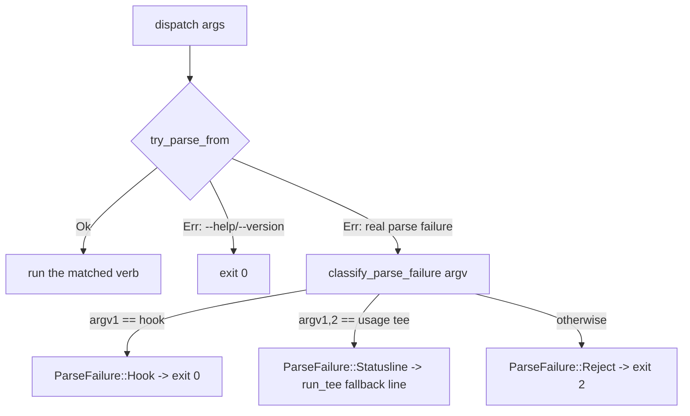

# Ctx Subsystem

## Quick Reference

- **Files:** `src/commands/ctx/mod.rs`, `src/commands/ctx/config.rs`, `src/commands/ctx/state.rs`, `src/commands/ctx/log.rs`, `src/commands/ctx/score.rs`, `src/commands/ctx/handoff.rs`, `src/commands/ctx/resume.rs`, `src/commands/ctx/hook.rs`, `src/commands/ctx/status.rs`, `src/commands/ctx/chat.rs`, `src/commands/ctx/agent.rs`, `src/commands/ctx/mail.rs`, `src/commands/ctx/sessions.rs`, `src/commands/ctx/memory.rs`; the dashboard's own `dash/{mod,pane,ui,spawnreq,roster}.rs` are covered on [[Ctx Supervisors]], not here
- **Used by:** the `zirv ctx <verb>` CLI surface; intercepted directly in `src/main.rs` (`argv[1] == "ctx"` calls `ctx::dispatch` and exits) before any `.zirv/` script lookup runs
- **Depends on:** [[Ctx Supervisors]] (`loop`/`exec`/`wrap` verbs live there), [[Ctx Adapters]] (`AgentAdapter` used by score/handoff/resume/hook), [[Rot Engine]] (`rot`/`event` scoring that `score` and `hook Stop` call into), [[Usage and Pacing]] (`usage` verb and the `pace` config block), `src/settings.rs` (`AgentGate`, loaded into `CtxConfig.agents` and surfaced by `status`)
- **Tests:** inline `#[cfg(test)] mod tests` in every file listed above — `mod.rs` covers dispatch/argv parsing/exit-code classification, `config.rs` covers layering and the `REPO_FORBIDDEN` boundary, `state.rs` covers path resolution and unix permissions, `log.rs` covers JSONL append/tail, and each verb module tests its own `run_with`
- **If changed:** [[Ctx Supervisors]], [[Ctx Adapters]], [[Rot Engine]], [[Usage and Pacing]], [[Untrusted Configuration]], [[Context Management]], [[Decision Log]]
- **Gotchas:**
  - A `.zirv/ctx.yaml` script literally named `ctx` is unreachable — `main.rs` intercepts the `ctx` verb before script resolution ever runs (see `ctx_is_intercepted_before_script_lookup` in `mod.rs`). `.zirv/ctx.toml` and `.zirv/.settings.toml` are config files, not scripts: both are in `utils::RESERVED_ZIRV_FILES` (compared case-insensitively, since NTFS/APFS would otherwise honor a differently-cased file the guard missed) and excluded from script listing (`help.rs`) and invocation (`input.rs`'s `find_script_in_dir`) alike.
  - A Stop hook must **never** exit non-zero: Claude Code reads hook exit 2 as "block the stop," so a mistyped `zirv ctx hook Stop --bogus` still exits 0.
  - The statusline tee (`ctx usage tee`) must never fail loudly either — a broken invocation still prints a fallback line via `usage::run_tee` instead of exiting with nothing.
  - `REPO_FORBIDDEN` is a real security boundary, not a style preference — see below.

## Purpose

`zirv ctx` is the AI-agent-context-management side of the CLI: a supervisor and toolkit for keeping a long-running coding-agent session from rotting as its context window fills. Claude Code and Codex are both supported adapters (see [[Ctx Adapters]]), but Claude Code has the full feature set; Codex launches and supervises with an honestly degraded surface (no event parsing, rot score, usage source, turn signal or injected system prompt) until its event shapes are wired up, tracked in issue #11. This page is the hub for the whole area — the verb tree, config layering, on-disk state, and the decision log. Deeper mechanics live on the sibling pages linked above.

## The Verb Tree

`CtxCli` is a `clap::Parser` with `disable_help_subcommand`, wrapping the `CtxVerb` subcommand enum:

- **`score`** — rot-score a transcript and print JSON (one-shot; see [[Rot Engine]])
- **`handoff`** — distill a transcript into a stored handoff document
- **`resume`** — start a clean interactive session with the latest handoff injected
- **`hook`** — agent hook entrypoints (`Stop`, `Prompt`, `PreCompact`, `Notify`)
- **`status`** — show supervised sessions, scores and handoffs
- **`loop`** (renamed from the Rust keyword via `#[command(name = "loop")]`) — stateless loop runner, a fresh headless session per cycle
- **`exec`** — supervise one headless run
- **`wrap`** — supervise an interactive TUI through a PTY
- **`usage`** — report usage windows, or tee the statusline to record them
- **`optimize`** — report-only analysis of the configuration surfaces that steer every session
- **`chat`** — start an interactive orchestrator session on the resolved adapter, driven through `wrap`; refuses to start inside an existing agent session unless `--allow-nested`/`ZIRV_ALLOW_NESTED=true` (see [[Ctx Supervisors]]) (also reachable as the top-level alias `zirv chat`, or bare `zirv` in a repo with a local `.zirv` directory and both stdin and stdout attached to a real terminal — see [[Built-in Commands]]). On a large-enough real terminal (both streams a tty, VT available, `cfg.dash.enabled`, not `--simple`), this opens the dashboard session multiplexer instead of a plain `wrap` passthrough — see [[Ctx Supervisors]]'s "The dashboard (`dash`)" section.
- **`agent`** — one-shot delegation of a task to a supervised headless worker on another enabled harness, driven through `exec` (also `zirv agent <name> <prompt>`). When this process is itself running inside a dashboard pane (`spawnreq::DASH_REQUESTS_ENV` set and still live), it asks the dashboard to spawn the delegated agent as a fresh pane instead of running headless in its own subshell — see [[Ctx Supervisors]]. **The ack decides what happens next, and `ok: false` is two different answers**: a `SpawnAck` carrying `retryable: false` is a *policy* refusal (the agent gate, the argv guard, the pane cap, an unresolvable adapter) and ends the delegation with exit 1 — falling back to headless would route straight around a refusal this operator's own configuration just made. `retryable: true` is a *channel-level* failure (the request named another repo, the pty spawn failed) which says nothing about whether the task may run, so the reason is printed and the ordinary headless path runs; it serde-defaults to `false`, so an ack written by an older build still reads as the refusal it was. An ack that never arrives for a **claimed** request gets 10s more (`DASH_CLAIM_EXTENSION`) and then fails with `dashboard claimed the request but never confirmed; check zirv ctx status / the dashboard` — deliberately *not* a headless fallback and no longer the exit 0 "accepted" it used to report, because the dashboard may still be spawning the pane and a double-run is worse than a clear failure. The harness prompt layer (`prompt::HARNESS_PROMPT`) describes both shapes to an orchestrator, since inside a dashboard `zirv agent` returns a pane's short id immediately rather than a finished result.
- **`send`** / **`inbox`** — leave or read short markdown notes between agent sessions on this machine, scoped to the current repo; `send --to-session <prefix>` addresses one live session instead of every session for an agent
- **`nudge`** — wake a live session early with a message, resolved against the live session registry by short-id prefix (at least four characters, or a whole short id — see `sessions.rs` below)
- **`remember`** / **`recall`** / **`forget`** — read and write the repo-scoped cross-session memory bank (durable facts, not task state — see the Sessions and Memory section below)

`loop`/`exec`/`wrap` are covered in depth on [[Ctx Supervisors]]; `usage` on [[Usage and Pacing]]; `score`'s internals on [[Rot Engine]].

## dispatch() and Parse-Failure Classification

`dispatch(args: &[String])` (called with `args[0]` as the literal `"ctx"`) reparses argv under the name `"zirv ctx"` via `CtxCli::try_parse_from`. clap represents both genuine parse errors *and* `--help`/`--version` as an `Err`, so `dispatch` first special-cases `DisplayHelp`/`DisplayVersion` to exit 0 (matching top-level `zirv --help`), then falls through to `classify_parse_failure` for everything else:

`classify_parse_failure` reads argv positions directly (not the clap error) because by the time parsing has failed, clap can no longer tell you which verb was meant. Only two shapes get special treatment, because only they have a downstream reader that a raw exit code would hurt:

- `ctx hook ...` → `ParseFailure::Hook` → exit 0, because Claude Code treats a Stop hook's exit 2 as "block the stop."
- `ctx usage tee ...` → `ParseFailure::Statusline` → the same fallback line `usage::run_tee` prints when its own chained command is missing, because Claude Code renders whatever the statusline command prints and a silent failure looks like a broken terminal.
- Everything else → `ParseFailure::Reject` → exit 2, the ordinary clap convention.

A verb's own successful run maps `Ok(code)` straight through and `Err(e)` to `crate::output::error(e)` plus exit 1.

## Layered Configuration (`CtxConfig`)

`CtxConfig::load(repo, env)` merges three layers, in this precedence (later wins):

1. `~/.zirv/ctx.toml` (home layer — the operator)
2. `<repo>/.zirv/ctx.toml` (repo layer — the checkout, untrusted)
3. `ZIRV_CTX_*` environment variables (operator, via `ENV_MAP`), applied last so they override both files

Flags passed on the command line are applied by each verb after `load()` returns, so they win over all three. Merging is a recursive TOML-table merge (`merge()`); env vars are inserted by dotted path (`insert_path()`) and type-coerced per `EnvKind` (`Str`/`Int`/`Float`/`Bool`). Unknown keys anywhere are rejected loudly (`deny_unknown_fields` on every config struct), and a missing file is not an error.

The config covers `agent`/`agent_bin`, and per-verb blocks: `score` (rot thresholds), `wrap` (debounce/inject timeouts), `supervise` (restart/backoff/`on_failure`), `handoff` (model, tail items, timeout), `pace` (usage pacing — see [[Usage and Pacing]]), `optimize` (report cadence and its own model), and `prompt` (the injected session-prompt layer, enable flag, repo-layer toggle, byte cap, and — 2026-08-16 — `harnesses`, the derived per-adapter roster layer's own on/off switch; see [[Ctx Adapters]]'s `harness_prompt_lines`).

`CtxConfig` also carries `agents: AgentGate` (`#[serde(skip)]`, populated at the end of `load()` from a separate file — `.zirv/.settings.toml`, not `ctx.toml`; see `src/settings.rs` and [[Ctx Adapters]]'s selection section). This is the per-adapter enable/disable gate `adapters::select` consults before every `ready()` call. `zirv ctx status` prints an `agents:` block, one line per known adapter, showing whether it's enabled and — when not — which file or environment variable disabled it; if the gate itself cannot be loaded, `status` prints `agents: (settings unreadable: <err>)` instead of failing the whole command.

### The `REPO_FORBIDDEN` security boundary

Before the repo layer is merged in, `reject_untrusted_keys` walks a fixed list, `REPO_FORBIDDEN`, of dotted key paths a repo-committed `.zirv/ctx.toml` is **not** allowed to set. If a repo file sets any of them, `load()` returns a hard error naming the offending key and the alternative (an env var, or `~/.zirv/ctx.toml`):

| Forbidden repo key | Operator escape hatch |
|---|---|
| `agent_bin` | `ZIRV_CTX_AGENT_BIN` |
| `supervise.on_failure` | `ZIRV_CTX_ON_FAILURE` |
| `handoff.model` | `ZIRV_CTX_MODEL` |
| `optimize.model` | `ZIRV_CTX_OPTIMIZE_MODEL` |
| `prompt.enabled` | `ZIRV_CTX_PROMPT` |
| `prompt.repo_layer` | `ZIRV_CTX_PROMPT_REPO` |
| `prompt.max_repo_bytes` | `ZIRV_CTX_PROMPT_MAX_REPO_BYTES` |
| `prompt.harnesses` | `ZIRV_CTX_PROMPT_HARNESSES` |
| `mail.enabled` | `ZIRV_CTX_MAIL` |
| `mail.max_delivered_bytes` | `ZIRV_CTX_MAIL_MAX_DELIVERED_BYTES` |
| `chrome.events` | `ZIRV_CTX_QUIET` (inverted — see `config.rs`'s `EnvKind::NegatedBool`) |
| `memory.enabled` | `ZIRV_CTX_MEMORY` |
| `memory.harvest` | `ZIRV_CTX_MEMORY_HARVEST` |
| `memory.max_entries` | `ZIRV_CTX_MEMORY_MAX_ENTRIES` |
| `memory.max_entry_bytes` | `ZIRV_CTX_MEMORY_MAX_ENTRY_BYTES` |
| `memory.max_injected_bytes` | `ZIRV_CTX_MEMORY_MAX_INJECTED_BYTES` |
| `dash.enabled` | `ZIRV_CTX_DASH` |
| `dash.sidebar_cols` | `ZIRV_CTX_DASH_SIDEBAR_COLS` |
| `dash.roster_max_age_secs` | `ZIRV_CTX_DASH_ROSTER_MAX_AGE_SECS` |
| `dash.max_panes` | `ZIRV_CTX_DASH_MAX_PANES` |
| `dash.mouse` | `ZIRV_CTX_DASH_MOUSE` |

The rationale (from the source comment on `REPO_FORBIDDEN`): cloning a repository must not be enough to choose the binary zirv launches (`agent_bin`), the shell command it runs on failure (`supervise.on_failure`), or the model it spends tokens on (`handoff.model`, `optimize.model`). The `prompt.*` entries close a related hole: without capping `max_repo_bytes` from the repo side, the untrusted prompt layer could raise its own size limit, making the cap decorative; `prompt.harnesses` (2026-08-16) closes the same hole for the derived harness-roster layer — a repo checkout must not be able to force that layer back on for an operator who turned it off. `mail.*`/`chrome.events` close the same hole for mail delivery and the announcement channel: a repo must not be able to raise its own delivered-mail cap, re-enable delivery an operator disabled, or silence `zirv ▸`'s own degradation notices. `memory.*` closes it again for the memory bank (N6/N7): a repo checkout must not be able to seed the bank, raise its own caps, or switch automatic harvesting on for anyone who runs zirv there — harvesting in particular is a trust-sensitive default (off), since a cheap model can be confidently wrong about what counts as durable. `dash.*` closes the same class of hole for the dashboard: a checkout must not be able to switch its own multiplexer on or off, resize the sidebar, change how long a quit-time roster stays offered for restore, raise its own pane cap (`dash.max_panes`, default 9, matching `Ctrl+A 1..9` addressing), or decide whether the dashboard captures the mouse (`dash.mouse`, which trades away the terminal's own native text selection for wheel-scrollable panes) — that is the operator's terminal, the operator's machine, the operator's call.

Note what is *not* forbidden: `agent` (picking between the claude/codex adapters, not naming an executable), `supervise.max_nudges` (names no binary or model, only how many interruptions a session tolerates), and per-verb thresholds like `handoff.tail_items` are still repo-settable, since none of them hand the checkout control over what zirv executes. `chat.model` is also deliberately **not** forbidden — see `ChatConfig`'s own doc comment (`config.rs`) and the [[Decision Log]] entry: unlike every model key in the table above, it only shapes an interactive session the operator deliberately launched, and the choice is displayed on screen (the launch banner, and the dashboard header) rather than spent silently in the background.

This is the same trust boundary documented in [[Untrusted Configuration]] and reiterated in this repo's own `CLAUDE.md`: repo-provided config and prompt text is untrusted input — capped, labeled, and unable to enable itself.

## State Directory (`StateDir`)

`StateDir::resolve(env)` picks its root in this order: `ZIRV_CTX_STATE_DIR` env override, else the OS state directory (`dirs::state_dir()`), else the OS local-data directory (macOS and Windows have no separate state dir), then appends `zirv/ctx`. Subpaths hang off that root:

- `handoffs()` — stored handoff documents, one subdirectory per `repo_slug`
- `sockets()` (`s/`, deliberately short — unix socket paths cap near 104 bytes on macOS) — one socket per supervised session, named by the first 8 hex chars of the session id (`socket_for`)
- `logs()` — holds `decisions.jsonl`
- `usage()` — a single machine-wide `usage.json` (shared across sessions, since usage windows are per-account, not per-session); `usage_for(provider)` names a sibling per-account file (`usage-<provider>.json`, `provider` sanitized by `provider_slug`) — see [[Usage and Pacing]]
- `scoring()` — per-transcript incremental-scoring checkpoints, since the Stop hook is a fresh process every turn and needs somewhere to leave its parse position

On unix, directories are created `0700` and files `0600` (`create_private_dir_all`, `open_private_append`, `write_private`); the `0700`/`0600` forcing is a no-op on Windows, which has no equivalent single call. `write_private` now writes a **temp sibling and renames over the target** — atomic on both platforms, fixed 2026-08-14 — with the unix `0600` forcing applied to the temp file before the rename, so overwriting a pre-existing world-readable file (e.g. `--out` onto a pre-touched path) still lands private. Before this fix, writing was create-truncate-then-write, leaving a zero-length window in which a concurrent reader (`sessions::list`) could see a record as absent — `sweep_orphaned_markers` then deleted that session's pending `.nudge`, silently losing the wake-up; see [[Known Issues]] and [[Decision Log]]. `prune_to_newest` caps per-session directories at `KEEP_NEWEST` (200) files, best-effort in every direction — a housekeeping failure must never be the reason a session fails to start.

## Decision Log

`log.rs` appends one JSON line per decision to `<state>/logs/decisions.jsonl` via `append()`, using the same private-file helpers as the rest of the state dir. Each `Decision` record carries a timestamp, session id, verb, rot verdict, numeric score, action taken, and free-text detail. `tail(state, count)` reads the whole file and returns the last `count` lines (oldest of the tail first) — used by the `status` verb. The log is append-only; nothing in this module rewrites or rotates it.

## Verb Modules (score / handoff / resume / hook / status)

These five are the "read a transcript, decide, maybe write state" verbs; the deeper scoring/adapter mechanics they call into belong on [[Rot Engine]] and [[Ctx Adapters]].

- **`score`** (`ScoreArgs { transcript, agent }`) parses a transcript with the selected `AgentAdapter` and prints its rot score as JSON. `score_transcript` is the one-shot path with no persisted state; `IncrementalScorer` (also in this file) is the checkpoint-folding path the Stop hook uses so a growing transcript costs only the bytes appended since the last pass, always falling back to a full reparse on any doubt (unreadable/corrupt checkpoint, rewritten file, or a rules/schema-version mismatch).
- **`handoff`** (`HandoffArgs { transcript, agent, session_id, stdout, no_model }`) distills a transcript into a `Handoff` document, storing it under `<state>/handoffs/<repo_slug>/<timestamp>-<session>.md` via `store()`. It first tries a real model call (`run_model`/`distill`, bounded by `handoff.timeout_secs` because `wrap` calls this synchronously from its terminal-facing pump) and falls back to a mechanical `structural()` extraction — which never fails — if the distiller is unavailable or times out. `latest_for_repo` finds the newest stored handoff for `resume` to read back.
- **`resume`** (`ResumeArgs { agent, print_prompt, extra, simple }`) looks up the latest handoff for the repo and launches a clean interactive agent session with a composed prompt (`resume_prompt`) injected, unless `--simple` skips zirv's own instructions (supervision, pacing, and hooks still apply either way).
- **`hook`** (`HookArgs { event: HookEvent }`) is the multi-event agent hook entrypoint: `Stop` scores the turn and forwards or advises (deciding what to print, where `None` — the same as every failure path — means print nothing); `Prompt` (UserPromptSubmit) installs the reply-marker instruction, since it's the only hook that can add context to the model; `PreCompact` can't influence compaction at all (verified against Claude Code's hook reference) but still logs that one started, so decision-log scores don't step down with no visible cause; `Notify` is codex's equivalent of `Stop`, mapping its differently-named payload fields onto the same shape rather than aliasing them (an alias could silently parse a renamed field as an empty transcript path).
- **`status`** (`StatusArgs { decisions }`) prints the state dir root, an `agents:` block, a `chat:` line naming the adapter `zirv ctx chat` would launch and the rule that picked it (or, degrading rather than failing, why nothing qualifies — reusing `adapters::resolve_default`'s own aggregated per-adapter reasons), a `mail: N unread` line for the current repo (`mail::list`, `(unreadable)` on error), a `sessions:` block from the session registry (one line per record — `<short> <agent> <verb> pid <pid> <age> live|stale <repo_slug>` — plus any `s/*.sock` with no matching record, labeled `(no record)`, so an older zirv binary that predates the registry still shows up), a `memory:` line summarizing the bank (`memory: N entries, oldest <age>, M stale >30d`, or `memory: empty`, reusing `optimize::memory_bank_summary`), and the tail of the decision log (`decisions` controls how many lines). Every block degrades independently rather than failing the whole command.

## Chat, Agent and Mail

Three modules round out the verb tree with an interactive session, one-shot delegation, and inter-session notes — none of them touch the rot engine directly, but all three reuse the supervisors and adapters those verbs are built on.

- **`chat.rs`** (`zirv ctx chat`, `ChatArgs { agent, resume, simple, quiet, allow_nested, extra }`) resolves an adapter (`--agent`, else `cfg.agent`, else `adapters::resolve_default`) and builds a `ChatLaunch` from it directly — a chat session names no wrapped command on the command line, so there is nothing for `wrap`'s own argv detection to guess at. Always tagged `PromptRole::Orchestrator` (see [[Ctx Adapters]] and the injected-prompt discussion in [[Context Management]]): this is the session a human is talking to directly, the only one allowed to hear about delegating to other harnesses. `--resume` folds the latest stored handoff into the first prompt, printing a note and starting fresh rather than failing when nothing is stored. `cfg.chat.model`/`ZIRV_CTX_CHAT_MODEL`, when set, is appended to the launch argv as trailing extras (`extra_with_model`, via `AgentAdapter::model_args` — trailing, never spliced by prefix arithmetic, which miscounted multi-token launchers like `cmd.exe /c claude.cmd`), shown in the launch banner and dashboard header, and always disclosed on the `zirv ▸` events channel, which a repo checkout cannot silence (see [[Untrusted Configuration]]). Launches through `wrap::run_with` on an ineligible terminal, so it inherits wrap's full safety contract (see [[Ctx Supervisors]]); on a large-enough real terminal it opens the dashboard multiplexer instead (`dash::run_dashboard`, `chrome::dash_eligible` — see [[Ctx Supervisors]]). Before any of that — before the config load, the adapter resolution or the terminal probe — it runs `sessions::nesting_refusal`, printing to stderr and exiting 1 when this process is already inside an agent session; `--allow-nested` (or `ZIRV_ALLOW_NESTED=true`) overrides it and is threaded into `WrapArgs`, because `wrap::run_with` re-runs the identical guard one layer down.
- **`agent.rs`** (`zirv ctx agent <name> <prompt> [-- flags]`, `AgentArgs`) is a one-shot delegation: it builds the same `ExecArgs` a hand-written `zirv ctx exec --agent <name> --prompt <text> -- ...` would and drives it through `exec::run_with` directly, so a delegated run gets identical pacing, rot detection and restart-with-handoff behavior. The prompt always travels as `ExecArgs::prompt` (data), never encoded into the trailing `command` argv — a prompt shaped like a flag must never be misread as one. `resolve_prompt` reads the prompt from stdin when it is exactly `"-"`. Always a **worker** session (`exec::run_with` has no `PromptRole` parameter to get wrong; it is hardcoded), which is what keeps a delegated run from being taught to delegate further in turn. Before falling to that headless path, `try_join_dashboard` checks whether this process is itself a dashboard pane's own child (`spawnreq::DASH_REQUESTS_ENV` set and its directory still present) and, if so, asks the dashboard to spawn the delegated agent as a fresh pane instead — see [[Ctx Supervisors]]'s dashboard section for the spawn-request protocol.
- **`mail.rs`** (`zirv ctx send`, `zirv ctx inbox`) is a repo-scoped inter-agent mailbox, mirroring `handoff.rs`'s storage idioms (zero-padded seconds prefix, `state::write_private`, tolerant markdown parsing) but a consumed message is moved into a `read/` subdirectory rather than deleted, since a message is meant to be read exactly once by whichever session gets there first. Consumption happens two ways: explicitly via `zirv ctx inbox --consume`, and automatically whenever `exec`/`loop` fold a message into a launched worker's prompt (see [[Ctx Supervisors]]). `Message { from_session, from_agent, to, to_session, sent, body }` round-trips through a `## Message` markdown header block; an unknown header or section is skipped, not an error. Header values (`to`, `to_session`, `from_agent`, `from_session`) are sanitized on the **write** side by `to_markdown`: CR/LF and other control characters collapse to spaces and a leading bullet marker is stripped, so one header is always exactly one line. A `--to` (or env-derived identity) carrying a newline plus `- To-session: victim01` used to forge the next header line, and the read side cannot tell a forged bullet from an honest one. Sanitizing strips rather than rejects, so a sender gets no crash lever either; the crafted text survives as a single literal value that simply matches no agent. `unread_counts(state, repo, agent, session_short, mail_enabled)` — the `(broadcast, direct)` split `wrap`'s T12b status bar reads — lives here rather than in `wrap.rs`, so the dashboard's own header (see [[Ctx Supervisors]]) shares the exact same visibility rule instead of a second copy.

`store_to(state, dest_slug, sender_slug, msg, cfg)` truncates an oversized body (never failing the store), gives the file a collision-free name (`{secs}-{short}.md`, `_001`/`_002`/... suffix on a same-second collision, chosen to sort after the unsuffixed file so oldest-first order survives it), and prunes the directory to the newest kept messages. Both limits belong to the mailbox's **owner**, so `limits_for` applies `cfg.mail.keep`/`cfg.mail.max_message_bytes` only when `dest_slug == sender_slug`; on a cross-repo directed send it falls back to the built-in `MailConfig::default()`. `mail.keep` is repo-settable, so without this a checkout with `[mail] keep = 1` could wipe another repo's whole unread queue with a single `--to-session` send. The default (not the sender's operator/env layer) is the neutral value: those layers describe the *sender's* intent and do not speak for the recipient either, and reading the recipient's own `ctx.toml` would mean trust-loading config from an arbitrary registry-named path. Both production stores (`send --to-session` and the nudge riding on it) call `store_to`; the single-slug `store` wrapper is `#[cfg(test)]` precisely so no production path can quietly reuse one slug for both. `list(state, repo_slug, for_agent, for_session)` filters by recipient agent (`"any"` or a matching agent name, when `for_agent` is `Some`) *and* by session addressing: `for_session = None` applies no session filter (the broad view `status`/`inbox` want); `for_session = Some(short)` is the narrow per-delivery view — a message with `to_session = Some(s)` is visible only when `short == s`, while an undirected message (`to_session = None`) stays visible to everyone regardless.

Reading and consuming get **different** listings. `zirv ctx inbox` (no `--consume`) keeps the broad view — everything for this agent, whatever session it was addressed to — because seeing what is in flight is the point. `zirv ctx inbox --consume` moves messages into `read/`, where their real addressee will never find them, so it is restricted to what is genuinely addressed to the caller: with a `ZIRV_CTX_SESSION` identity it consumes over `list(..., Some(short))` (broadcast plus mail directed at *this* session), and with no identity at all only over messages that are not session-directed. Either way directed mail for another session is unconsumable here, with or without an identity; before this, one `inbox --consume` swallowed every session's directed mail.

`send` records the sending session/agent from the environment, falling back to `"unknown"` rather than refusing when identity can't be determined; `send --to-session <prefix>` resolves the prefix against the live session registry (`sessions::resolve_prefix`) and stores the *resolved* full short id, so delivery survives the registry record itself being removed before the message is read. `cfg.mail.enabled = false` makes `send` refuse, `inbox` report empty, and both `exec`/`loop` skip delivery entirely (never erroring) — the same "disabled reports empty, not broken" shape `.settings.toml`'s agent gate uses elsewhere.

Mail body text is agent-authored free text, not an operator instruction — see [[Untrusted Configuration]] for how it's capped and why it's still worth treating cautiously even though it isn't repo-committed config.

## Sessions and Memory

Two more modules round out the coordination surface: a live registry of every supervised session, and a small cross-session fact store, both scoped to the current repository.

- **`sessions.rs`** (`Record`, `SessionGuard`, `zirv ctx nudge`) writes one JSON file per live supervisor to `<state>/sessions/<short8>.json`, keyed by the same eight-character short id `StateDir::socket_for` names its turn-signal socket after (`short_id`, pinned against the socket derivation by a dedicated test so the two cannot drift apart silently). `Record::new` captures the session id, agent, repo, `Verb` (`Exec`/`Loop`/`Wrap`/`Chat`/`Dash` — `Dash` is a dashboard worker pane's own registry row, distinct from `Chat`, which stays the dashboard's orchestrator pane), the supervisor's own pid and a `reachable` flag (serde-defaulted `true`, so records from older builds still parse) that a `wrap` with no bound turn-signal socket clears — such a session is shown as `unreachable` by `zirv ctx status` and refused by `zirv ctx nudge`, rather than being hidden from the registry entirely; `SessionGuard::register` writes it best-effort at spawn and `release()`/`Drop` remove it — `release()` is called explicitly in every arm that leaves a supervisor loop, the same explicit-arm discipline `RawGuard` follows, since this binary's release profile is `panic = "abort"` and `Drop` is not guaranteed to run. `list(state)` reads every record, probes each pid (`kill(pid, 0)` on unix, `GetExitCodeProcess` on Windows) and reports `Liveness::Live`/`Stale`, sweeping a stale record's file from disk as a side effect of the read (still reported once, so a caller learns what it just cleaned up) — a malformed file is skipped rather than failing the whole listing. `list` now returns a **stable sort by `(started_at, short)`** (fixed 2026-08-14) rather than raw `read_dir` order; the dashboard's sidebar indexes this list positionally, so an unrelated session registering or exiting used to reorder the highlighted row out from under the operator — see [[Known Issues]] and [[Ctx Supervisors]]. `resolve_prefix(state, prefix)` matches a short-id or full-session-id prefix against only the *live* records, returning `ResolveError::NotFound`/`Ambiguous` (both naming every candidate) otherwise — used by `send --to-session` and `nudge` alike, so the two verbs agree on what a session reference means. `refresh_session` rotates `Record.session` but deliberately **not** `Record.short`: the short id is the supervisor's stable *address* for the whole run (see [[Ctx Supervisors]] and the 2026-08-13 [[Decision Log]] entry), so a message addressed to a live session stays deliverable across every cycle and restart. `list`'s sweep also removes `.nudge` markers with no live record, so an orphaned wake-up cannot be claimed by a later run that reuses that address. `nudge` adds one rule of its own on top: `nudge_prefix_too_short` refuses anything under `MIN_NUDGE_PREFIX` (4) characters unless it equals a live session's whole short id, because a nudge *acts on* what it resolves — on a machine running one session, even a mistyped one-character prefix is "unique". This module also owns the interactive nesting guard (`nested_session_evidence`, `nesting_refusal`, `ALLOW_NESTED_ENV`) and the child-environment scrub (`SUPERVISION_ENV`, `scrub_supervision_env`/`_cmd`) every supervisor applies before setting its own session identity — see [[Ctx Supervisors]].

  A nudge is two independent writes on purpose: `run_nudge_with` stores the message as ordinary, durable, session-addressed mail (via `mail::store`, so it survives however long it takes to be picked up and shows up in `zirv ctx inbox` even if the wake-up itself is lost) under the **target's** own `repo_slug` rather than the sender's cwd (the registry is machine-wide, so a nudge can resolve a session in another checkout, and filing it under the sender's slug put it in a mailbox that session never reads) and *then* writes a marker file (`<short>.nudge`) whose contents are the *sender's* short id so a supervisor blocked on its own poll interval does not have to wait for it. `claim_nudge_marker` removes the marker atomically (`std::fs::remove_file` as the claim, the same idiom `mail::consume` uses) so exactly one observer ever acts on a given wake-up, returning the sender's short id read out of the file (`"unknown"` when empty or unreadable) so the announcement can name who actually nudged — every emitter used to pass its own id, so the line always read "nudged by <myself>". `exec`'s tick claims the marker and, when a relaunch is actually possible (a known prompt) and the consecutive count is under `cfg.supervise.max_nudges`, stops the child and relaunches with a handoff distilled from the transcript so far — a nudge-restart, logged as `nudge-restart` and *not* counted against the ordinary rot-restart budget, since a nudge is not rot. Past the cap the marker is still claimed (so it can never re-fire) but the child runs on untouched, logged as `nudge-ignored`. `wrap`'s pump only ever treats a nudge as advisory: it claims the marker and emits a `Nudge` announcement, never restarting or typing into the interactive session, carrying `NudgeDisposition::Advisory` ("run `zirv ctx inbox` to read it"). `run_nudge_with` says the same at send time when the resolved target's verb is `Wrap`/`Chat`. The three dispositions (`Relaunching` for `exec`, `NextCycle` for `loop`, `Advisory` for `wrap`/`chat`) are genuinely different promises; the old boolean told an interactive session its nudge would "be picked up as mail", the one thing that never happens there.

- **`memory.rs`** (`Entry`, `zirv ctx remember`/`recall`/`forget`) is a repo-scoped bank of durable facts, one file per *key* (not per message, unlike mail) under `<state>/memory/<repo_slug>/`: `remember` on an existing key replaces the old file rather than appending another one, and pruning (`prune_to_cap`, down to `cfg.memory.max_entries`) keys off the entry's own embedded `Written` timestamp rather than filesystem mtime, since `verify` rewrites a file in place without disturbing when it was first written. `prune_to_cap` now refuses to delete any entry it cannot confidently parse (fixed 2026-08-14): a partial read used to score `written=0` and sort first, so a racing `verify` could lose an entry outright — see [[Known Issues]]. `remember`'s duplicate-collapse for a key is best-effort, not a lock; a genuine two-writer race can transiently leave two files for the same key until the next list-based operation converges back to one. `Entry { key, written_by, written, verified, source, body }` round-trips through a `## Memory` markdown header block with the same tolerant-parse rules as `mail.rs`; `source` is `"explicit"` (a `remember` call) or `"handoff"` (harvested — see below). `render_for_prompt(state, slug, cfg, now)` is the one seam into the injected session prompt (see [[Context Management]]): it returns `Vec<prompt::MemoryLine>` already rendered with a human age ("written Nd ago, verified Nd ago"), empty outright when `cfg.memory.enabled` is false, so `prompt.rs` itself never has to read a clock or the bank's on-disk shape.

  **The handoff-vs-memory boundary is deliberate**: a handoff is task continuity (what *this* task was doing, useful only to the session that resumes it); memory is repository facts (true regardless of which task is running). Handoff-to-memory harvesting (opt-in, `cfg.memory.harvest`, default **false**) makes this explicit rather than assumed: right after a *distilled* handoff is stored in a rot-restart path (never from the mechanical structural fallback, which has nothing durable to offer), `memory::harvest_from_handoff` reuses `handoff::run_model` for one extra cheap-model call whose prompt explicitly asks for durable repository facts only (drawn from the handoff's `Gotchas learned`/`Files touched` sections) and instructs the model to answer with nothing when nothing qualifies. The answer is parsed strictly as `key: body` lines — a lowercase kebab-case key, both key and body non-empty, everything else silently dropped, never guessed at — and each surviving fact is stored via the ordinary `remember` path with `source = "handoff"`, so harvesting an existing key refreshes it rather than duplicating it. Any failure or timeout from the model call propagates and leaves the bank untouched. Harvesting defaults off because a cheap model can be confidently wrong, and an unreviewed guess landing in a bank every future session reads is worse than simply not harvesting — see [[Untrusted Configuration]].

## See Also

- [[Ctx Supervisors]] — `run_loop`/`exec`/`wrap` process supervision, plus `signal`/`supervise`/`term` primitives
- [[Ctx Adapters]] — the `AgentAdapter` trait and the claude/codex implementations these verbs dispatch through
- [[Rot Engine]] — `event.rs`/`rot.rs` scoring internals that `score` and `hook Stop` call into
- [[Usage and Pacing]] — `pace`/`usage`/`window`, the `usage` verb, and the statusline tee
