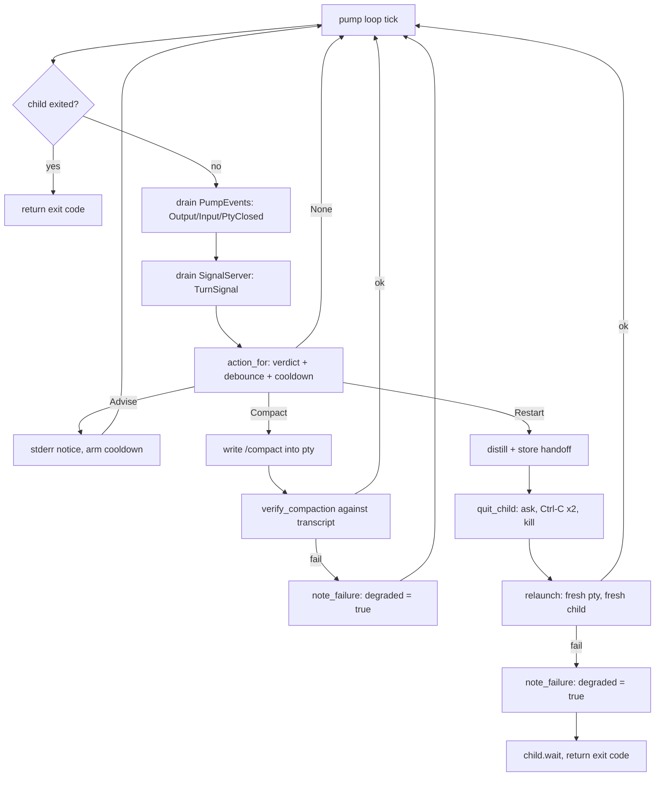

# Ctx Supervisors

## Quick Reference

- **Files:** `src/commands/ctx/run_loop.rs`, `exec.rs`, `wrap.rs` (the three process supervisors), plus `signal.rs`, `supervise.rs`, `term.rs`, `chrome.rs`, `announce.rs`, and `dash/{mod,pane,ui,spawnreq,roster}.rs` (the session multiplexer `zirv chat` opens on a capable terminal — see below)
- **Used by:** [[Script Runner]] (`AgentCommand::invoke` calls `exec::run_with` directly, in-process, for a supervised `Agent` step); `chat.rs`'s `run_with` calls `dash::run_dashboard` once `chrome::dash_eligible` says the terminal can carry it
- **Depends on:** [[Ctx Adapters]] (`AgentAdapter` builds the headless/interactive launch, exposes `transcript_path`, `register_turn_signal`, `compact_command`, `quit_sequence`, `model_args`, `resume_args`), [[Rot Engine]] (`score::IncrementalScorer` polls the transcript and yields a `Verdict`), [[Usage and Pacing]] (`pace::wait_for_window` / `pace::scan_for_limit` gate every cycle and catch usage-limit notices in the child's output; `window::max_used_percentage` feeds both `wrap`'s status bar and the dashboard's header), [[Ctx Subsystem]] (`sessions.rs`'s live registry and `zirv ctx nudge` marker/mail, `memory.rs`'s opt-in handoff harvest — both consulted from `exec`/`wrap`'s own tick and restart paths, not owned by this page)
- **Tests:** inline `#[cfg(test)] mod tests` in each file (e.g. `run_loop::tests`, `exec::tests`, `wrap::tests`, `signal::tests`, `supervise::tests`, `term::tests`, `dash::mod::tests`, `dash::pane::tests`, `dash::ui::tests`, `dash::spawnreq::tests`, `dash::roster::tests`; `wrap.rs` also has a `#[cfg(windows)] mod win` under `term::tests` for console-mode arithmetic)
- **If changed:** [[Ctx Subsystem]], [[Ctx Adapters]], [[Rot Engine]], [[Usage and Pacing]], [[Script Runner]], [[Decision Log]], [[Untrusted Configuration]]
- **Gotchas:** **the wrap safety contract** — `wrap` must never leave a session worse than unwrapped passthrough. The release profile is `panic = "abort"` (`Cargo.toml`, `[profile.release]`), so unwinding-based `Drop` cleanup cannot be relied on for raw-mode restore; `wrap.rs`'s hot path (`run_with`, `pump`, and everything they call) has zero `unwrap`/`expect` — every one of those calls in `wrap.rs`, `exec.rs`, and `run_loop.rs` lives inside `#[cfg(test)] mod tests`. See "The wrap safety contract" section below for exactly how this is enforced in code, not just asserted in prose. Also: **never write a control byte (``) into a pty master** — on Windows conhost broadcasts it to every process in the pseudoconsole, which is how a nested `wrap` used to kill the outer session; `quit_child`'s ladder is quit-sequence → grace → `child.kill()` with nothing in between. **`wrap` and `chat` refuse to start inside an existing agent session** unless `--allow-nested`/`ZIRV_ALLOW_NESTED=true`; the headless verbs are deliberately exempt. Also: `run_loop` mints a brand-new `SessionId` every cycle by design — do not "optimize" it into reusing one. `supervise_child` checks the child's exit status *before* calling the tick closure, so a fast limit-hit exit can race past the tick that would have caught it; both `run_loop` and `exec` compensate with one extra `pace::scan_for_limit` drain after `supervise_child`/`supervise_run` returns — removing that drain reintroduces the race. **The dashboard's orchestrator pane is never body-injected** — see "Injection semantics" below; getting this wrong would reopen the same mail/nudge trust split `wrap`'s own advisory-only rule already closes.

## Purpose

Three verbs, one job: keep an AI-agent process running well past what one raw invocation would survive, by watching its transcript for the [[Rot Engine]]'s verdict and acting on it — restart with a distilled handoff, inject a `/compact`, or just wait out a usage-window limit — without ever taking the wheel away from a human who is actually looking at the screen. A fourth piece, `dash`, is not a rot supervisor itself but the session multiplexer `zirv chat` opens on a capable terminal, hosting several of these supervised sessions as panes side by side.

- **`run_loop`** (`zirv ctx loop`) — a stateless loop runner: a fresh **headless** session, a fresh `SessionId`, every cycle. No context ever survives a cycle boundary on purpose.
- **`exec`** (`zirv ctx exec`) — supervises **one** headless run, restarting it in place (same invocation, new session, handoff injected into the new prompt) when it rots or a usage limit is hit. [[Script Runner]]'s `AgentCommand` calls `exec::run_with` directly for a supervised agent step inside a script — see [[Script Runner]].
- **`wrap`** (`zirv ctx wrap`) — supervises an **interactive** TUI session through a PTY, typing `/compact` or a restart handoff into the child itself rather than replacing its argv.
- **`dash`** (opened by `zirv chat`/bare `zirv` on a capable terminal, not a separate CLI verb) — a dashboard process owning N interactive ConPTY harness sessions, each rendered through its own embedded `vt100` screen model, with a persistent sidebar and header. See "The dashboard (`dash`)" below.

## How It Works

### `run_loop` — the stateless loop

`LoopArgs` (`--prompt`/`--prompt-file`, `--agent`, `--interval-secs`, `--max-cycle-secs`, `--max-failures`, `--on-failure`, `--cycles`, `--extra`, `--simple`). `run_with` loads `CtxConfig`, resolves the adapter and prompt once, then loops: `pace::wait_for_window` gates the cycle, a new `SessionId::new_v4()` is minted, the composed system prompt is (re-)injected and logged under that session's own id (never under the literal string `"loop"`), the child is spawned via `supervise::spawn_tapped`, and `supervise::supervise_child` polls it with a tick closure that watches for a usage-limit notice (`pace::scan_for_limit`) or a `Verdict::Restart` from the scorer. The outcome maps to one of `ok` / `limit-park` / `rot-kill` / `timeout-kill` / `nonzero-exit`; only `nonzero-exit` and `timeout-kill` count as a *failure* toward `--max-failures` (rot and a usage limit are treated as expected hygiene, not failure — the next cycle is the fix). `handle_cycle_outcome` applies exponential backoff (`backoff_for`, capped at four intervals) on consecutive failures and runs `--on-failure` (or `cfg.supervise.on_failure`) once the cap is hit, exiting `EXIT_FAILED` (75).

### `exec` — supervising one headless run

`ExecArgs` carries the headless command after `--`, or lets the adapter build the launch itself when `args.command` is empty/flag-only (this is how an `Agent` script step arrives — prompt as data, no argv to misparse). `run_with` resolves the prompt (`--prompt`, or `extract_prompt`/`locate_prompt` scanning the command for `-p`/`--print`/`exec`), builds a `signal::SignalServer` for turn signals, then loops: spawn, `supervise_run` (a tick closure combining limit detection, turn-signal `Verdict::Restart`, and the scorer's own verdict), and on exit either return the code, park until the usage window resets (usage limit — mints a new session, no restart-budget cost), or restart. A restart calls `handoff::distill_or_structural` to summarize the dying transcript, stores it, increments the restart counter against `--max-restarts` (`cfg.supervise.max_restarts`), and relaunches with the handoff prepended to the original prompt. Giving up exits `EXIT_ROT_EXHAUSTED` (75) for exhausted rot restarts or `EXIT_TIMEOUT` (76) for a wall-clock timeout with no prompt/budget left.

`extra_launch_flags` (also reused by `wrap`'s `restart_launch_flags`) is the piece that keeps a restart's argv honest: it strips only the prompt token, the launch-prefix positionals, and anything that pins the launch to an existing conversation (`--session-id`, `--resume`, `-c`, `--continue`, `--fork-session`, and their `=`-joined spellings) — every other operator flag (`--model`, `--allowedTools`, ...) survives every restart.

**Nudge is budget-free, checked in the same tick as rot.** `supervise_run`'s tick closure calls `sessions::claim_nudge_marker` right alongside its limit and turn-signal checks (before the scorer's own verdict is even consulted): claiming is atomic (`std::fs::remove_file` as the claim), so exactly one observer ever acts on a given wake-up, including across two ticks of the same process. When a relaunch is actually possible (a known `--prompt`) and the *consecutive* nudge count is still under `cfg.supervise.max_nudges` (default 3, its own env var `ZIRV_CTX_MAX_NUDGES`), the tick stops the child (`Tick::Stop("nudge")`) exactly like a rot restart does; `run_with`'s `nudged` branch then distills a handoff from the transcript so far and relaunches with it — but this **never touches `restarts`/`max_restarts`**, a wholly separate counter, because a nudge is an operator interruption, not rot. The counter really is consecutive: it resets to zero (`nudges_after`) as soon as the session reports a turn boundary of its own, since that is evidence it got somewhere between nudges. Note the dependency: the reset is driven by turn signals, so a run whose agent has no hook installed (nothing ever posts to the socket) never resets and the cap behaves cumulatively — the pre-fix behavior, for that case only. It used to be incremented and never reset, so a long-lived session nudged three times across an hour — doing real work in between each — permanently lost the ability to be nudged again. Past the cap (or with no prompt known) the marker is still claimed, so it can never re-fire, but the child keeps running untouched and the decision log records `nudge-ignored` rather than acting. A relaunch this way recomposes the prompt (re-applying the adapter layer and the operator's own command-line instruction through `prompt::relayer_recomposed`, from text captured at launch — re-running `merge_command_line_prompt` against the already-cleaned argv found nothing and silently dropped that instruction) and re-lists mail scoped to the run's stable registry short id, gated on a composed prompt actually existing so a `--simple` relaunch cannot consume mail it never delivered — the one deliberate exception to this module's own "mail is delivered once, at first launch" rule (see the module doc comment on `exec.rs`), because picking up what prompted the nudge is the whole point.

### `wrap` — supervising an interactive TUI through a PTY

`WrapArgs` (`--agent`, `--no-supervise`, `--simple`, `--allow-nested`, the command after `--`). `run_with` first refuses to start at all if this process is already inside an agent session (see [Nesting guard](#nesting-guard-and-the-missing-ctrl-c-rung) below), then selects the adapter, refuses to guess silently (an undetected command with no explicit `--agent` and no `--no-supervise`/`--simple` is a hard error *before the terminal is touched*, so `wrap` never types claude-only escape sequences into an unknown program), opens a `native_pty_system` pty sized from `term::window_size`, and spawns the wrapped command into it. Two threads pump bytes: PTY output to stdout (`spawn_output_thread`, gated by a generation counter so a stale reader from a pty a restart already abandoned can never interleave with the current one's output), and stdin to the PTY (filtered through `CprFilter`, which swallows the terminal's own answer to a Windows console-host cursor-position probe so it isn't typed into the agent as a keystroke — see the `CURSOR_POSITION_REPORT` doc comment for the deadlock this works around).

The `pump` loop drives an `InjectionState` off two sources: `PumpEvent`s (`Output`/`Input`/`PtyClosed`) from the two pump threads, and `TurnSignal`s from the `SignalServer`. `action_for` maps the current `Verdict` to `Action::None` / `Advise` / `Compact` / `Restart`, gated by `may_inject` (a turn boundary has been reported, the user hasn't typed since, the output debounce (`cfg.wrap.debounce_ms`, default 3000ms) has elapsed, and the last-armed cooldown has cleared). `Advise` only prints a stderr line. `Compact` writes the adapter's compact command into the pty and verifies the compaction actually landed in the transcript (`verify_compaction`, bounded by `cfg.wrap.inject_timeout_ms`, default 20s) before logging `inject` vs `inject-unverified`. `Restart` distills a handoff, asks the child to quit (`quit_child`: the adapter's quit sequence, then — after up to `QUIT_GRACE` = 5s — `child.kill()`; there is deliberately **no** Ctrl-C rung, see [Nesting guard](#nesting-guard-and-the-missing-ctrl-c-rung) below), opens a **fresh** inner pty (the old slave cannot be reused once its session leader has exited — `EBADF`), and relaunches with the handoff as the new prompt plus `restart_launch_flags`.



### The dashboard (`dash`)

`chat.rs::run_with` calls `chrome::dash_eligible(stdout_tty, stdin_tty, vt_ok, size, &cfg.dash, args.simple)` right after building the orchestrator launch (and splicing in `chat.model`, see [[Ctx Adapters]]); when it returns `true` the process becomes `dash::run_dashboard` instead of falling through to `wrap`. Eligibility needs **both** streams to be a real terminal (unlike `ChromeCaps::probe`, which only checks stdout — the dashboard reads keystrokes from stdin to drive pane selection), VT processing available, `cfg.dash.enabled` (default on, `dash.*` fully `REPO_FORBIDDEN`), not `--simple`, and a terminal at least `MIN_DASH_COLS`×`MIN_DASH_ROWS` (80×20 — a taller floor than `wrap`'s 40×8, measured against the vt100 spike, `docs/superpowers/notes/2026-08-13-vt100-spike.md`). A dashboard-enabled terminal that is simply too small still falls through to `wrap`, printing a one-line notice naming the floor (`--simple` silences it, and never reaches this branch at all since it disables eligibility outright).

**Pane model.** Each pane (`dash::pane::Pane`) is a supervised ConPTY child rendered through its own embedded `vt100::Screen`, reusing `wrap`'s own `answer_inherit_cursor_probe` (now `pub(in crate::commands::ctx)`) for the same Windows PTY-spawn deadlock. The first pane is always the orchestrator — the `PaneSpec` `chat.rs::dash_orchestrator_pane` builds from the resolved adapter's launch, carrying the **same composed prompt the `wrap` fallback builds** (memory lines → `prompt::compose` as an `Orchestrator` → `merge_command_line_prompt` → `injection_args_for_session` → `log_injection`, and deliberately **no** mail layer, exactly like `wrap`'s orchestrator path), title `"orch"`, registered under `Verb::Chat` (distinct from every other pane's `Verb::Dash`, so a registry row can tell "the orchestrator" from "a pane the dashboard spawned" apart — see [[Ctx Subsystem]]). Further panes arrive two ways: the `s` prefix command (`DashAction::Spawn` → `spawn_overlay_reduce`, whose `Enter` splits the typed line into `<agent> <prompt>` and routes it through the very same `fulfill_spawn_request` path a request takes — one place for the rules, not two), and a `zirv ctx agent` invocation run *inside* a pane's own child — `agent.rs::try_join_dashboard` writes a `spawnreq::SpawnRequest` (the prompt as data, never argv) into the directory the pane inherited via `spawnreq::DASH_REQUESTS_ENV`, and `fulfill_spawn_request` re-validates everything against the *live* configuration — a request is data, never authority — before spawning anything, in this order: the argv guard (`argv_unsafe_prompt`: a prompt beginning with `-` is refused outright, since the prompt is encoded positionally into the pane's argv and would otherwise reach the real harness child as a flag; `try_join_dashboard` refuses to even write such a request, falling back to the headless path where the prompt travels as `-p <value>` data), the requesting `cwd` (refused unless it names this dashboard's own repo — the field is checked, never honoured), `cfg.dash.max_panes` (default 9, matching `Ctrl+A 1..9` addressing, `REPO_FORBIDDEN`), then `cfg.agents.refusal`/`adapters::select` — the same gate an operator-issued `zirv ctx agent` goes through. It then answers with a `SpawnAck` naming the new pane's registry short id (or a refusal reason). `try_join_dashboard` declines the whole channel (one notice, then the headless path) when the invocation carries `--max-restarts`/`--timeout-secs`/trailing `-- flags`, none of which a pane can honour; `--quiet` is still allowed. A request that goes unanswered for `DASH_ACK_TIMEOUT` (5s) falls back to running headless — **unless** a `claim-<stem>` file is present: `handle_spawn_requests` writes one the instant `take_requests` hands it a request (which deletes the request file), so a slow spawn is distinguishable from nobody listening, and one `zirv ctx agent` can no longer become two live sessions working the same prompt. Claims are reaped with the whole request directory on quit.

**Prefix keys.** One prefix, `Ctrl+A` (`dash::PREFIX`), not configurable in v1 (a deliberate YAGNI deviation recorded in the plan's own self-review). `filter_key` matches it in either shape a real terminal can deliver: the classic `Char('a')`/`Char('A')` plus a `CONTROL` modifier flag, or — per the vt100 spike's own finding — the raw control byte `Char('\u{01}')` with **no** modifier flag at all, which is how Windows can deliver `Ctrl+A` in VT input mode; `encode_key`'s fallback `Char(c)` arm reproduces that same byte unchanged when it isn't the armed prefix, so no separate case is needed there. Once armed, the next key decides: digits `1`–`9` (`Switch`), `Tab` (`NextPane`), `Up`/`Down` (walk the sidebar), `s`/`n`/`m`/`M` open the spawn/nudge/mail/memory overlays (driven through the same library functions the CLI verbs use, not a parallel implementation), `z` toggles `Zoom` (the focused pane's grid is drawn into the whole frame — `effective_main` — with the header and sidebar skipped), `q` is `Quit`, and the prefix key pressed again (`LiteralPrefix`) sends one literal `Ctrl+A` byte to the active pane's child instead of invoking a dashboard command. An armed prefix followed by anything else disarms and forwards nothing, rather than leaking a stray keystroke the operator only meant as a failed command.

**Focus is not selection.** Two indices, moved by the pure `apply_navigation`: `selected` is the sidebar cursor over the *combined* row list (attached panes plus view-only registry rows) and is what a nudge is aimed at, while `focused` names the pane whose grid is drawn and whose child receives every un-prefixed keystroke — so it can only ever be a pane. `Up`/`Down` move `selected` alone (walking onto a view-only session leaves the focused pane exactly where it was, rather than blanking the grid and swallowing all typing); digits and `Tab` address panes and move both. The sidebar marks focus with a leading `*`, separately from the reversed-style selection highlight, so the operator can always see where their typing is going.

**Injection semantics.** Two once-per-tick sweeps deliver text into attached panes, both idle-gated: `deliver_queued_nudges` pops at most one FIFO-queued nudge per pane per tick when that pane is `Idle` (`deliverable_now`), and `mail_sweep` (via `sweep_one_pane`) injects **at most one** message per pane per tick the same way, consuming it only after a successful visible injection. One, not the whole mailbox: the idle gate is evaluated once, before the first injection, and injecting puts the pane straight back to work — so a batch delivered in one sweep would type messages two..N into a session that was already mid-turn, which is exactly what the gate exists to prevent. The remainder stays unread for a later tick. **The orchestrator pane (`Verb::Chat`) is excluded from `mail_sweep`'s automated delivery by construction** — `is_delivery_eligible` requires `Verb::Dash` — mirroring `wrap`'s own rule that an interactive Orchestrator session only ever gets a one-line unread-count advisory (the header's mail segment), never message bodies, from anything automated. The operator's own manual `n` (Nudge) overlay can still target the orchestrator's row directly (`NudgeTarget::AttachedPane(0)`), since that is a deliberate keystroke from the human at the keyboard, not an automated delivery path — queued the same FIFO way if the orchestrator is `Working`. A view-only sidebar row (another live session this dashboard did not spawn, `Liveness::Live` but not attached) routes a nudge through the existing headless `sessions::run_nudge_with` instead — this dashboard does not own that session's pty, so it can only ever wake it the way any other `zirv ctx nudge` caller would.

**Terminal restore.** `teardown_terminal` runs on every exit arm and the panic hook runs on the abort path, both writing the one shared `term::dash_reset_bytes()` sequence (`[?25h[?1049l` — cursor shown, scroll region un-fenced, alternate screen left) to **stdout**, the stream the alternate screen was entered on, after `disable_raw_mode`. Showing the cursor is not implied by leaving the alternate screen: ratatui hides it on every frame it draws. For the kills that reach no exit arm at all, `run_dashboard` also calls `term::stash_current_console`/`term::install_console_restore_handler` before entering raw mode and flags `term::set_dash_active(true)` after entering the alternate screen, so the shared console-control/signal handler owes the terminal the same sequence plus the pre-raw console modes — the `RawGuard` discipline `wrap` already has, reached here through crossterm's own `enable_raw_mode`.

**Quit and restore roster.** `q` quits immediately when no pane is `Working`; otherwise it opens a `QuitConfirm` overlay naming the working panes first. On confirmed quit, `on_quit` writes `<state>/dash/roster-<repo_slug>.json` (`roster::write_roster`) from every pane still alive — orchestrator included, tagged `roster::ROLE_ORCHESTRATOR`/`ROLE_WORKER` — then deletes the whole spawn-request directory (`<dash_short>-<token>`, not just its `requests` leaf) so nothing can reach a channel nobody is polling anymore. The next `run_dashboard` launch for the same repo calls `roster::take_roster` (consumed on read — renamed to `.consumed.json` immediately, even if it turns out stale — so a roster is never offered twice); a roster older than `cfg.dash.roster_max_age_secs` (default 7 days) or with the orchestrator's own entry filtered out (the fresh launch's own `first` `PaneSpec` already *is* the orchestrator) is offered as a `Restore` overlay, every candidate defaulting to checked. Confirming spawns each checked candidate via `roster::restore_argv`: `AgentAdapter::resume_args(session_id)` when the adapter has one (claude: `--resume <id>`, verified against the real CLI and already relied on elsewhere — `wrap::extra_launch_flags` strips it on every restart) reusing the roster entry's own `session_id`, so the restored pane's registry short id and mail/nudge address match what they were before the quit; codex has no verified resume flag, so it falls back to a plain prompt-carrying relaunch with a one-line "resuming after a dashboard restart" note instead of guessing one.

### `signal.rs` — turn-signal sockets

`TurnSignal { session_id, turn, score, verdict, transcript_path }` is how a hook running *inside* the wrapped/executed agent tells the supervisor a turn just ended — the supervisor cannot derive the agent's own session id or transcript path itself, so this is the only channel for both. On unix, `SignalServer::bind` opens a `UnixListener` (path capped at `MAX_SOCKET_PATH` = 100 bytes, macOS's `sun_path` limit) and reads newline-delimited JSON on a background thread, one connection at a time, with a per-connection `MAX_SIGNAL_BYTES` (64KB) cap and a `CLIENT_READ_TIMEOUT` (2s) so one stalled client can't starve every later signal. On Windows there are no unix sockets, so the same surface rides a named pipe (`\\.\pipe\zirv-ctx-<session>`, `MAX_PIPE_NAME` = 256) built on overlapped I/O; `pipe_name` derives the pipe name from the same socket path so the hook's environment and `send`'s reconnection logic round-trip unchanged. `try_recv` is non-blocking either way, which is what lets `run_loop`/`exec`/`wrap`'s poll ticks check for a signal without stalling.

### `supervise.rs` — shared process-supervision primitives

- `supervise_child(child, deadline, poll, on_tick)` — the polling loop all three verbs build on: checks `try_wait`, then the deadline, then calls `on_tick`, sleeping `poll` between iterations; always calls `terminate` (SIGTERM then SIGKILL after a grace period) before returning `TimedOut` or `StoppedByTick`, so no supervisor ever leaks a process. See `SuperviseConfig` in `config.rs` for the tunables that feed the `deadline`/`poll`/restart-budget arguments each verb passes in: `max_restarts` (exec's restart budget, default 2), `poll_ms` (default 2000), `interval_secs` (loop's between-cycle sleep, default 900), `max_cycle_secs` (the wall-clock deadline, default 3600), `max_failures` (loop's failure cap, default 5), `backoff_base_secs` (default 60), `on_failure` (shell command run when loop gives up).
- `spawn_tapped` / `OutputTap` — spawns with piped stdout/stderr, forwards every line to this process's own streams unchanged (tapping must never change what the operator sees), and also hands whole lines to the caller via a channel, which is how `pace::scan_for_limit` inspects headless output for usage-limit notices without swallowing them.
- `Watcher` — polls a growing transcript file and reports only the bytes appended since the last poll (`read_appended` → `Appended { lines, partial, restarted }`), an O(1)-per-poll operation via head/tail fingerprinting (`consumed_fingerprint`) rather than re-reading the whole file. Detects same-length rewrites (via mtime, e.g. right after a compaction) and truncations/longer rewrites (via the fingerprint mismatch), reporting `restarted: true` and re-reading from byte zero whenever the delta can no longer be trusted. Supports resuming from a previously persisted `(offset, consumed)` position. Used by `score::IncrementalScorer` and by `wrap`'s `verify_compaction`.
- `run_shell` — runs an `on_failure`/similar hook the way the script runner runs a command (`powershell -Command` on Windows, `sh -c` elsewhere).

### `term.rs` — raw terminal mode

`RawGuard` puts the controlling terminal (or, on Windows, the process console) into raw mode for `wrap`'s pty pump and restores it afterward. Unix: `termios`/`tcgetattr`/`tcsetattr`/`cfmakeraw` around a single fd (`STDIN_FD`, always `0` — the real fd on unix, a token meaning "this process's own console" on Windows, rejected everywhere else rather than cast into a handle). Windows: two console modes, not one — `ENABLE_LINE_INPUT`/`ENABLE_ECHO_INPUT`/`ENABLE_PROCESSED_INPUT` cleared and `ENABLE_VIRTUAL_TERMINAL_INPUT` set on the *input* handle, `ENABLE_VIRTUAL_TERMINAL_PROCESSING`/`DISABLE_NEWLINE_AUTO_RETURN` set on the *output* handle — because a Windows TUI's escape sequences are read from one handle and rendered on the other. `RawGuard::enter` on Windows rolls the input mode back if setting the output mode fails, so a half-applied raw mode never lingers. `window_size` reads the console's visible viewport (`srWindow`, not the taller scrollback buffer `dwSize` would report) on Windows, `TIOCGWINSZ` on unix. On any other platform, `RawGuard::enter` always returns `Err` and `window_size` always returns `Err`, so `wrap` still compiles and degrades to its `.unwrap_or(DEFAULT_SIZE)` / no-raw-mode paths there instead of being `cfg`'d out. Because those modes belong to the *user's own* console rather than a private handle, and `restore` only runs on a path this process actually reaches, `RawGuard::enter` also stashes the pre-raw modes in a write-once process global and installs a restore handler exactly once (`install_console_restore_handler`: `SetConsoleCtrlHandler` on Windows, `signal(SIGINT/SIGTERM/SIGHUP)` on unix). The handler restores those modes — plus a fixed, allocation-free `CSI r` when the chrome bar had fenced off the terminal's last row (`term::set_bar_active`, driven from `wrap`'s scroll-region write and `reset_bar`) — and then lets default handling proceed, so the process still dies of what it was sent. It cannot cover `TerminateProcess`/`SIGKILL`, which run no user code by design; the manual verification recipe for the rest lives in a comment at the top of `term.rs`.

### Nesting guard and the missing Ctrl-C rung

Two closely-related safety rules, both added 2026-08-13 after a nested `zirv chat` was found to kill the session it was started from. See the [[Decision Log]] entry for the full mechanism.

- **`quit_child` has no Ctrl-C rung.** Writing `` into the pty master is not a signal to that one child: on Windows the master is a ConPTY and conhost broadcasts the byte as a console control event to *every* process attached to the pseudoconsole, with no `CREATE_NEW_PROCESS_GROUP` (portable-pty 0.9.0 does not spawn with one) to narrow it to. The ladder is the adapter's quit sequence, a `QUIT_GRACE` wait, then `child.kill()` — the one narrow primitive — and nothing else. `quit_child_never_writes_a_control_c_into_the_pty` asserts the exact sink bytes, on every platform, against a stub `portable_pty::Child`.
- **Interactive verbs refuse to nest.** `sessions::nested_session_evidence` reports why this process looks like it is already inside an agent session — `ZIRV_CTX_SESSION`, `ZIRV_CTX_SOCKET`, the `CLAUDE_PID`+`CLAUDECODE` pair (either Claude Code marker alone is too weak; the pair is required), or `spawnreq::DASH_REQUESTS_ENV` (a dashboard pane owns this terminal — exported into a pane's own `turn_env`, never into the dashboard's own process environment, so this is never a self-trip on the dashboard's own launch). `sessions::nesting_refusal` turns that into the message `wrap` and `chat` print before touching config, an adapter, or the terminal. `--allow-nested`, or `ZIRV_ALLOW_NESTED=true`, overrides it; `chat` threads its own flag into `WrapArgs` because `wrap` re-runs the identical guard one layer down. The **headless** verbs (`exec`, `loop`, `agent`) are deliberately not gated: delegating to a worker from inside a session is what they are for, and a worker never takes the shared console over. `DASH_REQUESTS_ENV` is deliberately absent from `SUPERVISION_ENV`'s scrub, unlike the other three markers — a pane child's own further children (e.g. a nested `zirv ctx agent`) must still be able to reach the dashboard's spawn-request channel, which scrubbing it there would break.
- **Every child's supervision identity is scrubbed first.** `sessions::SUPERVISION_ENV` (`ZIRV_CTX_SESSION`, `ZIRV_CTX_SOCKET`, `ZIRV_CTX_TRANSCRIPT`) is `env_remove`d from every child command *before* the supervisor sets whichever of it it actually owns — `wrap::apply_session_env` for both the initial launch and every relaunch, `exec`'s own `apply_session_env` closure for all four launch paths, and `run_loop` (which owns none of it at all, and is therefore the case that most needed the scrub). `CommandBuilder::new` seeds itself from `std::env::vars_os`, so without this a supervisor whose socket bind failed handed its child the *outer* session's identity, and that child's hooks reported turn boundaries into somebody else's rot engine.
- **The registry short id is a stable address.** `SessionGuard::refresh_session` rotates `Record.session` but never `Record.short`, so a supervisor answers to one address for its whole run. Every delivery listing a supervisor performs on its own behalf is scoped to that address — `exec`'s launch and nudge-relaunch listings, `loop`'s per-cycle listing, and `exec`'s nudge-marker claim. Rotating it had made mail addressed to a live session undeliverable the moment a cycle or restart replaced it, and `loop`'s `None` workaround meant it consumed other sessions' directed mail. See the 2026-08-13 [[Decision Log]] entry.
- **Nothing spawned from a supervised session inherits its identity.** Beyond the supervisors' own agent children, this covers `handoff::run_model` (the distiller, and therefore `memory::harvest_from_handoff`, which spawns through it) and `resume`'s hand-over launch. `resume` is also subject to the nesting guard: it hands the terminal to an interactive agent exactly as `wrap`/`chat` do, and takes the same `--allow-nested`. Its `--print-prompt` branch launches nothing and is deliberately not gated.
- **A `wrap` session with no turn-signal socket is registered as `reachable: false`, not hidden.** The pump claims nudge markers exclusively from its turn-signal arm, so a session with no socket (`--no-supervise`, or a failed bind) can never answer a nudge — not even to advise about one. Dropping such sessions from the registry cured the silent nudge by making the session invisible, including in `zirv ctx status`. Instead the record carries `reachable` (serde-defaulted `true`, so older records still parse): `status` renders it as `unreachable` rather than `live`, and `zirv ctx nudge` refuses it with the reason and points at `zirv ctx send` instead. Keyed on the socket rather than on the flags: `--simple` still binds one and remains a legitimate advisory target.
- **One socket-path file per session.** `wrap` publishes `<state>/socket-path-<short8>` (`publish_socket_path`, released next to the registry record when the pump returns) instead of the pre-F5 global `<state>/socket-path`, which two concurrent supervisors clobbered. `read_socket_path(state, session)` resolves a named session's own file only — never a neighbour's — falling back to the legacy global file; with no session it takes the newest published one.

## The wrap safety contract

The repo's own `CLAUDE.md` states the invariant: *"`wrap` must never make a session worse. No `unwrap`/`expect` on its hot path, raw-mode restore happens in explicit arms (the release profile is `panic = "abort"`), and any supervision failure degrades to pure passthrough."* This was verified line-by-line against the current source:

- **`panic = "abort"` is real.** `Cargo.toml`'s `[profile.release]` sets `panic = "abort"` (alongside `opt-level = "z"`, `lto = true`, `codegen-units = 1`). Under this profile a panic terminates the process immediately — it does **not** unwind the stack, so `Drop` impls along the way (including `RawGuard`'s) are not guaranteed to run. Cleanup that only lived in a `Drop` guard would be unreliable exactly when it matters most.
- **No `unwrap`/`expect` on the hot path.** Every `.unwrap()`/`.expect(...)` call in `wrap.rs`, `exec.rs`, and `run_loop.rs` lives inside that file's `#[cfg(test)] mod tests`; `run_with` and `pump` (the functions that actually drive a live session) use `?`, `.unwrap_or(...)`, `.ok()`, `if let Ok(...)`, and `let ... else` throughout instead. A failure to lock a poisoned mutex, bind a socket, or open a pty is turned into a `CtxResult` and either logged via `note_failure`/`log::append` or falls through to a degraded/passthrough path — never a panic.
- **Raw-mode restore happens in an explicit arm, not only via `Drop`.** `RawGuard` *does* implement `Drop` (for the arms that legitimately fall through without an explicit call, and as defense in depth), but `run_with` also calls `guard.restore()` explicitly immediately after `pump` returns — on *any* exit path, since `pump`'s return value is captured first and the restore runs unconditionally before that result is inspected:
  ```rust
  let exit = pump(&mut child, /* ... */);
  if let Some(guard) = raw.as_mut() {
      let _ = guard.restore();
  }
  match exit { Ok(code) => Ok(code), Err(e) => { writeln!(w, "zirv ctx wrap: {e}")?; Ok(1) } }
  ```
  `RawGuard::restore` is itself idempotent (an `active` flag makes a second call a no-op), which is what makes calling it both explicitly and via `Drop` safe rather than double-restoring.
- **Any supervision failure degrades to pure passthrough, not a crash.** `--no-supervise` is a first-class flag (`WrapArgs::no_supervise`) that sets `InjectionState::degraded = true` up front and skips binding a signal socket entirely — `action_for` returns `Action::None` unconditionally once `degraded` is set, so the pty pump still runs (bytes still flow both ways) but nothing is ever typed into the child. The same `degraded` flag is set at runtime by `note_failure` whenever supervision machinery itself fails: a socket that won't bind, a compaction that can't be verified, a relaunch that fails. It is a **one-way switch** — once set, `action_for` short-circuits to `Action::None` for the rest of that `wrap` session, by design ("once supervision has proven unreliable in a session it stays off: a wrapped session must never be worse than an unwrapped one"). An adapter `wrap` cannot identify (no `--agent`, detection inconclusive) is refused *before* the terminal or child process is touched at all, rather than guessed at and typed into with the wrong escape sequences.

Net effect: the worst thing a bug in the supervision logic can do to a `wrap` session is stop advising/compacting/restarting — it cannot leave the terminal in raw mode, and it cannot itself crash the wrapped agent. This is the one place in `zirv ctx` where "fail closed" specifically means "fail down to plain `wrap --no-supervise`-equivalent behavior," not "fail loud."

## The interactive session's role, mail advisory, and terminal chrome

Three smaller pieces round out what an interactive `wrap` session (in practice, `zirv ctx chat`) gets beyond the pump loop above:

- **Role parameter.** `wrap::run_with` takes a `PromptRole` (`Orchestrator` or `Worker`, defined in `prompt.rs`) rather than always injecting the same system prompt. `zirv ctx chat` passes `PromptRole::Orchestrator` for the session a human is talking to directly; every other caller of `wrap`'s own composition path passes `PromptRole::Worker`. Only an orchestrator session gets the harness-teaching layer (`HARNESS_PROMPT` — how to delegate via `zirv ctx agent`, exchange notes via `zirv ctx send`/`inbox`, and read `zirv ctx status`); a worker never does, so a delegated run cannot itself be taught to delegate further. See [[Ctx Adapters]] and [[Context Management]] for the rest of the injected-prompt layering.
- **Mail advisory.** An interactive `wrap` session never receives mail message content in its own prompt — it gets a one-line advisory instead (`mail::list`'s unread count folded into `announce::Event::MailWaiting`), so a human decides whether to go read it via `zirv ctx inbox`. Full message bodies are delivered into the composed system prompt only for headless **Worker** sessions: `exec::run_with` (once, at the first launch — a restart reuses that same composed prompt rather than re-listing) and `run_loop::run_with` (fresh, every cycle), both gated by `cfg.mail.enabled` and folding mail in as its own labeled `PromptSource::Mail` layer, after the repo layer and before the command-line layer (`prompt::with_mail_layer`, see [[Untrusted Configuration]]). A message delivered this way is consumed (`mail::consume`, moved to `read/`) immediately after, so it is not redelivered on the next launch or cycle; a failed consume is swallowed rather than failing the launch, since the mail already reached the prompt either way. The T12b bar's own mail count (below) splits the same visible-to-this-session listing into `(broadcast, direct-to-this-session)` rather than one combined total, so a message addressed to this session specifically does not disappear into an undifferentiated number.
- **Nudge advisory.** Exactly like mail, an interactive `wrap` session is only ever *advised* of a nudge, never restarted and never typed into — a nudge that would trigger a rot-style restart in `exec` (see above) is deliberately inert here. `pump`'s turn-signal arm calls `sessions::claim_nudge_marker` (the same atomic claim `exec`'s tick uses, throttled the same way the mail-advisory check already is: only from this one arm, never the raw byte-pump path) and, on a successful claim, emits an `Event::Nudge { restarted: false }` on the announcement channel. The nudge's own payload is still ordinary session-addressed mail, so it is picked up the normal way via `zirv ctx inbox` or the bar's mail count, not through this advisory.
- **Terminal chrome.** `chrome.rs` decides — as a pure function of caller-supplied probe results, no terminal handle opened inside it — whether a session gets the one-time launch banner, the reserved one-row status bar, and colour. Eligibility requires stdout to be a real terminal, at least 40 columns by 8 rows, and neither `--simple` nor `--no-supervise`; `--simple`/`--no-supervise` both promise a plain passthrough session, so both turn every piece of chrome off exactly like a too-small or non-terminal one does. The status bar additionally needs Windows VT processing to be enabled (it draws with cursor-addressing escapes), so a terminal that can't do VT still gets a plain, uncoloured banner but never a bar. Chrome degrades in one direction only — nothing here ever upgrades a session mid-run — and it never touches the wrapped child's own pty; only `wrap`'s pump reads or writes that. `announce.rs` is the `zirv ▸` event channel this chrome enables, printed to stderr as `[HH:MM:SS] zirv ▸ <message>`; it (along with the banner and bar) can be turned off independently via `[chrome] events`/`banner`/`bar` in `ctx.toml`, or the whole announcement channel via `--quiet`/`ZIRV_CTX_QUIET`. `chrome::dash_eligible` is the sibling gate for the dashboard itself (see "The dashboard (`dash`)" above): a separate, taller floor (`MIN_DASH_COLS`×`MIN_DASH_ROWS`, 80×20) and a stricter both-streams-must-be-a-terminal rule, since `ChromeCaps::probe` only ever needed stdout.

## Known gap: no rot score in a pane's own header

The dashboard's header (`ui::HeaderFacts`) has a `score` field, but every real call site (`assemble_header_facts` in `run_dashboard`'s render loop) passes `None` — no [[Rot Engine]] transcript scoring is wired up for panes yet, unlike `wrap`'s own status bar. A pane still runs supervised (turn-signal env, quit sequence, resume on restore) but nothing watches its transcript for a `Verdict` the way `exec`/`wrap`/`run_loop` do for their own single session; the header shows harness/usage/mail/memory/session-count only.

## Cross-links

- [[Ctx Subsystem]] — the hub page for `zirv ctx`; verb dispatch, config layering, and how these three verbs fit alongside `status`, `hook`, `handoff`, `resume`, and the dashboard.
- [[Ctx Adapters]] — the `AgentAdapter` trait these supervisors launch and monitor (`headless_cmd`, `interactive_cmd`, `transcript_path`, `register_turn_signal`, `parse_events`, `compact_command`, `quit_sequence`, `model_args`, `resume_args`).
- [[Rot Engine]] — the pure `Verdict` computation (`Healthy`/`Advise`/`Compact`/`Restart`) that every supervisor's tick closure ultimately acts on (not yet wired into a dashboard pane's own header — see above).
- [[Script Runner]] — `AgentCommand::invoke` calls `exec::run_with` directly for a supervised `Agent` script step; see its "Agent steps" section.
