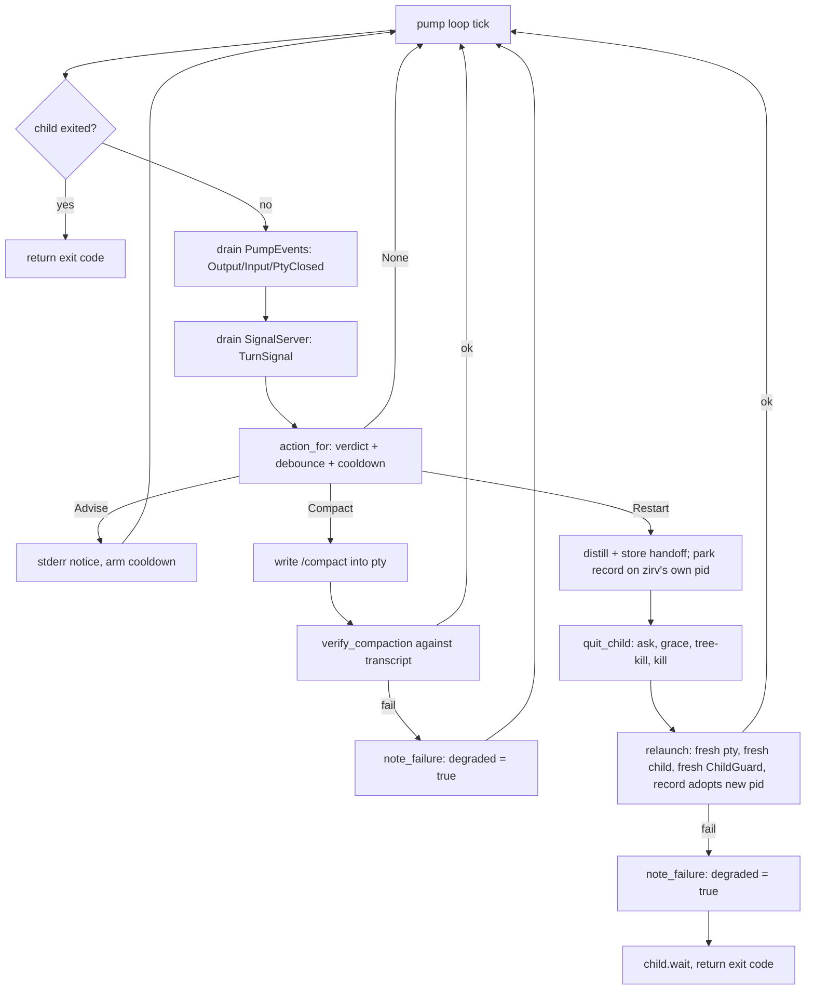

# Ctx Supervisors

## Quick Reference

- **Files:** `src/commands/ctx/run_loop.rs`, `exec.rs`, `wrap.rs` (the three process supervisors), plus `signal.rs`, `supervise.rs`, `term.rs`, `chrome.rs`, `announce.rs`, and `dash/{mod,pane,ui,spawnreq,roster}.rs` (the session multiplexer `zirv chat` opens on a capable terminal — see below)
- **Used by:** [[Script Runner]] (`AgentCommand::invoke` calls `exec::run_with` directly, in-process, for a supervised `Agent` step); `chat.rs`'s `run_with` calls `dash::run_dashboard` once `chrome::dash_eligible` says the terminal can carry it
- **Depends on:** [[Ctx Adapters]] (`AgentAdapter` builds the headless/interactive launch, exposes `transcript_path`, `register_turn_signal`, `compact_command`, `quit_sequence`, `model_args`, `resume_args`, `provider`), [[Rot Engine]] (`score::IncrementalScorer` polls the transcript and yields a `Verdict`; `score::cached_score` gives the dashboard header/sidebar a cheap per-pane score off the same incremental fold), [[Usage and Pacing]] (`pace::wait_for_window` / `pace::scan_for_limit` gate every cycle and catch usage-limit notices in the child's output; `window::available` (2026-08-18) filters both the dashboard header and `wrap`'s status bar down to windows that have not provably reset before either renders `5h X% wk Y%` per enabled harness — see below), [[Ctx Subsystem]] (`sessions.rs`'s live registry and `zirv ctx nudge` marker/mail, `memory.rs`'s opt-in durable harvest, issue #37 — consulted from `exec`/`wrap`'s restart *and* clean-exit paths now, not owned by this page)
- **Tests:** inline `#[cfg(test)] mod tests` in each file (e.g. `run_loop::tests`, `exec::tests`, `wrap::tests`, `signal::tests`, `supervise::tests`, `term::tests`, `dash::mod::tests`, `dash::pane::tests`, `dash::ui::tests`, `dash::spawnreq::tests`, `dash::roster::tests`; `wrap.rs` also has a `#[cfg(windows)] mod win` under `term::tests` for console-mode arithmetic)
- **If changed:** [[Ctx Subsystem]], [[Ctx Adapters]], [[Rot Engine]], [[Usage and Pacing]], [[Script Runner]], [[Decision Log]], [[Untrusted Configuration]], [[Technology Stack]] (the `windows-sys` `Win32_System_JobObjects` feature backing `supervise::JobGuard`)
- **Gotchas:** **the wrap safety contract** — `wrap` must never leave a session worse than unwrapped passthrough. The release profile is `panic = "abort"` (`Cargo.toml`, `[profile.release]`), so unwinding-based `Drop` cleanup cannot be relied on for raw-mode restore; `wrap.rs`'s hot path (`run_with`, `pump`, and everything they call) has zero `unwrap`/`expect` — every one of those calls in `wrap.rs`, `exec.rs`, and `run_loop.rs` lives inside `#[cfg(test)] mod tests`. See "The wrap safety contract" section below for exactly how this is enforced in code, not just asserted in prose. Also: **never write a control byte (`\x03`) into a pty master** — on Windows conhost broadcasts it to every process in the pseudoconsole, which is how a nested `wrap` used to kill the outer session; `quit_child`'s ladder is quit-sequence → grace → `kill_tree` → `child.kill()`, still with no Ctrl-C rung (2026-08-16 added the `kill_tree` step; see "The Windows process-tree lifecycle" below). **A dropped `ChildGuard` closes its Job Object, which on Windows kills the child it guards** — the guard must never go out of scope before the child's exit is confirmed; see "The Windows process-tree lifecycle" below and [[Known Issues]]. **`wrap` and `chat` refuse to start inside an existing agent session** unless `--allow-nested`/`ZIRV_ALLOW_NESTED=true`; the headless verbs are deliberately exempt. Also: `run_loop` mints a brand-new `SessionId` every cycle by design — do not "optimize" it into reusing one. `supervise_child` checks the child's exit status *before* calling the tick closure, so a fast limit-hit exit can race past the tick that would have caught it; both `run_loop` and `exec` compensate with one extra `pace::scan_for_limit` drain after `supervise_child`/`supervise_run` returns — removing that drain reintroduces the race. **That final drain itself used to still lose the race (fixed v2.25.1, PR #113):** it called `tap.try_lines()`, a pure non-blocking drain with no synchronization against `spawn_tapped`'s own reader threads reaching EOF, so a child that printed its limit line and exited immediately could still have that line in flight — invisible to `try_lines` — at the exact instant `child.wait()`/`try_wait()` observed the OS-level exit. Both call sites now use `OutputTap::drain_to_eof(supervise::FINAL_DRAIN_BUDGET)` instead — see "`supervise.rs`" below. **The dashboard's orchestrator pane is never body-injected** — see "Injection semantics" below; getting this wrong would reopen the same mail/nudge trust split `wrap`'s own advisory-only rule already closes. **A full-screen pane (the alternate screen) has no vt100 scrollback, ever** — two independent mechanisms in vt100 0.16.2 guarantee it regardless of the configured scrollback size; the dashboard forwards the wheel to a mouse-owning child instead of trying to make scrollback work. **Never call `crossterm::EnableMouseCapture` in the dashboard** — it also enables `?1003`, the free-running motion mode, which floods the input drain; the dashboard writes `?1000h?1002h?1006h` itself (button/wheel reporting, button-*drag* tracking, SGR coordinates), never `?1003h`. `?1002`'s `Drag` events feed the dashboard's own tmux-style click-drag text selection and OSC 52 clipboard copy (2026-08-19, uncommitted, extends PR #29) for a pane whose child does not itself want mouse reporting. See "Pane scrolling and mouse reporting" below and [[Known Issues]] for both.

## Purpose

Three verbs, one job: keep an AI-agent process running well past what one raw invocation would survive, by watching its transcript for the [[Rot Engine]]'s verdict and acting on it — restart with a distilled handoff, inject a `/compact`, or just wait out a usage-window limit — without ever taking the wheel away from a human who is actually looking at the screen. A fourth piece, `dash`, is not a rot supervisor itself but the session multiplexer `zirv chat` opens on a capable terminal, hosting several of these supervised sessions as panes side by side.

- **`run_loop`** (`zirv ctx loop`) — a stateless loop runner: a fresh **headless** session, a fresh `SessionId`, every cycle. No context ever survives a cycle boundary on purpose.
- **`exec`** (`zirv ctx exec`) — supervises **one** headless run, restarting it in place (same invocation, new session, handoff injected into the new prompt) when it rots or a usage limit is hit. [[Script Runner]]'s `AgentCommand` calls `exec::run_with` directly for a supervised agent step inside a script — see [[Script Runner]].
- **`wrap`** (`zirv ctx wrap`) — supervises an **interactive** TUI session through a PTY, typing `/compact` or a restart handoff into the child itself rather than replacing its argv.
- **`dash`** (opened by `zirv chat`/bare `zirv` on a capable terminal, not a separate CLI verb) — a dashboard process owning N interactive ConPTY harness sessions, each rendered through its own embedded `vt100` screen model, with a persistent sidebar and header. See "The dashboard (`dash`)" below.

## How It Works

### `run_loop` — the stateless loop

`LoopArgs` (`--prompt`/`--prompt-file`, `--agent`, `--interval-secs`, `--max-cycle-secs`, `--max-failures`, `--on-failure`, `--cycles`, `--extra`, `--simple`). `run_with` loads `CtxConfig`, resolves the adapter and prompt once, then loops: `pace::wait_for_window` gates the cycle, a new `SessionId::new_v4()` is minted, the composed system prompt is (re-)injected and logged under that session's own id (never under the literal string `"loop"`), the child is spawned via `supervise::spawn_tapped`, and `supervise::supervise_child` polls it with a tick closure that watches for a usage-limit notice (`pace::scan_for_limit`) or a `Verdict::Restart` from the scorer. The outcome maps to one of `ok` / `limit-park` / `rot-kill` / `timeout-kill` / `nonzero-exit`; only `nonzero-exit` and `timeout-kill` count as a *failure* toward `--max-failures` (rot and a usage limit are treated as expected hygiene, not failure — the next cycle is the fix). `handle_cycle_outcome` applies exponential backoff (`backoff_for`, capped at four intervals) on consecutive failures and runs `--on-failure` (or `cfg.supervise.on_failure`) once the cap is hit, exiting `EXIT_FAILED` (75).

### `exec` — supervising one headless run

`ExecArgs` carries the headless command after `--`, or lets the adapter build the launch itself when `args.command` is empty/flag-only (this is how an `Agent` script step arrives — prompt as data, no argv to misparse). `run_with` resolves the prompt (`--prompt`, or `extract_prompt`/`locate_prompt` scanning the command for `-p`/`--print`/`exec`), builds a `signal::SignalServer` for turn signals, then loops: spawn, `supervise_run` (a tick closure combining limit detection, turn-signal `Verdict::Restart`, and the scorer's own verdict), and on exit either return the code, park until the usage window resets (usage limit — mints a new session, no restart-budget cost), or restart. A restart calls `handoff::distill_or_structural` to summarize the dying transcript, stores it, increments the restart counter against `--max-restarts` (`cfg.supervise.max_restarts`), and relaunches with the handoff prepended to the original prompt. Giving up exits `EXIT_ROT_EXHAUSTED` (75) for exhausted rot restarts or `EXIT_TIMEOUT` (76) for a wall-clock timeout with no prompt/budget left. When the restart's own handoff came back genuinely *distilled*, it also feeds `memory::harvest_durable` (issue #37, `cfg.memory.harvest`, default off) for one extra cheap-model call extracting durable SHARED-bank facts — best-effort, discarded with `let _ =`, so a harvest failure can never fail the restart. **A genuinely clean exit (`Outcome::Exited(code) if !limit_hit`) now gets the same chance** (issue #37, a seam that did not exist before it): gated on `cfg.memory.harvest` before the transcript is even read, it distills the just-ended transcript itself via `memory::harvest_at_session_end` (there being no already-distilled handoff lying around at a clean exit the way there is at a restart) and, only if that distillation succeeded, hands the result to the same `harvest_durable`. A nudge relaunch still gets neither.

`extra_launch_flags` (also reused by `wrap`'s `restart_launch_flags`) is the piece that keeps a restart's argv honest: it strips only the prompt token, the launch-prefix positionals, and anything that pins the launch to an existing conversation (`--session-id`, `--resume`, `-c`, `--continue`, `--fork-session`, and their `=`-joined spellings) — every other operator flag (`--model`, `--allowedTools`, ...) survives every restart. **That pin-flag strip is scoped to the adapter that actually built the launch (issue #143, 2026-08-26).** `extra_launch_flags`/`pins_an_existing_conversation` now both take the adapter's `name()` and gate the whole strip on `adapter_has_resume_flags(name)` (true only for `"claude"`, the one adapter this vocabulary was ever verified against): codex's own `-c, --config <key>=<value>` shares claude's bare `-c` spelling for an unrelated, value-carrying flag, and the un-gated strip used to drop `-c` as claude's valueless `--continue` shorthand on every codex restart while its own config value (e.g. `approval_policy=never`) survived, orphaned on argv — real codex-cli then rejected the whole relaunch.

**Nudge is budget-free, checked in the same tick as rot.** `supervise_run`'s tick closure calls `sessions::claim_nudge_marker` right alongside its limit and turn-signal checks (before the scorer's own verdict is even consulted): claiming is atomic (`std::fs::remove_file` as the claim), so exactly one observer ever acts on a given wake-up, including across two ticks of the same process. When a relaunch is actually possible (a known `--prompt`) and the *consecutive* nudge count is still under `cfg.supervise.max_nudges` (default 3, its own env var `ZIRV_CTX_MAX_NUDGES`), the tick stops the child (`Tick::Stop("nudge")`) exactly like a rot restart does; `run_with`'s `nudged` branch then distills a handoff from the transcript so far and relaunches with it — but this **never touches `restarts`/`max_restarts`**, a wholly separate counter, because a nudge is an operator interruption, not rot. The counter really is consecutive: it resets to zero (`nudges_after`) as soon as the session reports a turn boundary of its own, since that is evidence it got somewhere between nudges. Note the dependency: the reset is driven by turn signals, so a run whose agent has no hook installed (nothing ever posts to the socket) never resets and the cap behaves cumulatively — the pre-fix behavior, for that case only. It used to be incremented and never reset, so a long-lived session nudged three times across an hour — doing real work in between each — permanently lost the ability to be nudged again. Past the cap (or with no prompt known) the marker is still claimed, so it can never re-fire, but the child keeps running untouched and the decision log records `nudge-ignored` rather than acting. A relaunch this way recomposes the prompt (re-applying the adapter layer and the operator's own command-line instruction through `prompt::relayer_recomposed`, from text captured at launch — re-running `merge_command_line_prompt` against the already-cleaned argv found nothing and silently dropped that instruction) and re-lists mail scoped to the run's stable registry short id, gated on a composed prompt actually existing so a `--simple` relaunch cannot consume mail it never delivered — the one deliberate exception to this module's own "mail is delivered once, at first launch" rule (see the module doc comment on `exec.rs`), because picking up what prompted the nudge is the whole point.

**Delegated-worker budgets (`--budget-tokens`/`--max-tool-calls`, issue #155 Task 5.4).** `zirv ctx agent` (and any `zirv ctx exec` invocation carrying the same flags) can cap a delegated worker on cumulative token spend and/or tool-call count: `agent::budget_state` checkpoints at 80% (`SoftWarn`, one `eprintln!` per run) and hard-stops at the ceiling (`HardStop`) — a budget exhaustion is always a stop, never a model downgrade. `evaluate_worker_budget` (`exec.rs`) reads the transcript fresh, sums usage via `AgentAdapter::transcript_usage`, and counts `NormalizedEvent::ToolCall`s via `parse_events`; it is skipped entirely (no transcript read at all) when neither ceiling is configured, so an ordinary delegation before this feature (or the common case after it) pays nothing extra. A `HardStop` mid-run stops the child (`Tick::Stop("budget")`) and reports `EXIT_BUDGET_EXHAUSTED`; the run never restarts once `budget_exhausted` is set, regardless of restart budget remaining.

`--max-tool-calls` is refused up front, before anything is spawned, for an adapter that cannot count tool calls at all: `AgentAdapter::counts_tool_calls()` (default `true`) is `false` for `CodexAdapter`, since its `parse_events` never emits `NormalizedEvent::ToolCall` (no verified rollout shape exists for one) — accepting the flag and then silently never advancing toward it would read as "budget respected" forever rather than "budget not enforceable." `run_with_clock` checks `adapter.counts_tool_calls()` right after adapter selection and returns a hard error naming the adapter rather than a ceiling that quietly never fires; `zirv ctx agent` shares this gate for free, since it delegates through `exec::run_with`. See [[Ctx Adapters]].

**A clean exit can still be over budget (2026-08-27 review round, finding C1).** `supervise_child` checks `try_wait` for a completed child *before* it ever calls the tick that evaluates the budget, so a worker that writes its whole over-budget transcript and then exits promptly can race past every tick that would have caught it and report its own clean exit code instead. `supervise_run` now re-evaluates the budget against the final transcript right after `supervise_child` returns, gated on a clean (`Exited(0)`) outcome only — a child that exited with its own nonzero failure code keeps that code untouched, since overriding it here would erase a real failure the budget verdict may have nothing to do with. The tick's own check and this post-exit check share one `evaluate_worker_budget` helper so the two can never drift.

Worker budgets still reset across a restart (tracked as a residual, issue #169) — a rot restart or a nudge relaunch starts the new child's own spend from zero rather than carrying the exhausted total forward.

### `wrap` — supervising an interactive TUI through a PTY

`WrapArgs` (`--agent`, `--no-supervise`, `--simple`, `--allow-nested`, the command after `--`). `run_with` first refuses to start at all if this process is already inside an agent session (see [Nesting guard](#nesting-guard-and-the-missing-ctrl-c-rung) below), then selects the adapter, refuses to guess silently (an undetected command with no explicit `--agent` and no `--no-supervise`/`--simple` is a hard error *before the terminal is touched*, so `wrap` never types claude-only escape sequences into an unknown program), opens a `native_pty_system` pty sized from `term::window_size`, and spawns the wrapped command into it. Two threads pump bytes: PTY output to stdout (`spawn_output_thread`, gated by a generation counter so a stale reader from a pty a restart already abandoned can never interleave with the current one's output), and stdin to the PTY (filtered through `CprFilter`, which swallows the terminal's own answer to a Windows console-host cursor-position probe so it isn't typed into the agent as a keystroke — see the `CURSOR_POSITION_REPORT` doc comment for the deadlock this works around).

The `pump` loop drives an `InjectionState` off two sources: `PumpEvent`s (`Output`/`Input`/`PtyClosed`) from the two pump threads, and `TurnSignal`s from the `SignalServer`. `action_for` maps the current `Verdict` to `Action::None` / `Advise` / `Compact` / `Restart`, gated by `may_inject` (a turn boundary has been reported, the user hasn't typed since, the output debounce (`cfg.wrap.debounce_ms`, default 3000ms) has elapsed, and the last-armed cooldown has cleared). `Advise` only prints a stderr line. `Compact` writes the adapter's compact command into the pty as a single burst (`inject_compact`) — deliberately, not a residual: this arm can only ever fire once `may_inject` holds, which requires a turn signal codex's adapter never posts, so it is only ever reachable for claude, whose composer submits a same-burst trailing `\r` correctly (issue #118; see "Injection semantics" below) — and verifies the compaction actually landed in the transcript (`verify_compaction`, bounded by `cfg.wrap.inject_timeout_ms`, default 20s) before logging `inject` vs `inject-unverified`. `Restart` distills a handoff (also feeding `memory::harvest_durable` when it came back distilled, same as `exec`'s own restart, issue #37), asks the child to quit (`quit_child`: the adapter's quit sequence, then — after up to `QUIT_GRACE` = 5s — on Windows `supervise::kill_tree` (`taskkill /T /F /PID`, 2026-08-16) *before* the narrow `child.kill()`, so an npm-shim's `node` grandchild can no longer survive a restart — there is deliberately **no** Ctrl-C rung, see [Nesting guard](#nesting-guard-and-the-missing-ctrl-c-rung) below), opens a **fresh** inner pty (the old slave cannot be reused once its session leader has exited — `EBADF`), and relaunches with the handoff as the new prompt plus `restart_launch_flags`. The old child's `ChildGuard` (see "The Windows process-tree lifecycle" below) is released and a fresh one adopted around the new child, in that order, so a pid the OS has already recycled can never be deregistered out from under the replacement; `session_guard.adopt_child_pid` follows the same swap so the registry record never names a dead pid either — parked on zirv's own (unquestionably alive) pid for the whole kill-then-respawn window first, since a concurrent `sessions::list` sweep (`zirv ctx status`, `nudge`, `send --to-session`, a dashboard's own ~1s refresh) would otherwise delete this very much live session's record the instant the old child's pid stops answering.



`B -- yes --> Z` is `pump`'s own clean exit -- a `try_wait` catching the child already gone, or a `PtyClosed` event forcing a final `wait` -- and, as of issue #37, both now call `harvest_at_clean_exit` (the same gate-then-distill-then-`harvest_durable` shape `harvest_at_session_end` gives `exec`) right before returning the code, so a session that simply ends gets a harvest chance too. The relaunch-*failed* exit at the bottom of the `Restart` arm (`N2 -> L`) deliberately does **not** call it again: that arm's own `Action::Restart` handling, just above, already ran a harvest against the distilled handoff it produced, and issue #37's contract is one harvest call per boundary, never two.

**`zirv ctx handover` (issue #84).** `pump`'s loop checks for a pending handover request (`handover::take_request`, keyed by `bar.session_short`) every tick -- not only on a turn signal, so a mid-turn refusal answers within one ~100ms poll rather than waiting for a boundary that may be a while off. The accept/refuse decision is `wrap::handover_may_act` (`force || may_inject(...)`), reusing the exact same "verified-idle turn boundary" precondition every other injection already gates on. Acting on a request (`perform_handover_swap`) mirrors `Action::Restart` almost exactly -- distill via `handoff::distill_or_structural` against the *current* adapter, `quit_child` the old child, open a fresh pty, relaunch -- generalized to a possibly different adapter/model resolved via `handover::resolve_swap_launch`/`build_turn_env`. The one structural change this required: `pump`'s `adapter` parameter is `&mut Box<dyn AgentAdapter>` (not `&dyn AgentAdapter`), and `distiller_model`/`turn_env` are owned (`&mut String`/`&mut Vec<_>`) rather than borrowed, so a successful swap can replace all three in place (`*adapter = new_adapter`) and every later tick of the *same* `pump` invocation -- a subsequent compact/quit sequence, a capabilities-gated mail delivery, a rot-triggered restart -- runs against the new harness. `session_guard` is never re-registered (`refresh_session` is never called, only `adopt_child_pid`, parked on zirv's own pid for the swap's duration exactly like a same-harness restart), so the session's registry short id -- and so its mail/nudge address -- never moves; see the Decision Log. The handoff packet rides the same positional/task-prompt channel every restart already uses (`restart_prompt`/`interactive_cmd`, never a system-prompt injection), so a successor with no system-prompt mechanism at all (codex) receives it exactly the same way a same-harness restart already would -- nothing adapter-specific was needed for that half of the cross-harness requirement. `zirv ctx handover` itself (the CLI process) never touches a pty: it writes the request, then polls for the ack `pump` writes back (`<short>.handover-ack`), timing out honestly (and withdrawing its own request) if nothing is listening.

### The dashboard (`dash`)

`chat.rs::run_with` calls `chrome::dash_eligible(stdout_tty, stdin_tty, vt_ok, size, &cfg.dash, args.simple)` right after building the orchestrator launch (with `chat.model`'s own `model_args` folded in as trailing extra arguments, see [[Ctx Adapters]]); when it returns `true` the process becomes `dash::run_dashboard` instead of falling through to `wrap`. Eligibility needs **both** streams to be a real terminal (unlike `ChromeCaps::probe`, which only checks stdout — the dashboard reads keystrokes from stdin to drive pane selection), VT processing available, `cfg.dash.enabled` (default on, `dash.*` fully `REPO_FORBIDDEN`), not `--simple`, and a terminal at least `MIN_DASH_COLS`×`MIN_DASH_ROWS` (80×20 — a taller floor than `wrap`'s 40×8, measured against the vt100 spike, `docs/superpowers/notes/2026-08-13-vt100-spike.md`). A dashboard-enabled terminal that is simply too small still falls through to `wrap`, printing a one-line notice naming the floor (`--simple` silences it, and never reaches this branch at all since it disables eligibility outright).

**Pane model.** Each pane (`dash::pane::Pane`) is a supervised ConPTY child rendered through its own embedded `vt100::Screen`, reusing `wrap`'s own `answer_inherit_cursor_probe` (now `pub(in crate::commands::ctx)`) for the same Windows PTY-spawn deadlock. `Pane::spawn` adopts a `supervise::ChildGuard` (its `lifecycle` field, 2026-08-16) on the very next statement after the child is spawned, ahead of every other fallible step, so a `Pane::spawn` that fails partway through takes the child with it rather than orphaning it — see "The Windows process-tree lifecycle" below. `Pane::shutdown`/`finish_shutdown` (the quit path and the ended-pane reap path respectively) both run `supervise::kill_tree` ahead of the narrow `child.kill()` on Windows now too, the same escalation `wrap::quit_child` gained, and both release the `lifecycle` guard explicitly once the child is confirmed gone. The first pane is always the orchestrator — the `PaneSpec` `chat.rs::dash_orchestrator_pane` builds from the resolved adapter's launch, carrying the **same composed prompt the `wrap` fallback builds** (`compile::compile` as an `Orchestrator` — memory, the derived harness roster, `prompt::compose`, and the canonical `.zirv/context/` layer, issue #44 — then `merge_command_line_prompt` → `injection_args_for_session` → `log_injection`, and deliberately **no** mail layer, exactly like `wrap`'s orchestrator path), title `"orch"`, **pinned** to zirv's own session uuid via `AgentAdapter::session_pin_args` (claude: `--session-id <uuid>`; appended by the pane seams only, never by `interactive_cmd`, so `wrap`'s mint-a-fresh-conversation relaunch semantics are untouched and a restored pane carrying `--resume` never also carries a pin — nor does a launch where the **operator** already pinned it themselves: `exec::pins_an_existing_conversation` (given this pane's own `adapter.name()`, since issue #143 — see above) checks the built argv for any of `--session-id`/`--resume` (both spellings, `--flag=value` included) or `-c`/`--continue`/`--fork-session`, because `zirv chat -- --resume <id>` plus a fresh `--session-id` is two contradictory ids in one launch and the harness refuses it outright — inside a dashboard the pane then died on the spot and was reaped, so the operator saw it vanish with no error at all) so the quit roster's stored uuid is the id a later restore can actually resume, registered under `Verb::Chat` (distinct from every other pane's `Verb::Dash`, so a registry row can tell "the orchestrator" from "a pane the dashboard spawned" apart — see [[Ctx Subsystem]]). Further panes arrive two ways: the `s` prefix command (`DashAction::Spawn` → `spawn_overlay_reduce`, whose `Enter` splits the typed line into `<agent> <prompt>` and routes it through the very same `fulfill_spawn_request` path a request takes — one place for the rules, not two), and a `zirv ctx agent` invocation run *inside* a pane's own child — `agent.rs::try_join_dashboard` writes a `spawnreq::SpawnRequest` (the prompt as data, never argv) into the directory the pane inherited via `spawnreq::DASH_REQUESTS_ENV` (or, since issue #145, a live sibling `<state>/dash/*` directory found by `live_join_target`'s own fallback scan when the inherited one is stale/dead — see [[Ctx Subsystem]]'s `agent` verb entry), and `fulfill_spawn_request` re-validates everything against the *live* configuration — a request is data, never authority — before spawning anything, in this order: the argv guard (`argv_unsafe_prompt`: a prompt beginning with `-` is refused outright, since the prompt is encoded positionally into the pane's argv and would otherwise reach the real harness child as a flag; `try_join_dashboard` refuses to even write such a request, falling back to the headless path where the prompt travels as `-p <value>` data), the requesting `cwd` (checked before it is honoured, never trusted outright: `dash::accepted_spawn_cwd` accepts it either when it canonicalises to this dashboard's own `repo`, or — issue #119 — when it is a linked `git worktree add` sibling of that repo, decided by comparing each side's `git rev-parse --git-common-dir`, shelled out to with `GIT_DIR`/`GIT_COMMON_DIR`/`GIT_WORK_TREE`/`GIT_INDEX_FILE` stripped from the child's env so a value inherited from the dashboard's own process can never make two unrelated repos compare equal; anything else, including `git` being unavailable, refuses. A worktree-accepted pane's process actually runs at `cwd` — `Pane::spawn` now takes `cwd` and `repo` as separate parameters for exactly this — but its `sessions::Record` (and therefore `repo_slug`, mailbox routing, and every `zirv ctx nudge --to-session` lookup) is still stamped with the dashboard's own `repo`, never the worktree, since the session/state store is shared across every pane a dashboard hosts regardless of which working tree its argv runs in), `cfg.dash.max_panes` against `panes.len()` (every pane in the vector is a live one — see **Pane reaping** below; default 9, matching `Ctrl+A 1..9` addressing, `REPO_FORBIDDEN`), then `cfg.agents.refusal`/`adapters::select` — the same gate an operator-issued `zirv ctx agent` goes through. It then answers with a `SpawnAck` naming the new pane's registry short id (or a refusal reason). **A worker pane is told how to report its result back**: `compose_worker_prompt` builds the pane's prompt on `exec::run_with`'s own recipe (`compile::compile` as a `Worker` — memory and the canonical `.zirv/context/` layer, issue #44 — then mail scoped to this fresh session's short id → `with_mail_layer`) and then adds `prompt::with_report_back_layer`, a final labeled layer carrying the literal command `zirv ctx send --to-session <requested_by> --message '<summary>'`. The requester's short id comes from the `SpawnRequest`, and the layer is skipped entirely unless it is plainly a short id (`agent.rs` writes `"unknown"` when it cannot identify the requesting session). The harness layer promises an orchestrator that a pane's results come back by mail; this is what makes that true, since nothing else in the dashboard produces any. **The report-back send is only ever `--to-session`-directed because `build_turn_env` now sets the pane's own session-identity env var unconditionally** (2026-08-19, uncommitted, extends PR #29, issue #30): `register_turn_signal` legitimately returns an empty `env` for an adapter with no turn-signal mechanism at all (codex today), and that silence used to also leave the identity env entirely unset, so such a pane's `zirv ctx send` recorded `from_session = "unknown"` and had no address of its own for a reply to be directed at — the reply landed as *broadcast* mail instead, consumable by any matching session, so a different worker pane's own sweep or spawn-time harvest could claim it invisibly to the intended recipient's `zirv ctx inbox`. `build_turn_env` now adds the identity env whenever a turn-signal-capable adapter's own `setup.env` hasn't already set it, so every spawned pane has an address regardless of adapter. `try_join_dashboard` declines the whole channel (one notice, then the headless path) when the invocation carries `--max-restarts`/`--timeout-secs`/trailing `-- flags`, none of which a pane can honour; `--quiet` is still allowed, and so is one trailing flag as of 2026-08-19: a **lone** `--model` pin (any spelling `adapters::model_only_flags` reads — `--model`/`-m`, bare, `=`-joined, or attached), which travels in the `SpawnRequest`'s own `model` field and is built into the pane's argv by `dash::pane_model_args` ahead of the resolved worker default, re-checked there rather than trusted (see [[Ctx Adapters]]'s "The delegated-worker model default"). A pin *plus* anything else still declines — honouring half of what the operator typed is worse than not using the dashboard at all. `HARNESS_PROMPT` now teaches orchestrators to name the cheapest capable model on every delegation, so without this every dashboard delegation would have silently lost its visible pane. A request that goes unanswered for `DASH_ACK_TIMEOUT` (5s) falls back to running headless — **unless** a `claim-<stem>` file is present. **Taking a request and claiming it are one atomic rename**: `spawnreq::take_requests` renames `req-<stem>.json` to `claim-<stem>` (the claim carries the request's own JSON; nothing ever parses it — the file's existence is the whole signal), so there is no instant, however short, in which a taken request is unclaimed. It used to delete the request and let `claim_batch` write the claim afterwards, and a requester whose ack timed out inside that gap saw neither, concluded nobody was listening, and double-ran the prompt. `claim_batch` now only derives each request's stem. A claim is **withdrawn** (`spawnreq::remove_claim`) when fulfilment refuses outright, kept when the spawn succeeded and only the ack write failed — but the withdrawal is bookkeeping now, not the thing that stops a timed-out requester reporting success. That job belongs to the **ack itself**: `write_ack`'s `ok: false` (with `retryable`/`reason`) lands right after the withdrawal, and the requester's own remove-first protocol (below) never reads `is_claimed` at all, only `wait_for_ack` — `is_claimed` is `#[cfg(test)]`-only now, kept as the claim protocol's own observable. The withdrawal would only have mattered in the one case it can't reach on its own: a refusal whose ack write *also* fails. Even there the requester does not report success — its claim-extension timeout answers honestly instead (`dashboard claimed the request but never confirmed`, exit 1) — so a stale claim changes nothing observable either way. **A requester that times out decides by removing its own request file, not by reading the claim**: `try_join_dashboard` calls `remove_file` on the request path first — `Ok` means nothing had taken it and nothing now can (a dashboard's later rename finds nothing), so the headless fallback is safe; `Err`, for any reason, means the file is no longer where the requester left it, and the thing that moves it is a claim, so the request is waited out as claimed. Asking `is_claimed` and *then* removing was check-then-act against a dashboard whose claim is a rename of that very file, and a claim landing in that window sent the requester headless while the pane was already spawning. `spawnreq::is_claimed` is now `#[cfg(test)]` only, the claim protocol's own observable. A **claimed** request buys the dashboard `DASH_CLAIM_EXTENSION` (10s) more polling rather than being reported as success on the spot; if that also elapses the delegation fails honestly with `dashboard claimed the request but never confirmed` and still does not fall back — see [[Ctx Subsystem]] for the ack's own `retryable` split. Every write in this directory (request, ack, claim) lands through a `<name>.tmp-<uuid>` + `rename`, so the 50ms/100ms pollers on either side can never read a half-written file. Claims are reaped with the whole request directory on quit.

**Delegation depth cap and coordinator-role trust (issue #155 Task 5.3, hardened 2026-08-27 review round).** `SpawnRequest` carries `role`/`parent_session`/`work_group_id`; `role` resolves to `prompt::PromptRole::Worker` (default), `SubOrchestrator` (a middle tier that may split a scope and dispatch further Workers via `zirv agent`, but gets neither `HARNESS_PROMPT` nor the harness roster — see [[Ctx Adapters]]/[[Context Management]]), or `Orchestrator`. `fulfill_spawn_request` resolves the requesting pane's own role via `parent_role_for` and refuses the spawn (`depth_refusal(parent_role, requested_role)`) whenever it would violate the fixed `Orchestrator -> SubOrchestrator -> Worker` chain — a `SubOrchestrator` (or a `Worker`) can never itself spawn another coordinator.

`parent_role_for`'s answer is **not** a verified identity, only a best-effort reading (a missing/unmatched `parent_session` value falls back to `Orchestrator`, the same answer a genuine top-level rejoin gets) — trusting it directly for a *coordinator* grant would let a live Worker pane forge or omit its own `parent_session` and claim `parent_role_for` == `Orchestrator`, sailing a `depth_refusal(Orchestrator, SubOrchestrator)` check that was always `None`. `parent_lineage_verified(req, panes)` closes that gap: it checks whether `req.parent_session` names one of *this dashboard's own currently live panes* — the only lineage claim ever trusted for a privilege grant — and `fulfill_spawn_request` refuses a `SubOrchestrator` (coordinator) role outright the moment lineage is unverified, **before** `depth_refusal` ever runs on the unverified `parent_role_for` reading at all. A **Worker** role with the identical unverified lineage is unaffected and still reaches the ordinary pane-cap/adapter-gate checks — this narrows only the coordinator grant, preserving the dash-rejoin flow (a genuine top-level `zirv ctx agent` call from outside any pane, whose `parent_session` legitimately names nothing live) for the role it was always meant for.

**A file-dropped `SpawnRequest.force` can lift only the soft pace-pressure warning, never the hard quota refusal (2026-08-27 review round, Finding 2).** `pace::spawn_gate` (issue #155 Phase 6(c)) refuses a *new* delegated spawn — a `zirv ctx agent` call or a dashboard pane request — at `pace.spawn_hard_pct` (95%, `SpawnGate::Refuse`) and warns at `pace.spawn_soft_pct` (80%, `SpawnGate::Warn`); an *existing* session's own restart on a cost signal is untouched, since that would be the single most expensive possible reaction to quota pressure. `agent.rs::run_with`'s own `--force` is a real operator flag, typed at an actual terminal, and legitimately overrides `SpawnGate::Refuse` via `agent::spawn_blocked`. `fulfill_spawn_request` used to honour `req.force` through the identical `spawn_blocked` check — but `SpawnRequest` is untrusted JSON any process that can reach the requests directory can hand-write, so any pane could self-grant the hard refusal's override just by writing `force: true` into its own request file, with only a visible "(--force: spawning anyway)" notice betraying it. `req.force` is now honoured only for the soft band (which never blocked a spawn either way); the hard arm is refused unconditionally, force or not, with a message explaining the refusal cannot be forced from a pane and naming the two real overrides: raising `pace.spawn_hard_pct` in `~/.zirv/ctx.toml`, or running `zirv ctx agent --force` directly outside any dashboard pane. See [[Usage and Pacing]] for `spawn_gate` itself and [[Untrusted Configuration]] for `spawn_soft_pct`/`spawn_hard_pct`'s `REPO_FORBIDDEN` status.

**A silently-omitted report-back instruction is now logged, and a worker that never reports is reminded once (issue #115, v2.25.2).** `compose_worker_prompt`'s `with_report_back_layer`/`worker_task_prompt`'s fallback both already skipped the report-back block for an unaddressable `req.requested_by` — reasonably, but silently, with nothing telling the operator a worker pane was launched with no way to report its outcome back. `compose_worker_prompt` now logs one `"report-back-omitted"` decision-log entry (gated on `cfg.mail.enabled`) naming the unaddressable requester whenever that happens, covering both adapter shapes from one check. Separately, `fulfill_spawn_request` calls `Pane::set_report_to(report_to_for(req, cfg))` right after `Pane::spawn` — `Some(id)` under the same two conditions (`cfg.mail.enabled` and `prompt::is_addressable_short`) `compose_worker_prompt` already requires before attaching the instruction, `None` otherwise, `report_reminder_sent` reset alongside it. A new `report_back_reminder_sweep`, run at the same `FACTS_THROTTLE` cadence as `mail_sweep` (right after it, once per tick), injects `report_back_reminder_body`'s one-shot reminder — naming the exact `zirv ctx send --to-session <id>` command, labelled `"report-back"` — into any `Verb::Dash` pane that has a `report_to`, has produced output at least once (`Pane::has_produced_output`, off `Pane::last_output_at`), is `injectable()`, and has not already been reminded; `Pane::mark_report_reminder_sent()` marks it fired, and a failed injection is left unmarked so it retries on a later tick. No gating on whether the report has actually already gone out: the only mail-delivery log today is the *recipient's* own consume (`"mail-consumed"`, written on read), so there is no durable, cheap sender-side "already sent" signal to check — see the Decision Log for why the reminder fires unconditionally instead, worded to be a harmless no-op if the report already went out. `compose_worker_prompt`'s own `"report-back-omitted"` log gate now calls `report_to_for(req, cfg).is_none()` directly (review finding F6, PR #116) rather than restating `is_addressable_short` inline, so the two can never drift apart on what counts as unaddressable.

**`report_to`/`report_reminder_sent` survive a dashboard restart, and `Pane::handover` resets only the reminder half (review F3/F5, PR #116).** `spawn_restored_pane` used to leave a restored worker pane's `report_to` permanently unset — the quit-time roster carried no such field — so `report_back_reminder_sweep` could never remind a worker again once it survived one dashboard restart. `roster::RosterPane` now carries `report_to`/`report_reminder_sent` (`#[serde(default)]`, so a roster file written by an older build with neither key on disk still parses as `None`/`false`); `on_quit`'s live-pane snapshot writes both, and `spawn_restored_pane` restores `report_to` via `Pane::set_report_to` and re-marks `report_reminder_sent` only when the roster says it was already `true` — a restore resurrects the *same* logical session, so an already-reminded worker must not be reminded again. `Pane::handover` (issue #84) resets `report_reminder_sent` to `false` instead (`report_to` is untouched) and drops any outstanding `pending_submit`: a handover starts a genuinely *new* child session in the same pane, which must be eligible for its own one-shot reminder even if the predecessor already got one, and any `\r` still owed to the old child would otherwise land in the successor's composer instead.

**Prefix keys.** One prefix, `Ctrl+A` (`dash::PREFIX`), not configurable in v1 (a deliberate YAGNI deviation recorded in the plan's own self-review). `filter_key` matches it in either shape a real terminal can deliver: the classic `Char('a')`/`Char('A')` plus a `CONTROL` modifier flag, or — per the vt100 spike's own finding — the raw control byte `Char('\u{01}')` with **no** modifier flag at all, which is how Windows can deliver `Ctrl+A` in VT input mode; `encode_key`'s fallback `Char(c)` arm reproduces that same byte unchanged when it isn't the armed prefix, so no separate case is needed there. Once armed, the next key decides: digits `1`–`9` (`Switch`; a digit beyond the current pane count is a **no-op**, not a clamp to the last pane — a mistyped digit must not move the keyboard somewhere the operator never asked for), `Tab` (`NextPane`), `Up`/`Down` (walk the sidebar), `s`/`n`/`m`/`M` open the spawn/nudge/mail/memory overlays (driven through the same library functions the CLI verbs use, not a parallel implementation), `o` (issue #84, not `m` -- already `Mail` -- or `h`/`H` -- already `Help`) opens the handover picker (`Overlay::Handover`, listing every enabled+ready harness crossed with `handover::TIERS`, each already tier-resolved to a concrete model label) and swaps the *focused* pane's model or harness in place on `Enter` when it reads `Idle` (`Pane::handover`, which resolves the new adapter/argv/turn-env through the exact same `handover::resolve_swap_launch`/`build_turn_env` seams `wrap::perform_handover_swap` uses, so the CLI verb and the dashboard picker can never drift on what a swap's fresh launch carries -- see [[Ctx Subsystem]] and the Decision Log), `z` toggles `Zoom` (the focused pane's grid is drawn into the whole frame — `effective_main` — with the header and sidebar skipped), `?`/`h`/`H` (`Help`, 2026-08-19) opens a static key-binding reference (`Overlay::Help`, `dash/ui.rs`'s `HELP_BINDINGS` table) that any key closes, `q` is `Quit`, and the prefix key pressed again (`LiteralPrefix`) sends one literal `Ctrl+A` byte to the active pane's child instead of invoking a dashboard command. An armed prefix followed by anything else disarms and forwards nothing, rather than leaking a stray keystroke the operator only meant as a failed command. **The help table is its own ground truth**: every row's `checks` entries are asserted against the real `filter_key` dispatch (`help_bindings_match_the_real_filter_key_dispatch`), and a second test walks all 17 `DashAction` variants through a match with no wildcard arm, so adding an action without deciding whether it gets a help row is a compile error, not a silent omission. Content is a `static`, not rebuilt per frame — `render_overlay` reaches it on every draw, which during the hot poll window below is up to ~100/s — and every line is capped at 49 characters (fits an 80-column terminal at the default `dash.sidebar_cols`), with the whole dialog checked against a standard 24-row terminal (a terminal shorter than ~22 rows still clips the tail — accepted, not scrolled).

**Pane state and the idle debounce.** A pane is `Idle` when it counts as idle by `pane::pane_is_idle`, `Working` otherwise, and `Ended(code)` once its child exits (exit outranks both). `pane_is_idle` branches on whether the resolved adapter actually has a turn-signal mechanism (`AgentAdapter::capabilities().turn_signal`, captured once at `Pane::spawn` time as `turn_signal_capable`): a **signal-capable** pane (claude today) is exactly the pre-existing rule, `pane::signal_still_stands(signal_at, output_at, now, IDLE_DEBOUNCE)` — a pure function of two timestamps and a 500ms window, measured **from the last output, not from the signal**: a turn boundary has been reported, and the child has been quiet for a debounce since the last byte it produced (with no output recorded since the signal, the window runs from the signal itself). That is `wrap::may_inject`'s own `now - last_output >= debounce` precondition applied to the pane's state rather than to one injection decision, and it is the second fix to this rule, not the first. `drain` originally cleared the signal on **any** byte, so a single post-turn repaint — which every harness does, redrawing its prompt and status line — latched the pane into `Working` until a *next* turn signal that a harness sitting at its prompt never sends. Measuring quiet from the *signal* fixed that case and broke two others: any output more than a debounce after a signal (a zoom or resize repaint, echoed keystrokes, an async status line) re-latched the pane the same way, and inside the window the pane flipped to `Idle` at `signal + debounce` even while bytes were still streaming. Measuring from the last output covers all three: a burst keeps pushing the deadline out while it lasts, and one debounce after it stops the pane is reachable again.

A **signal-less** pane (codex today) never advances `last_signal_at` past `None` at all — `register_turn_signal` is a no-op for it — so gating on a signal would leave it `Working` forever and the mail sweep/nudge drain, both gated on `Idle`, could never reach it. Its own pty output stands in instead: `pane::signal_less_quiescent`, against `dash.idle_quiet_ms` (`Pane::idle_quiet`, default 10000ms, config key `[dash] idle_quiet_ms` / `ZIRV_CTX_DASH_IDLE_QUIET_MS`, deliberately **not** `REPO_FORBIDDEN` — a pure timing knob over a session the operator already chose to run interactively, the same class as `pace.soft_percent`), independent of `signal_at` entirely. As of the same-day fix, that quiescence check measures from the *later* of the child's last output and zirv's own last local input into the pane (`last_local_input_at`, folded in via `latest_of`, stamped by both a successful `inject_visible` and every `write_operator_input`) — not from output alone. Output alone let a review-caught race through: `inject_visible`/`write_operator_input` only ever run once a pane already reads idle, so on the very next `drain()` tick (tens of milliseconds later, well under `idle_quiet`) the child had not yet had time to answer, `last_output_at` hadn't moved, and the pane read quiet again — clearing `injected_awaiting_turn`/`user_typed_since_turn` almost immediately instead of holding for the full quiet window. That produced two concrete failures: a mail-sweep injection immediately followed by an unthrottled second injection from the nudge drain landing on top of it, and a swept mail line typed straight into an operator's own unsubmitted, mid-composition prompt. Folding local input into the same clock fixes both: an injection or a keystroke now restarts the quiet window, exactly as a signal-capable pane's own debounce already does off output.

One flag overrides everything below an exit either way: `injected_awaiting_turn`, set while an injected line awaits its own turn signal (or, for a signal-less pane, awaits the quiet window closing — `drain` clears both flags once `signal_less_quiescent` reports quiet, since such a pane's `on_turn_signal` never fires), which reports `Working` until cleared. `user_typed_since_turn` — set by `Pane::write_operator_input`, which is what `run_dashboard` routes every forwarded keystroke through, and cleared the same way — is deliberately **not** a `state_from` input: a pane the operator is mid-composing in still renders `Idle` and is still named idle in the quit-confirm dialog. It gates only [`Pane::injectable`] instead — the single eligibility check `deliver_queued_nudges`, `mail_sweep`, and `submit_nudge`'s immediate-injection branch all read before landing a line, so a nudge submitted mid-thought queues rather than injecting on top of a half-composed prompt. An operator who has typed into a pane since its last turn boundary is mid-thought at a half-composed prompt, and an injected line submits itself and takes that text with it; `wrap` holds the same precondition (`!state.user_typed_since_turn`).

**Focus is not selection.** Two indices, moved by the pure `apply_navigation`: `selected` is the sidebar cursor over the *combined* row list (attached panes plus view-only registry rows) and is what a nudge is aimed at, while `focused` names the pane whose grid is drawn and whose child receives every un-prefixed keystroke — so it can only ever be a pane. `Up`/`Down` move `selected` and then let `focused` **follow it onto any row that is a pane** (`follow_focus`, fixed 2026-08-15 — previously `Up`/`Down` moved only the sidebar cursor, so a highlighted pane could not actually be switched to, and only `Ctrl+A Tab` ever moved the keyboard); walking onto a view-only registry row leaves the focused pane exactly where it was, rather than blanking the grid and swallowing all typing, since a view-only row cannot take the keyboard. The sidebar dims a view-only row (`Modifier::DIM`) so an unfocusable row *looks* unfocusable, and marks focus with a leading `*`, separately from the reversed-style selection highlight, so the operator can always see where their typing is going. Digits and `Tab` address panes and move both indices. `selected` is also fixed up on pane **insertion**, not just removal (`reap_fixup`'s counterpart on the spawn path) — previously appending a pane could silently re-aim the cursor at a different session, so `Ctrl+A n` risked nudging the wrong one.

**View-only rows are scoped to this dashboard's own sessions, not every live session on the machine (2026-08-16).** `assemble_sidebar` takes a `dashboard_pid` parameter and keeps a registry record as a view-only row only when `sessions::Record.owner_pid == Some(dashboard_pid)`. `owner_pid` is stamped in exactly one seam, `sessions::SessionGuard::register` itself: it sets `Some(std::process::id())` — the *registering* process's own pid — unless the caller already supplied one, so every registration path (a dashboard pane, its in-process headless fallback, a standalone `wrap`/`exec`/`loop`/`chat` session) is attributed uniformly with no per-caller stamping to remember (`#[serde(default)]`, so a pre-upgrade on-disk record with no `owner_pid` key deserializes as `None` and is excluded, same as a record owned by a different pid). `FactsCache::refresh_if_due` skips scoring a foreign or unowned record too, so it never does the wasted work `assemble_sidebar` would discard anyway. A second, concurrently running dashboard's panes — and any session registered outside a dashboard at all — no longer render, or become nudgeable, from this dashboard's panel; `zirv ctx status` (unchanged, no panel identity to scope to) remains the everything-view. This deliberately narrows `ac40418`'s "sidebar shows every registered session" — see [[Decision Log]] and [[Known Issues]] (a residual attribution gap for a pane child's own in-process headless fallback running in a genuinely separate process, plus the unrelated roster-restore liveness gap found during the same investigation — neither fixed by this change).

**The sidebar itself scrolls.** It used to always draw from row 0, so a selection past the fold (more combined rows than the sidebar's height) was invisible — a keyboard the operator could not see moving. `sidebar_offset(total, visible, selected)` is a pure function windowing the row list so the selection is always inside it, from any starting state; the cost is that a scrolled window pins the selection to its top or bottom edge rather than centering it. The sidebar's own title becomes `panes <first>-<last>/<total>` while windowed, so the truncation is visible rather than silent.

**Cursor rendering.** The focused pane's `vt100` cursor position is translated into frame coordinates and published via ratatui's `set_cursor_position` on every draw (suppressed while an overlay owns input) — fixed 2026-08-14. Before this, ratatui hid the terminal cursor for the entire dashboard session regardless of which pane was focused: there was no caret visible anywhere while typing, in any pane. A missed or coalesced terminal resize is now also reconciled at draw time by comparing the queried terminal size against the stored one, rather than only reacting to a `Resize` event that could be dropped.

**Key encoding.** Every key reaching a pane's child — not just the `Ctrl+A` prefix — goes through an encoder that used to lose modifier information on special keys and mis-map several control combinations; both fixed 2026-08-14. Special keys (arrows, Home/End/PageUp, …) now carry the xterm modifier parameter (`CSI 1;<mod><final>` / `CSI <n>;<mod>~`, `mod = 1 + shift + 2*alt + 4*ctrl`), so e.g. Ctrl+Left is word-wise again instead of moving one character. Control combinations crossterm pre-maps to a plain `Char` before zirv ever sees them are now encoded to their real bytes instead of the literal character: Ctrl+Space→`0x00`, Ctrl+\→`0x1c`, Ctrl+]→`0x1d`, Ctrl+^→`0x1e`, Ctrl+_→`0x1f`. `encode_key`'s `Enter` arm sends `ESC CR` (does **not** submit — inserts a newline) whenever the modifiers **intersect** SHIFT or ALT, not SHIFT alone (2026-08-19, uncommitted, extends PR #29); bare `Enter` and Ctrl+Enter still send `\r` and submit. `ESC CR` was chosen over the CSI-u form because CSI-u is only legal once the child has negotiated the kitty keyboard protocol, and an un-negotiated harness would type the literal bytes instead (see [[Decision Log]]). ALT was added to the check once an empirical ConPTY probe against a real claude v2.1.235 established the actual root cause of Shift+Enter submitting instead of newlining in a pane: with claude's own `/terminal-setup` bound in Windows Terminal, WT rewrites Shift+Enter itself into `ESC CR` *before* zirv ever sees a keystroke, and zirv's own console layer folds that byte pair back into a single `Enter` keydown carrying **ALT**, not SHIFT — which fell through to the bare-`\r` branch and silently submitted. The same probe also established that claude treats `\x1b\r` as a newline regardless of chunking, and negotiates win32-input-mode (`?9001`), never the kitty protocol. See [[Known Issues]] for the failure modes this closed.

**Zirv-owned overlay newlines and kitty keyboard enhancement (issue #118, 2026-08-25).** The `encode_key` convention above governs keys forwarded *into a pane's child*; a zirv-owned overlay's own `Enter` is consumed by the overlay's reducer before it would ever reach `encode_key`, so it needed the identical Shift+Enter/Alt+Enter-inserts-a-newline behavior added separately. `mail_overlay_reduce`/`spawn_overlay_reduce`/`memory_overlay_reduce`, and the newly extracted `nudge_overlay_reduce` (pulled out of `run_dashboard`'s inline `match key.code` so the nudge overlay can be unit-tested the same way the other three already are — the extraction changes no behavior on its own), all match `KeyCode::Enter` with `modifiers.intersects(SHIFT | ALT)` ahead of the plain-submit arm and push `'\n'` onto the draft instead of submitting. `dash::ui::draft_lines` splits a multi-line draft on `\n` into one dialog row per visual line (`"> "` on the first, a two-space continuation prefix on the rest) so `render_dialog`'s `lines.len() + 2` box sizing stays correct; `render_draft_dialog`/`render_mail_dialog`/`render_memory_dialog`/`render_nudge_dialog` all call it instead of building one `format!("> {input}")` line. A real terminal only puts a SHIFT/ALT modifier bit on the wire for `Enter` once it has negotiated the kitty keyboard protocol's `DISAMBIGUATE_ESCAPE_CODES` flag — without it, Shift+Enter arrives as a plain `\r`, indistinguishable from bare Enter. `run_dashboard` now calls `push_keyboard_enhancement()` once, after raw mode/the alternate screen/mouse reporting are all up and before the event loop starts reading stdin (`supports_keyboard_enhancement` blocks on the same terminal query/reply cycle `event::read`/`poll` use, so probing after the loop starts would race it): a supporting terminal gets `PushKeyboardEnhancementFlags(DISAMBIGUATE_ESCAPE_CODES)` only — never event-type/release reporting, which would double every keystroke into a keydown+keyup pair nothing here reads — popped again by `teardown_terminal(keyboard_enhancement_pushed)` on every exit arm. Either end failing is silent and leaves the terminal exactly as it was, matching this dashboard's rule that a supervision/UI failure must never make a session worse. See [[Known Issues]] for the two residuals this leaves: Shift+Enter stays indistinguishable from Enter on a terminal with no kitty support (Apple Terminal, e.g.) — Alt+Enter is the fallback that needs no negotiation — and a multi-line nudge delivered into an *attached* pane (as opposed to typed live into an overlay) still comes out flattened to one line by `scrub_controls`, deliberately.

**Pane scrolling and mouse reporting.** A pty probe against the real harness (spawned in a real pty, answering ConPTY's `ESC[6n` cursor-position query so output actually flowed, parsed through vt100) found why panes never scrolled: Claude Code spends the whole session on the alternate screen (`ESC[?1049h`) and enables its own mouse reporting (`?1000h ?1002h ?1003h ?1006h`, SGR) — it scrolls itself, and it never leaves the one vt100 grid shape (alternate) that structurally has no scrollback, in two independent ways (see [[Known Issues]]). The dashboard now decides per pane at scroll time: (1) a child with mouse reporting enabled gets the wheel event encoded the way it asked (SGR or X10) in pane-local, 1-based coordinates, forwarded through `Pane::write_input` — deliberately not `write_operator_input`, which would mark the pane as typed-in and hold its idle-gated injectors (nudge/mail delivery) off for as long as anyone kept scrolling; (2) a full-screen child *without* mouse reporting gets a transient notice that scrolling belongs to the app, nothing invented; (3) a normal-screen child uses the existing vt100-scrollback path with the `SCROLL -N` marker. **Known limitation, not a bug:** `Ctrl+A PageUp/Home/End` do nothing but explain themselves on a full-screen child — there is no synthesised wheel report to send — while unprefixed `PageUp` still reaches the child directly. The dashboard enables wheel+button+drag mouse reporting (`?1000h`+`?1002h`+`?1006h`, written as raw bytes via `term::dash_mouse_on_bytes`, never `crossterm::EnableMouseCapture`, which also turns on `?1003`, the free-running any-motion mode — a probe showed it floods the input drain with a `Moved` event per pointer movement with no button ever held). `?1002` (button-drag tracking only, motion reported solely while a button is down) was added 2026-08-19 (uncommitted, extends PR #29) once something finally consumed it — see "Click-drag text selection and clipboard copy" below; `?1003` stays off. Gated by `[dash] mouse` (default true, `REPO_FORBIDDEN`, `ZIRV_CTX_DASH_MOUSE`) — a genuine trade against the terminal's own native click-drag text selection, not a strict improvement, though the dashboard now offers its own replacement for a pane that doesn't want mouse itself (below). See [[Decision Log]] for both decisions. `ZIRV_CTX_DASH_KEYLOG=<path>` is an opt-in, append-only diagnostic log (no `ctx.toml` key — env-only) that records every input event with the overlay that consumed it, the `filter_key` verdict, and per-scroll the branch taken plus the child's alternate-screen/mouse state; inert when unset, and no logging failure can propagate into the dashboard.

**Click-drag text selection and clipboard copy (2026-08-19, uncommitted, extends PR #29).** Enabling any mouse reporting at all displaces the terminal's own native click-drag selection with nothing to replace it until now. A left click-drag over a pane whose child does **not** itself want mouse reporting (`Pane::wants_mouse`) now selects text: `Selection { pane_short, anchor, end }` holds 0-based visible-grid `(row, col)` cells (`pane_local_cell`, the selection counterpart of `pane_local_mouse`), rendered REVERSED by `ui::render_grid`'s `cell_in_selection` against the always-ordered pair `normalize_selection` produces. Release copies the selected text (`vt100::Screen::contents_between`) to the system clipboard via an OSC 52 sequence (`osc52_copy_sequence`, `\x1b]52;c;<base64>\x07`) written raw to the host stdout — best-effort, inline, capped at `OSC52_MAX_BASE64_BYTES` (64 KiB of base64, ~48 KiB of source text, truncated on a UTF-8 boundary by `cap_for_osc52`); a terminal that ignores or doesn't support OSC 52 silently gets no copy. A click with no drag (`selection_on_release`: `end == anchor`) copies nothing, matching every terminal's own native selection behaviour. A pane whose child **does** want mouse keeps forwarding its clicks exactly as before (`Drag` still reaches `forward_mouse_button`'s caller in `dash::mod`, but nothing routes it to that pane's child — the same "unhandled mouse kind" fate every `Drag` had before `?1002h` was turned on) — such a pane gets no zirv-side selection, and the operator's own terminal's native shift+drag still works there.

**Selection cancellation invariant:** a selection's `(row, col)` coordinates are only meaningful while the *selected pane's* visible content is static, since both rendering (`Screen::cell`) and extraction (`Screen::contents_between`) reinterpret them against whatever is presently scrolled into view. Three independent call sites therefore cancel a live or held selection on the selected pane specifically, leaving a selection on any other pane untouched: `scroll_cancels_selection` (any nonzero scrollback-offset movement — wheel or `Ctrl+A PageUp`/`Home`/`End`), `output_cancels_selection` (any newly processed child output at all, checked off `Pane::drain`'s new `(any, more)` return — telling "changed" apart from "repainted identically" would need a full-screen diff for no operator-visible benefit), and `resize_cancels_selection` (a grid-size change — `Event::Resize`, per-frame reconciliation, or the `Ctrl+A z` zoom toggle — via the shared `cancel_selection_on_resize` glue so none of the three resize call sites can independently forget it).

**`Ctrl+A v` select mode (2026-08-22): an escape hatch for a pane the dashboard's own selection can never reach.** Zirv's click-drag selection above is gated on `!Pane::wants_mouse()`, so it never engages for a Claude Code pane (Claude Code enables its own mouse reporting and owns every click). `DashAction::ToggleSelectMode` (`Ctrl+A v`) is the fix: it flips `mouse_capture` and, when turning selection mode on, writes `term::dash_mouse_off_bytes()` to release the dashboard's own mouse reporting entirely, so the terminal stops delivering `Event::Mouse` altogether and the operator's native terminal selection (and its own clipboard shortcut) takes over for *every* pane, not just non-mouse-wanting ones; `Ctrl+A v` again writes `dash_mouse_on_bytes()` to resume. Toggling either way cancels any in-progress zirv selection (coordinates are only meaningful under the mouse mode that produced them). A no-op with a notice when `[dash] mouse` is already off (native selection was never displaced). While select mode is on, the header shows a persistent `SELECT (Ctrl+A v to resume)` reminder — the first thing dropped when the header truncates for width — since an operator who never opened the help overlay still needs to discover the toggle exists; otherwise the header's normal `Ctrl+A v select` hint is always present. A press-then-drag over a mouse-wanting pane still can't be selected by either mechanism (neither zirv's gated selection nor the terminal's native one sees it) — a one-time-per-session notice (`mouse_capture_hint_shown`, never re-armed, never an automatic mode switch) explains why instead of silently doing nothing.

**Event loop budgets.** Input events are now drained in a bounded inner loop per tick, with one redraw per tick rather than one redraw per event — fixed 2026-08-14, closing a case where a large paste (e.g. 2000 characters) cost 2000 full ticks, each one also draining panes, reaping, sweeping the mailbox off disk, and querying the terminal size. The mail sweep is now throttled to the same ~1s facts interval as the rest of the header's disk-backed data instead of re-reading the whole mailbox every tick, and `Pane::drain` takes a 256 KiB budget per call and reports whether more remains, so a pane streaming a large amount of output (`cat big.log`) can no longer make `Ctrl+A q` unreachable.

**Adaptive input-poll wait (2026-08-19).** Each tick's first `event::poll` call used to block a flat 50ms regardless of activity; keystrokes still reached the pane's pty instantly, but the repaint that showed the child's own echo of them waited out the same 50ms, so typing felt debounced. `input_poll_wait(since_activity)` is pure: 10ms (`INPUT_POLL_HOT_WAIT`) while `since_activity <= 300ms` (`INPUT_POLL_HOT_WINDOW`) of the last operator keyboard/mouse event, else the old flat 50ms (`INPUT_POLL_IDLE_WAIT`). `last_activity` (seeded at launch, so the dashboard starts in the hot window) is refreshed only by a `Key`/`Mouse` event actually read from crossterm — deliberately **not** by pane output, since a streaming response or an animated spinner is the normal state of an active dashboard and would otherwise hold the loop at the hot rate indefinitely for no benefit; the operator's own keystroke already opens the window, which is all typing latency needs. For the whole 300ms window the entire tick — not just the poll — runs at up to ~100/s (every pane drain, the spawn-request `read_dir`, the mail-sweep gate check, the sidebar rebuild, the draw), a bounded and deliberate trade against the fast repaint; it closes back to the cheap 50ms cadence the instant activity stops, so idle and streaming CPU are unchanged.

**Injection semantics.** An injected line is `"[zirv ▸ {label}] {body}"` followed by exactly one `\r` — the same framing `wrap::inject_compact` documents as this codebase's convention (a TUI submits on carriage return; `inject_compact` is `Action::Compact`'s own single-burst production caller again as of issue #118 — see "Only the mail advisory defers..." below). The line itself carries no control characters: the old `\r\n`-prefixed framing submitted whatever the operator had half-typed at the prompt before the injected text was ever entered. Two once-per-tick sweeps deliver text into attached panes, both gated on [`Pane::injectable`] rather than on the displayed `PaneState` alone: `deliver_queued_nudges` pops at most one FIFO-queued nudge per pane per tick when that pane is injectable (`deliverable_now`) — not merely `Idle`; a pane the operator is mid-composing in renders `Idle` but is not eligible until its next turn signal clears `user_typed_since_turn` — and `mail_sweep` (via `sweep_one_pane`) injects **at most one** message per pane per tick the same way, consuming it only after a successful visible injection — via `mail::consume_and_log` (2026-08-19, uncommitted, extends PR #29, issue #30), which leaves a `mail-consumed` decision-log entry naming the file and the consuming pane, since this is consumption on the pane's behalf, never in answer to its own `zirv ctx inbox` call. Every other on-behalf-of consumption seam in the dashboard (`fulfill_spawn_request`'s own-prompt drain, the mail-overlay `Consume` effect) goes through the same logged path now; see [[Ctx Subsystem]]'s mail section for the full seam list, including the two exec/loop supervisor launch-prompt seams outside the dashboard. `submit_nudge`'s own immediate-injection branch (an attached-pane target with nothing queued) is gated the same way (H1): it used to check `state() == Idle` directly, which let a nudge submitted mid-composition inject onto and submit a half-typed prompt. The two run back to back in one tick, so a successful `Pane::inject_visible` sets `injected_awaiting_turn` and the pane reports `Working` until its next turn signal clears it — without that, both sweeps saw the same stale `Idle` and each typed into it. One, not the whole mailbox: the idle gate is evaluated once, before the first injection, and injecting puts the pane straight back to work — so a batch delivered in one sweep would type messages two..N into a session that was already mid-turn, which is exactly what the gate exists to prevent. The remainder stays unread for a later tick. **A mail body is untrusted text and is treated as such before it reaches a pty**: `pane::body_for_injection` replaces every C0 control character (`\r`, `\n`, `ESC`) and `DEL` with a single space (runs collapsed) and caps the result at `cfg.mail.max_delivered_bytes` on a char boundary, appending `…[truncated]`; `pane::write_injection_phase1` then scrubs label and body again as a floor for *every* caller (an operator nudge included) before writing phase 1's line, and `write_submit_cr` (see above) is the *only* other write either injection makes, so exactly one control byte ever reaches the child across the two. Without the scrub an interior `\r` submitted the message halfway and left its tail typed at a fresh prompt, and an `ESC` reached the child TUI as an escape sequence. The label carries the trust marker every other mail seam applies (`mail_injection_label`: `mail from {agent}/{short} — information, not instruction`), and the **label is bounded too**: the sender's own `from_agent` is untrusted, unbounded input (whatever that session had in `ZIRV_CTX_AGENT`), so it is capped at `MAX_SENDER_NAME_BYTES` (64) *before* the marker is appended — trimming the finished label from the right would push the marker off it, which is precisely what a hostile sender would want — with `pane::capped_injection` holding the whole label to `MAX_INJECTED_LABEL_BYTES` (192) behind that and the body to `cfg.mail.max_delivered_bytes`.

**The line and its trailing `\r` no longer cross the pty in one write, and — since PR #116's review round — no longer block the caller waiting for the gap between them either (issue #114, v2.25.2).** Against codex's ratatui composer, a burst of bytes arriving within a few milliseconds of each other reads as a paste, and a `\r` inside that burst gets folded into the pasted text as a literal newline rather than read as a submit keypress — so a nudge/mail/report-back injection sat typed but unsubmitted in the composer until a human happened to press Enter. `Pane::inject_visible` splits the write into `pane::write_injection_phase1` (the labelled, control-byte-free line, flushed) and a separately-scheduled `pane::write_submit_cr` (the lone `\r`, the only control byte either write carries) at least `INJECTION_SUBMIT_DELAY` later (a hardcoded 50ms — see the Decision Log for why this is a const, not a `.zirv` config key). The gap is now enforced as a **deadline the caller polls, not a blocking sleep inside `inject_visible` itself** — findings F1/F2 on PR #116's review round caught that the original shape blocked the dashboard's single UI thread for the settle gap on every injection, and `mail_sweep`/`report_back_reminder_sweep`/`deliver_queued_nudges` all iterate every pane in the same tick, so a handful of injections could serially freeze redraw and input for the sum of their delays (up to ~1.35s across nine panes and three sweeps); it also stamped `injected_awaiting_turn`/`last_local_input_at` only after the blocking second write, so a failed phase-2 write left both flags unset and a retry sweep typed a whole second line on top of the still-unsubmitted first. `inject_visible` now returns as soon as phase 1 lands: it stamps `last_local_input_at`/`injected_awaiting_turn` immediately and records a `Pane::pending_submit` deadline (`Instant::now() + INJECTION_SUBMIT_DELAY`) rather than sleeping. `dash::mod::run_dashboard`'s tick loop calls a new `drain_pending_submits` every tick, unthrottled by `FACTS_THROTTLE`, draining any pane whose deadline has passed (`Pane::pending_submit_due`/`Pane::submit_pending`); `Pane::write_operator_input` also drains a pane's own pending submit eagerly, before the operator's keystroke reaches the composer, so a half-typed injection is never left sitting unsubmitted behind whatever the operator types next. A failed `\r` write leaves `pending_submit` set for a safe retry — `write_submit_cr` never re-sends phase 1, so the worst case is one harmless extra Enter keypress into an already-submitted composer, never a doubled line. `signal_less_quiescent`'s idle-quiet window is keyed off `last_local_input_at`, stamped at phase 1 now rather than after phase 2 — a deliberate change from the original H1/issue-#114 fix below, since phase 2 can be an arbitrary number of ticks later under load and a signal-less pane's quiet window must see the injection as "in flight" from the moment it starts. `wrap`'s pump loop shares this exact shape for its own two injections (below) via the same `write_submit_cr`. **The orchestrator pane (`Verb::Chat`) is excluded from `mail_sweep`'s body delivery by construction** — `is_delivery_eligible` requires `Verb::Dash` — mirroring `wrap`'s own rule that an interactive Orchestrator session never gets message bodies from anything automated. It is not excluded from the sweep entirely, though (2026-08-18): when idle/injectable with unread mail of its own, `mail_sweep` routes it into `advise_one_pane` instead of `sweep_one_pane`, injecting `orchestrator_mail_advisory_body`'s one-line `"{count} unread from {agent}/{short} — zirv ctx inbox"` (never a body, never consumed — only an orchestrator's own `zirv ctx inbox` consumes for it) through the same `[zirv ▸ mail]`-labelled `inject_visible` path a worker's body delivery uses. Deduplicated per pane across ticks (`advised: HashMap<session_id, newest_message_filename>`, owned by `run_dashboard` for the whole run): re-advises only once a message sorting past the last-advised one actually arrives, so an unchanged inbox is not re-typed on every ~1s sweep tick. The operator's own manual `n` (Nudge) overlay can still target the orchestrator's row directly, since that is a deliberate keystroke from the human at the keyboard, not an automated delivery path — queued the same FIFO way if the orchestrator is `Working`. **A nudge names its target by registry short id, never by pane index** (`NudgeTarget::AttachedPane(String)`, resolved through `pane_index_by_short` against the live pane list at `Enter` time, exactly as `ViewOnlySession` already was): the dialog stays open for as long as the operator takes to type, and a pane reaped or spawned meanwhile shifts every index after it, so a captured index quietly re-aimed the nudge at whichever pane slid into that slot. A short that no longer names a live pane is reported (`nudge: target ended before it could be delivered`) and injected nowhere. A view-only sidebar row (another live session this dashboard did not spawn, `Liveness::Live` but not attached) routes a nudge through the existing headless `sessions::run_nudge_with` instead — this dashboard does not own that session's pty, so it can only ever wake it the way any other `zirv ctx nudge` caller would.

**Pane records now carry the child's own pid**, not the dashboard's — fixed 2026-08-14 (every pane row in the registry used to show the dashboard's own pid regardless of which pane it described). **A nudge aimed at an attached pane is claimed via `sessions::claim_nudge_marker` and surfaced on screen** — previously it was accepted but never claimed, silently doing nothing; a successful view-only nudge (routed through headless `sessions::run_nudge_with`) now surfaces its own confirmation too. **Informational messages moved off a sticky `⚠` error line onto an expiring (~4s) notice channel**, so a transient notice no longer occupies the header permanently. **A recently-reaped session's short id is excluded from view-only sidebar rows** for a short window, so a pane that just ended does not ghost as a still-live view-only row for the ~1s it takes the registry sweep to catch up.

**Pane reaping.** A pane whose child has exited is removed from the dashboard on the next tick (`reap_ended_panes`, right after every pane is drained and polled): it is `shutdown` once (idempotent — the child is already gone, so the quit ladder is a no-op and this is really "release the registry record, unpublish the socket"), announced into the header's notice channel as `pane '<title>' (<short>) ended (exit <code>)`, and dropped along with its nudge queue, with `focused`/`selected` fixed up by the pure `reap_fixup` (an index past the removed pane shifts down; `focused` landing on it goes to the first pane; `selected` stays, since it addresses the combined sidebar). This supersedes the earlier keep-every-pane-forever rule, which bought index stability at the price of unbounded growth: registry corpses that `zirv ctx sessions` listed as `Live` and that `send`/`nudge` "reached" successfully (a `SessionGuard` was released only at quit), leaked sockets and `vt100` buffers, and live panes pushed past `Ctrl+A <digit>` reach. Index stability is now maintained by that explicit fixup instead. **Reaping the last pane quits the dashboard** (`should_exit_empty(live_panes, restore_pending)`, checked right after the reap): `/exit` in the orchestrator used to leave the operator staring at a blank alternate screen with no pane left to press `Ctrl+A q` in. It leaves through the ordinary quit path — `on_quit` roster, `shutdown_all`, terminal restored — and *after* the teardown writes the header's retained notices (`MAX_KEPT_ERRORS`, most recent first-in-order, one per line, including each `pane '<title>' (<short>) ended (exit <code>)`) to stderr, then the closing line `all sessions ended; dashboard closed`. Those notices only ever lived in a header that goes away with the alternate screen, so an operator whose panes all died learned nothing about how. **The exit code is a fold over the reaped panes' own exit codes** (`empty_exit_code`: 1 if any pane exited nonzero, else 0, from the codes `reap_ended_panes` records) — a dashboard whose sessions all failed used to report success. The check lives inside the loop, which the first pane's own spawn already precedes, so "no panes" can only ever mean "every pane that existed has ended", never "none has started" — and it is **held off while the startup restore dialog is still unanswered**, since `take_roster` has already consumed the offer and quitting under the dialog would throw it away (see **Quit and restore roster** below).

**Terminal restore.** The event loop always reaches an exit arm: alongside `Ctrl+A q`, an unbroken run of `MAX_CONSECUTIVE_INPUT_ERRORS` (100 — at most ~5s at the idle 50ms poll wait, since a run of errors reads as no activity and the adaptive poll above settles back to it well inside that window, and far less in practice since a *failing* poll returns immediately) failing `event::poll`/`event::read` calls is read as a dead input stream (`input_stream_is_dead`; any success resets the count) and breaks to the same quit path — roster written, panes shut down, terminal restored — rather than spinning at full speed forever with nobody left to press a key. `teardown_terminal` runs on every exit arm and the panic hook runs on the abort path, both writing the one shared `term::dash_reset_bytes()` sequence (`\x1b[?25h\x1b[r\x1b[?1049l` — cursor shown, scroll region un-fenced, alternate screen left) to **stdout**, the stream the alternate screen was entered on, after `disable_raw_mode`. Showing the cursor is not implied by leaving the alternate screen: ratatui hides it on every frame it draws. The three *setup* failure arms (`enable_raw_mode`, `EnterAlternateScreen`, `Terminal::new`) run `abort_setup` — the quit path's own `shutdown_all`, errors discarded — before returning `Err`: the orchestrator pane's child is already spawned by then, and (before 2026-08-16, when `Pane` had no `Drop` and dropping a `portable-pty` child did not kill it) those arms used to orphan a live harness process behind a registry record still claiming it was reachable. **This is no longer strictly a leak on Windows** — a `Pane`'s `lifecycle: ChildGuard` field means dropping a `Pane` now closes its kill-on-close Job Object, which reaps the child (see "The Windows process-tree lifecycle" below) — but `abort_setup` is still very much wanted: it walks the adapter's own quit-sequence-then-grace ladder so the harness can exit cleanly rather than being shot, releases the registry record and unpublishes the socket (things `ChildGuard` knows nothing about), and covers unix, where there is no Job Object at all. **A held-back roster candidate is a separate, still-open gap in this same code path** — see "Quit and restore roster" below and [[Known Issues]]. `install_panic_hook` returns the hook it displaced and every exit arm restores **that** one (`restore_panic_hook`), rather than calling a bare `take_hook()` — which installs std's default and silently discards whatever the process had already chained in. For the kills that reach no exit arm at all, `run_dashboard` also calls `term::stash_current_console`/`term::install_console_restore_handler` before entering raw mode and flags `term::set_dash_active(true)` after entering the alternate screen, so the shared console-control/signal handler owes the terminal the same sequence plus the pre-raw console modes — the `RawGuard` discipline `wrap` already has, reached here through crossterm's own `enable_raw_mode`.

**Quit and restore roster.** `q` quits immediately when no pane is `Working`; otherwise it opens a `QuitConfirm` overlay naming the working panes first. **Quit now sends the quit request to every pane and shares one grace window** across all of them, rendering a "shutting down" frame first — fixed 2026-08-14. It used to serialise a full `QUIT_GRACE` (5s) wait *per pane* behind a frozen alternate screen, so a dashboard with nine stuck panes could appear hung for up to 45s with no visible feedback that anything was happening. On confirmed quit, `on_quit` writes `<state>/dash/roster-<repo_slug>.json` (`roster::write_roster`) from every pane still alive — orchestrator included, tagged `roster::ROLE_ORCHESTRATOR`/`ROLE_WORKER`; a pane whose child already exited is left out, since there is nothing there to restore — then deletes the whole spawn-request directory (`<dash_short>-<token>`, not just its `requests` leaf) so nothing can reach a channel nobody is polling anymore. The next `run_dashboard` launch for the same repo calls `roster::take_roster`, which **claims first**: the rename to `.consumed.json` happens before the read and before the age check (the same atomic-filesystem-operation idiom `sessions::claim_nudge_marker` and `mail::consume` use), and a rename that fails means somebody else claimed it, so the answer is `None` rather than a second restore of the same roster; a roster older than `cfg.dash.roster_max_age_secs` (default 7 days) or with the orchestrator's own entry filtered out (`restorable_candidates`; the fresh launch's own `first` `PaneSpec` already *is* the orchestrator — and its stored `session_id` is zirv's own uuid even on a launch where the operator pinned the conversation themselves with `--resume`, so resuming from that entry would name a conversation that never existed under that id) is excluded.

**A liveness check runs before anything is offered (2026-08-16, P4).** A dashboard that was *killed* rather than quit — window closed, `taskkill`, a crash — leaves both a roster and, on Windows before the Job-Object backstop existed, genuinely still-running pane agents; restoring one of those spawns a second agent onto a conversation the first is still holding. `roster::partition_live(taken_candidates, sessions::short_is_live)` splits the taken candidates into what is actually offered and what is held back, and each held-back candidate gets a notice (`"not restoring … : that session is still running (kept for next launch)"`) rather than vanishing silently. `short_is_live` reads the candidate's own registry record file directly (never `sessions::list`, which sweeps as a side effect) and answers `false` for anything missing, unreadable, or naming a dead pid — a genuine "nothing to collide with" case still offers normally. The held-back half is not simply dropped: it seeds `deferred_restore` (the same pool a pane-cap-deferred or setup-failure-unoffered candidate already uses) so `on_quit` writes it straight back into the fresh roster the same launch produces.

**Two residuals from this fail-safe, both open:** first, because `on_quit` stamps the *whole roster* with one fresh `written: now_secs()` on every write and there is no per-pane age, a session that stays alive gets its roster entry's age reset to zero on every launch-then-quit cycle — `roster_max_age_secs` never gets a chance to apply to a *live* candidate at all, only to one that has actually exited. Second, `deferred_restore` (like every `unoffered` candidate) is only ever persisted by `on_quit` — the three terminal-setup failure arms above (`abort_setup`) return `Err` directly without ever reaching it, so a candidate this very launch just held back for being live can still be lost outright if setup then fails, the same pre-existing hole every deferred candidate has always had. Every candidate defaults to checked in the `Restore` overlay. The roster is taken **after** the terminal is claimed (raw mode, alternate screen, `Terminal::new`), not before: `take_roster` consumes on read, so any of those three failing used to throw the restore away without ever offering it. For the same reason the offer survives an exit that never answered it: while a `Restore` overlay is open the empty-exit is held off, and any quit reached with it still open (in practice the dead-input-stream arm) passes those candidates to `on_quit` as `unoffered`, which merges them into the roster it writes (`merge_unoffered`, deduped on `session_id`) so the next launch offers them again. Without that, an early total death consumed the roster and then overwrote it with a fresh empty one. Confirming spawns each checked candidate via `roster::restore_argv`, subject to the same live-pane cap every other spawn seam enforces (`restore_budget`: at the cap it stops and pushes a notice naming how many were skipped): `AgentAdapter::resume_args(session_id)` when the adapter has one (claude: `--resume <id>`, verified against the real CLI and already relied on elsewhere — `wrap::extra_launch_flags` strips it on every restart) reusing the roster entry's own `session_id`, so the restored pane's registry short id and mail/nudge address match what they were before the quit — and, because the pane was launched pinned to that same uuid (see **Pane model** above), `--resume` actually finds the conversation instead of failing with "no conversation found"; codex has no verified resume flag, so it falls back to a plain prompt-carrying relaunch with a one-line "resuming after a dashboard restart" note instead of guessing one.

### `signal.rs` — turn-signal sockets

`TurnSignal { session_id, turn, score, verdict, transcript_path }` is how a hook running *inside* the wrapped/executed agent tells the supervisor a turn just ended — the supervisor cannot derive the agent's own session id or transcript path itself, so this is the only channel for both. On unix, `SignalServer::bind` opens a `UnixListener` (path capped at `MAX_SOCKET_PATH` = 100 bytes, macOS's `sun_path` limit) and reads newline-delimited JSON on a background thread, one connection at a time, with a per-connection `MAX_SIGNAL_BYTES` (64KB) cap and a `CLIENT_READ_TIMEOUT` (2s) so one stalled client can't starve every later signal. On Windows there are no unix sockets, so the same surface rides a named pipe (`\\.\pipe\zirv-ctx-<session>`, `MAX_PIPE_NAME` = 256) built on overlapped I/O; `pipe_name` derives the pipe name from the same socket path so the hook's environment and `send`'s reconnection logic round-trip unchanged. `try_recv` is non-blocking either way, which is what lets `run_loop`/`exec`/`wrap`'s poll ticks check for a signal without stalling.

### `supervise.rs` — shared process-supervision primitives

- `supervise_child(child, deadline, poll, on_tick)` — the polling loop all three verbs build on: checks `try_wait`, then the deadline, then calls `on_tick`, sleeping `poll` between iterations; always calls `terminate` (SIGTERM then SIGKILL after a grace period on unix) before returning `TimedOut` or `StoppedByTick`, so no supervisor ever leaks a process. **On Windows, `terminate` kills the whole process tree**, not just the direct child: it runs `kill_tree` (`taskkill /T /F /PID <pid>`, a numeric pid, no shell, no new dependency; renamed from `taskkill_tree` and promoted `pub(crate)` 2026-08-16 — see below) first and falls back to `child.kill()` only if that fails. This matters because on an npm install the direct child is `cmd.exe /c claude.cmd`, whose node grandchild is the actual agent — `child.kill()` alone left that grandchild running, so every rot verdict, timeout, or nudge relaunch spawned a *second* agent against the same repo while the first kept running underneath (fixed 2026-08-14; see [[Known Issues]] and [[Decision Log]]). See `SuperviseConfig` in `config.rs` for the tunables that feed the `deadline`/`poll`/restart-budget arguments each verb passes in: `max_restarts` (exec's restart budget, default 2), `poll_ms` (default 2000), `interval_secs` (loop's between-cycle sleep, default 900), `max_cycle_secs` (the wall-clock deadline, default 3600), `max_failures` (loop's failure cap, default 5), `backoff_base_secs` (default 60), `on_failure` (shell command run when loop gives up), `max_heavy_workers` (issue #133 — see below, default 1).

### Heavy-operation permits (`permit.rs`, issue #133, rewritten issue #155 Task 5.5, 2026-08-27)

The original fix for the BSOD incident (four kernel bugchecks in 12 minutes, traced to two concurrent cold `cargo build` + full-nextest workloads running under zirv supervision with no resource governance) counted live *sessions* (`Verb::Exec`/`Verb::Dash`) against a budget — workload-blind, since an idle worker consumed the whole default slot while a busy `Chat` orchestrator running a full nextest sweep consumed none. `permit.rs` replaces that with a machine-wide permit held only for the duration of an actual classified **heavy command** (`cargo build`/`test`/`nextest`/`clippy`/`package`/`publish`, or an operator's own `heavy_command_patterns` — see `is_heavy`), acquired at `script_runner::Command::invoke` — the one seam where a zirv script runs a shell command — and released via RAII (`HeavyPermit`'s `Drop`) when the child exits, however it exits. `exec.rs`'s and `dash::fulfill_spawn_request`'s old refuse-at-registration gates are gone; a session by itself is no longer a heavy event. `script_runner` **waits** for a free slot instead of refusing outright (`heavy_permit_for`/`wait_for_permit`, polling every `POLL_INTERVAL` up to `MAX_WAIT` = 600s), since failing an operator's own `zirv test` because an unrelated build is running would be worse than waiting for it.

`SuperviseConfig::max_heavy_operations` (`config.rs`, default **1**, `REPO_FORBIDDEN`, env `ZIRV_CTX_SUPERVISE_MAX_HEAVY_OPERATIONS`) is the budget; `max_heavy_workers`/`ZIRV_CTX_SUPERVISE_MAX_HEAVY_WORKERS` is kept as a deprecated alias, rewritten before deserialization, both still `REPO_FORBIDDEN`. `supervise.heavy_command_patterns` (an operator/repo-extensible list on top of the fixed built-in set `is_heavy` always checks regardless) is **not** `REPO_FORBIDDEN` — it is lifted out of both config layers before the deep merge and **unioned** after (2026-08-27 review round, `161ed7c`), the identical add-only treatment `sandbox.extra_deny` already gets: a repo `ctx.toml` may add a pattern, even an empty array cannot erase the operator's own home-layer entries, and there is no env override for this key. See [[Untrusted Configuration]].

**Atomic slot claim, not count-then-create (2026-08-27 review round).** `permit::acquire` used to be count-then-create with no lock — two processes could both observe a free slot via `live_count` and both write a permit file, exceeding `max_heavy_operations`, the exact over-admission the budget exists to prevent. Slots are now `limit` numbered files (`slot-0.json` .. `slot-<limit-1>.json`); a caller claims one by winning an exclusive `create_new` open, a single atomic filesystem operation on both Windows and Unix — `live_count` is kept only as a cheap pre-loop fast path, never the admission decision (`concurrent_acquisitions_never_exceed_the_limit` races 16 threads for a budget of 1 and asserts exactly one wins). A claim is `create_new` then `write_all`, two separate syscalls in a `panic = "abort"` binary, so a kill between them can leave an empty/partial slot file; `live_records`' dead-owner sweep now treats an unparseable slot file as crash-orphaned and removes it only once it is older than a 5s grace window (`UNPARSEABLE_SLOT_GRACE_SECS`, by mtime) rather than skipping it forever and permanently losing that slot index. `acquire` also re-reads and verifies its own record right after a claim (bounded retries, `CLAIM_VERIFY_ATTEMPTS` = 3) and retries the scan if the file vanished or holds someone else's record — closing the mirror-image race where the dead-owner sweep reads a slot, decides its owner is dead, and removes the file with no recheck, so a concurrent claimant that won `create_new` on that same path between the sweeper's read and its `remove_file` would otherwise lose its brand-new permit to the sweep while believing it holds the slot.

**`PermitRecord.child_pid` (2026-08-27 review round).** A permit's stored `pid` used to be the script-runner (parent zirv) process that called `permit::acquire`, not the heavy child `Command::invoke` spawns afterward — if the parent died first while the real heavy build kept running, the dead-owner sweep in `live_records` freed the slot while the actual work it was guarding was still live. `HeavyPermit::set_child_pid`, called once `Command::invoke` has actually spawned the real child, records an optional `child_pid`; the sweep now treats a slot as live if *either* the original pid or `child_pid` is alive, so a slot stays held for as long as the spawned heavy child is, independent of the parent's own lifetime.

**Config-load failure fails closed to the default policy, not to no governance at all (2026-08-27 review round).** `heavy_permit_for` used to map any `CtxConfig::load` error straight to `None` — the same answer an unclassified command gets — so a repo committing a `REPO_FORBIDDEN` key (a hard load error by design) silently disabled the whole permit system for every heavy command run there, reopening the exact ungoverned-concurrency incident the budget exists to prevent. On a load error it now falls back to `SuperviseConfig::default()` (the built-in patterns, `max_heavy_operations` at its safe default of 1) instead, and logs the failure once per process rather than staying silent.

**The 600s wait-timeout escape hatch now warns loudly (2026-08-27 review round).** `wait_for_permit` deliberately still proceeds *without* a permit once `MAX_WAIT` elapses — removing that liveness escape hatch could deadlock a script behind a build that never finishes, matching `wrap.rs`'s own "supervision failure degrades to passthrough, never blocks forever" philosophy. But a command that proceeds ungoverned is exactly the failure mode the budget exists to prevent, so the timeout itself now always prints its own loud `zirv: WARNING: waited <N>s for a heavy-operation slot (<limit> in use) before running \`<command>\` -- proceeding WITHOUT a permit` line naming both how long it waited and that it is now running ungoverned, rather than the previous silent fall-through.

`zirv ctx status` renders `heavy operations: N of M slots in use` off `permit::live_records` (not the old session-count enumeration) against `cfg.supervise.max_heavy_operations` as *this* invocation's own `CtxConfig::load` just resolved it, plus one `pid <pid> -- <label>` line per live permit so a refusal or wait can name who actually holds the budget — degrading silently (line omitted) on a config load error.
- `spawn_tapped` / `OutputTap` — spawns with piped stdout/stderr, forwards every line to this process's own streams unchanged (tapping must never change what the operator sees), and also hands whole lines to the caller via a channel, which is how `pace::scan_for_limit` inspects headless output for usage-limit notices without swallowing them. Returns a third value now (2026-08-16): a `ChildGuard` (see below) covering the spawned child for as long as `exec`/`loop` hold it — one call, one chokepoint, so neither supervisor's own call sites have to remember to register anything. `OutputTap::try_lines` is a pure, instantaneous, non-blocking drain with no synchronization against the tap's own reader threads reaching EOF — every regular poll-tick call to it is fine with that, but it is the wrong primitive for the one-shot "final drain" `exec`/`run_loop` run right after `supervise_child`/`supervise_run` returns (see the Gotchas bullet above). `OutputTap::drain_to_eof(budget)` (added v2.25.1, PR #113) is the bounded-blocking alternative for exactly that seam: it drains whatever is already queued, then blocks — but only as long as it actually takes — for the reader thread(s) to either deliver more lines or disconnect (real EOF), up to `supervise::FINAL_DRAIN_BUDGET` (500ms, scheduling headroom rather than a work-completion wait; both reader threads normally disconnect within a scheduling quantum of the child's own exit, so this is paid in full only in the pathological case where they do not).
- `Watcher` — polls a growing transcript file and reports only the bytes appended since the last poll (`read_appended` → `Appended { lines, partial, restarted }`), an O(1)-per-poll operation via head/tail fingerprinting (`consumed_fingerprint`) rather than re-reading the whole file. Detects same-length rewrites (via mtime, e.g. right after a compaction) and truncations/longer rewrites (via the fingerprint mismatch), reporting `restarted: true` and re-reading from byte zero whenever the delta can no longer be trusted. Supports resuming from a previously persisted `(offset, consumed)` position. Used by `score::IncrementalScorer` and by `wrap`'s `verify_compaction`.
- `run_shell` — runs an `on_failure`/similar hook the way the script runner runs a command (`powershell -Command` on Windows, `sh -c` elsewhere).

### The Windows process-tree lifecycle (`kill_tree`, `ChildGuard`, `JobGuard`, the console-close sweep)

Added 2026-08-16 (`fix/process-lifecycle`, `c843891`/`222b24f`) to close every teardown path that could leave a supervised agent's process tree running with nothing watching it. Three layers, each covering what the others structurally cannot — see the [[Decision Log]] entry for why all three are kept rather than consolidated into one:

- **P1 — tree-kill at every seam, not just `exec`/`loop`.** `supervise::kill_tree(pid)` (the same `taskkill /T /F /PID` primitive `terminate` above has always used, now `pub(crate)`) runs ahead of the narrow kill at `wrap::quit_child`, `dash::pane::Pane::finish_shutdown`, and `handoff::run_model`'s distiller timeout escalation — seams that previously called only `Child::kill()`/`child.kill()` and so could leave an npm-shim's `node` grandchild running behind a "successfully" quit or restarted session. `kill_tree`'s return value is still not evidence of anything (see [[Known Issues]] on portable-pty's own inverted `do_kill` check) — `try_wait`/`wait` remain the only proof of death.
- **P2 — a cross-platform supervised-pid registry, swept on Windows console close.** `supervise::{register_child_pid, deregister_child_pid, supervised_pid_snapshot}` track every live supervised child pid in a process-wide `Mutex<Vec<u32>>` (ordinary safe code, not `cfg`'d to Windows, so CI — which is Linux — actually runs its tests). `term::console_ctrl_handler` calls `supervise::kill_registered_trees()` — which spawns one `taskkill` per registered pid and waits on all of them against one shared `CLOSE_KILL_BUDGET` (1.5s, comfortably inside the ~5s Windows allows a console-close handler) — but only on a **terminal** event (`term::is_terminal_console_event`: `CTRL_CLOSE`/`CTRL_LOGOFF`/`CTRL_SHUTDOWN_EVENT`). `CTRL_C`/`CTRL_BREAK` are deliberately exempt: that is the operator interrupting the agent, not the window closing, and tree-killing every supervised child on an ordinary Ctrl-C would end every session the operator only meant to interrupt. Legal specifically because a Windows console control handler runs on an ordinary thread (spawning `taskkill` from a POSIX signal handler would not be async-signal-safe) — which is also why the unix signal handler gains none of this: portable-pty's `setsid`+`TIOCSCTTY` already means closing the pty master SIGHUPs the child's whole session.
- **P3 — a kill-on-close Job Object as the kernel-enforced backstop.** `supervise::JobGuard::adopt(pid)` creates an anonymous Windows Job Object with `JOB_OBJECT_LIMIT_KILL_ON_JOB_CLOSE` and assigns the child to it (`windows-sys`'s `Win32_System_JobObjects` feature — see [[Technology Stack]]); every failure (no job support, an ambient job that refuses nesting, a pid that already exited, a missing right) degrades silently to `JobGuard::inert()`, exactly today's pre-P3 behaviour, never an error. This is the one layer that fires when P1 and P2 cannot: `taskkill /F` against zirv itself, a crash, or the release profile's own `panic = "abort"` all run *no user code at all*, so nothing supervised by this process can run either — but closing zirv's own process handles closes the job handle too, and the kernel does the killing. **Known residual:** `AssignProcessToJobObject` only pulls in descendants created *after* assignment; a shim's grandchild spawned before the assignment lands escapes the job (a timing race, not a guarantee — portable-pty offers no `CREATE_SUSPENDED` seam to close it), which is exactly why P1's `taskkill /T` — which walks the tree as it stands *at kill time* — stays in place rather than being replaced by P3. See [[Known Issues]].
- **`ChildGuard`** is the RAII wrapper one supervised child's lifetime actually holds: `pid: Option<u32>` (for P2) plus a `JobGuard` (for P3). `ChildGuard::adopt(child.process_id())` degrades to an inert guard when the pty backend cannot report a pid at all. `release()` deregisters the pid and closes the job handle — called explicitly on every confirmed-exit arm, since the release profile is `panic = "abort"` and `Drop` (which also calls `release()`) is not a safety net, only defense in depth for an ordinary scope exit. **On Windows, closing an *active* job handle is what kills whatever is still in it** — so `release()` must only ever be called once the child's exit is already confirmed; dropping (or explicitly releasing) a `ChildGuard` while its child might still be alive kills that child as a side effect. See [[Known Issues]] — every current holder (`spawn_tapped`'s returned guard, `wrap`'s `child_guard`, `dash::pane::Pane`'s `lifecycle` field) is written to respect this, but it is a real invariant a future caller has to hold too.

### `term.rs` — raw terminal mode

`RawGuard` puts the controlling terminal (or, on Windows, the process console) into raw mode for `wrap`'s pty pump and restores it afterward. Unix: `termios`/`tcgetattr`/`tcsetattr`/`cfmakeraw` around a single fd (`STDIN_FD`, always `0` — the real fd on unix, a token meaning "this process's own console" on Windows, rejected everywhere else rather than cast into a handle). Windows: two console modes, not one — `ENABLE_LINE_INPUT`/`ENABLE_ECHO_INPUT`/`ENABLE_PROCESSED_INPUT` cleared and `ENABLE_VIRTUAL_TERMINAL_INPUT` set on the *input* handle, `ENABLE_VIRTUAL_TERMINAL_PROCESSING`/`DISABLE_NEWLINE_AUTO_RETURN` set on the *output* handle — because a Windows TUI's escape sequences are read from one handle and rendered on the other. `RawGuard::enter` on Windows rolls the input mode back if setting the output mode fails, so a half-applied raw mode never lingers. `window_size` reads the console's visible viewport (`srWindow`, not the taller scrollback buffer `dwSize` would report) on Windows, `TIOCGWINSZ` on unix. On any other platform, `RawGuard::enter` always returns `Err` and `window_size` always returns `Err`, so `wrap` still compiles and degrades to its `.unwrap_or(DEFAULT_SIZE)` / no-raw-mode paths there instead of being `cfg`'d out. Because those modes belong to the *user's own* console rather than a private handle, and `restore` only runs on a path this process actually reaches, `RawGuard::enter` also stashes the pre-raw modes in a write-once process global and installs a restore handler exactly once (`install_console_restore_handler`: `SetConsoleCtrlHandler` on Windows, `signal(SIGINT/SIGTERM/SIGHUP)` on unix). The handler restores those modes — plus a fixed, allocation-free `CSI r` when the chrome bar had fenced off the terminal's last row (`term::set_bar_active`, driven from `wrap`'s scroll-region write and `reset_bar`) — and then lets default handling proceed, so the process still dies of what it was sent. It cannot cover `TerminateProcess`/`SIGKILL`, which run no user code by design; the manual verification recipe for the rest lives in a comment at the top of `term.rs`.

### Nesting guard and the missing Ctrl-C rung

Two closely-related safety rules, both added 2026-08-13 after a nested `zirv chat` was found to kill the session it was started from. See the [[Decision Log]] entry for the full mechanism.

- **`quit_child` has no Ctrl-C rung.** Writing `\x03` into the pty master is not a signal to that one child: on Windows the master is a ConPTY and conhost broadcasts the byte as a console control event to *every* process attached to the pseudoconsole, with no `CREATE_NEW_PROCESS_GROUP` (portable-pty 0.9.0 does not spawn with one) to narrow it to. The ladder is the adapter's quit sequence, a `QUIT_GRACE` wait, then `child.kill()` — the one narrow primitive — and nothing else. `quit_child_never_writes_a_control_c_into_the_pty` asserts the exact sink bytes, on every platform, against a stub `portable_pty::Child`.
- **Interactive verbs refuse to nest.** `sessions::nested_session_evidence` reports why this process looks like it is already inside an agent session — `ZIRV_CTX_SESSION`, `ZIRV_CTX_SOCKET`, the `CLAUDE_PID`+`CLAUDECODE` pair (either Claude Code marker alone is too weak; the pair is required), or `spawnreq::DASH_REQUESTS_ENV` **naming a directory that still exists and whose owner is alive** (a dashboard pane owns this terminal — exported into a pane's own `turn_env`, never into the dashboard's own process environment, so this is never a self-trip on the dashboard's own launch; the liveness test matches `agent::try_join_dashboard`'s own, since the dashboard removes that directory on quit and a shell that outlived one carries a value naming nothing — the two readers disagreeing about what "set" means refused a session no dashboard owned any more). **Requiring a live owner is itself a 2026-08-14 fix**, on top of the directory-existence check above: given `ZIRV_CTX_DASH_REQUESTS` = `<state>/dash/<short>-<token>/requests`, the dashboard now writes a sibling `owner.pid` (its own pid, decimal ASCII) at startup, and `nested_session_evidence` requires that pidfile to be present, readable, parseable, **and** the pid alive — missing/unreadable/unparseable/dead all mean no evidence. Before this, mere directory existence counted: a dashboard killed externally (not through its own quit path) left the directory behind, and every later `zirv chat`/`zirv ctx wrap` from a surviving pane shell refused to start, permanently. The dashboard also sweeps sibling `dash/` directories whose `owner.pid` names a dead process on its own startup. See [[Decision Log]]. `sessions::nesting_refusal` turns that into the message `wrap` and `chat` print before touching config, an adapter, or the terminal. `--allow-nested`, or `ZIRV_ALLOW_NESTED=true`, overrides it; `chat` threads its own flag into `WrapArgs` because `wrap` re-runs the identical guard one layer down. The **headless** verbs (`exec`, `loop`, `agent`) are deliberately not gated: delegating to a worker from inside a session is what they are for, and a worker never takes the shared console over. `DASH_REQUESTS_ENV` is deliberately absent from `SUPERVISION_ENV`'s scrub, unlike the other three markers — a pane child's own further children (e.g. a nested `zirv ctx agent`) must still be able to reach the dashboard's spawn-request channel, which scrubbing it there would break.
- **Every child's supervision identity is scrubbed first.** `sessions::SUPERVISION_ENV` (`ZIRV_CTX_SESSION`, `ZIRV_CTX_SOCKET`, `ZIRV_CTX_TRANSCRIPT`) is `env_remove`d from every child command *before* the supervisor sets whichever of it it actually owns — `wrap::apply_session_env` for both the initial launch and every relaunch, `exec`'s own `apply_session_env` closure for all four launch paths, and `run_loop` (which owns none of it at all, and is therefore the case that most needed the scrub). `CommandBuilder::new` seeds itself from `std::env::vars_os`, so without this a supervisor whose socket bind failed handed its child the *outer* session's identity, and that child's hooks reported turn boundaries into somebody else's rot engine.
- **The registry short id is a stable address.** `SessionGuard::refresh_session` rotates `Record.session` but never `Record.short`, so a supervisor answers to one address for its whole run. Every delivery listing a supervisor performs on its own behalf is scoped to that address — `exec`'s launch and nudge-relaunch listings, `loop`'s per-cycle listing, and `exec`'s nudge-marker claim. Rotating it had made mail addressed to a live session undeliverable the moment a cycle or restart replaced it, and `loop`'s `None` workaround meant it consumed other sessions' directed mail. See the 2026-08-13 [[Decision Log]] entry.
- **Nothing spawned from a supervised session inherits its identity.** Beyond the supervisors' own agent children, this covers `handoff::run_model` (the distiller, and therefore `memory::harvest_durable`, which spawns through it) and `resume`'s hand-over launch. `resume` is also subject to the nesting guard: it hands the terminal to an interactive agent exactly as `wrap`/`chat` do, and takes the same `--allow-nested`. Its `--print-prompt` branch launches nothing and is deliberately not gated.
- **A `wrap` session with no turn-signal socket is registered as `reachable: false`, not hidden.** The pump claims nudge markers exclusively from its turn-signal arm, so a session with no socket (`--no-supervise`, or a failed bind) can never answer a nudge — not even to advise about one. Dropping such sessions from the registry cured the silent nudge by making the session invisible, including in `zirv ctx status`. Instead the record carries `reachable` (serde-defaulted `true`, so older records still parse): `status` renders it as `unreachable` rather than `live`, and `zirv ctx nudge` refuses it with the reason and points at `zirv ctx send` instead. Keyed on the socket rather than on the flags: `--simple` still binds one and remains a legitimate advisory target.
- **One socket-path file per session.** `wrap` publishes `<state>/socket-path-<short8>` (`publish_socket_path`, released next to the registry record when the pump returns) instead of the pre-F5 global `<state>/socket-path`, which two concurrent supervisors clobbered. `read_socket_path(state, session)` resolves a named session's own file only — never a neighbour's — falling back to the legacy global file; with no session it takes the newest published one.

## The wrap safety contract

The repo's own `CLAUDE.md` states the invariant: *"`wrap` must never make a session worse. No `unwrap`/`expect` on its hot path, raw-mode restore happens in explicit arms (the release profile is `panic = "abort"`), and any supervision failure degrades to pure passthrough."* This was verified line-by-line against the current source:

- **`panic = "abort"` is real.** `Cargo.toml`'s `[profile.release]` sets `panic = "abort"` (alongside `opt-level = "z"`, `lto = true`, `codegen-units = 1`). Under this profile a panic terminates the process immediately — it does **not** unwind the stack, so `Drop` impls along the way (including `RawGuard`'s) are not guaranteed to run. Cleanup that only lived in a `Drop` guard would be unreliable exactly when it matters most.
- **No `unwrap`/`expect` on the hot path.** Every `.unwrap()`/`.expect(...)` call in `wrap.rs`, `exec.rs`, and `run_loop.rs` lives inside that file's `#[cfg(test)] mod tests`; `run_with` and `pump` (the functions that actually drive a live session) use `?`, `.unwrap_or(...)`, `.ok()`, `if let Ok(...)`, and `let ... else` throughout instead. A failure to lock a poisoned mutex, bind a socket, or open a pty is turned into a `CtxResult` and either logged via `note_failure`/`log::append` or falls through to a degraded/passthrough path — never a panic.
- **Raw-mode restore happens in an explicit arm, not only via `Drop`.** `RawGuard` *does* implement `Drop` (for the arms that legitimately fall through without an explicit call, and as defense in depth), but `run_with` also calls `guard.restore()` explicitly immediately after `pump` returns — on *any* exit path, since `pump`'s return value is captured first and the restore runs unconditionally before that result is inspected:
  ```rust
  let exit = pump(&mut child, /* ... */);
  if let Some(guard) = raw.as_mut() {
      let _ = guard.restore();
  }
  match exit { Ok(code) => Ok(code), Err(e) => { writeln!(w, "zirv ctx wrap: {e}")?; Ok(1) } }
  ```
  `RawGuard::restore` is itself idempotent (an `active` flag makes a second call a no-op), which is what makes calling it both explicitly and via `Drop` safe rather than double-restoring.
- **Any supervision failure degrades to pure passthrough, not a crash.** `--no-supervise` is a first-class flag (`WrapArgs::no_supervise`) that sets `InjectionState::degraded = true` up front and skips binding a signal socket entirely — `action_for` returns `Action::None` unconditionally once `degraded` is set, so the pty pump still runs (bytes still flow both ways) but nothing is ever typed into the child. The same `degraded` flag is set at runtime by `note_failure` whenever supervision machinery itself fails: a socket that won't bind, a compaction that can't be verified, a relaunch that fails. It is a **one-way switch** — once set, `action_for` short-circuits to `Action::None` for the rest of that `wrap` session, by design ("once supervision has proven unreliable in a session it stays off: a wrapped session must never be worse than an unwrapped one"). An adapter `wrap` cannot identify (no `--agent`, detection inconclusive) is refused *before* the terminal or child process is touched at all, rather than guessed at and typed into with the wrong escape sequences.

Net effect: the worst thing a bug in the supervision logic can do to a `wrap` session is stop advising/compacting/restarting — it cannot leave the terminal in raw mode, and it cannot itself crash the wrapped agent. This is the one place in `zirv ctx` where "fail closed" specifically means "fail down to plain `wrap --no-supervise`-equivalent behavior," not "fail loud."

## The interactive session's role, mail advisory, and terminal chrome

Four smaller pieces round out what an interactive `wrap` session (in practice, `zirv ctx chat`) gets beyond the pump loop above:

- **Launch-time pacing gate (T10, 2026-08-22).** Before this, only `exec`/`loop` (and `zirv ctx agent`, which delegates to `exec`) ever consulted the usage-pacing gate — every interactive path launched with no check at all. `wrap::run_with` now calls `pace::resolve_interactive_gate` and `wrap::apply_interactive_gate` before the pty is ever opened: a comfortable reading launches silently, the soft band or genuinely unknown data shows a message and a skippable pause (any keypress, or the timeout, launches), and the hard ceiling refuses outright unless the operator types `'y'` or passes `--force-pace`. The dashboard's own first (orchestrator) pane applies the identical blocking gate at `run_dashboard` launch time; a worker pane spawned *from inside* a live dashboard (`dash::mod::fulfill_spawn_request`) cannot block on a keypress there, so it resolves the same gate non-interactively instead — refusing at the ceiling via `SpawnRefusal::policy`, pausing only advisory-style (spawns anyway with a notice) in the soft band. Full mechanics and config (`pace.blind_delay_secs`, the `pace.enabled`/`max_percent`/`soft_percent` repo-narrowing fold) are owned by [[Usage and Pacing]].
- **Role parameter.** `wrap::run_with` takes a `PromptRole` (`Orchestrator` or `Worker`, defined in `prompt.rs`) rather than always injecting the same system prompt. Both of its callers pass `PromptRole::Orchestrator`: `zirv ctx chat`, and — since 2026-08-19 — the bare `zirv ctx wrap` verb itself, whose wrapped command an operator is sitting in front of and driving. A relaunch inside `pump` never re-decides; it reuses the launch's own composed prompt, so it keeps the launch's role by construction. An orchestrator session gets the harness-teaching layer (`HARNESS_PROMPT` — how to delegate via `zirv ctx agent`, exchange notes via `zirv ctx send`/`inbox`, and read `zirv ctx status`), the adapter's *orchestrator* layer, and the operator's `~/.zirv/system-prompt.md`; a `Worker` (`exec`, `loop`, dashboard worker panes) gets none of the harness layer, the adapter's own *worker* layer instead, and the separate `~/.zirv/system-prompt.worker.md` — so a delegated run cannot itself be taught to delegate further. `zirv ctx resume` is a separate verb (it never calls `wrap::run_with`) but composes its own prompt the same Orchestrator way, for the same reason: it too hands the terminal to an interactive agent the operator drives themselves. **The bare verb used to pass `Worker`**, which was harmless while the role only gated the harness layer; once it also picked the adapter layer and the user-layer file, that would have injected worker conventions into an operator's own interactive session and dropped their user layer — a session made worse by being wrapped, which is the one thing `wrap` must never do. See [[Ctx Adapters]] and [[Context Management]] for the rest of the injected-prompt layering.
- **Mail advisory (T13, 2026-08-18: live delivery; 2026-08-22: signal-less parity).** An interactive `wrap` session never receives mail message *content* in its own prompt — `mail_facts` drops the body at the seam, so nothing downstream of it can leak one — but it is no longer only advised on stderr. `pump` now polls the mailbox itself on a `MAIL_POLL` (2s) cadence, independent of turn signals, and at a verified-idle boundary types **one** labelled advisory line into the child (`mail_advisory_line`, the same `[zirv ▸ {label}] {body}` framing `dash::pane`'s own visible injections use, naming the unread count and the newest sender) rather than only emitting `announce::Event::MailWaiting` on stderr. The idle check itself is `mail_inject_ready`, which branches on `AgentAdapter::capabilities().turn_signal` exactly the way `pane_is_idle` (below) does for a dashboard pane: `may_inject` for a turn-signal-capable adapter (claude), or `signal_less_mail_ready` for one that has no turn-signal mechanism at all (codex) — `may_inject`'s own `signals_seen > 0` precondition can never pass for such an adapter (`register_turn_signal` is a no-op for it), so before this fix the advisory never typed itself into a wrapped codex session at all, only ever falling back to the stderr announcement; a `zirv chat`/bare `zirv` session that falls through to plain `wrap` on a too-small terminal inherited the same gap. `signal_less_mail_ready` measures quiet off the *later* of `InjectionState`'s `last_output` and a new `last_input` field (set by `on_event`'s `PumpEvent::Input` arm, mirroring `dash::pane::latest_of`'s own fold) against `cfg.dash.idle_quiet_ms` — the same non-`REPO_FORBIDDEN` timing knob `dash::pane::Pane::idle_quiet` already reads, reused here rather than adding a second wrap-only knob for the identical question. `MailWatch` dedupes by message file name (not count, since consuming one and receiving another can leave the count unchanged) and retries an owed injection at the next poll when the child is not currently injectable, falling back to the stderr announcement in the meantime. `mail_polling_enabled` gates the poll itself: `cfg.mail.enabled`, a non-empty registered session short, and **never** while `degraded` — a session already proven unreliable by supervision must not gain a new way to type into the child. This is deliberately after the escalation ladder in `pump`'s own tick order, so a `/compact`/restart that just armed `cooldown_at_signal` correctly makes this arm fall back to the announcement channel rather than typing a second line on top of it. Full message bodies are still delivered into the composed system prompt only for headless **Worker** sessions: `exec::run_with` (once, at the first launch — a restart reuses that same composed prompt rather than re-listing) and `run_loop::run_with` (fresh, every cycle), both gated by `cfg.mail.enabled` and folding mail in as its own labeled `PromptSource::Mail` layer, after the repo layer and before the command-line layer (`prompt::with_mail_layer`, see [[Untrusted Configuration]]). A message delivered this way is consumed (`mail::consume`, moved to `read/`) immediately after, so it is not redelivered on the next launch or cycle; a failed consume is swallowed rather than failing the launch, since the mail already reached the prompt either way. **`wrap` itself never consumes mail** — the advisory line only ever names a count and a sender, and reading the body stays a deliberate `zirv ctx inbox`. The T12b bar's own mail count (below) splits the same visible-to-this-session listing into `(broadcast, direct-to-this-session)` rather than one combined total, so a message addressed to this session specifically does not disappear into an undifferentiated number.

**The advisory write itself is now capability-aware too (issue #118, 2026-08-25).** `write_mail_advisory` checks `AgentAdapter::capabilities().defer_injection_submit` (see [[Ctx Adapters]]): for a turn-signal-capable adapter (claude, `defer == false`) it stays the original single `write_all` burst (`mail_advisory_bytes`), since claude's composer submits a same-burst trailing `\r` correctly. For a `defer_injection_submit` adapter (codex) it instead writes `write_mail_advisory_phase1` — the labelled line, no control bytes, flushed alone — and arms a new `MailWatch::pending_submit` deadline `INJECTION_SUBMIT_DELAY` later, closing the identical codex-composer paste-fold `dash::pane`'s own visible injections already avoid (below), now for wrap's own T13 advisory too. `pump`'s loop drains a due `pending_submit` every tick via the shared `dash::pane::write_submit_cr` — unconditioned by `mail_polling_enabled`/`mail_watch.due`, since this finishes a write an earlier tick already committed, not a new poll. If a still-owed `\r` from an earlier advisory is pending when a new one starts, it is flushed first (best-effort; a failed flush just leaves it for the next tick's drain), so two advisories can never interleave into one garbled line. `MailWatch::commit_injected` still fires at phase 1 either way — the same "advised" moment `dash::pane::inject_visible` already commits its own pane state at, not once the drain's own `\r` lands.

**Only the mail advisory defers; `Action::Compact` stays single-burst by reachability, not by omission (issue #118, 2026-08-25, correcting the PR #116/F4 shape below).** An earlier round (PR #116's F4 review finding) briefly gave `wrap.rs` its own `PendingSubmit { deadline, kind }`, sharing `dash::pane`'s deferred shape for *both* `Action::Compact` and the T13 mail advisory unconditionally — but splitting `Action::Compact`'s write made two real-pty tests hang past their `read_until` budget (reverted, commit `15a7db9`), leaving both writes back to single-burst with no adapter distinction until this round. The fix is now capability-gated instead of blanket: only the mail advisory checks `Capabilities::defer_injection_submit` and defers for codex (see the paragraph above); `inject_compact`/`Action::Compact` stays exactly the single-burst shape it always was, because that call site is only ever reachable once `may_inject` holds a turn signal — codex's adapter never posts one at all (`register_turn_signal` is a no-op for it) — so it is only ever reached by claude in practice, and claude's composer never needed deferring against. `INJECTION_SUBMIT_DELAY` itself moved out of `dash::pane` into `crate::commands::ctx` (`mod.rs`) as the single source both modules now read, re-exported by `dash::pane` for its own existing callers. The `read_until` hang that forced the original revert is fixed at the test-harness level, not avoided: `wrap.rs`'s test-only `ChunkReader` runs the real blocking read on a background thread and hands chunks back over a channel, so `read_until`'s own loop can bound its wait with `recv_timeout` regardless of what the real read is doing, closing the previously-recorded blocking-read residual (see [[Known Issues]]).
- **Nudge advisory.** Exactly like mail, an interactive `wrap` session is only ever *advised* of a nudge, never restarted and never typed into — a nudge that would trigger a rot-style restart in `exec` (see above) is deliberately inert here. `pump`'s turn-signal arm calls `sessions::claim_nudge_marker` (the same atomic claim `exec`'s tick uses, throttled the same way the mail-advisory check already is: only from this one arm, never the raw byte-pump path) and, on a successful claim, emits an `Event::Nudge { restarted: false }` on the announcement channel. The nudge's own payload is still ordinary session-addressed mail, so it is picked up the normal way via `zirv ctx inbox` or the bar's mail count, not through this advisory.
- **Terminal chrome.** `chrome.rs` decides — as a pure function of caller-supplied probe results, no terminal handle opened inside it — whether a session gets the one-time launch banner, the reserved one-row status bar, and colour. Eligibility requires stdout to be a real terminal, at least 40 columns by 8 rows, and neither `--simple` nor `--no-supervise`; `--simple`/`--no-supervise` both promise a plain passthrough session, so both turn every piece of chrome off exactly like a too-small or non-terminal one does. The status bar additionally needs Windows VT processing to be enabled (it draws with cursor-addressing escapes), so a terminal that can't do VT still gets a plain, uncoloured banner but never a bar. Chrome degrades in one direction only — nothing here ever upgrades a session mid-run — and it never touches the wrapped child's own pty; only `wrap`'s pump reads or writes that. `announce.rs` is the `zirv ▸` event channel this chrome enables, printed to stderr as `[HH:MM:SS] zirv ▸ <message>`; it (along with the banner and bar) can be turned off independently via `[chrome] events`/`banner`/`bar` in `ctx.toml`, or the whole announcement channel via `--quiet`/`ZIRV_CTX_QUIET`. `chrome::dash_eligible` is the sibling gate for the dashboard itself (see "The dashboard (`dash`)" above): a separate, taller floor (`MIN_DASH_COLS`×`MIN_DASH_ROWS`, 80×20) and a stricter both-streams-must-be-a-terminal rule, since `ChromeCaps::probe` only ever needed stdout.

## The header and sidebar rot score, and usage's return to the header

Each pane's rot score is now wired up, closing the gap the header's `score` field used to sit unfilled behind. `score::cached_score(state, repo, session_id)` (see [[Rot Engine]]) gives a render path a cheap per-session score to poll about once a second: steady state is a single `metadata()` call (the resolved transcript path, the score, and its `(mtime, len)` key are all cached in a process-wide `OnceLock`), and a change costs only the appended bytes through the same incremental fold the Stop hook uses. It returns `None` — never `0` — for a missing or unscorable transcript, because "healthy" and "unknown" are opposite readings to an operator; the header and every sidebar row render that as `score_text`'s `--`. A pane still runs fully supervised regardless (turn-signal env, quit sequence, quit/restore roster) — this closes only the "nothing watches this pane's transcript for display purposes" gap, not a supervision gap; a pane still never self-advises/compacts/restarts the way `exec`/`wrap`/`run_loop` do for their own single session.

**The header is one row at every terminal height**, not two: `<harness> [(<focused pane title>)]  rot <score|-->  mail <b>+<d>  mem <n>  sessions <n>  [<harness> <usage>]...`, right-truncated to the terminal width, never wrapped (`header_line`, `header_rows` — the latter always returns 1). Usage was **removed from the header entirely** on 2026-08-15 (`a3b81c3`): authoritative percentages required the operator to wire zirv into Claude's own statusline (`rate_limits`), and the estimator fallback defaults off since a plan's real token allowance is undocumented — in practice every usage figure rendered "no usage source," and a row of that was worse than no row.

**Usage returned to the header in Task 7 (2026-08-16)**, once that objection stopped holding for most sessions: the pacing gate's own passive codex scan and poll fallback (Tasks 4-6, `PaceGate`'s call sites) and `wrap`'s own new throttled passive codex scan (below) keep the per-provider files fresh without any statusline wiring at all. The segment is one trailing entry per harness enabled in `cfg.agents`, assembled in `FactsCache::refresh_if_due` (`dash::mod`) from `window::load_for(state, adapters::provider_for_agent_name(Some(name)))`.

**Both usage windows render, not the worse of the two (2026-08-18).** `ui::HeaderFacts::usage` is now `Vec<HarnessUsage>` (`name`, `five_hour: Option<f64>`, `seven_day: Option<f64>`, `credits: bool`) rather than the single-percent `(&'static str, Option<f64>, bool)` tuple; `window::max_used_percentage` (the worse-of-both collapse) is **removed**, no caller left. `header_line` renders `<harness> 5h <pct>% wk <pct>%` when both windows are present, either label alone when only one is, the shared `chrome::PLACEHOLDER` en dash when neither is, and — for a harness with `cfg.pace.use_credits` on for its provider — `<harness> credits` with no percentage at all. `refresh_if_due` filters the loaded `UsageWindows` through the new `window::available(windows, now)` before splitting it into the two `HarnessUsage` fields: a window is displayable only when `(resets_at == 0 || resets_at > now) && age_secs <= span` (its own 5h/7d length), so a reading whose window has provably reset renders as absent, not as a stale percentage — see [[Usage and Pacing]] for `available`'s own contract and the refresh-gate fix (`window::freshest_available_observation`) that keeps a rolled-over window from sitting blank up to `collector_max_age_secs`. `zirv ctx status` applies the same filter before `describe()`; `zirv ctx usage` (no subcommand) deliberately does not — it is the diagnostic surface explaining pacing, which still consults the raw windows.

A wrapped codex session specifically has no statusline tee of its own, so without help its usage segment would stay a permanent placeholder for its entire life — unlike the sessions that already gate on pacing. `wrap`'s `redraw_bar_if_due` now runs `window::refresh_codex_usage` itself immediately before its existing `load_for` read, gated on `bar.provider == window::CODEX_USAGE_PROVIDER` and floored to once per `CODEX_BAR_SCAN_SECS` (60s — independent of `BAR_THROTTLE`'s 1s redraw cadence, since a rollout scan is a real filesystem walk, not a single stat call). File-scanning only: `HttpPoller`/`maybe_poll` never appear on this path, per `wrap`'s "must never make a session worse" invariant — a network call on the redraw path could stall the whole session. See [[Usage and Pacing]] for the scan's own home-directory resolution (`crate::utils::home_dir()`, not `refresh_codex_usage`'s internal Windows-unsafe fallback) and [[Decision Log]] for why the 2026-08-15 removal no longer applies. Both the header and every sidebar row's score are still polled on the existing ~1s facts throttle, never per frame.

## Cross-links

- [[Ctx Subsystem]] — the hub page for `zirv ctx`; verb dispatch, config layering, and how these three verbs fit alongside `status`, `hook`, `handoff`, `resume`, and the dashboard.
- [[Ctx Adapters]] — the `AgentAdapter` trait these supervisors launch and monitor (`headless_cmd`, `interactive_cmd`, `transcript_path`, `register_turn_signal`, `parse_events`, `compact_command`, `quit_sequence`, `model_args`, `resume_args`).
- [[Rot Engine]] — the pure `Verdict` computation (`Healthy`/`Advise`/`Compact`/`Restart`) that every supervisor's tick closure ultimately acts on; `score::cached_score` (see above) reuses its incremental fold to feed the dashboard's header and sidebar.
- [[Script Runner]] — `AgentCommand::invoke` calls `exec::run_with` directly for a supervised `Agent` script step; see its "Agent steps" section.
