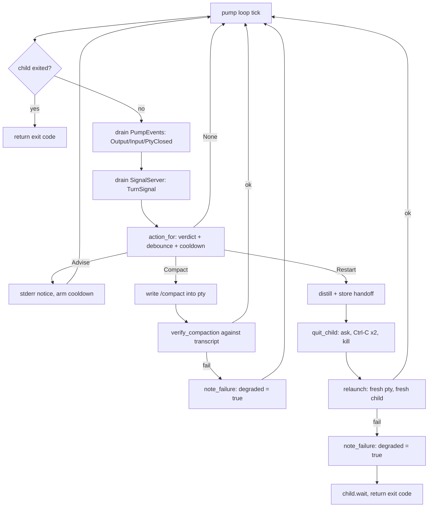

# Ctx Supervisors

## Quick Reference

- **Files:** `src/commands/ctx/run_loop.rs`, `exec.rs`, `wrap.rs` (the three supervisors), plus `signal.rs`, `supervise.rs`, `term.rs`, `chrome.rs`, `announce.rs`
- **Used by:** [[Script Runner]] (`AgentCommand::invoke` calls `exec::run_with` directly, in-process, for a supervised `Agent` step)
- **Depends on:** [[Ctx Adapters]] (`AgentAdapter` builds the headless/interactive launch, exposes `transcript_path`, `register_turn_signal`, `compact_command`, `quit_sequence`), [[Rot Engine]] (`score::IncrementalScorer` polls the transcript and yields a `Verdict`), [[Usage and Pacing]] (`pace::wait_for_window` / `pace::scan_for_limit` gate every cycle and catch usage-limit notices in the child's output)
- **Tests:** inline `#[cfg(test)] mod tests` in each of the six files (e.g. `run_loop::tests`, `exec::tests`, `wrap::tests`, `signal::tests`, `supervise::tests`, `term::tests`; `wrap.rs` also has a `#[cfg(windows)] mod win` under `term::tests` for console-mode arithmetic)
- **If changed:** [[Ctx Subsystem]], [[Ctx Adapters]], [[Rot Engine]], [[Usage and Pacing]], [[Script Runner]], [[Decision Log]], [[Untrusted Configuration]]
- **Gotchas:** **the wrap safety contract** — `wrap` must never leave a session worse than unwrapped passthrough. The release profile is `panic = "abort"` (`Cargo.toml`, `[profile.release]`), so unwinding-based `Drop` cleanup cannot be relied on for raw-mode restore; `wrap.rs`'s hot path (`run_with`, `pump`, and everything they call) has zero `unwrap`/`expect` — every one of those calls in `wrap.rs`, `exec.rs`, and `run_loop.rs` lives inside `#[cfg(test)] mod tests`. See "The wrap safety contract" section below for exactly how this is enforced in code, not just asserted in prose. Also: `run_loop` mints a brand-new `SessionId` every cycle by design — do not "optimize" it into reusing one. `supervise_child` checks the child's exit status *before* calling the tick closure, so a fast limit-hit exit can race past the tick that would have caught it; both `run_loop` and `exec` compensate with one extra `pace::scan_for_limit` drain after `supervise_child`/`supervise_run` returns — removing that drain reintroduces the race.

## Purpose

Three verbs, one job: keep an AI-agent process running well past what one raw invocation would survive, by watching its transcript for the [[Rot Engine]]'s verdict and acting on it — restart with a distilled handoff, inject a `/compact`, or just wait out a usage-window limit — without ever taking the wheel away from a human who is actually looking at the screen.

- **`run_loop`** (`zirv ctx loop`) — a stateless loop runner: a fresh **headless** session, a fresh `SessionId`, every cycle. No context ever survives a cycle boundary on purpose.
- **`exec`** (`zirv ctx exec`) — supervises **one** headless run, restarting it in place (same invocation, new session, handoff injected into the new prompt) when it rots or a usage limit is hit. [[Script Runner]]'s `AgentCommand` calls `exec::run_with` directly for a supervised agent step inside a script — see [[Script Runner]].
- **`wrap`** (`zirv ctx wrap`) — supervises an **interactive** TUI session through a PTY, typing `/compact` or a restart handoff into the child itself rather than replacing its argv.

## How It Works

### `run_loop` — the stateless loop

`LoopArgs` (`--prompt`/`--prompt-file`, `--agent`, `--interval-secs`, `--max-cycle-secs`, `--max-failures`, `--on-failure`, `--cycles`, `--extra`, `--simple`). `run_with` loads `CtxConfig`, resolves the adapter and prompt once, then loops: `pace::wait_for_window` gates the cycle, a new `SessionId::new_v4()` is minted, the composed system prompt is (re-)injected and logged under that session's own id (never under the literal string `"loop"`), the child is spawned via `supervise::spawn_tapped`, and `supervise::supervise_child` polls it with a tick closure that watches for a usage-limit notice (`pace::scan_for_limit`) or a `Verdict::Restart` from the scorer. The outcome maps to one of `ok` / `limit-park` / `rot-kill` / `timeout-kill` / `nonzero-exit`; only `nonzero-exit` and `timeout-kill` count as a *failure* toward `--max-failures` (rot and a usage limit are treated as expected hygiene, not failure — the next cycle is the fix). `handle_cycle_outcome` applies exponential backoff (`backoff_for`, capped at four intervals) on consecutive failures and runs `--on-failure` (or `cfg.supervise.on_failure`) once the cap is hit, exiting `EXIT_FAILED` (75).

### `exec` — supervising one headless run

`ExecArgs` carries the headless command after `--`, or lets the adapter build the launch itself when `args.command` is empty/flag-only (this is how an `Agent` script step arrives — prompt as data, no argv to misparse). `run_with` resolves the prompt (`--prompt`, or `extract_prompt`/`locate_prompt` scanning the command for `-p`/`--print`/`exec`), builds a `signal::SignalServer` for turn signals, then loops: spawn, `supervise_run` (a tick closure combining limit detection, turn-signal `Verdict::Restart`, and the scorer's own verdict), and on exit either return the code, park until the usage window resets (usage limit — mints a new session, no restart-budget cost), or restart. A restart calls `handoff::distill_or_structural` to summarize the dying transcript, stores it, increments the restart counter against `--max-restarts` (`cfg.supervise.max_restarts`), and relaunches with the handoff prepended to the original prompt. Giving up exits `EXIT_ROT_EXHAUSTED` (75) for exhausted rot restarts or `EXIT_TIMEOUT` (76) for a wall-clock timeout with no prompt/budget left.

`extra_launch_flags` (also reused by `wrap`'s `restart_launch_flags`) is the piece that keeps a restart's argv honest: it strips only the prompt token, the launch-prefix positionals, and anything that pins the launch to an existing conversation (`--session-id`, `--resume`, `-c`, `--continue`, `--fork-session`, and their `=`-joined spellings) — every other operator flag (`--model`, `--allowedTools`, ...) survives every restart.

### `wrap` — supervising an interactive TUI through a PTY

`WrapArgs` (`--agent`, `--no-supervise`, `--simple`, the command after `--`). `run_with` selects the adapter, refuses to guess silently (an undetected command with no explicit `--agent` and no `--no-supervise`/`--simple` is a hard error *before the terminal is touched*, so `wrap` never types claude-only escape sequences into an unknown program), opens a `native_pty_system` pty sized from `term::window_size`, and spawns the wrapped command into it. Two threads pump bytes: PTY output to stdout (`spawn_output_thread`, gated by a generation counter so a stale reader from a pty a restart already abandoned can never interleave with the current one's output), and stdin to the PTY (filtered through `CprFilter`, which swallows the terminal's own answer to a Windows console-host cursor-position probe so it isn't typed into the agent as a keystroke — see the `CURSOR_POSITION_REPORT` doc comment for the deadlock this works around).

The `pump` loop drives an `InjectionState` off two sources: `PumpEvent`s (`Output`/`Input`/`PtyClosed`) from the two pump threads, and `TurnSignal`s from the `SignalServer`. `action_for` maps the current `Verdict` to `Action::None` / `Advise` / `Compact` / `Restart`, gated by `may_inject` (a turn boundary has been reported, the user hasn't typed since, the output debounce (`cfg.wrap.debounce_ms`, default 3000ms) has elapsed, and the last-armed cooldown has cleared). `Advise` only prints a stderr line. `Compact` writes the adapter's compact command into the pty and verifies the compaction actually landed in the transcript (`verify_compaction`, bounded by `cfg.wrap.inject_timeout_ms`, default 20s) before logging `inject` vs `inject-unverified`. `Restart` distills a handoff, asks the child to quit (`quit_child`: quit sequence, then double Ctrl-C, then kill — each step waits up to `QUIT_GRACE` = 5s), opens a **fresh** inner pty (the old slave cannot be reused once its session leader has exited — `EBADF`), and relaunches with the handoff as the new prompt plus `restart_launch_flags`.



### `signal.rs` — turn-signal sockets

`TurnSignal { session_id, turn, score, verdict, transcript_path }` is how a hook running *inside* the wrapped/executed agent tells the supervisor a turn just ended — the supervisor cannot derive the agent's own session id or transcript path itself, so this is the only channel for both. On unix, `SignalServer::bind` opens a `UnixListener` (path capped at `MAX_SOCKET_PATH` = 100 bytes, macOS's `sun_path` limit) and reads newline-delimited JSON on a background thread, one connection at a time, with a per-connection `MAX_SIGNAL_BYTES` (64KB) cap and a `CLIENT_READ_TIMEOUT` (2s) so one stalled client can't starve every later signal. On Windows there are no unix sockets, so the same surface rides a named pipe (`\\.\pipe\zirv-ctx-<session>`, `MAX_PIPE_NAME` = 256) built on overlapped I/O; `pipe_name` derives the pipe name from the same socket path so the hook's environment and `send`'s reconnection logic round-trip unchanged. `try_recv` is non-blocking either way, which is what lets `run_loop`/`exec`/`wrap`'s poll ticks check for a signal without stalling.

### `supervise.rs` — shared process-supervision primitives

- `supervise_child(child, deadline, poll, on_tick)` — the polling loop all three verbs build on: checks `try_wait`, then the deadline, then calls `on_tick`, sleeping `poll` between iterations; always calls `terminate` (SIGTERM then SIGKILL after a grace period) before returning `TimedOut` or `StoppedByTick`, so no supervisor ever leaks a process. See `SuperviseConfig` in `config.rs` for the tunables that feed the `deadline`/`poll`/restart-budget arguments each verb passes in: `max_restarts` (exec's restart budget, default 2), `poll_ms` (default 2000), `interval_secs` (loop's between-cycle sleep, default 900), `max_cycle_secs` (the wall-clock deadline, default 3600), `max_failures` (loop's failure cap, default 5), `backoff_base_secs` (default 60), `on_failure` (shell command run when loop gives up).
- `spawn_tapped` / `OutputTap` — spawns with piped stdout/stderr, forwards every line to this process's own streams unchanged (tapping must never change what the operator sees), and also hands whole lines to the caller via a channel, which is how `pace::scan_for_limit` inspects headless output for usage-limit notices without swallowing them.
- `Watcher` — polls a growing transcript file and reports only the bytes appended since the last poll (`read_appended` → `Appended { lines, partial, restarted }`), an O(1)-per-poll operation via head/tail fingerprinting (`consumed_fingerprint`) rather than re-reading the whole file. Detects same-length rewrites (via mtime, e.g. right after a compaction) and truncations/longer rewrites (via the fingerprint mismatch), reporting `restarted: true` and re-reading from byte zero whenever the delta can no longer be trusted. Supports resuming from a previously persisted `(offset, consumed)` position. Used by `score::IncrementalScorer` and by `wrap`'s `verify_compaction`.
- `run_shell` — runs an `on_failure`/similar hook the way the script runner runs a command (`powershell -Command` on Windows, `sh -c` elsewhere).

### `term.rs` — raw terminal mode

`RawGuard` puts the controlling terminal (or, on Windows, the process console) into raw mode for `wrap`'s pty pump and restores it afterward. Unix: `termios`/`tcgetattr`/`tcsetattr`/`cfmakeraw` around a single fd (`STDIN_FD`, always `0` — the real fd on unix, a token meaning "this process's own console" on Windows, rejected everywhere else rather than cast into a handle). Windows: two console modes, not one — `ENABLE_LINE_INPUT`/`ENABLE_ECHO_INPUT`/`ENABLE_PROCESSED_INPUT` cleared and `ENABLE_VIRTUAL_TERMINAL_INPUT` set on the *input* handle, `ENABLE_VIRTUAL_TERMINAL_PROCESSING`/`DISABLE_NEWLINE_AUTO_RETURN` set on the *output* handle — because a Windows TUI's escape sequences are read from one handle and rendered on the other. `RawGuard::enter` on Windows rolls the input mode back if setting the output mode fails, so a half-applied raw mode never lingers. `window_size` reads the console's visible viewport (`srWindow`, not the taller scrollback buffer `dwSize` would report) on Windows, `TIOCGWINSZ` on unix. On any other platform, `RawGuard::enter` always returns `Err` and `window_size` always returns `Err`, so `wrap` still compiles and degrades to its `.unwrap_or(DEFAULT_SIZE)` / no-raw-mode paths there instead of being `cfg`'d out.

## The wrap safety contract

The repo's own `CLAUDE.md` states the invariant: *"`wrap` must never make a session worse. No `unwrap`/`expect` on its hot path, raw-mode restore happens in explicit arms (the release profile is `panic = "abort"`), and any supervision failure degrades to pure passthrough."* This was verified line-by-line against the current source:

- **`panic = "abort"` is real.** `Cargo.toml`'s `[profile.release]` sets `panic = "abort"` (alongside `opt-level = "z"`, `lto = true`, `codegen-units = 1`). Under this profile a panic terminates the process immediately — it does **not** unwind the stack, so `Drop` impls along the way (including `RawGuard`'s) are not guaranteed to run. Cleanup that only lived in a `Drop` guard would be unreliable exactly when it matters most.
- **No `unwrap`/`expect` on the hot path.** Every `.unwrap()`/`.expect(...)` call in `wrap.rs`, `exec.rs`, and `run_loop.rs` lives inside that file's `#[cfg(test)] mod tests`; `run_with` and `pump` (the functions that actually drive a live session) use `?`, `.unwrap_or(...)`, `.ok()`, `if let Ok(...)`, and `let ... else` throughout instead. A failure to lock a poisoned mutex, bind a socket, or open a pty is turned into a `CtxResult` and either logged via `note_failure`/`log::append` or falls through to a degraded/passthrough path — never a panic.
- **Raw-mode restore happens in an explicit arm, not only via `Drop`.** `RawGuard` *does* implement `Drop` (for the arms that legitimately fall through without an explicit call, and as defense in depth), but `run_with` also calls `guard.restore()` explicitly immediately after `pump` returns — on *any* exit path, since `pump`'s return value is captured first and the restore runs unconditionally before that result is inspected:
  ```rust
  let exit = pump(&mut child, /* ... */);
  if let Some(guard) = raw.as_mut() {
      let _ = guard.restore();
  }
  match exit { Ok(code) => Ok(code), Err(e) => { writeln!(w, "zirv ctx wrap: {e}")?; Ok(1) } }
  ```
  `RawGuard::restore` is itself idempotent (an `active` flag makes a second call a no-op), which is what makes calling it both explicitly and via `Drop` safe rather than double-restoring.
- **Any supervision failure degrades to pure passthrough, not a crash.** `--no-supervise` is a first-class flag (`WrapArgs::no_supervise`) that sets `InjectionState::degraded = true` up front and skips binding a signal socket entirely — `action_for` returns `Action::None` unconditionally once `degraded` is set, so the pty pump still runs (bytes still flow both ways) but nothing is ever typed into the child. The same `degraded` flag is set at runtime by `note_failure` whenever supervision machinery itself fails: a socket that won't bind, a compaction that can't be verified, a relaunch that fails. It is a **one-way switch** — once set, `action_for` short-circuits to `Action::None` for the rest of that `wrap` session, by design ("once supervision has proven unreliable in a session it stays off: a wrapped session must never be worse than an unwrapped one"). An adapter `wrap` cannot identify (no `--agent`, detection inconclusive) is refused *before* the terminal or child process is touched at all, rather than guessed at and typed into with the wrong escape sequences.

Net effect: the worst thing a bug in the supervision logic can do to a `wrap` session is stop advising/compacting/restarting — it cannot leave the terminal in raw mode, and it cannot itself crash the wrapped agent. This is the one place in `zirv ctx` where "fail closed" specifically means "fail down to plain `wrap --no-supervise`-equivalent behavior," not "fail loud."

## The interactive session's role, mail advisory, and terminal chrome

Three smaller pieces round out what an interactive `wrap` session (in practice, `zirv ctx chat`) gets beyond the pump loop above:

- **Role parameter.** `wrap::run_with` takes a `PromptRole` (`Orchestrator` or `Worker`, defined in `prompt.rs`) rather than always injecting the same system prompt. `zirv ctx chat` passes `PromptRole::Orchestrator` for the session a human is talking to directly; every other caller of `wrap`'s own composition path passes `PromptRole::Worker`. Only an orchestrator session gets the harness-teaching layer (`HARNESS_PROMPT` — how to delegate via `zirv ctx agent`, exchange notes via `zirv ctx send`/`inbox`, and read `zirv ctx status`); a worker never does, so a delegated run cannot itself be taught to delegate further. See [[Ctx Adapters]] and [[Context Management]] for the rest of the injected-prompt layering.
- **Mail advisory.** Unread mail for the current repo (`mail::list`, see [[Ctx Subsystem]]) is folded into the composed system prompt as its own layer, sitting after the repo layer and before the command-line layer, so an orchestrator session starts already aware of notes other sessions left it — labeled as information from another session, not as an instruction, since mail is agent-authored free text (see [[Untrusted Configuration]]).
- **Terminal chrome.** `chrome.rs` decides — as a pure function of caller-supplied probe results, no terminal handle opened inside it — whether a session gets the one-time launch banner, the reserved one-row status bar, and colour. Eligibility requires stdout to be a real terminal, at least 40 columns by 8 rows, and neither `--simple` nor `--no-supervise`; `--simple`/`--no-supervise` both promise a plain passthrough session, so both turn every piece of chrome off exactly like a too-small or non-terminal one does. The status bar additionally needs Windows VT processing to be enabled (it draws with cursor-addressing escapes), so a terminal that can't do VT still gets a plain, uncoloured banner but never a bar. Chrome degrades in one direction only — nothing here ever upgrades a session mid-run — and it never touches the wrapped child's own pty; only `wrap`'s pump reads or writes that. `announce.rs` is the `zirv ▸` event channel this chrome enables, printed to stderr as `[HH:MM:SS] zirv ▸ <message>`; it (along with the banner and bar) can be turned off independently via `[chrome] events`/`banner`/`bar` in `ctx.toml`, or the whole announcement channel via `--quiet`/`ZIRV_CTX_QUIET`.

## Cross-links

- [[Ctx Subsystem]] — the hub page for `zirv ctx`; verb dispatch, config layering, and how these three verbs fit alongside `status`, `hook`, `handoff`, `resume`.
- [[Ctx Adapters]] — the `AgentAdapter` trait these supervisors launch and monitor (`headless_cmd`, `interactive_cmd`, `transcript_path`, `register_turn_signal`, `parse_events`, `compact_command`, `quit_sequence`).
- [[Rot Engine]] — the pure `Verdict` computation (`Healthy`/`Advise`/`Compact`/`Restart`) that every supervisor's tick closure ultimately acts on.
- [[Script Runner]] — `AgentCommand::invoke` calls `exec::run_with` directly for a supervised `Agent` script step; see its "Agent steps" section.
