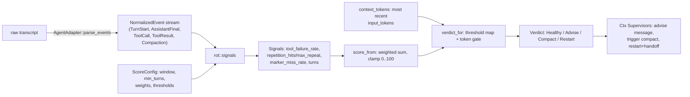

# Rot Engine

## Quick Reference

- **Files:** `src/commands/ctx/event.rs`, `src/commands/ctx/rot.rs` (also `src/commands/ctx/score.rs`, the `score` verb's driver — see [[Ctx Subsystem]] for its CLI surface)
- **Used by:** [[Ctx Subsystem]] (`score` verb), [[Ctx Supervisors]] (`exec`/`wrap`/`run_loop` poll a score every turn and act on the `Verdict`)
- **Depends on:** [[Ctx Adapters]] (`AgentAdapter::parse_events` turns a raw transcript into `NormalizedEvent`s and reports `Capabilities`), [[Ctx Subsystem]]'s `ScoreConfig` (config.rs) for weights/thresholds
- **Tests:** `event::tests` (FNV-1a hash stability, `SessionId` uniqueness, `Capabilities` defaults, event equality); `rot::tests` — the largest suite in the module, covering marker detection, windowed signals, the incremental/full-parse equivalence (`folding_events_in_chunks_matches_a_full_parse`, `every_prefix_of_a_stream_scores_like_a_full_parse_of_that_prefix`), verdict thresholds, and eight cases ported from `~/.claude/hooks/canary-check.test.sh`; `score::tests` covers the transcript-driving and checkpoint-caching layer around the engine
- **If changed:** [[Ctx Subsystem]], [[Ctx Supervisors]], [[Ctx Adapters]], [[Usage and Pacing]], [[Decision Log]]
- **Gotchas:** **Purity invariant** — `rot.rs` contains no `std::fs`, `std::time`, `std::env`, or `std::net` calls anywhere (verified by grep across the whole file); every scoring function takes only data and returns data, so identical events always produce an identical verdict. All I/O (reading the transcript file, checkpoint files, clock/env lookups) lives in `score.rs`, one layer up. Also: the marker signal is capability-gated and only activates once `min_turns` is reached *and* the marker has appeared at least once — a session where the hook was never installed reports `marker_miss_rate: None`, not a score of zero. The token floor/ceiling is a hard gate, not a fourth weighted term: below `token_floor` the verdict is always `Healthy` regardless of how badly the other signals fire.

## Purpose

`rot.rs` is zirv's deterministic answer to "has this agent session gone stale and should it be nudged, compacted, or restarted?" It replaces the ad hoc shell "canary" script (an older per-session heuristic referenced directly in the ported test names) with a small, pure, unit-tested scoring function. It never touches a transcript file, a clock, or the environment itself — `score.rs` does that job and hands the engine only normalized events.

## How It Works

### Normalized events (`event.rs`)

`NormalizedEvent` is the only vocabulary the rot engine and the supervisors understand — the sole input to everything in `rot.rs`. Five variants:

- `TurnStart` — marks a new agent turn.
- `AssistantFinal { text, input_tokens }` — emitted for every assistant message; `text` is the concatenated text blocks (empty for tool-only/thinking-only messages). The marker signal groups these by turn and reads only the *last* non-empty text per turn; the token gate instead reads the most recent event's `input_tokens` regardless of whether it carried text, so mid-turn token growth is still visible.
- `ToolCall { name, input_hash }` — `input_hash` is a hand-rolled FNV-1a 64 hash (`event::input_hash`), chosen over `DefaultHasher` specifically so the rot engine's output is stable across compiler versions, not just across runs.
- `ToolResult { is_error }`.
- `Compaction` — a marker for a context-compaction boundary in the transcript; carries no signal itself, but resets what "recent" tokens mean.

Two other types travel alongside events but aren't scoring inputs: `Capabilities` (`marker_signal`, `token_usage`, `turn_signal`, `system_prompt`, `events`) tells the engine which signals a given adapter can actually feed — a capability that's off is treated the same as a signal that never fired, not as a zero — and `StructuralContext` carries raw material (user messages, assistant texts, files touched, tool errors) that handoffs need but the normalized stream deliberately drops. `events` (added 2026-08-15) is different in kind from the other three: it is never read inside `rot.rs` at all (the purity invariant holds — `signals`/`score_events`/`score_from` don't consult it), only by `score.rs`'s own callers (`full_score`, `IncrementalScorer::poll`), which refuse to build a `Score` at all for an adapter with no verified event parsing (`events == false`, codex today) rather than fold its permanently-empty `parse_events` output into a fabricated `Healthy`/`0` — see the Score/caching section below.

### Signals and scoring (`rot.rs`)

`signals(events, caps, cfg) -> Signals` computes four independent measurements over the trailing `cfg.window` turns (0 means unbounded — the whole transcript):

- **`tool_failure_rate`** — share of `ToolResult`s in the window that were errors; 0.0 for a window with no tool calls at all.
- **`repetition_hits` / `max_repeat`** — groups `ToolCall`s in the window by `(name, input_hash)`; `max_repeat` is the largest count, `repetition_hits` counts how many distinct `(tool, input)` pairs reached `cfg.repetition_threshold` or more repeats.
- **`marker_miss_rate: Option<f64>`** — share of turn-final texts in the window missing `cfg.marker` (e.g. `[zirv]`), tolerating leading markdown/whitespace/quote characters (`has_marker` strips a small lead-character set before comparing). `None` — not `Some(0.0)` — whenever the signal is inactive: `caps.marker_signal` is off, `cfg.marker` is empty, the marker has never appeared even once, or the session hasn't reached `cfg.min_turns` yet. This distinguishes "the hook isn't installed" from "the hook is installed and behaving."
- **`turns`** — count of turns that produced any assistant text.

`score_from(signals, tokens, cfg) -> Score` combines three of those four into a weighted sum:

```
raw = weight_tool_failure * tool_failure_rate
    + weight_repetition   * repetition_component(max_repeat, repetition_threshold)
    + weight_marker       * marker_miss_rate.unwrap_or(0.0)
score = round(raw).clamp(0, 100)
```

`repetition_component` is zero below `repetition_threshold`, then ramps linearly to 1.0 at `2 * threshold - 1` identical calls (clamped above that). The defaults from `ScoreConfig` (config.rs) are `window: 10`, `min_turns: 10`, `token_floor: 100_000`, `token_ceiling: 160_000`, `weight_tool_failure: 40.0`, `weight_repetition: 30.0`, `weight_marker: 30.0`, `repetition_threshold: 3`, `advise_at: 40`, `compact_at: 60`, `restart_at: 80`, `marker: "[zirv]"` — so each signal alone can push the score into `Advise` territory, and any two together reach `Compact`.

### Verdicts and the token gate

```rust
pub enum Verdict { Healthy, Advise, Compact, Restart }
```

`Verdict` derives `Ord` (`Healthy < Advise < Compact < Restart`) so a supervisor can compare/escalate verdicts directly, and serializes lowercase via serde for the JSON the `score` verb prints.

`verdict_for(score, tokens, cfg) -> Verdict` layers a hard token gate on top of the plain threshold mapping (`score >= advise_at` → `Advise`, `>= compact_at` → `Compact`, `>= restart_at` → `Restart`, else `Healthy`):

- Below `token_floor`, the verdict is **always** `Healthy` — no amount of tool-failure or repetition alone escalates a short, low-context session. (One ported canary case makes this explicit: every signal maxed out at 100 but `Healthy` because context is only 40k tokens.)
- At or above `token_ceiling`, the verdict is **at least** `Compact` even if the weighted score alone wouldn't reach it — and a score that had already reached `compact_at` is escalated all the way to `Restart`.

Net effect: token growth is a gate, not a fifth weighted vote. Behavioral signals decide *how bad* a session looks; token count decides *whether that badness is allowed to matter yet* and can force an outcome behavior alone wouldn't reach.

### Capacity-aware gates (issue #155, Phase 6, 2026-08-27)

`token_floor`/`token_ceiling` used to be flat absolute numbers (100_000/160_000) regardless of the actual seat's context window — the epic's own motivating bug was a 1M-context claude session (`[1m]`) restarting at roughly 16% of its real capacity because the gate had no way to know the seat was ten times bigger than the default assumption. Both are now `Option<u64>` **explicit overrides**; three new keys derive the gate from the model's real capacity instead: `token_floor_ratio` (default 0.5), `token_ceiling_ratio` (default 0.8), and `model_context_tokens` (an operator override of the resolved capacity — "they know their seat; the adapter's default is a guess about it"). All five keys are `REPO_FORBIDDEN` (see [[Untrusted Configuration]]).

`rot::token_gates(cfg, caps) -> (u64, u64)` is the new pure resolver `verdict_for`/`score_from` both take a `Capabilities` parameter to call: an explicit `token_floor`/`token_ceiling` wins outright per field; otherwise the corresponding ratio is applied to the resolved capacity (`cfg.model_context_tokens`, else `caps.context_window_tokens`, i.e. the adapter's own per-model report); with no capacity available from anywhere (codex today, or any adapter that cannot honestly state one), `FALLBACK_TOKEN_FLOOR`/`FALLBACK_TOKEN_CEILING` (100_000/160_000, the pre-#155 absolutes) apply unchanged. The result is always ordered and non-zero: if a *derived* ceiling would land at or below the floor, only the derived side moves (a fully operator-pinned inverted pair stands as written — a number the operator typed is never silently rewritten) so `verdict_for`'s two-stage gate never becomes meaningless. Still fully pure — capacity arrives inside `Capabilities`, already a parameter of `score_events`/`RotState::score`, so no fs/clock/env/net access is added to `rot.rs`.

**The live model has to actually reach this gate, which needed a second fix (2026-08-27 review round, finding D1).** `Capabilities::context_window_tokens` was only ever reachable through `AgentAdapter::capabilities_for_model`, which had no production caller — every live scoring path called plain `capabilities()` with `model: None`, so a 1M claude seat's real window never reached the gate above and the epic's motivating bug stayed unfixed even after `token_gates` itself shipped. `AgentAdapter::model_hint(jsonl)` (default `None`; claude reads the last assistant `message.model` field, newest wins — see [[Ctx Adapters]]) is now wired through `score.rs`'s live scoring paths: `full_score` resolves it off the whole transcript in hand and calls `capabilities_for_model` instead of `capabilities()`; `IncrementalScorer` carries the resolved model across polls in its own `model: Option<String>` field, since a poll only ever sees the bytes appended since the last one and a chunk that happens not to mention a model (a lone tool-result line) must not read as "no model at all." The Stop hook's on-disk checkpoint gained the same `model` field, and `CHECKPOINT_VERSION` bumped **1 → 2** so an older checkpoint (written before the field existed) is rejected and rebuilt cleanly on the next poll rather than silently resuming with `model: None` until a lucky assistant line happens to repeat it. `RotState::feed_all`'s own fold never reads capabilities at all, so `fingerprint()` (the checkpoint-invalidation key) deliberately keeps calling plain `capabilities()`: a model switch mid-session must not force a full incremental rebuild, only the next poll's gate computation needs the new model.



### Incremental scoring (`RotState`)

Re-parsing a whole transcript on every turn is wasteful, so `RotState` folds events one at a time (`feed`/`feed_all`) into a bounded structure — a ring of turn-final marker flags and a deque of per-turn tool-call/result segments, both capped at `cfg.window`. `RotState::score(caps, cfg)` reproduces exactly what a full `score_events` call over the same events would return, provided the state was `built_for` the same `cfg` (same `window` and `marker`; otherwise it returns `None` and the caller rebuilds from scratch). A `window` of 0 (unbounded) has no representable bounded state, so `RotState::new` returns `None` in that case and callers fall back to a full parse.

This equivalence is the module's heaviest-tested property: `folding_events_in_chunks_matches_a_full_parse` feeds identical event streams through the incremental path in chunk sizes of 1, 2, 5, and 97 events and asserts byte-identical `Score`s against a full parse, across multiple `ScoreConfig`s and seven transcript shapes (empty, past-window, with a `Compaction`, events before the first `TurnStart`, an open/unclosed final turn, etc.). `every_prefix_of_a_stream_scores_like_a_full_parse_of_that_prefix` goes further and checks every single prefix length, not just chunk boundaries.

### The `score` verb driver (`score.rs`)

`score.rs` is the one layer that actually touches the outside world, and it's intentionally thin around the pure core: `score_transcript` reads the JSONL transcript from disk, resolves the adapter and `ScoreConfig` from `CtxConfig::load`, calls `adapter.parse_events` to normalize it, and calls `rot::score_events` — the reference every incremental pass has to agree with. `score_transcript_cached` (used by the Stop hook, a fresh process every turn) adds `IncrementalScorer` + a checkpoint file per transcript (keyed by a hash of its path, written atomically via rename, invalidated on any doubt at all — corrupt JSON, wrong schema version, wrong transcript, wrong `ScoreConfig` fingerprint, or an offset past the current file length) so a long session is scored in the bytes appended since the last poll rather than from scratch. All of that machinery — file reads, `Watcher` diffing, checkpoint persistence — lives outside `rot.rs`; the engine itself only ever sees the `&[NormalizedEvent]` slice it's handed. The CLI plumbing for `zirv ctx score` (args, output format) is documented on [[Ctx Subsystem]].

**No-event-parsing adapters report "no data," never `Healthy`/`0` (2026-08-15).** Both of `score.rs`'s own entry points into a real parse check `adapter.capabilities().events` first and refuse before computing anything: `full_score` returns `Err` (propagated by `score_transcript`/`score_transcript_cached`, degraded by the Stop hook's own `let Ok(score) = ... else { return Ok(0) }` into a silent no-op, exactly like a missing transcript), and `IncrementalScorer::poll` returns `Ok(None)` (its own existing spelling of "nothing to report," which is also what leaves `exec`/`loop`'s rot-restart gate — `verdict == Restart` — never true for such a session, now for an explicit, honest reason rather than as an accidental side effect of folding zero real events). `score::cached_score` (the dashboard's sidebar/footer score, already documented as "`None` means unknown, never healthy," rendered as `--`) inherits this for free through `score_with_checkpoint`'s `.ok()`: no dashboard-side code changed at all. (As of issue #209's v3 restoration, 2026-08-30, `cached_score` is actually rendered again — the sidebar's own rot column and the footer's verdict segment for the focused pane; see [[Ctx Supervisors]].) Both registered adapters now report `capabilities().events == true` (issue #86, 2026-08-23, gave codex real turn-boundary/token event derivation from its rollout JSON — see [[Ctx Adapters]]), so this guard has no currently-registered adapter to protect against; it stays live for any future adapter that ships without event parsing, and `score.rs`'s own tests exercise it against a local fake `EventlessAdapter` rather than codex now.

## Purity invariant

Per the repo's CLAUDE.md: *"The rot engine is pure: no clock, no filesystem, no environment reads inside `rot.rs`, so the same events always produce the same verdict."* This was checked directly against the source rather than taken on faith:

- A grep for `std::fs`, `std::time`, `std::env`, and `std::net` across `src/commands/ctx/rot.rs` returns **no matches**.
- The core functions' signatures confirm the same thing structurally: `signals(events: &[NormalizedEvent], caps: Capabilities, cfg: &ScoreConfig) -> Signals`, `score_events(events: &[NormalizedEvent], caps: Capabilities, cfg: &ScoreConfig) -> Score`, `score_from(signals: Signals, tokens: u64, cfg: &ScoreConfig) -> Score`, and `verdict_for(score: u32, tokens: u64, cfg: &ScoreConfig) -> Verdict` — every one takes only data (event slices, a config reference, plain numbers) and returns data. None take a file handle, a clock, or an environment-lookup closure.
- `RotState` (the incremental path) is likewise data-in/data-out: `feed`/`feed_all` consume `&NormalizedEvent`, and `score` reads only its own fields plus `cfg`.
- `scoring_is_deterministic` in `rot::tests` asserts this directly: the same event slice scored 20 times in a loop produces byte-identical `Score` values every time.

No exceptions were found — the invariant as stated in CLAUDE.md holds exactly as written. All I/O (`std::fs::read_to_string`, checkpoint files, `std::process::id()`, `EnvLookup` closures) is confined to `score.rs`, one layer above the engine.

**`screen.rs` (issue #243, v3.5.0) is a sibling pure module, not a `rot.rs` extension.** `IncrementalScorer::poll`/`score_transcript_cached` now screen newly-ingested transcript bytes alongside scoring — same `score.rs` I/O layer, same "read once, hand data down" shape — but `screen::screen` never touches `rot.rs`'s signals, score, or verdict, and `rot.rs` gained no new knowledge of it. Pinned by a dedicated test that screening never changes the score itself. See [[Ctx Subsystem]] and [[Untrusted Configuration]].
