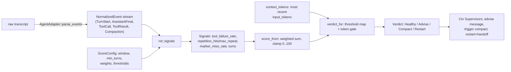

# Rot Engine

## Quick Reference

- **Files:** `src/commands/ctx/event.rs`, `src/commands/ctx/rot.rs` (also `src/commands/ctx/score.rs`, the `score` verb's driver, and `src/commands/ctx/hook.rs`'s `stop_output`, the Stop-hook advisory that reads `Signals.repetition_hits` — see [[Ctx Subsystem]] for both verbs' CLI surface)
- **Used by:** [[Ctx Subsystem]] (`score` verb), [[Ctx Supervisors]] (`exec`/`wrap`/`run_loop` poll a score every turn and act on the `Verdict`)
- **Depends on:** [[Ctx Adapters]] (`AgentAdapter::parse_events` turns a raw transcript into `NormalizedEvent`s and reports `Capabilities`), [[Ctx Subsystem]]'s `ScoreConfig` (config.rs) for weights/thresholds
- **Tests:** `event::tests` (FNV-1a hash stability, `SessionId` uniqueness, `Capabilities` defaults, event equality); `rot::tests` — the largest suite in the module, covering marker detection, windowed signals, the incremental/full-parse equivalence (`folding_events_in_chunks_matches_a_full_parse`, `every_prefix_of_a_stream_scores_like_a_full_parse_of_that_prefix`), verdict thresholds, eight cases ported from `~/.claude/hooks/canary-check.test.sh`, and `timestamps_never_move_a_verdict` (issue #293 — timestamped events score identically to unstamped ones); `score::tests` covers the transcript-driving and checkpoint-caching layer around the engine plus `derive_speed_metrics_reports_speed_from_a_timestamped_claude_fixture`
- **If changed:** [[Ctx Subsystem]], [[Ctx Supervisors]], [[Ctx Adapters]], [[Usage and Pacing]], [[Workflows]] (speed telemetry), [[Decision Log]]
- **Gotchas:** **Purity invariant** — `rot.rs` contains no `std::fs`, `std::time`, `std::env`, or `std::net` calls anywhere (verified by grep across the whole file); every scoring function takes only data and returns data, so identical events always produce an identical verdict. All I/O (reading the transcript file, checkpoint files, clock/env lookups) lives in `score.rs`, one layer up. Also: the marker signal is capability-gated and only activates once `min_turns` is reached *and* the marker has appeared at least once — a session where the hook was never installed reports `marker_miss_rate: None`, not a score of zero. The token floor/ceiling is a hard gate, not a fourth weighted term: below `token_floor` the verdict is always `Healthy` regardless of how badly the other signals fire.

## Purpose

`rot.rs` is zirv's deterministic answer to "has this agent session gone stale and should it be nudged, compacted, or restarted?" It replaces the ad hoc shell "canary" script (an older per-session heuristic referenced directly in the ported test names) with a small, pure, unit-tested scoring function. It never touches a transcript file, a clock, or the environment itself — `score.rs` does that job and hands the engine only normalized events.

## How It Works

### Normalized events (`event.rs`)

`NormalizedEvent` is the only vocabulary the rot engine and the supervisors understand — the sole input to everything in `rot.rs`. Seven variants (issue #293, v3.12.0, added two purely additive ones and an `at_ms` field to several existing ones — see "Speed metrics" below), plus four more purely additive sibling variants (issue #312, v3.17.0 — see "Window attribution" below): `UserText { byte_len }` (a human-typed turn's text length, emitted alongside `TurnStart` whenever that row carries extractable text), `AssistantThinking { byte_len }` (the combined length of an assistant row's `thinking`-block text, since `text_of` already drops thinking blocks from `AssistantFinal::text`), `ToolResultSize { byte_len, content_hash }` (the full raw content length and an exact FNV-1a fingerprint of the immediately preceding `ToolResult`, for byte-identical dedupe), and `ToolCallPath { path, is_modification }` (the file-shaped path argument of the immediately preceding `ToolCall`, when the adapter's transcript shape exposes one, and whether it's an edit-shaped tool). None of the four feed `signals`/`score_from`/`verdict_for` — they fall through as no-ops in every exhaustive match in `rot.rs` and exist purely for `breakdown::attribute_window` to consume.

- `TurnStart { at_ms }` — marks a new agent turn; `at_ms` is a unix-millisecond wall-clock timestamp, `None` when the source line's timestamp didn't parse.
- `AssistantFirstText { at_ms }` (new, issue #293) — the candidate first-non-empty-assistant-text point within a turn, emitted right before the `AssistantFinal` carrying that same text whenever it's non-empty; both current adapters emit it.
- `AssistantFinal { text, input_tokens, at_ms }` — emitted for every assistant message; `text` is the concatenated text blocks (empty for tool-only/thinking-only messages). The marker signal groups these by turn and reads only the *last* non-empty text per turn; the token gate instead reads the most recent event's `input_tokens` regardless of whether it carried text, so mid-turn token growth is still visible.
- `ToolCall { name, input_hash, at_ms }` — `input_hash` is a hand-rolled FNV-1a 64 hash (`event::input_hash`), chosen over `DefaultHasher` specifically so the rot engine's output is stable across compiler versions, not just across runs.
- `ToolResult { is_error }` — unchanged; its own timestamp travels on the sibling variant below rather than as a new field, since `ToolResult` is matched exhaustively with no-`..` field patterns in several places a fielded addition would have broken.
- `ToolResultTimestamp { at_ms }` (new, issue #293) — the wall-clock time of the immediately preceding `ToolResult`, emitted right after it; both current adapters emit it.
- `Compaction` — a marker for a context-compaction boundary in the transcript; carries no signal itself, but resets what "recent" tokens mean.

`ToolErrorText { hash }` (added alongside the same-error signal, above) is an eighth, sibling variant of the same shape — never a field on `ToolResult`, for the identical exhaustive-match reason.

Two other types travel alongside events but aren't scoring inputs: `Capabilities` (`marker_signal`, `token_usage`, `turn_signal`, `system_prompt`, `events`) tells the engine which signals a given adapter can actually feed — a capability that's off is treated the same as a signal that never fired, not as a zero — and `StructuralContext` carries raw material (user messages, assistant texts, files touched, tool errors) that handoffs need but the normalized stream deliberately drops. `events` (added 2026-08-15) is different in kind from the other three: it is never read inside `rot.rs` at all (the purity invariant holds — `signals`/`score_events`/`score_from` don't consult it), only by `score.rs`'s own callers (`full_score`, `IncrementalScorer::poll`), which refuse to build a `Score` at all for an adapter with no verified event parsing (`events == false`, codex today) rather than fold its permanently-empty `parse_events` output into a fabricated `Healthy`/`0` — see the Score/caching section below.

### Signals and scoring (`rot.rs`)

`signals(events, caps, cfg) -> Signals` computes four independent measurements over the trailing `cfg.window` turns (0 means unbounded — the whole transcript):

- **`tool_failure_rate`** — share of `ToolResult`s in the window that were errors; 0.0 for a window with no tool calls at all.
- **`repetition_hits` / `max_repeat`** — groups `ToolCall`s in the window by `(name, input_hash)`; `max_repeat` is the largest count, `repetition_hits` counts how many distinct `(tool, input)` pairs reached `cfg.repetition_threshold` or more repeats. **Interleave-aware since the wrapper behaviour redesign round 2 (2026-09-01, `docs/superpowers/specs/2026-09-01-wrapper-behaviour-redesign.md`):** a repeat of `(name, input_hash)` only extends its streak when no edit-like call happened since the pair's previous occurrence. `EDIT_LIKE_TOOLS` (`rot.rs`, a deliberate, independent copy of `workflow::adoption::EDIT_LIKE_TOOLS` — importing across would give this pure module a dependency on a much less constrained one for a five-item list) is `["edit", "write", "multiedit", "notebookedit", "apply_patch"]`, matched case-insensitively via `is_edit_like`. This is what tells a healthy edit → rerun → edit → rerun TDD loop apart from a stuck agent re-running the same passing check with nothing changed in between: the TDD loop always has an edit between reruns, so it never builds a streak, while an un-separated repeat (the same check run twice with no edit between) still counts. An edit-like call clears **every** key's in-flight streak at once, not just the key sharing its name — it sits between any pair of calls made before and after it, for every key — and is itself never tracked as a repeated call, since it's the healthy action this signal exists to stop penalising, not the over-verification it exists to catch. This directly implements the "rot signal for over-verification" follow-up the round-1 spec/Decision Log entry left open.
- **`marker_miss_rate: Option<f64>`** — share of turn-final texts in the window missing `cfg.marker` (e.g. `[zirv]`), tolerating leading markdown/whitespace/quote characters (`has_marker` strips a small lead-character set before comparing). `None` — not `Some(0.0)` — whenever the signal is inactive: `caps.marker_signal` is off, `cfg.marker` is empty, the marker has never appeared even once, or the session hasn't reached `cfg.min_turns` yet. This distinguishes "the hook isn't installed" from "the hook is installed and behaving."
- **`turns`** — count of turns that produced any assistant text.

`score_from(signals, tokens, cfg) -> Score` combines three of those four into a weighted sum:

```
raw = weight_tool_failure * tool_failure_rate
    + weight_repetition   * repetition_component(max_repeat, repetition_threshold)
    + weight_marker       * marker_miss_rate.unwrap_or(0.0)
score = round(raw).clamp(0, 100)
```

`repetition_component` is zero below `repetition_threshold`, then ramps linearly to 1.0 at `2 * threshold - 1` identical calls (clamped above that). The defaults from `ScoreConfig` (config.rs) are `window: 10`, `min_turns: 10`, `token_floor: 100_000`, `token_ceiling: 160_000`, `weight_tool_failure: 40.0`, `weight_repetition: 30.0`, `weight_marker: 30.0`, `repetition_threshold: 3`, `advise_at: 40`, `compact_at: 60`, `restart_at: 80`, `marker: "[zirv]"` — so each signal alone can push the score into `Advise` territory, and any two together reach `Compact`.

### Verdicts and the token gate

```rust
pub enum Verdict { Healthy, Advise, Compact, Restart }
```

`Verdict` derives `Ord` (`Healthy < Advise < Compact < Restart`) so a supervisor can compare/escalate verdicts directly, and serializes lowercase via serde for the JSON the `score` verb prints.

`verdict_for(score, tokens, cfg) -> Verdict` layers a hard token gate on top of the plain threshold mapping (`score >= advise_at` → `Advise`, `>= compact_at` → `Compact`, `>= restart_at` → `Restart`, else `Healthy`):

- Below `token_floor`, the verdict is **always** `Healthy` — no amount of tool-failure or repetition alone escalates a short, low-context session. (One ported canary case makes this explicit: every signal maxed out at 100 but `Healthy` because context is only 40k tokens.)
- At or above `token_ceiling`, the verdict is **at least** `Compact` even if the weighted score alone wouldn't reach it — and a score that had already reached `compact_at` is escalated all the way to `Restart`.

Net effect: token growth is a gate, not a fifth weighted vote. Behavioral signals decide *how bad* a session looks; token count decides *whether that badness is allowed to matter yet* and can force an outcome behavior alone wouldn't reach.

**The Stop hook names over-verification explicitly when it drove the verdict (`hook.rs::stop_output`, wrapper behaviour redesign round 2, 2026-09-01).** On a non-`Healthy` verdict whose `Signals.repetition_hits > 0`, the advisory `systemMessage` gets one appended sentence: "Same tool call repeated {max_repeat}x with no edit in between: the result will not change, move on." — distinct from the ordinary "consider /compact, or run `zirv ctx resume`" wording, since re-running an unchanged check cannot produce a new result and the advisory now says so plainly rather than only pointing at context management. The clause is silent when `repetition_hits == 0`, even on a non-Healthy verdict driven by other signals, and never fires at all on `Healthy` (the hook's own early-return branch for a healthy session only ever carries the optimize hint/adoption nudge).

**A same-error signal, shipped inert (harness iteration round 1, 2026-09-02).** `repetition_hits`/`max_repeat` key on `(tool, input_hash)` — three different fixes that all re-trigger the SAME compiler/test error look like three unrelated calls, not a stuck loop, since each attempt's input differs. `Signals.same_error_repeats` catches that case instead: the longest run of consecutive identical *normalized* tool-result error texts within the window, computed by `longest_same_error_run` over one entry per tool result: `Some(hash)` for an erroring result with extractable text, `None` for a passing result or an error with no text, so a passing retry between two occurrences of the same error resets the streak (codex review finding; the first cut kept only error hashes and scored "A, success, A, A" as three in a row). The hashes come from `event::normalize_error_text` (a hex literal collapses to `0x#`, a run of decimal digits to a single `#` — folding most line numbers and randomized temp-path segments — a run of whitespace to one space, capped at 400 chars) plus `event::error_text_hash` (`input_hash` of the normalized text); `NormalizedEvent::ToolErrorText { hash }` carries it as a sibling emitted right after `ToolResult { is_error: true }`, never a new field on `ToolResult` itself (which is matched with exhaustive, no-`..` field patterns in several places — a fielded addition there would have broken every one of them). `ClaudeAdapter::parse_events` emits it whenever it can extract the result's text; `RotState::Segment` gained a parallel per-result record (`Vec<Option<u64>>`) so the incremental fold agrees with a full parse (`same_error_repeats_folds_incrementally_the_same_as_a_full_parse`), which bumped `score.rs`'s own `CHECKPOINT_VERSION` **2 -> 4** across the two cuts so an older on-disk checkpoint is discarded and rebuilt rather than misread. `ScoreConfig` gained `same_error_weight` (default **0.0**) and `same_error_threshold` (default 3, ramped through the same `repetition_component` curve `repetition_threshold` already uses) — documented commented-out in `.zirv/ctx.toml`. The default weight ships at zero deliberately: this signal must never move an existing verdict fixture until an operator opts in by raising it (`default_same_error_weight_is_zero_and_does_not_move_the_score`).

**The Stop hook still names it, independent of the score.** `hook.rs::stop_output` takes `same_error_threshold` as an explicit parameter (loaded from `cfg.score` by its one production caller, `run_stop`) rather than a `ScoreConfig` itself, and whenever the threshold is nonzero and `score.signals.same_error_repeats >= same_error_threshold` (a threshold of 0 disables the signal and the clause alike), the advisory gets its own appended sentence: "Same error {N}x in a row across different attempts: the fix isn't landing, try a different approach." — alongside, not instead of, round 2's over-verification clause (`repetition_hits > 0`), since a stuck same-error loop and an unchanged tool call repeated with no edit in between are distinct failure modes. This clause fires off the raw signal and the operator's own threshold directly, decoupled from `same_error_weight`: an operator who never raises the weight (the shipped default) still sees the advisory the moment the streak crosses the threshold, even though the score itself hasn't moved.

### Speed metrics: turn latency and time-to-first-text, shipped inert to the verdict (issue #293, v3.12.0)

Nothing above measures wall-clock speed — every signal is about content (failure, repetition, marker, tokens). `score::derive_speed_metrics(events: &[NormalizedEvent]) -> SpeedMetrics` adds that, entirely in `score.rs`, never `rot.rs`: it is descriptive telemetry for `zirv workflow stats`, not a rot signal, and `verdict_for`/`score_from` take no new parameter for it. `SpeedMetrics { turn_p50_ms, turn_max_ms, ttft_p50_ms, tool_error_rate }` (`event.rs`) tracks, per turn (reset on `TurnStart`/`Compaction`): a turn's latency sample is `last_assistant.at_ms - turn_start.at_ms`, contributed only when both ends carry a real `at_ms`; its time-to-first-text sample is the first `AssistantFirstText.at_ms` seen since the turn started, minus the turn's own start — one sample per turn, the earliest only. `turn_p50_ms`/`ttft_p50_ms` are nearest-rank percentiles over the sorted sample sets (`idx = round((len-1)*0.5)`); `turn_max_ms` is the sorted set's own maximum; `tool_error_rate` is `tool_errors / tool_total` over every `ToolResult` seen, `None` with no tool calls at all. Every field is `Option`, `None` — never a fabricated `0`/`0.0` — whenever there is nothing to compute it from (no timestamped turns, no tool calls). `window::parse_iso8601_utc_ms` is the millisecond-precision sibling that feeds every `at_ms`: it reuses `parse_iso8601_utc` (see [[Usage and Pacing]]) for the whole-seconds part, then reads up to three fractional digits after the following `.`, zero-padded/truncated to milliseconds — purely additive; `parse_iso8601_utc`/`parse_rfc3339_utc` are untouched and still used where they already were. Both adapters populate `at_ms` and emit `AssistantFirstText`/`ToolResultTimestamp` — this is not claude-only.

`TelemetryKind::TurnLatencySampled` (`workflow::telemetry`) carries the four `SpeedMetrics` fields plus `session_id` (`workflow_id` stays `None` — this is a session-level sample, not phase-keyed) and is emitted once per Stop-hook scoring pass by `hook::record_speed_sample`, reading `IncrementalScorer`'s own third return value (`last_speed_sample`, a sibling of the checkpoint-folded `Score` rather than a field on `Score` itself) — not once per dashboard poll. `zirv workflow stats` aggregates every sampled event into one overall (not per-phase, not per-workflow) `speed: {N} samples, turn p50 ~{X}ms (max {Y}ms), ttft p50 ~{Z}ms, tool error rate ~{W}%` line, `"speed: no data"` with zero samples, `n/a` per field with no data for that field alone — averaging each sample's own p50 across samples (not re-deriving a true percentile of the pooled population) while `turn_max_ms` takes the true max across samples. See [[Workflows]]'s Telemetry section.

**Verified inert to the rot verdict.** The two new `NormalizedEvent` variants fall through as pure no-ops in every one of `rot.rs`'s exhaustive matches — no functional change to `signals`/`score_from`/`verdict_for`. `rot::tests::timestamps_never_move_a_verdict` is the issue's own acceptance criterion: stamping a fixture stream with strictly increasing `at_ms` values, plus interleaved `AssistantFirstText`/`ToolResultTimestamp` events, produces byte-identical verdicts to the unstamped stream. No config key gates this — collection is unconditional, additive telemetry with no `REPO_FORBIDDEN` surface of its own.

### Window attribution: where the context window went, by bucket (`breakdown.rs`, issue #312, v3.17.0)

Nothing above answers "where did the window go" once the score itself is computed — every signal is about failure/repetition/marker/tokens, not the window's composition. `breakdown.rs` is a sibling pure module, not a `rot.rs` extension: `BreakdownAccumulator::feed`/`feed_all` and `attribute_window` read only `&NormalizedEvent`/plain numbers, never fs/clock/env/net, and `rot.rs` gained no new knowledge of it. `BreakdownSummary` buckets a session into `system_and_layers` (the compiled prompt prefix), `tool_schemas` (the harness roster's own measured bytes, the closest available proxy for real per-tool API schema bytes zirv cannot see — `None`, never a fabricated zero, when the caller supplied no roster figure), `tool_results_live`/`tool_results_stale`, `assistant_text`, `user_text`, and `thinking` — every field is already-apportioned TOKENS, split from the real total (the ground-truth `context_tokens`, not a computed estimate) in proportion to each bucket's byte weight via an exact largest-remainder allocation (`apportion`), so the buckets always sum to the total precisely.

**Byte-identical tool results dedupe** on `ToolResultSize`'s `content_hash`: a later result with the same hash contributes zero additional bytes, since it is the same content appearing again, not new window occupancy. **Staleness is path-keyed**: a tool result correlated (via `ToolCallPath`) with a file path stays in `tool_results_live` until a LATER call marks that same path modified, at which point every not-yet-stale byte recorded for it moves to `tool_results_stale`; a result with no known path (most `Bash` output) can never go stale by this rule — that is not a false positive, since zirv genuinely has no invalidation signal for it.

`zirv ctx status --breakdown <session>` and `zirv ctx score`'s own JSON gain a `window_breakdown` key, both computed by `score.rs`'s `breakdown_for_session`/`window_breakdown_for_transcript`. **`rot::Score` itself has a `window_breakdown: Option<BreakdownSummary>` field that `score_from` always leaves `None`** — attached post-hoc by `score.rs` after scoring, exactly like `model_change` already is, so the incremental (`RotState`) and full-parse (`score_events`) scoring paths never have to agree on it for the equivalence tests both already uphold on every OTHER field; see [[Known Issues]] for this as a standing gotcha for anyone expecting `Score.window_breakdown` to be populated by the engine itself. See [[Ctx Subsystem]]'s `status`/`search` verb entries and [[Command Safety]]/[[Untrusted Configuration]] are not involved — this feature has no config surface of its own beyond the reclaim-gated compact advisory below, which is a `hook.rs` consumer of the same accumulator, not a `rot.rs`/`breakdown.rs` concern.

**A second, cost-driven compact advisory rides the same accumulator (`hook.rs::compact_advisory_stop_nudge`, issue #312).** Independent of `score.verdict`, the Stop hook now also nudges toward `/compact` when stale tool-result tokens exceed the operator-narrowable `compact_advisory.min_reclaim_tokens` (default 4096) AND the window exceeds `compact_advisory.window_fraction` (default 0.6) of the model's resolved context window — both keys are narrow-only, not `REPO_FORBIDDEN` (a repo may only raise them, quietening the advisory, never lower them to make it nag every turn; see [[Untrusted Configuration]] and the [[Decision Log]]). A checkpointed accumulator (keyed like `score.rs`'s own scoring checkpoint) folds only newly-appended transcript bytes per Stop invocation; a real `NormalizedEvent::Compaction` boundary resets both the accumulator and the advisory's own rearm hysteresis, since the bytes it summarized are no longer live context. Once fired, the advisory rearms only after the window has regrown a full trigger-sized runway past the point it last fired — not on every subsequent turn past the threshold — so an operator who ignores one nudge isn't nagged again next turn.

### Capacity-aware gates (issue #155, Phase 6, 2026-08-27)

`token_floor`/`token_ceiling` used to be flat absolute numbers (100_000/160_000) regardless of the actual seat's context window — the epic's own motivating bug was a 1M-context claude session (`[1m]`) restarting at roughly 16% of its real capacity because the gate had no way to know the seat was ten times bigger than the default assumption. Both are now `Option<u64>` **explicit overrides**; three new keys derive the gate from the model's real capacity instead: `token_floor_ratio` (default 0.5), `token_ceiling_ratio` (default 0.8), and `model_context_tokens` (an operator override of the resolved capacity — "they know their seat; the adapter's default is a guess about it"). All five keys are `REPO_FORBIDDEN` (see [[Untrusted Configuration]]).

`rot::token_gates(cfg, caps) -> (u64, u64)` is the new pure resolver `verdict_for`/`score_from` both take a `Capabilities` parameter to call: an explicit `token_floor`/`token_ceiling` wins outright per field; otherwise the corresponding ratio is applied to the resolved capacity (`cfg.model_context_tokens`, else `caps.context_window_tokens`, i.e. the adapter's own per-model report); with no capacity available from anywhere (codex today, or any adapter that cannot honestly state one), `FALLBACK_TOKEN_FLOOR`/`FALLBACK_TOKEN_CEILING` (100_000/160_000, the pre-#155 absolutes) apply unchanged. The result is always ordered and non-zero: if a *derived* ceiling would land at or below the floor, only the derived side moves (a fully operator-pinned inverted pair stands as written — a number the operator typed is never silently rewritten) so `verdict_for`'s two-stage gate never becomes meaningless. Still fully pure — capacity arrives inside `Capabilities`, already a parameter of `score_events`/`RotState::score`, so no fs/clock/env/net access is added to `rot.rs`.

**The live model has to actually reach this gate, which needed a second fix (2026-08-27 review round, finding D1).** `Capabilities::context_window_tokens` was only ever reachable through `AgentAdapter::capabilities_for_model`, which had no production caller — every live scoring path called plain `capabilities()` with `model: None`, so a 1M claude seat's real window never reached the gate above and the epic's motivating bug stayed unfixed even after `token_gates` itself shipped. `AgentAdapter::model_hint(jsonl)` (default `None`; claude reads the last assistant `message.model` field, newest wins — see [[Ctx Adapters]]) is now wired through `score.rs`'s live scoring paths: `full_score` resolves it off the whole transcript in hand and calls `capabilities_for_model` instead of `capabilities()`; `IncrementalScorer` carries the resolved model across polls in its own `model: Option<String>` field, since a poll only ever sees the bytes appended since the last one and a chunk that happens not to mention a model (a lone tool-result line) must not read as "no model at all." The Stop hook's on-disk checkpoint gained the same `model` field, and `CHECKPOINT_VERSION` bumped **1 → 2** so an older checkpoint (written before the field existed) is rejected and rebuilt cleanly on the next poll rather than silently resuming with `model: None` until a lucky assistant line happens to repeat it. `RotState::feed_all`'s own fold never reads capabilities at all, so `fingerprint()` (the checkpoint-invalidation key) deliberately keeps calling plain `capabilities()`: a model switch mid-session must not force a full incremental rebuild, only the next poll's gate computation needs the new model.



### Incremental scoring (`RotState`)

Re-parsing a whole transcript on every turn is wasteful, so `RotState` folds events one at a time (`feed`/`feed_all`) into a bounded structure — a ring of turn-final marker flags and a deque of per-turn tool-call/result segments, both capped at `cfg.window`. `RotState::score(caps, cfg)` reproduces exactly what a full `score_events` call over the same events would return, provided the state was `built_for` the same `cfg` (same `window` and `marker`; otherwise it returns `None` and the caller rebuilds from scratch). A `window` of 0 (unbounded) has no representable bounded state, so `RotState::new` returns `None` in that case and callers fall back to a full parse.

This equivalence is the module's heaviest-tested property: `folding_events_in_chunks_matches_a_full_parse` feeds identical event streams through the incremental path in chunk sizes of 1, 2, 5, and 97 events and asserts byte-identical `Score`s against a full parse, across multiple `ScoreConfig`s and seven transcript shapes (empty, past-window, with a `Compaction`, events before the first `TurnStart`, an open/unclosed final turn, etc.). `every_prefix_of_a_stream_scores_like_a_full_parse_of_that_prefix` goes further and checks every single prefix length, not just chunk boundaries.

### The `score` verb driver (`score.rs`)

`score.rs` is the one layer that actually touches the outside world, and it's intentionally thin around the pure core: `score_transcript` reads the JSONL transcript from disk, resolves the adapter and `ScoreConfig` from `CtxConfig::load`, calls `adapter.parse_events` to normalize it, and calls `rot::score_events` — the reference every incremental pass has to agree with. `score_transcript_cached` (used by the Stop hook, a fresh process every turn) adds `IncrementalScorer` + a checkpoint file per transcript (keyed by a hash of its path, written atomically via rename, invalidated on any doubt at all — corrupt JSON, wrong schema version, wrong transcript, wrong `ScoreConfig` fingerprint, or an offset past the current file length) so a long session is scored in the bytes appended since the last poll rather than from scratch. All of that machinery — file reads, `Watcher` diffing, checkpoint persistence — lives outside `rot.rs`; the engine itself only ever sees the `&[NormalizedEvent]` slice it's handed. The CLI plumbing for `zirv ctx score` (args, output format) is documented on [[Ctx Subsystem]].

**No-event-parsing adapters report "no data," never `Healthy`/`0` (2026-08-15).** Both of `score.rs`'s own entry points into a real parse check `adapter.capabilities().events` first and refuse before computing anything: `full_score` returns `Err` (propagated by `score_transcript`/`score_transcript_cached`, degraded by the Stop hook's own `let Ok(score) = ... else { return Ok(0) }` into a silent no-op, exactly like a missing transcript), and `IncrementalScorer::poll` returns `Ok(None)` (its own existing spelling of "nothing to report," which is also what leaves `exec`/`loop`'s rot-restart gate — `verdict == Restart` — never true for such a session, now for an explicit, honest reason rather than as an accidental side effect of folding zero real events). `score::cached_score` (the dashboard's sidebar/footer score, already documented as "`None` means unknown, never healthy," rendered as `--`) inherits this for free through `score_with_checkpoint`'s `.ok()`: no dashboard-side code changed at all. (As of issue #209's v3 restoration, 2026-08-30, `cached_score` is actually rendered again — the sidebar's own rot column and the footer's verdict segment for the focused pane; see [[Ctx Supervisors]].) Both registered adapters now report `capabilities().events == true` (issue #86, 2026-08-23, gave codex real turn-boundary/token event derivation from its rollout JSON — see [[Ctx Adapters]]), so this guard has no currently-registered adapter to protect against; it stays live for any future adapter that ships without event parsing, and `score.rs`'s own tests exercise it against a local fake `EventlessAdapter` rather than codex now.

## Purity invariant

Per the repo's CLAUDE.md: *"The rot engine is pure: no clock, no filesystem, no environment reads inside `rot.rs`, so the same events always produce the same verdict."* This was checked directly against the source rather than taken on faith:

- A grep for `std::fs`, `std::time`, `std::env`, and `std::net` across `src/commands/ctx/rot.rs` returns **no matches**.
- The core functions' signatures confirm the same thing structurally: `signals(events: &[NormalizedEvent], caps: Capabilities, cfg: &ScoreConfig) -> Signals`, `score_events(events: &[NormalizedEvent], caps: Capabilities, cfg: &ScoreConfig) -> Score`, `score_from(signals: Signals, tokens: u64, cfg: &ScoreConfig) -> Score`, and `verdict_for(score: u32, tokens: u64, cfg: &ScoreConfig) -> Verdict` — every one takes only data (event slices, a config reference, plain numbers) and returns data. None take a file handle, a clock, or an environment-lookup closure.
- `RotState` (the incremental path) is likewise data-in/data-out: `feed`/`feed_all` consume `&NormalizedEvent`, and `score` reads only its own fields plus `cfg`.
- `scoring_is_deterministic` in `rot::tests` asserts this directly: the same event slice scored 20 times in a loop produces byte-identical `Score` values every time.

No exceptions were found — the invariant as stated in CLAUDE.md holds exactly as written. All I/O (`std::fs::read_to_string`, checkpoint files, `std::process::id()`, `EnvLookup` closures) is confined to `score.rs`, one layer above the engine.

**`screen.rs` (issue #243, v3.5.0) is a sibling pure module, not a `rot.rs` extension.** `IncrementalScorer::poll`/`score_transcript_cached` now screen newly-ingested transcript bytes alongside scoring — same `score.rs` I/O layer, same "read once, hand data down" shape — but `screen::screen` never touches `rot.rs`'s signals, score, or verdict, and `rot.rs` gained no new knowledge of it. Pinned by a dedicated test that screening never changes the score itself. See [[Ctx Subsystem]] and [[Untrusted Configuration]].
