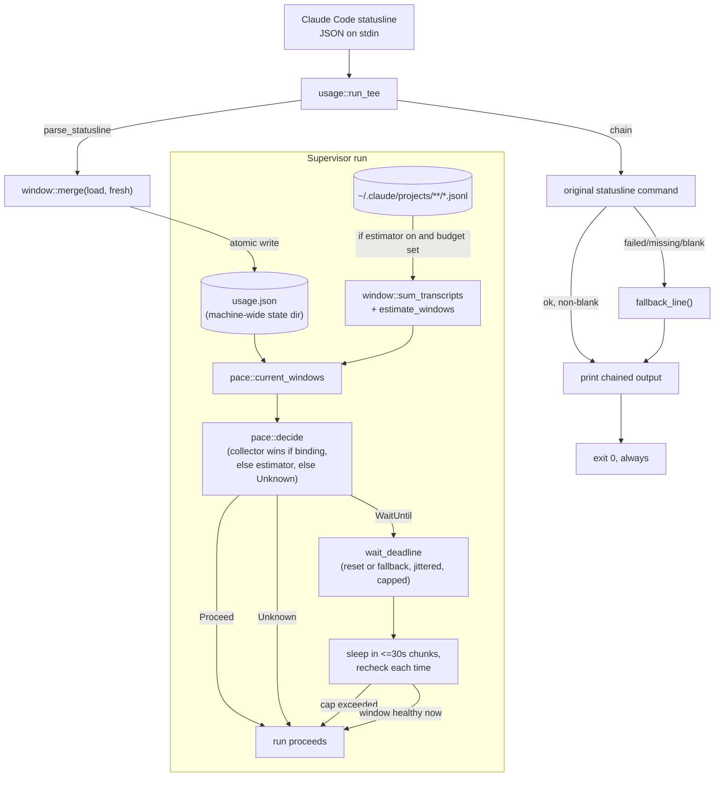

# Usage and Pacing

## Quick Reference

- **Files:** `src/commands/ctx/window.rs`, `src/commands/ctx/usage.rs`, `src/commands/ctx/pace.rs`, `src/commands/ctx/poll.rs`
- **Used by:** [[Ctx Supervisors]] (`run_loop`, `exec`, `wrap` call `pace::wait_for_window` before/around a supervised run); the `zirv ctx usage` verb and `usage tee` statusline wrapper are used directly by an operator's Claude Code `statusLine` config
- **Depends on:** [[Ctx Subsystem]] for config layering and state-dir resolution (`config.rs`, `state.rs`), [[Rot Engine]]'s sibling `log.rs` decision log (pace-wait entries), [[Ctx Adapters]] only indirectly (transcripts under `~/.claude/projects` come from the claude adapter's sessions; `poll.rs`'s `HttpPoller` reads `~/.codex/sessions`/`~/.codex/auth.json` and `~/.claude/.credentials.json` directly, bypassing the adapter trait entirely), [[Technology Stack]] for `ureq` (`poll.rs`'s only HTTP dependency, blocking, poll-fallback-only — see below)
- **Tests:** inline `#[cfg(test)] mod tests` in `window.rs` (parsing, merge, atomic store, transcript summation, estimator math, the codex rollout parser against `tests/fixtures/codex-rollout-rate-limits.jsonl`), in `pace.rs` (gating decisions, jitter, wait-cap scaling, the `Slow` throttle band, `use_credits`, `wait_for_window` with a fake clock), in `poll.rs` (the Anthropic parser against `tests/fixtures/anthropic-oauth-usage.json`, the codex parser against synthetic bodies since the endpoint is unverified, `maybe_poll`'s staleness/floor logic with a stub `UsagePoller`), and in `usage.rs` (tee persistence/fallback behavior, the `report` output, the `use_credits`/vendor-credits advisory lines)
- **If changed:** [[Ctx Subsystem]] (config schema for `[pace]`, `REPO_FORBIDDEN`), [[Ctx Supervisors]] (the only callers of the gate), [[Context Management]] (concept-level description of pacing), [[Decision Log]] (`pace-wait`, `limit-wording-drift`, `use-credits-skip` entries), [[Technology Stack]] (`ureq`)
- **Gotchas:**
  - `usage tee` must **never** fail to print a line. If parsing the payload or the chained command fails, it still writes a fallback statusline and always exits `0` — see the `run_tee` and `dispatch`'s `ParseFailure::Statusline` notes below.
  - `five_hour_budget_tokens` and `seven_day_budget_tokens` default to `0`, which means "no budget configured," not "zero tokens." The estimator produces no percentage for a `0`-budget window (`estimate_windows` returns `None` for it) rather than inventing one from an undocumented plan allowance.
  - `usage.json` under the state dir is a single, machine-wide file — not per-session, not per-repo. Every live Claude Code session's statusline tee writes to the same file, merged by newest-observation-per-window. A parallel per-provider file (`usage-<provider>.json`, see below) now exists alongside it. `pace::wait_for_window`/`current_windows`, `zirv ctx usage` (no subcommand), and `wrap`'s reserved status bar are all per-provider since 2026-08-15 (`window::load_for`/`has_no_usage_source`, keyed off the resolved adapter's own `provider()`) — none of the three read the unscoped `window::load` directly anymore.
  - `AgentAdapter::provider()` is the account (`"anthropic"`, `"openai"`), not the binary or the adapter's own `name()` — two harnesses can share one billed account. It has no default, so a new adapter must declare it explicitly rather than silently inheriting someone else's usage windows.

## Purpose

This module answers two related questions for a machine running unattended agent sessions: *how close is this account to its Anthropic rate-limit windows*, and *should a supervised run proceed right now or wait*. `window.rs` owns the data (what a window is, how it is persisted and merged); `pace.rs` owns the decision (the gate consulted by [[Ctx Supervisors]]); `usage.rs` is the human/operator-facing surface (`zirv ctx usage` reporting, and the `usage tee` statusline wrapper that feeds `window.rs` its data).

## How It Works

### `window.rs` — the rolling usage window

A `Window` is one subscription rate-limit reading: `used_percentage`, `resets_at` (unix epoch seconds, `0` meaning "unknown"), and `observed_at`. `UsageWindows` holds two optional windows, `five_hour` and `seven_day` — matching Anthropic's session and weekly rate-limit windows.

There are two independent sources of a `Window`:

- **Collector**: `parse_statusline` reads the `rate_limits.five_hour` / `rate_limits.seven_day` block that Claude Code's statusline JSON payload carries for Pro/Max sessions (server-authoritative). A payload with no `rate_limits` object, or with neither sub-window present, parses to `None` — this is normal (non-subscriber, or before the session's first response), not an error.
- **Estimator**: `sum_transcripts` walks every `*.jsonl` transcript under `~/.claude/projects` (including `subagents/` subdirectories, since subagent turns spend the same budget), sums `input + cache_creation_input + output` tokens per assistant event (`cache_read_input` is excluded by default via `count_cache_reads`, since cached reads are the dominant class in a cached session and are discounted by the API), buckets them into trailing 5-hour and 7-day windows by parsing each event's ISO-8601 timestamp, and tracks the oldest counted event per window (used to predict when the window frees up). `estimate_windows` then turns those token sums into percentages — but only against a caller-supplied budget; see the zero-budget gotcha above.

Persistence: `load`/`store` read and write `StateDir::usage()`, i.e. `usage.json` in the platform state directory — one file, shared by every session on the machine. `store` writes through a `tmp<pid>` file and renames it into place, so a reader never observes a half-written file even with several concurrent sessions' statuslines writing at once. A missing or corrupt file reads back as `UsageWindows::default()` rather than an error (a statusline hook must not break on a half-written state file). `merge` combines an existing and a freshly-parsed `UsageWindows` per sub-window, keeping whichever observation has the newer `observed_at`, and treating an absent window in the fresh reading as "no new information" rather than erasing what was already known.

`window.rs` also contains `parse_iso8601_utc`, a small hand-rolled parser for the exact `2026-07-31T14:15:15.968Z` shape Claude writes into transcripts (using Howard Hinnant's `days_from_civil` so it needs no date crate), and a future-skew guard: an event timestamped more than 5 minutes in the future is skipped entirely rather than being clamped to age-zero and inflating the freshest bucket.

**The codex collector (2026-08-16).** Codex has no statusline and no `rate_limits` payload of its own, so its data source is a third kind entirely: a passive scan of the codex CLI's own session rollout files (`~/.codex/sessions/**/*.jsonl`). `parse_rollout_line` reads one JSONL line, accepting only a `type: "event_msg"` line and pulling its rate-limit snapshot; `windows_from_rate_limits(limits, observed_at)` turns that snapshot's `primary`/`secondary` (or a bare, unwrapped shape — both `{"rate_limits": {...}}` and a bare `{...}` parse) into a `UsageWindows`, mapping `window_minutes` to `five_hour`/`seven_day` by nearest match (saturating the conversion against untrusted values rather than panicking on an absurd `window_minutes`) and `used_percent`/`resets_at` onto `Window`'s own fields. `resets_at` on a rollout snapshot is an RFC 3339 timestamp (`2026-08-16T20:49:59.785342+00:00`, with a UTC offset, unlike the transcript estimator's own bare-`Z` `parse_iso8601_utc`), so `window.rs` gained a second hand-rolled parser, `parse_rfc3339_utc`, reusing the same `days_from_civil` day-count math. `refresh_codex_usage(state, sessions_dir, now, max_age_secs)` is the actual scanner: a no-op once the stored `openai` reading is already fresher than `max_age_secs`, otherwise a bounded tail-scan of rollout files (rollout files grow large; only the tail can hold the newest snapshot) picking the **newest** snapshot by `observed_at` (not simply the last line read) with the same future-skew guard the transcript estimator uses, merged into the stored per-provider file the same way `merge` already combines two `UsageWindows`. `CODEX_USAGE_PROVIDER` (`"openai"`) is the provider slug every codex-usage call site names explicitly rather than deriving from an adapter instance, since `window.rs` has no adapter dependency of its own. This collector is what `pace::refresh_sources`, `wrap`'s own throttled bar scan (below), and `zirv ctx usage`'s no-subcommand report all call into — it is the thing that made per-harness usage in the dashboard header (Task 7) and codex pacing at all possible without any statusline wiring.

**A codex adapter capability nuance worth stating plainly:** `CodexAdapter::capabilities().token_usage` is still `false` (see [[Ctx Adapters]]) — that flag describes transcript-derived, in-process event parsing, which codex genuinely has none of. The collector above is a wholly separate, out-of-band mechanism (`window.rs` scanning rollout *files* directly, never going through `AgentAdapter::parse_events`), so a codex session can have real, fresh usage data in `usage-openai.json` while `readiness_note`'s `missing_capability_labels` still lists "usage" for it — both are correct simultaneously, describing two different things.

**Per-provider storage (2026-08-15).** The single machine-wide `usage.json` above cannot say *which account* a reading belongs to, and the old `load`'s default-on-absent made "no source" and "sitting at 0%" indistinguishable. `StateDir::usage_for(provider)` names a second file per account, `usage-<provider>.json`, where `provider` is sanitized by `state::provider_slug` (lowercase `[a-z0-9-]`, non-empty, `"unknown"` if that would otherwise be empty — cannot escape the state directory). `window::store_for`/`load_for` are the per-provider counterparts of `store`/`load`; `load_for` returns `None` — never a zero-valued `UsageWindows` — when nothing has ever been recorded for that provider, and for `anthropic` specifically it falls back to reading the legacy global `usage.json` (never moving or deleting it), so an operator upgrading into this layout keeps the reading their statusline has already been collecting. `usage::run_tee` writes both the legacy file and the resolved adapter's own `usage_for(adapter.provider())` file on every statusline tick. This storage was originally paired with dashboard-header rendering (`window::provider_summary`, `window::load_all`, `adapters::providers()`), all since **deleted** (2026-08-15, `a3b81c3`) once the dashboard dropped usage from its header. Usage is **back in the header as of Task 7 (2026-08-16)**, via a different, narrower reader (`window::load_for`/`max_used_percentage` per enabled harness, not the deleted `load_all`/`provider_summary`) — see [[Ctx Supervisors]] and [[Decision Log]] for why the "always reads no usage source" objection no longer holds.

**The pacing gate, `zirv ctx usage`, and `wrap`'s status bar all became per-provider readers the same day (2026-08-15, rounds 2 and 3).** Until this fix, `pace::current_windows`/`wait_for_window`, `usage::run_with`'s no-subcommand report, and `wrap`'s `redraw_bar_if_due` all called the unscoped `window::load`, so a codex session was paced against, and `zirv ctx usage`/the wrap status bar displayed, whatever Anthropic data claude's own statusline tee happened to have written -- not "no data for this account". `window::has_no_usage_source(state, provider)` is the fix's own key predicate: `true` for any provider but claude when `load_for` finds nothing (claude is exempt even before its first tee, since "not yet" is still the true, actionable answer there, unlike codex's structural "never"). `wait_for_window` now takes the resolved adapter's `provider()` and, when `has_no_usage_source` is true, skips the gate outright with one `Event::PacingSkipped` announcement (`"pacing off: <provider> has no usage source"`) rather than entering the loop and reading the absence as a fresh 0%-used collector reading for that provider. `zirv ctx usage` (no subcommand) prints the same `"<provider>: no usage source"` line instead of `report`'s "not reported ... wire your statusline" text, which is only ever true advice for claude. `wrap`'s bar needed no renderer change at all: `BarRuntime` now carries the resolved adapter's own `provider` (set at both construction sites, `wrap.rs`), `redraw_bar_if_due` reads `window::load_for(state_dir, &bar.provider).unwrap_or_default()` instead of the unscoped `window::load`, and `chrome::status_bar` already rendered a `None` `usage_percent` as the placeholder dash rather than a fabricated `0%` (its `BarState`/`PLACEHOLDER` contract predates this fix) -- only the *source* of the value changed.

`score::cached_score(state, repo, session_id) -> Option<u32>` (in `score.rs`, covered in depth on [[Rot Engine]]) is unrelated to usage windows but was added the same round for the same "cheap per-pane facts on a ~1s render throttle" reason: a dashboard pane's rot score, backed by the same incremental fold the Stop hook uses, cached behind a single `metadata()` call in steady state. `None` means unknown, never a healthy `0`.

**A wrapped codex session's own passive rollout scan (Task 7, 2026-08-16).** `wrap`'s status bar reads `window::load_for(state_dir, &bar.provider)` on every throttled redraw, same as before, but a wrapped codex session had no statusline tee of its own to keep that file fresh — its usage segment would otherwise stay a permanent placeholder for the session's whole life, unlike the pacing gate's own call sites (Tasks 4-6), which already scan/poll before every cycle. `redraw_bar_if_due` now runs `window::refresh_codex_usage` itself, floored to once per `CODEX_BAR_SCAN_SECS` (60s, independent of the 1s `BAR_THROTTLE` redraw cadence — a rollout scan is a real filesystem walk) and gated on `bar.provider == window::CODEX_USAGE_PROVIDER`. File-scanning only, exactly like `refresh_codex_usage` everywhere else it is called: `HttpPoller`/`maybe_poll` never appear on this path, matching `wrap`'s "must never make a session worse" invariant. The sessions directory is resolved via `crate::utils::home_dir()` (`HOME`/`USERPROFILE`), the same as `pace::refresh_sources` and `usage.rs`'s own refresh, not `refresh_codex_usage`'s internal `dirs::home_dir()` fallback, which ignores those variables on Windows and so cannot be pointed at a test fixture there.

### `pace.rs` — the pacing gate

`decide(collector, estimator, now, cfg) -> PaceDecision` is the pure core. `PaceDecision` is one of:

- `Proceed { source, worst_percent }`
- `WaitUntil { reset_at, window, percent, source }` — the hard pause, at or above `max_percent`
- `Slow { delay_secs, window, percent, source }` (2026-08-16) — the pace-to-reset soft-throttle band, between `soft_percent` and `max_percent`
- `Unknown` — no usable data at all (proceeds, but is reported honestly as unknown rather than as a healthy 0%)

The logic, in order:

1. If `cfg.enabled` is `false`, always `Proceed` with `Source::None` — pacing is off entirely.
2. A collector window is *binding* (`binding()`) if it is fresh (age ≤ `collector_max_age_secs`, default 900s), **or** if it is stale but was last seen at or above `max_percent` and its `resets_at` hasn't passed yet — a window cannot free up before its own reset, so staleness alone must never clear a park. A stale reading below the ceiling is simply treated as unknown.
3. Of the two sub-windows, `worst()` picks the one with the higher `used_percentage`.
4. If a binding collector reading exists, it wins outright — `Source::Collector`, even when an estimator reading disagrees (server-authoritative data always beats the approximation). Only when no collector reading binds, and `cfg.estimator` is enabled, does an estimator reading (only produced when a budget is configured) get considered, as `Source::Estimator`.
5. Below `soft_percent` (default 80.0%), `Proceed` unthrottled. At or above `max_percent` (default 99.0%, inclusive ceiling), `WaitUntil`, carrying the window's own `resets_at` (or `None` if it's `0`/unknown). **Between the two** (the soft-throttle band), `Slow`: see below.

**Pace-to-reset throttle, `Slow` (2026-08-16).** Inside `[soft_percent, max_percent)`, the gate does not hard-pause — it spreads the *remaining* budget evenly over the *remaining* time in the window instead, one cycle at a time. `delay_secs = t_rem * (percent - soft_percent) / (max_percent - soft_percent)`, where `t_rem` is `resets_at - now` when the reset is known and still ahead, else `cfg.fallback_delay_secs` (the same fallback `WaitUntil` uses for an unknown reset). A `delay_secs` of `0` (near the reset, or a `soft_percent >= max_percent` empty band) falls through to a plain `Proceed` rather than manufacturing a zero-length throttle. `wait_deadline` turns `Slow` into `now + delay_secs`, deliberately **un-jittered** (the delay is already reading-derived, not a shared thundering-herd wakeup) and, in `wait_for_window`'s own loop, tracked with a **monotonic minimum across rechecks** (`slow_deadline`): re-deriving the decision every 30s chunk recomputes `t_rem` against the advancing clock, which would otherwise creep the deadline forward every chunk and stretch a soft throttle into something approaching a full park; only a *smaller* recomputed deadline may pull it in, never a larger one push it out. `describe(&Slow{..})` reports `"<window> window at <pct>% (<source> data), throttling ~<delay>s before the next run"`.

`wait_deadline(decision, now, cfg, seed)` turns a `WaitUntil` into a concrete wake time: the window's `resets_at` if known and still in the future, else `now + fallback_delay_secs` (default 900s). That target is jittered by `apply_jitter` (a deterministic, non-cryptographic PCG-style mix keyed by `seed`, bounded to `[0, jitter_secs)`, default up to 30s — so several supervisors on one machine don't all wake in the same second) and then capped by `wait_cap(window, cfg)`: either the operator's absolute `max_wait_secs` override, or (the default) the tripped window's own length (`FIVE_HOUR_SECS` / `SEVEN_DAY_SECS`) plus `wait_slack_secs` (default 3600s) head-room. The cap is scaled per-window deliberately: a seven-day trip legitimately needs to wait days, while a bogus far-future `resets_at` on the five-hour window must not park a supervisor for a year. `Slow`'s own deadline is capped by the same `wait_cap`.

**New `[pace]` config keys backing all of this (2026-08-16):** `soft_percent` (default `80.0`, `ZIRV_CTX_PACE_SOFT_PERCENT`) — the start of the throttle band described above; `poll_enabled` (default `true`, `ZIRV_CTX_PACE_POLL`) and `poll_min_interval_secs` (default `60`, `ZIRV_CTX_PACE_POLL_MIN_INTERVAL_SECS`) — gate the active poll fallback, see `poll.rs` below; `[pace.use_credits] claude`/`codex` (both default `false`, `ZIRV_CTX_PACE_USE_CREDITS_CLAUDE`/`_CODEX`) — see "`use_credits`: an operator override" below. `UseCreditsConfig::for_provider(provider)` maps `"anthropic"` → `claude`, `"openai"` → `codex`, anything else → `false` (an unrecognized provider gates, it does not skip). All three keys join `REPO_FORBIDDEN` (`pace.use_credits`, `pace.poll_enabled`, `pace.poll_min_interval_secs` — see [[Ctx Subsystem]]): a repo checkout must not be able to declare its own credits-cover-overage exemption, or weaken/strengthen the poll floor that governs how often zirv calls out to a vendor API with the operator's own OAuth token.

**`use_credits`: an operator override that skips proactive gating, never the vendor's own limit park.** `PaceGate<'a> { use_credits: bool, poller: Option<&'a dyn poll::UsagePoller> }` is threaded into `wait_for_window` per call, resolved by each call site from `cfg.pace.use_credits.for_provider(adapter.provider())`. When `use_credits` is `true`, `wait_for_window` short-circuits **before any source refresh or decision at all** — no `Slow` throttle, no `WaitUntil` pause — logging `use-credits-skip` once per run (`PaceGateFlags::credits_announced`, the same once-per-run announce latch `no_source_announced` already used) rather than on every cycle. This is deliberately narrow: it only ever silences the *proactive* pace/throttle path. The vendor-reported limit park — the caller's own `scan_for_limit`/`is_limit_hit` scan of live output for a "hit your session/weekly/opus limit" message — is a wholly separate code path in `exec.rs`/`run_loop.rs` and is untouched by `use_credits`; both of its call sites deliberately pass `use_credits: false` into whatever pacing they invoke afterward, since a vendor that has already told the operator it hit a limit is not a case `use_credits` is meant to silence.

`wait_for_window<W: Write>(w, state, cfg, verb, session, now_fn, sleep_fn, announcer: Option<&announce::Announcer>, provider, gate: PaceGate, flags: &mut PaceGateFlags)` is the actual blocking call [[Ctx Supervisors]] use. It loops: `refresh_sources` (codex's passive rollout scan plus `gate.poller`'s active poll, see below — run once before the no-source check and again every loop iteration) → read `current_windows` (collector always, per-`provider` via `window::load_for`; estimator only when `cfg.estimator` is on **and** at least one budget is nonzero, since walking every transcript is not free) → `decide` → if `Proceed`/`Unknown`, return immediately with `PaceOutcome { waited_secs, source }` → if `WaitUntil`/`Slow`, check the total elapsed time against the window-scaled safety cap (if exceeded, print `"usage still high after waiting Ns (cap Ns), proceeding anyway"` and return rather than blocking forever — pacing failing closed would be worse than not pacing) → otherwise sleep in ≤30s chunks (`SLEEP_CHUNK_SECS`) so it rechecks state periodically (a live session may refresh the collector file mid-wait), printing/logging the decision once per distinct fingerprint (window name + reset time for `WaitUntil`; `"slow:<window>"` for `Slow`, deliberately not keyed on the shrinking delay/percent so one throttle episode announces once) rather than once per sleep chunk, to avoid scrolling the operator's terminal for days on a long park. It never exits the process and never returns an error. `announcer`, when `Some`, also emits a `PacingWait` event on the `zirv ▸` channel (see [[Ctx Supervisors]]) alongside the existing `w`/decision-log reporting, so a wait is visible on the announcement channel and not just in the transcript. `exec.rs` passes its own `Announcer` at both of its call sites; `run_loop.rs` passes `None` at both of its.

### `poll.rs` — the active usage-poll fallback (2026-08-16)

A second, active data source alongside the passive collector, consulted only when the stored per-provider reading has already gone stale at a gating point — never proactively, never on a path that must stay HTTP-free (`wrap`'s own status-bar redraw never constructs a poller; see [[Ctx Supervisors]]). `UsagePoller` is a one-method trait (`poll(&self, provider) -> Option<PollReading>`), so every test stubs it and the crate's test suite never makes a real network call. `HttpPoller` is the real implementation: a blocking `ureq` request (new dependency, see [[Technology Stack]]) against the vendor's own usage endpoint, using an OAuth token read fresh from disk on every call and never cached, logged, or persisted anywhere but that one request — `anthropic_token`/`codex_token` read `~/.claude/.credentials.json`/`~/.codex/auth.json` via `crate::utils::home_dir()` (not `dirs::home_dir()`, for the same Windows `HOME`/`USERPROFILE`-testability reason `pace::refresh_sources` and `usage.rs`'s own refresh use).

- **Anthropic** (`https://api.anthropic.com/api/oauth/usage`, verified against a real response — `tests/fixtures/anthropic-oauth-usage.json`): `parse_anthropic_usage` reads `five_hour`/`seven_day.utilization`/`.resets_at` (an RFC 3339 timestamp, via `window::parse_rfc3339_utc`) plus an advisory `extra_usage.is_enabled` flag surfaced as `PollReading::vendor_credits_enabled`.
- **Codex** (`https://chatgpt.com/backend-api/codex/usage`): **UNVERIFIED** — no readable token existed on the reference machine to exercise it against the real endpoint, so this ships best-effort, code-reviewed but never observed against a live response; see [[Known Issues]]. `parse_codex_usage` reuses `window::windows_from_rate_limits` (the same parser the passive rollout collector uses) against either a `{"rate_limits": {...}}` wrapper or a bare rate-limits object, plus an advisory `credits/has_credits` flag.

`maybe_poll(state, cfg, now, provider, poller)` is the throttled entry point every call site actually uses: returns `None` outright when `cfg.poll_enabled` is `false`; `None` when the stored reading for `provider` is already fresher than `cfg.collector_max_age_secs` (the poll exists only as a fallback, not a competing refresh); `None` when a marker file (`state.poll_marker_for(provider)`, `{"last_attempt": u64}`, atomically written via the same temp-sibling-plus-rename idiom `window::store_at` uses) shows an attempt inside `cfg.poll_min_interval_secs` — **written on every attempt, success or failure**, so a provider with a broken token doesn't retry on every single call either. On an actual poll, the result — success or not — merges into the stored per-provider file via `window::merge`/`store_for` exactly like the passive collector does, so the two sources compose rather than one clobbering the other's freshest reading. Both `pace::refresh_sources` (every `wait_for_window` call site, via `PaceGate.poller`) and `zirv ctx usage`'s no-subcommand report construct an `HttpPoller` and call this; nothing else in the binary does.

`pace.rs` also owns limit-message detection used by the supervisors: `is_limit_hit` matches exactly three documented phrases (`"hit your session limit"`, `"hit your weekly limit"`, `"hit your opus limit"`, case-insensitive substring match) — deliberately narrow, since a false positive parks a healthy run and an unverified guess is not a fact. `scan_for_limit` runs this over a batch of tapped output lines and also calls `note_limit_wording_drift` for any line that loosely resembles a limit message (contains "limit" plus a hit/reached/exceeded verb) without matching strictly — this only logs a decision-log breadcrumb and prints a stderr advisory, it never itself changes the proceed/wait outcome.

### `usage.rs` — the `usage` verb and statusline tee

`zirv ctx usage` (no subcommand) loads config, resolves state, refreshes both usage sources ahead of reporting (codex's passive rollout scan plus an `HttpPoller` poll — the same `refresh_sources`-shaped best-effort call the pacing gate makes, so a `usage` run right after a fresh session can surface data before any gate call site would have), computes `current_windows`, and prints a human-readable `report`: the collector reading for each sub-window (with freshness and reset time, or "not reported" if absent — never shown as 0%), the estimator reading if a budget is configured (explicitly labeled "approximation" since token-class weighting is undocumented) or an "estimator: off" line telling the operator how to enable it, and a pacing summary (ceiling, wait bounds for each window, and the current `decide()` verdict). Two more lines, both conditional: `cfg.pace.use_credits.for_provider(provider)` prints `"use_credits: enabled for this harness -- pacing gate skipped"`; and, only when a poll actually ran this call and returned an opinion (never invented from a stale reading, and silent when no poll ran — disabled, floored, or unneeded), `"vendor reports credits <on/off> on this plan"` from that poll's own `vendor_credits_enabled` advisory.

`zirv ctx usage tee -- <original statusline command>` is meant to be wired directly into Claude Code's `statusLine` setting, wrapping the operator's real statusline script. `run_tee`:

1. Reads the statusline JSON payload from stdin.
2. Best-effort persists it first: if it parses into a `UsageWindows` (via `window::parse_statusline`), merges it into `usage.json` and writes it back — before attempting the chained command, so a broken statusline script downstream cannot cost the reading.
3. Runs the original chained command (`run_chained`), piping the same stdin JSON to it and capturing its stdout.
4. Prints the chained command's output if it succeeded and produced non-blank output; otherwise falls back to `fallback_line`, a one-line summary built from the payload's `model.display_name` and `context_window.used_percentage` (or just the model name, or literally `"claude"` if the payload itself is unparseable).
5. **Always returns `0`.**

This resilience is deliberate and load-bearing: Claude Code renders whatever the statusline command prints on every render tick, so a `tee` that errors out or prints nothing makes the terminal look broken. The same fallback path is reused one level up: `ctx/mod.rs`'s `dispatch` classifies a clap parse failure on `ctx usage tee ...` argv as `ParseFailure::Statusline` (as opposed to the generic `ParseFailure::Reject`, which exits `2`) and calls `usage::run_tee` with an empty command and no state, so even a malformed invocation of the tee itself still emits a fallback line and exits `0`.

## Data Flow

## See Also

- [[Ctx Subsystem]] — the hub page for the whole `zirv ctx` command tree and its config/state layering
- [[Ctx Supervisors]] — `run_loop`, `exec`, and `wrap`, the actual callers of `pace::wait_for_window`
- [[Decision Log]] — where `pace-wait` and `limit-wording-drift` entries land
- [[Context Management]] — the higher-level concept this module supports
