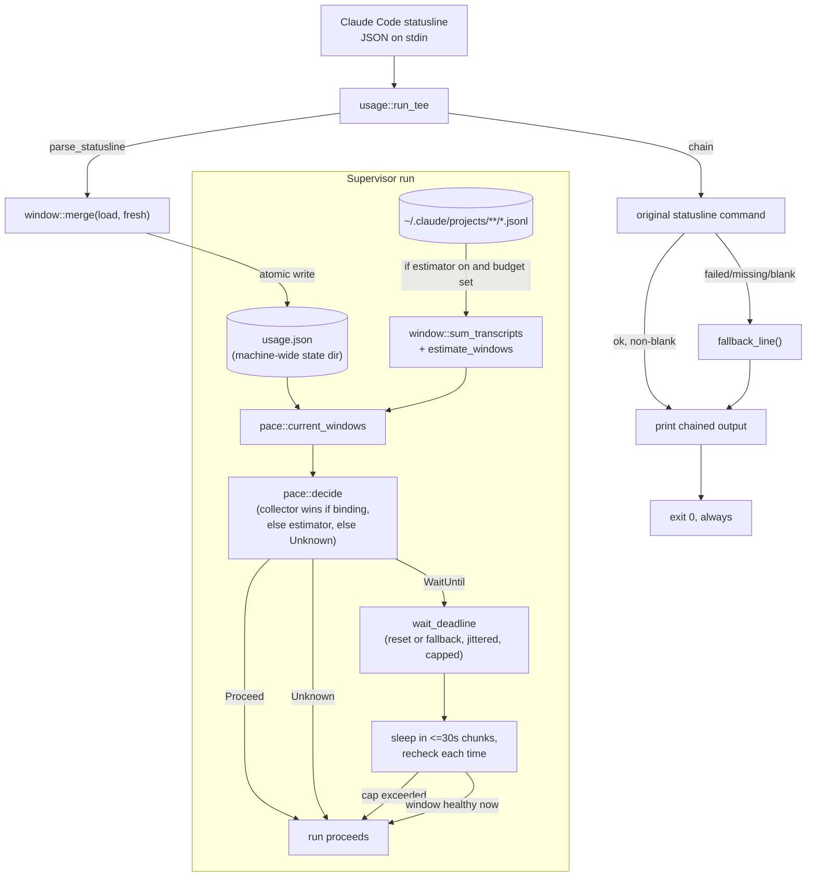

# Usage and Pacing

## Quick Reference

- **Files:** `src/commands/ctx/window.rs`, `src/commands/ctx/usage.rs`, `src/commands/ctx/pace.rs`
- **Used by:** [[Ctx Supervisors]] (`run_loop`, `exec`, `wrap` call `pace::wait_for_window` before/around a supervised run); the `zirv ctx usage` verb and `usage tee` statusline wrapper are used directly by an operator's Claude Code `statusLine` config
- **Depends on:** [[Ctx Subsystem]] for config layering and state-dir resolution (`config.rs`, `state.rs`), [[Rot Engine]]'s sibling `log.rs` decision log (pace-wait entries), [[Ctx Adapters]] only indirectly (transcripts under `~/.claude/projects` come from the claude adapter's sessions)
- **Tests:** inline `#[cfg(test)] mod tests` in `window.rs` (parsing, merge, atomic store, transcript summation, estimator math), in `pace.rs` (gating decisions, jitter, wait-cap scaling, `wait_for_window` with a fake clock), and in `usage.rs` (tee persistence/fallback behavior, the `report` output)
- **If changed:** [[Ctx Subsystem]] (config schema for `[pace]`), [[Ctx Supervisors]] (the only callers of the gate), [[Context Management]] (concept-level description of pacing), [[Decision Log]] (`pace-wait` and `limit-wording-drift` entries)
- **Gotchas:**
  - `usage tee` must **never** fail to print a line. If parsing the payload or the chained command fails, it still writes a fallback statusline and always exits `0` — see the `run_tee` and `dispatch`'s `ParseFailure::Statusline` notes below.
  - `five_hour_budget_tokens` and `seven_day_budget_tokens` default to `0`, which means "no budget configured," not "zero tokens." The estimator produces no percentage for a `0`-budget window (`estimate_windows` returns `None` for it) rather than inventing one from an undocumented plan allowance.
  - `usage.json` under the state dir is a single, machine-wide file — not per-session, not per-repo. Every live Claude Code session's statusline tee writes to the same file, merged by newest-observation-per-window.

## Purpose

This module answers two related questions for a machine running unattended agent sessions: *how close is this account to its Anthropic rate-limit windows*, and *should a supervised run proceed right now or wait*. `window.rs` owns the data (what a window is, how it is persisted and merged); `pace.rs` owns the decision (the gate consulted by [[Ctx Supervisors]]); `usage.rs` is the human/operator-facing surface (`zirv ctx usage` reporting, and the `usage tee` statusline wrapper that feeds `window.rs` its data).

## How It Works

### `window.rs` — the rolling usage window

A `Window` is one subscription rate-limit reading: `used_percentage`, `resets_at` (unix epoch seconds, `0` meaning "unknown"), and `observed_at`. `UsageWindows` holds two optional windows, `five_hour` and `seven_day` — matching Anthropic's session and weekly rate-limit windows.

There are two independent sources of a `Window`:

- **Collector**: `parse_statusline` reads the `rate_limits.five_hour` / `rate_limits.seven_day` block that Claude Code's statusline JSON payload carries for Pro/Max sessions (server-authoritative). A payload with no `rate_limits` object, or with neither sub-window present, parses to `None` — this is normal (non-subscriber, or before the session's first response), not an error.
- **Estimator**: `sum_transcripts` walks every `*.jsonl` transcript under `~/.claude/projects` (including `subagents/` subdirectories, since subagent turns spend the same budget), sums `input + cache_creation_input + output` tokens per assistant event (`cache_read_input` is excluded by default via `count_cache_reads`, since cached reads are the dominant class in a cached session and are discounted by the API), buckets them into trailing 5-hour and 7-day windows by parsing each event's ISO-8601 timestamp, and tracks the oldest counted event per window (used to predict when the window frees up). `estimate_windows` then turns those token sums into percentages — but only against a caller-supplied budget; see the zero-budget gotcha above.

Persistence: `load`/`store` read and write `StateDir::usage()`, i.e. `usage.json` in the platform state directory — one file, shared by every session on the machine. `store` writes through a `tmp<pid>` file and renames it into place, so a reader never observes a half-written file even with several concurrent sessions' statuslines writing at once. A missing or corrupt file reads back as `UsageWindows::default()` rather than an error (a statusline hook must not break on a half-written state file). `merge` combines an existing and a freshly-parsed `UsageWindows` per sub-window, keeping whichever observation has the newer `observed_at`, and treating an absent window in the fresh reading as "no new information" rather than erasing what was already known.

`window.rs` also contains `parse_iso8601_utc`, a small hand-rolled parser for the exact `2026-07-31T14:15:15.968Z` shape Claude writes into transcripts (using Howard Hinnant's `days_from_civil` so it needs no date crate), and a future-skew guard: an event timestamped more than 5 minutes in the future is skipped entirely rather than being clamped to age-zero and inflating the freshest bucket.

### `pace.rs` — the pacing gate

`decide(collector, estimator, now, cfg) -> PaceDecision` is the pure core. `PaceDecision` is one of:

- `Proceed { source, worst_percent }`
- `WaitUntil { reset_at, window, percent, source }`
- `Unknown` — no usable data at all (proceeds, but is reported honestly as unknown rather than as a healthy 0%)

The logic, in order:

1. If `cfg.enabled` is `false`, always `Proceed` with `Source::None` — pacing is off entirely.
2. A collector window is *binding* (`binding()`) if it is fresh (age ≤ `collector_max_age_secs`, default 900s), **or** if it is stale but was last seen at or above `max_percent` and its `resets_at` hasn't passed yet — a window cannot free up before its own reset, so staleness alone must never clear a park. A stale reading below the ceiling is simply treated as unknown.
3. Of the two sub-windows, `worst()` picks the one with the higher `used_percentage`.
4. If a binding collector reading exists, it wins outright — `Source::Collector`, even when an estimator reading disagrees (server-authoritative data always beats the approximation). Only when no collector reading binds, and `cfg.estimator` is enabled, does an estimator reading (only produced when a budget is configured) get considered, as `Source::Estimator`.
5. If the winning window's percentage is below `max_percent` (default 99.0%, inclusive ceiling), `Proceed`. Otherwise `WaitUntil`, carrying the window's own `resets_at` (or `None` if it's `0`/unknown).

`wait_deadline(decision, now, cfg, seed)` turns a `WaitUntil` into a concrete wake time: the window's `resets_at` if known and still in the future, else `now + fallback_delay_secs` (default 900s). That target is jittered by `apply_jitter` (a deterministic, non-cryptographic PCG-style mix keyed by `seed`, bounded to `[0, jitter_secs)`, default up to 30s — so several supervisors on one machine don't all wake in the same second) and then capped by `wait_cap(window, cfg)`: either the operator's absolute `max_wait_secs` override, or (the default) the tripped window's own length (`FIVE_HOUR_SECS` / `SEVEN_DAY_SECS`) plus `wait_slack_secs` (default 3600s) head-room. The cap is scaled per-window deliberately: a seven-day trip legitimately needs to wait days, while a bogus far-future `resets_at` on the five-hour window must not park a supervisor for a year.

`wait_for_window` is the actual blocking call [[Ctx Supervisors]] use. It loops: read `current_windows` (collector always; estimator only when `cfg.estimator` is on **and** at least one budget is nonzero, since walking every transcript is not free) → `decide` → if `Proceed`/`Unknown`, return immediately with `PaceOutcome { waited_secs, source }` → if `WaitUntil`, check the total elapsed time against the window-scaled safety cap (if exceeded, print `"usage still high after waiting Ns (cap Ns), proceeding anyway"` and return rather than blocking forever — pacing failing closed would be worse than not pacing) → otherwise sleep in ≤30s chunks (`SLEEP_CHUNK_SECS`) so it rechecks state periodically (a live session may refresh the collector file mid-wait), printing/logging the decision once per distinct fingerprint (window name + reset time) rather than once per sleep chunk, to avoid scrolling the operator's terminal for days on a long park. It never exits the process and never returns an error.

`pace.rs` also owns limit-message detection used by the supervisors: `is_limit_hit` matches exactly three documented phrases (`"hit your session limit"`, `"hit your weekly limit"`, `"hit your opus limit"`, case-insensitive substring match) — deliberately narrow, since a false positive parks a healthy run and an unverified guess is not a fact. `scan_for_limit` runs this over a batch of tapped output lines and also calls `note_limit_wording_drift` for any line that loosely resembles a limit message (contains "limit" plus a hit/reached/exceeded verb) without matching strictly — this only logs a decision-log breadcrumb and prints a stderr advisory, it never itself changes the proceed/wait outcome.

### `usage.rs` — the `usage` verb and statusline tee

`zirv ctx usage` (no subcommand) loads config, resolves state, computes `current_windows`, and prints a human-readable `report`: the collector reading for each sub-window (with freshness and reset time, or "not reported" if absent — never shown as 0%), the estimator reading if a budget is configured (explicitly labeled "approximation" since token-class weighting is undocumented) or an "estimator: off" line telling the operator how to enable it, and a pacing summary (ceiling, wait bounds for each window, and the current `decide()` verdict).

`zirv ctx usage tee -- <original statusline command>` is meant to be wired directly into Claude Code's `statusLine` setting, wrapping the operator's real statusline script. `run_tee`:

1. Reads the statusline JSON payload from stdin.
2. Best-effort persists it first: if it parses into a `UsageWindows` (via `window::parse_statusline`), merges it into `usage.json` and writes it back — before attempting the chained command, so a broken statusline script downstream cannot cost the reading.
3. Runs the original chained command (`run_chained`), piping the same stdin JSON to it and capturing its stdout.
4. Prints the chained command's output if it succeeded and produced non-blank output; otherwise falls back to `fallback_line`, a one-line summary built from the payload's `model.display_name` and `context_window.used_percentage` (or just the model name, or literally `"claude"` if the payload itself is unparseable).
5. **Always returns `0`.**

This resilience is deliberate and load-bearing: Claude Code renders whatever the statusline command prints on every render tick, so a `tee` that errors out or prints nothing makes the terminal look broken. The same fallback path is reused one level up: `ctx/mod.rs`'s `dispatch` classifies a clap parse failure on `ctx usage tee ...` argv as `ParseFailure::Statusline` (as opposed to the generic `ParseFailure::Reject`, which exits `2`) and calls `usage::run_tee` with an empty command and no state, so even a malformed invocation of the tee itself still emits a fallback line and exits `0`.

## Data Flow

## See Also

- [[Ctx Subsystem]] — the hub page for the whole `zirv ctx` command tree and its config/state layering
- [[Ctx Supervisors]] — `run_loop`, `exec`, and `wrap`, the actual callers of `pace::wait_for_window`
- [[Decision Log]] — where `pace-wait` and `limit-wording-drift` entries land
- [[Context Management]] — the higher-level concept this module supports
