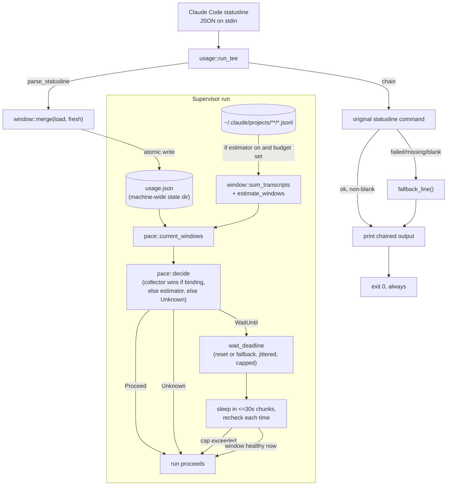

# Usage and Pacing

## Quick Reference

- **Files:** `src/commands/ctx/window.rs`, `src/commands/ctx/usage.rs`, `src/commands/ctx/pace.rs`, `src/commands/ctx/poll.rs`, `src/commands/ctx/allocator.rs` and `src/commands/ctx/reservation.rs` (issue #358: the pure cross-harness capacity planner and the durable per-provider reservation ledger it reads — see "Elastic cross-harness capacity" below)
- **Used by:** [[Ctx Supervisors]] (`run_loop`, `exec`, `wrap` call `pace::wait_for_window` before/around a supervised run); the `zirv ctx usage` verb and `usage tee` statusline wrapper are used directly by an operator's Claude Code `statusLine` config
- **Depends on:** [[Ctx Subsystem]] for config layering and state-dir resolution (`config.rs`, `state.rs`), [[Rot Engine]]'s sibling `log.rs` decision log (pace-wait entries), [[Ctx Adapters]] only indirectly (transcripts under `~/.claude/projects` come from the claude adapter's sessions; `poll.rs`'s `HttpPoller` reads `~/.codex/sessions`/`~/.codex/auth.json` and `~/.claude/.credentials.json` directly, bypassing the adapter trait entirely), [[Technology Stack]] for `ureq` (`poll.rs`'s only HTTP dependency, blocking, poll-fallback-only — see below)
- **Tests:** inline `#[cfg(test)] mod tests` in `window.rs` (parsing, merge, atomic store, transcript summation, estimator math, the codex rollout parser against `tests/fixtures/codex-rollout-rate-limits.jsonl`), in `pace.rs` (gating decisions, jitter, wait-cap scaling, the `Slow` throttle band, `use_credits`, `wait_for_window` with a fake clock), in `poll.rs` (the Anthropic parser against `tests/fixtures/anthropic-oauth-usage.json`, the codex parser against synthetic bodies since the endpoint is unverified, `maybe_poll`'s staleness/floor logic with a stub `UsagePoller`), and in `usage.rs` (tee persistence/fallback behavior, the `report` output, the `use_credits`/vendor-credits advisory lines)
- **If changed:** [[Ctx Subsystem]] (config schema for `[pace]`/`[fallback]`, `REPO_FORBIDDEN`, `zirv ctx compile --measure`, the pool state files), [[Ctx Supervisors]] (the only callers of the gate; the seat/rollover machinery built on the allocator/reservation ledger), [[Workflows]] (the identical schema-v2 cache-hit formula `zirv workflow stats` surfaces), [[Context Management]] (concept-level description of pacing), [[Decision Log]] (`pace-wait`, `limit-wording-drift`, `use-credits-skip`, `allocation-plan-changed`, `delegation-routed` entries), [[Untrusted Configuration]] (narrowing direction for every `[fallback]` key), [[Technology Stack]] (`ureq`)
- **Gotchas:**
  - `usage tee` must **never** fail to print a line. If parsing the payload or the chained command fails, it still writes a fallback statusline and always exits `0` — see the `run_tee` and `dispatch`'s `ParseFailure::Statusline` notes below.
  - `five_hour_budget_tokens` and `seven_day_budget_tokens` default to `0`, which means "no budget configured," not "zero tokens." The estimator produces no percentage for a `0`-budget window (`estimate_windows` returns `None` for it) rather than inventing one from an undocumented plan allowance.
  - `usage.json` under the state dir is a single, machine-wide file — not per-session, not per-repo. Every live Claude Code session's statusline tee writes to the same file, merged by newest-observation-per-window. A parallel per-provider file (`usage-<provider>.json`, see below) now exists alongside it. `pace::wait_for_window`/`current_windows`, `zirv ctx usage` (no subcommand), and `wrap`'s reserved status bar are all per-provider since 2026-08-15 (`window::load_for`/`has_no_usage_source`, keyed off the resolved adapter's own `provider()`) — none of the three read the unscoped `window::load` directly anymore.
  - `AgentAdapter::provider()` is the account (`"anthropic"`, `"openai"`), not the binary or the adapter's own `name()` — two harnesses can share one billed account. It has no default, so a new adapter must declare it explicitly rather than silently inheriting someone else's usage windows.
  - `window::available` (display filter, 2026-08-18) and `pace::binding` (pacing gate, pre-existing) are two *different* staleness rules over the same `Window` data — don't conflate them. `available` drops a window once its `resets_at` has passed, full stop. `binding` deliberately keeps a stale-but-still-high reading binding when `used_percentage >= max_percent && resets_at > now`, so a park cannot be cleared by staleness alone before the window's own reset — that reading can render as a blank usage segment on the bar while still correctly holding a session parked; see [[Known Issues]].
  - `zirv ctx usage` (no subcommand) is the one usage surface that does **not** filter through `window::available` — it is the diagnostic view explaining pacing, and pacing consults the raw windows too. It also prints a `resets_at` as a bare unix epoch even once it has passed, with no "already reset" wording (see [[Known Issues]]).

## Purpose

This module answers two related questions for a machine running unattended agent sessions: *how close is this account to its Anthropic rate-limit windows*, and *should a supervised run proceed right now or wait*. `window.rs` owns the data (what a window is, how it is persisted and merged); `pace.rs` owns the decision (the gate consulted by [[Ctx Supervisors]]); `usage.rs` is the human/operator-facing surface (`zirv ctx usage` reporting, and the `usage tee` statusline wrapper that feeds `window.rs` its data).

## How It Works

### `window.rs` — the rolling usage window

A `Window` is one subscription rate-limit reading: `used_percentage`, `resets_at` (unix epoch seconds, `0` meaning "unknown"), and `observed_at`. `UsageWindows` holds two optional windows, `five_hour` and `seven_day` — matching Anthropic's session and weekly rate-limit windows.

There are two independent sources of a `Window`:

- **Collector**: `parse_statusline` reads the `rate_limits.five_hour` / `rate_limits.seven_day` block that Claude Code's statusline JSON payload carries for Pro/Max sessions (server-authoritative). A payload with no `rate_limits` object, or with neither sub-window present, parses to `None` — this is normal (non-subscriber, or before the session's first response), not an error.
- **Estimator**: `sum_transcripts` walks every `*.jsonl` transcript under `~/.claude/projects` (including `subagents/` subdirectories, since subagent turns spend the same budget), sums `input + cache_creation_input + output` tokens per assistant event (`cache_read_input` is excluded by default via `count_cache_reads`, since cached reads are the dominant class in a cached session and are discounted by the API), buckets them into trailing 5-hour and 7-day windows by parsing each event's ISO-8601 timestamp, and tracks the oldest counted event per window (used to predict when the window frees up). `estimate_windows` then turns those token sums into percentages — but only against a caller-supplied budget; see the zero-budget gotcha above.

Persistence: `load`/`store` read and write `StateDir::usage()`, i.e. `usage.json` in the platform state directory — one file, shared by every session on the machine. `store` writes through a `tmp<pid>` file and renames it into place, so a reader never observes a half-written file even with several concurrent sessions' statuslines writing at once. A missing or corrupt file reads back as `UsageWindows::default()` rather than an error (a statusline hook must not break on a half-written state file). `merge` combines an existing and a freshly-parsed `UsageWindows` per sub-window, keeping whichever observation has the newer `observed_at`, and treating an absent window in the fresh reading as "no new information" rather than erasing what was already known.

`window.rs` also contains `parse_iso8601_utc`, a small hand-rolled parser for the exact `2026-07-31T14:15:15.968Z` shape Claude writes into transcripts (using Howard Hinnant's `days_from_civil` so it needs no date crate), and a future-skew guard: an event timestamped more than 5 minutes in the future is skipped entirely rather than being clamped to age-zero and inflating the freshest bucket.

**The codex collector (2026-08-16), now sharing its line parser with codex's own event derivation (issue #86, 2026-08-23).** Codex has no statusline and no `rate_limits` payload of its own, so its data source is a third kind entirely: a passive scan of the codex CLI's own session rollout files (`~/.codex/sessions/**/*.jsonl`). `parse_rollout_line` is now a thin wrapper over `window::parse_rollout_record`, the single shared per-line parser that also backs `CodexAdapter::parse_events`/`structural_context`/`transcript_usage` (see [[Ctx Adapters]]): a `RolloutRecord` is `TokenCount { observed_at, windows, totals }` (`event_msg`/`token_count`), `TaskStarted` (`event_msg`/`task_started`), or `TaskComplete { last_agent_message }` (`event_msg`/`task_complete`); `parse_rollout_line` keeps only the `TokenCount` variant's `windows` field, discarding the turn-boundary records — so the rollout file is parsed once per line, not by two independent readers that could drift apart on what a line means. `windows_from_rate_limits(limits, observed_at)` turns a `token_count` snapshot's `primary`/`secondary` (or a bare, unwrapped shape — both `{"rate_limits": {...}}` and a bare `{...}` parse) into a `UsageWindows`, mapping `window_minutes` to `five_hour`/`seven_day` by nearest match (saturating the conversion against untrusted values rather than panicking on an absurd `window_minutes`) and `used_percent`/`resets_at` onto `Window`'s own fields. `resets_at` on a rollout snapshot is an RFC 3339 timestamp (`2026-08-16T20:49:59.785342+00:00`, with a UTC offset, unlike the transcript estimator's own bare-`Z` `parse_iso8601_utc`), so `window.rs` gained a second hand-rolled parser, `parse_rfc3339_utc`, reusing the same `days_from_civil` day-count math. `refresh_codex_usage(state, sessions_dir, now, max_age_secs)` is the actual scanner: a no-op once the stored `openai` reading is already fresher than `max_age_secs`, otherwise a bounded tail-scan of rollout files (rollout files grow large; only the tail can hold the newest snapshot) picking the **newest** snapshot by `observed_at` (not simply the last line read) with the same future-skew guard the transcript estimator uses, merged into the stored per-provider file the same way `merge` already combines two `UsageWindows`. `CODEX_USAGE_PROVIDER` (`"openai"`) is the provider slug every codex-usage call site names explicitly rather than deriving from an adapter instance, since `window.rs` has no adapter dependency of its own. This collector is what `pace::refresh_sources`, `wrap`'s own throttled bar scan (below), and `zirv ctx usage`'s no-subcommand report all call into — it is the thing that made per-harness usage in the dashboard header (Task 7) and codex pacing at all possible without any statusline wiring.

**A codex adapter capability nuance worth stating plainly:** `CodexAdapter::capabilities().token_usage` is still `false` (see [[Ctx Adapters]]) — that flag describes transcript-derived, in-process event parsing, which codex genuinely has none of. The collector above is a wholly separate, out-of-band mechanism (`window.rs` scanning rollout *files* directly, never going through `AgentAdapter::parse_events`), so a codex session can have real, fresh usage data in `usage-openai.json` while `readiness_note`'s `missing_capability_labels` still lists "usage" for it — both are correct simultaneously, describing two different things.

**Per-provider storage (2026-08-15).** The single machine-wide `usage.json` above cannot say *which account* a reading belongs to, and the old `load`'s default-on-absent made "no source" and "sitting at 0%" indistinguishable. `StateDir::usage_for(provider)` names a second file per account, `usage-<provider>.json`, where `provider` is sanitized by `state::provider_slug` (lowercase `[a-z0-9-]`, non-empty, `"unknown"` if that would otherwise be empty — cannot escape the state directory). `window::store_for`/`load_for` are the per-provider counterparts of `store`/`load`; `load_for` returns `None` — never a zero-valued `UsageWindows` — when nothing has ever been recorded for that provider, and for `anthropic` specifically it falls back to reading the legacy global `usage.json` (never moving or deleting it), so an operator upgrading into this layout keeps the reading their statusline has already been collecting. `usage::run_tee` writes both the legacy file and the resolved adapter's own `usage_for(adapter.provider())` file on every statusline tick. This storage was originally paired with dashboard-header rendering (`window::provider_summary`, `window::load_all`, `adapters::providers()`), all since **deleted** (2026-08-15, `a3b81c3`) once the dashboard dropped usage from its header. Usage is **back in the header as of Task 7 (2026-08-16)**, via a different, narrower reader (`window::load_for` per enabled harness, not the deleted `load_all`/`provider_summary`) — see [[Ctx Supervisors]] and [[Decision Log]] for why the "always reads no usage source" objection no longer holds. As of 2026-08-18 the header renders both windows per harness rather than the worse of the two; see "Both windows displayed, honestly filtered" below.

**The pacing gate, `zirv ctx usage`, and `wrap`'s status bar all became per-provider readers the same day (2026-08-15, rounds 2 and 3).** Until this fix, `pace::current_windows`/`wait_for_window`, `usage::run_with`'s no-subcommand report, and `wrap`'s `redraw_bar_if_due` all called the unscoped `window::load`, so a codex session was paced against, and `zirv ctx usage`/the wrap status bar displayed, whatever Anthropic data claude's own statusline tee happened to have written -- not "no data for this account". `window::has_no_usage_source(state, provider)` is the fix's own key predicate, and since the codex collector and the poller landed (2026-08-16) it is a plain "nothing recorded" check for every provider — the old claude exemption is gone, because callers now refresh sources first and then ask, so absence genuinely means "no data from any source", not "not yet teed". A side effect worth knowing: a fresh claude machine that has never teed now gets the generic `"anthropic: no usage source"` line, not the old actionable "wire your statusline" hint. `wait_for_window` now takes the resolved adapter's `provider()` and, when `has_no_usage_source` is true (and no estimator budget is configured), applies the bounded blind-mode safety delay rather than entering the loop and reading the absence as a fresh 0%-used collector reading for that provider -- see the `Event::PacingBlind`/`blind_wait` paragraph below (T8, 2026-08-22) for the actual current behavior; the gate is no longer silently skipped. `zirv ctx usage` (no subcommand) prints the same `"<provider>: no usage source"` line instead of `report`'s "not reported ... wire your statusline" text, which is only ever true advice for claude. `wrap`'s bar needed no renderer change at the time: `BarRuntime` now carries the resolved adapter's own `provider` (set at both construction sites, `wrap.rs`), `redraw_bar_if_due` reads `window::load_for(state_dir, &bar.provider).unwrap_or_default()` instead of the unscoped `window::load`, and `chrome::status_bar` already rendered an unknown usage value as the placeholder dash rather than a fabricated `0%` (its `BarState`/`PLACEHOLDER` contract predates this fix) -- only the *source* of the value changed. The renderer itself changed later, 2026-08-18 — see below.

### Both windows displayed, honestly filtered by `window::available` (2026-08-18)

A per-agent usage reading used to collapse both subscription windows into one number: `window::max_used_percentage` picked the worse (higher) of `five_hour`/`seven_day` for both the dashboard header and `wrap`'s status bar. That number could also be stale by months with nothing checking it — the motivating case was a dashboard reading "codex 14%" from a rollout snapshot observed 2026-02-26, whose `resets_at` had expired roughly 172 days earlier, rendered as if it were current. `max_used_percentage` is now **removed**; no caller is left.

- **`window::available(windows, now) -> UsageWindows`** is the new per-slot filter, applied at every display surface: a window is kept only when `(resets_at == 0 || resets_at > now)` *and* `age_secs(window, now) <= span` (`FIVE_HOUR_SECS`/`SEVEN_DAY_SECS`, the window's own length). The `resets_at == now` boundary is dropped, not kept — deliberately matching `pace.rs`'s own `reset_passed` convention (`resets_at != 0 && resets_at <= now`) so the two never disagree about whether the reset second itself has passed. Each slot is judged independently: a rolled-over `five_hour` never drops a still-live `seven_day`, or vice versa. A window with no `resets_at` at all (`0`) is judged on age alone, so a bogus far-future `resets_at` persisted once and never refreshed cannot keep an ancient reading displayable forever.
- **Dashboard (footer, not header, as of issue #202/v2.38.0 and issue #209/v2.39.0):** `FactsCache::DiskFacts::usage: Vec<HarnessUsage>` (`name`, `five_hour: Option<f64>`, `seven_day: Option<f64>`, `credits: bool`) is filled by `refresh_if_due` from `window::load_for` filtered through `available` at the current wall clock, every throttle tick, regardless of whether anything currently renders it — this bullet's own `header_line`/`HeaderFacts::usage` shape described the dashboard header before issue #202 (2026-08-30) dropped usage from the header entirely; issue #209 (the same day) is what first reads `DiskFacts::usage` again, into the new footer's focused-pane segment (`◔ 5h%·7d%`), matched by the focused pane's own harness. See [[Ctx Supervisors]]'s "The dashboard header, sidebar and footer".
- **`wrap`'s status bar:** `chrome::BarState::usage_percent` is replaced by `usage_five_hour`/`usage_seven_day` (both `Option<f64>`); `status_bar` renders the same `5h X% wk Y%` shape, either window alone, or the existing placeholder when neither is available. `wrap::redraw_bar_if_due` filters through `window::available` before building the `BarState` — still a pure file/memory read on the throttled redraw path, no new I/O.
- **`zirv ctx status`:** filters the loaded windows through `window::available` before `describe()`, so an expired window reads `unknown`, the same wording a never-recorded window already used.
- **`zirv ctx usage` (no subcommand) deliberately does not filter.** It is the diagnostic surface explaining *why* pacing is doing what it's doing, and pacing itself still consults the raw windows (`binding()`'s own staleness rule, below, is not the same rule as `available`) — filtering it would hide the very data an operator debugging a pacing decision needs to see. It still prints a window's `resets_at` as a bare unix epoch (`"resets at unix <n>"`) even once that instant has passed, with no "already reset" wording — a known gap, not fixed here (see [[Known Issues]]).

**The refresh gates had to change too, or a rolled-over window sat blank for up to `collector_max_age_secs`.** Both `poll::maybe_poll` and `window::refresh_codex_usage` judged staleness off `window::newest_observation` — the newest `observed_at` across whichever windows were stored, with no regard for whether `available` would actually display them. Both windows are always written from one snapshot with a shared `observed_at` (`parse_statusline`, `parse_anthropic_usage`, and `windows_from_rate_limits` all do this), so when `five_hour` rolls over but `seven_day` is still live, `available` drops `five_hour` while `seven_day` survives with that same recent `observed_at` — and the old staleness check read the pair as fresh, short-circuiting the refresh that would have replaced the now-blank `five_hour` reading. `window::freshest_available_observation(windows, now)` is the fix: it returns `0` ("stale") whenever `available` dropped a slot that was actually stored, not just when the whole result is empty, so a dropped slot keeps reporting stale until something replaces it. Cost: with a dropped slot and no fresher data to find, both gates re-fire on every call rather than backing off for the full staleness budget — bounded by each gate's own floor (`poll_min_interval_secs` for `maybe_poll`, `CODEX_SCAN_FLOOR_SECS` for the codex scan), and accepted rather than fixed further.

`score::cached_score(state, repo, session_id) -> Option<u32>` (in `score.rs`, covered in depth on [[Rot Engine]]) is unrelated to usage windows but was added the same round for the same "cheap per-pane facts on a ~1s render throttle" reason: a dashboard pane's rot score, backed by the same incremental fold the Stop hook uses, cached behind a single `metadata()` call in steady state. `None` means unknown, never a healthy `0`.

**A wrapped codex session's own passive rollout scan (Task 7, 2026-08-16).** `wrap`'s status bar reads `window::load_for(state_dir, &bar.provider)` on every throttled redraw, same as before, but a wrapped codex session had no statusline tee of its own to keep that file fresh — its usage segment would otherwise stay a permanent placeholder for the session's whole life, unlike the pacing gate's own call sites (Tasks 4-6), which already scan/poll before every cycle. `redraw_bar_if_due` now runs `window::refresh_codex_usage` itself, floored to once per `CODEX_BAR_SCAN_SECS` (60s, independent of the 1s `BAR_THROTTLE` redraw cadence — a rollout scan is a real filesystem walk) and gated on `bar.provider == window::CODEX_USAGE_PROVIDER`. File-scanning only, exactly like `refresh_codex_usage` everywhere else it is called: `HttpPoller`/`maybe_poll` never appear on this path, matching `wrap`'s "must never make a session worse" invariant. The sessions directory is resolved via `crate::utils::home_dir()` (`HOME`/`USERPROFILE`), the same as `pace::refresh_sources` and `usage.rs`'s own refresh, not `refresh_codex_usage`'s internal `dirs::home_dir()` fallback, which ignores those variables on Windows and so cannot be pointed at a test fixture there.

### `pace.rs` — the pacing gate

`decide(collector, estimator, now, cfg) -> PaceDecision` is the pure core. `PaceDecision` is one of:

- `Proceed { source, worst_percent }`
- `WaitUntil { reset_at, window, percent, source }` — the hard pause, at or above `max_percent`
- `Slow { delay_secs, window, percent, source }` (2026-08-16) — the pace-to-reset soft-throttle band, between `soft_percent` and `max_percent`
- `Unknown` — no usable data at all (proceeds, but is reported honestly as unknown rather than as a healthy 0%)

The logic, in order:

1. If `cfg.enabled` is `false`, always `Proceed` with `Source::None` — pacing is off entirely.
2. A collector window is *binding* (`binding()`) if it is fresh (age ≤ `collector_max_age_secs`, default 900s), **or** if it is stale but was last seen at or above `max_percent` and its `resets_at` hasn't passed yet — a window cannot free up before its own reset, so staleness alone must never clear a park. A stale reading below the ceiling is simply treated as unknown.
3. Of the two sub-windows, `worst()` picks the one with the higher `used_percentage`.
4. If a binding collector reading exists, it wins outright — `Source::Collector`, even when an estimator reading disagrees (server-authoritative data always beats the approximation). Only when no collector reading binds, and `cfg.estimator` is enabled, does an estimator reading (only produced when a budget is configured) get considered, as `Source::Estimator`.
5. Below `soft_percent` (default 80.0%), `Proceed` unthrottled. At or above `max_percent` (default 99.0%, inclusive ceiling), `WaitUntil`, carrying the window's own `resets_at` (or `None` if it's `0`/unknown). **Between the two** (the soft-throttle band), `Slow`: see below.

**Pace-to-reset throttle, `Slow` (2026-08-16).** Inside `[soft_percent, max_percent)`, the gate does not hard-pause — it spreads the *remaining* budget evenly over the *remaining* time in the window instead, one cycle at a time. `delay_secs = t_rem * (percent - soft_percent) / (max_percent - soft_percent)`, where `t_rem` is `resets_at - now` when the reset is known and still ahead, else `cfg.fallback_delay_secs` (the same fallback `WaitUntil` uses for an unknown reset). A `delay_secs` of `0` (near the reset, or a `soft_percent >= max_percent` empty band) falls through to a plain `Proceed` rather than manufacturing a zero-length throttle. `wait_deadline` turns `Slow` into `now + delay_secs`, deliberately **un-jittered** (the delay is already reading-derived, not a shared thundering-herd wakeup) and, in `wait_for_window`'s own loop, tracked with a **monotonic minimum across rechecks** (`slow_deadline`): re-deriving the decision every 30s chunk recomputes `t_rem` against the advancing clock, which would otherwise creep the deadline forward every chunk and stretch a soft throttle into something approaching a full park; only a *smaller* recomputed deadline may pull it in, never a larger one push it out. `describe(&Slow{..})` reports `"<window> window at <pct>% (<source> data), throttling ~<delay>s before the next run"`.

`wait_deadline(decision, now, cfg, seed)` turns a `WaitUntil` into a concrete wake time: the window's `resets_at` if known and still in the future, else `now + fallback_delay_secs` (default 900s). That target is jittered by `apply_jitter` (a deterministic, non-cryptographic PCG-style mix keyed by `seed`, bounded to `[0, jitter_secs)`, default up to 30s — so several supervisors on one machine don't all wake in the same second) and then capped by `wait_cap(window, cfg)`: either the operator's absolute `max_wait_secs` override, or (the default) the tripped window's own length (`FIVE_HOUR_SECS` / `SEVEN_DAY_SECS`) plus `wait_slack_secs` (default 3600s) head-room. The cap is scaled per-window deliberately: a seven-day trip legitimately needs to wait days, while a bogus far-future `resets_at` on the five-hour window must not park a supervisor for a year. `Slow`'s own deadline is capped by the same `wait_cap`.

**New `[pace]` config keys backing all of this (2026-08-16):** `soft_percent` (default `80.0`, `ZIRV_CTX_PACE_SOFT_PERCENT`) — the start of the throttle band described above; `poll_enabled` (default `true`, `ZIRV_CTX_PACE_POLL`) and `poll_min_interval_secs` (default `60`, `ZIRV_CTX_PACE_POLL_MIN_INTERVAL_SECS`) — gate the active poll fallback, see `poll.rs` below; `[pace.use_credits] claude`/`codex` (both default `false`, `ZIRV_CTX_PACE_USE_CREDITS_CLAUDE`/`_CODEX`) — see "`use_credits`: an operator override" below. `UseCreditsConfig::for_provider(provider)` maps `"anthropic"` → `claude`, `"openai"` → `codex`, anything else → `false` (an unrecognized provider gates, it does not skip). All three keys join `REPO_FORBIDDEN` (`pace.use_credits`, `pace.poll_enabled`, `pace.poll_min_interval_secs` — see [[Ctx Subsystem]]): a repo checkout must not be able to declare its own credits-cover-overage exemption, or weaken/strengthen the poll floor that governs how often zirv calls out to a vendor API with the operator's own OAuth token.

**`use_credits`: an operator override that skips proactive gating, never the vendor's own limit park.** `PaceGate<'a> { use_credits: bool, poller: Option<&'a dyn poll::UsagePoller> }` is threaded into `wait_for_window` per call, resolved by each call site from `cfg.pace.use_credits.for_provider(adapter.provider())`. When `use_credits` is `true`, `wait_for_window` short-circuits **before any source refresh or decision at all** — no `Slow` throttle, no `WaitUntil` pause — logging `use-credits-skip` once per run (`PaceGateFlags::credits_announced`, the same once-per-run announce latch `no_source_announced` already used) rather than on every cycle. This is deliberately narrow: it only ever silences the *proactive* pace/throttle path. The vendor-reported limit park — the caller's own `scan_for_limit`/`is_limit_hit` scan of live output for a "hit your session/weekly/opus limit" message — is a wholly separate code path in `exec.rs`/`run_loop.rs` and is untouched by `use_credits`; both of its call sites deliberately pass `use_credits: false` into whatever pacing they invoke afterward, since a vendor that has already told the operator it hit a limit is not a case `use_credits` is meant to silence.

`wait_for_window<W: Write>(w, state, cfg, verb, session, now_fn, sleep_fn, announcer: Option<&announce::Announcer>, provider, gate: PaceGate, flags: &mut PaceGateFlags)` is the actual blocking call [[Ctx Supervisors]] use. It loops: `refresh_sources` (codex's passive rollout scan plus `gate.poller`'s active poll, see below — run once before the no-source check and again every loop iteration) → read `current_windows` (collector always, per-`provider` via `window::load_for`; estimator only when `cfg.estimator` is on **and** at least one budget is nonzero, since walking every transcript is not free) → `decide` → if `Proceed`/`Unknown`, return immediately with `PaceOutcome { waited_secs, source }` → if `WaitUntil`/`Slow`, check the total elapsed time against the window-scaled safety cap (if exceeded, print `"usage still high after waiting Ns (cap Ns), proceeding anyway"` and return rather than blocking forever — pacing failing closed would be worse than not pacing) → otherwise sleep in ≤30s chunks (`SLEEP_CHUNK_SECS`) so it rechecks state periodically (a live session may refresh the collector file mid-wait), printing/logging the decision once per distinct fingerprint (window name + reset time for `WaitUntil`; `"slow:<window>"` for `Slow`, deliberately not keyed on the shrinking delay/percent so one throttle episode announces once) rather than once per sleep chunk, to avoid scrolling the operator's terminal for days on a long park. It never exits the process and never returns an error. `announcer`, when `Some`, also emits a `PacingWait` event on the `zirv ▸` channel (see [[Ctx Supervisors]]) alongside the existing `w`/decision-log reporting, so a wait is visible on the announcement channel and not just in the transcript. `exec.rs` passes its own `Announcer` at both of its call sites; `run_loop.rs` passes `None` at both of its.

**The no-data/stale-data paths now fail closed, not open (T8, 2026-08-22).** Both the upfront `has_no_usage_source` shortcut and an in-loop `PaceDecision::Unknown` (a reading that once existed but has since gone stale below the ceiling with nothing fresher) used to `Proceed` immediately, at full speed, forever — a supervised loop with genuinely no usage visibility ran completely unthrottled. `blind_wait` replaces both: every such call now sleeps a bounded `cfg.blind_delay_secs` (new key, default `60`, `ZIRV_CTX_PACE_BLIND_DELAY_SECS`, `REPO_FORBIDDEN` — a repo checkout must not be able to shrink or zero this out and silently restore the old fail-open behavior) before returning, on **every** call (the delay itself is the safety mechanism and is never deduplicated), while the operator is told only once per run (`flags.no_source_announced`, a `zirv ▸ pacing degraded: ... has no usage source; applying a 60s safety delay per cycle` line plus a one-time `Event::PacingBlind { provider, delay_secs }` on the announcement channel and a `"pacing-blind"` decision-log entry).
**`pace.enabled`/`max_percent`/`soft_percent` become repo-narrowing-only (T9, 2026-08-22).** These three used to be plain repo-mergeable, so a checked-out repo could set `enabled = false` and silently disable the whole spend gate. `config.rs`'s `narrow_pace_bool`/`narrow_pace_percent` now lift them out of both layers before the deep merge and fold them like `[policy]`'s own stance narrowing — `true` wins for `enabled`, the *lower* value wins for the two percentages — before `ZIRV_CTX_PACE*` env (which still overrides both layers outright) is applied. A repo can still legitimately tighten any of the three; it can no longer widen or disable them. See [[Decision Log]] for the full rationale (why `REPO_FORBIDDEN` outright was rejected).
**Interactive launches get the same gate, non-blockingly narrated (T10, 2026-08-22; made fully non-blocking for T9, 2026-09-04).** `wait_for_window`'s loop-and-sleep shape is wrong for a human sitting in front of a launch, so `pace::resolve_interactive_gate`/`InteractiveGate` (`Launch`/`Pause { message, seconds }`/`Refuse { message }`) is a one-shot mapping from the same `PaceDecision` instead: `Proceed` and the `enabled=false`/`use_credits` short-circuits resolve to `Launch` silently; the soft `Slow` band and a genuinely `Unknown` reading (T8's blind delay, made visible rather than silently slept through) resolve to `Pause`; the hard `WaitUntil` ceiling resolves to `Refuse`. As of issue #358 (T9), neither `Pause` nor `Refuse` ever waits or confirms any more: `wrap::apply_interactive_gate` (the terminal-facing consumer — `wrap::run_with`'s pre-spawn path, `zirv ctx chat`'s dashboard-fallback orchestrator through the same call, and the dashboard's own first/orchestrator pane at `run_dashboard` launch time) prints `message` and returns `Ok(())` immediately for both shapes; `--force-pace` is still accepted and still names itself in the printed line, but is now a no-op for the gate — there is nothing left for it to skip. A **worker pane** spawned from inside a live dashboard (`dash::mod::fulfill_spawn_request`) still calls the same `resolve_interactive_gate` non-interactively (that call happens inside the dashboard's own raw-mode event loop, so it could never block on a keypress anyway): `Launch` spawns normally, and both `Pause` and `Refuse` spawn anyway with a visible notice through the existing error/notice channel — `Refuse` no longer returns `SpawnRefusal::policy` at all. Usage headroom is never again a reason a `wrap`/`chat`/dashboard-pane launch fails to start.
**`zirv ctx status` now explains, not just reports, a missing usage source (2026-08-22).** `poll::usage_source_hint(provider)` names the concrete reason and next step — credentials file absent, macOS Keychain access needed (see below), or the statusline tee never wired — rather than a bare "no data"; `status.rs` calls it wherever a provider has no usage source, and `interactive_gate`'s own `Unknown`-decision message reuses the identical hint text.

**`pace::spawn_gate` — ranking, never gating, *new* delegated work on quota pressure (issue #155, Phase 6(c), 2026-08-27; reworked to never refuse, issue #358 T9, 2026-09-04).** Everything above paces an *existing* supervised run continuing or restarting; `spawn_gate` reads the same `current_windows`/estimator data the rest of this module already resolves and returns `SpawnGate::Proceed` below `pace.spawn_soft_pct` (default 80%), `SpawnGate::Warn` between the soft and hard percentages, and `SpawnGate::Refuse` at or above `pace.spawn_hard_pct` (default 95%) or an explicit vendor refusal. Both percentages are `REPO_FORBIDDEN` (see [[Untrusted Configuration]]), and the enum's names/thresholds are unchanged — `allocator.rs`'s adaptive routing still reads them to rank harnesses. What changed under T9: **a delegation is never refused or delayed for a usage reason.** `agent::run_with` and `dash::fulfill_spawn_request` both print `describe_spawn_gate`'s note (worded "at the spawn ceiling", not "refusing") and, for `Refuse`, file an informational `Attention::Quota` row against the requesting session/pane — then continue exactly like a `Warn` or `Proceed` would. `route_new_delegation` (the cross-harness fallback selector, below) already prefers a healthier harness first; only when no alternative exists does `agent::run_with` print an extra `"usage at the ceiling on <harness>; launching anyway -- the provider may refuse, in which case the worker is rerouted or parked"` line and launch on the requested harness regardless. `--force` (`agent.rs`'s own trusted flag) is now a no-op for this gate specifically — it still means "no cross-harness steering" for `route_new_delegation(force)`, a separate, unrelated meaning that is unchanged. The pre-launch "harness-reset-wait" deferral that used to sit between the gate and the launch (`fallback::earliest_reset_choice`, waiting for an admissible seat's hard gate to clear before a delegation was even attempted) is gone; that function still runs the RUNTIME reroute in `exec.rs` (`route_blocked_session`, for a session that hits a confirmed limit mid-run) and the seat exhaustion park in `rollover.rs` — both about a session already spending that the provider itself just refused, not a delegation that has not started. Restarting an *existing* session on a cost signal remains deliberately untouched — pausing or killing a session already carrying live context would be the single most expensive possible reaction to quota pressure. `rot.rs` carries its own test pinning that it never reads pace/window data at all, so this signal cannot leak into the (pure) rot engine by accident.

**The pre-launch pacing call for a brand-new headless worker never blocks either (issue #358 T9, 2026-09-04).** `exec.rs`'s and `run_loop.rs`'s own supervise loops call `pace::wait_for_window` once before every cycle, including the very first — historically the same hard `WaitUntil`/soft `Slow` verdict that paces a restart also blocked that first launch outright. `PaceGate` gained an `initial_launch: bool` field for exactly this: both loops track a local flag, `true` only for the first trip through the loop and unconditionally cleared right after that call (so a nudge restart, an in-place compact-continue, or an ordinary restart all read as `false`). When `initial_launch` is set, `wait_for_window` downgrades a `WaitUntil`/`Slow` verdict to one `zirv ▸` warning line (and a `"pace-initial-launch-warn"` decision-log entry) and returns immediately instead of entering its sleep loop; a `Proceed`/`Unknown` verdict is unaffected either way. The SECOND, confirmed-limit-park call each loop makes after a child actually reports a vendor refusal (`exec.rs`'s/`run_loop.rs`'s own `confirmed_limit_pace` clone, `use_credits: false`) always builds its `PaceGate` with `initial_launch: false` — a session already running that hits a real, structured-corroborated refusal still parks before its restart exactly as before.

**`pace.run_budget_tokens` (issue #285, v3.11.0) is the default budget `zirv ctx objective set` applies, not a gate of its own.** Unset by default (`REPO_FORBIDDEN`, `ZIRV_CTX_PACE_RUN_BUDGET_TOKENS`, the same trust asymmetry every other spend ceiling in this module gets -- a repo checkout must not be able to raise its own budget). When an operator runs `zirv ctx objective set <text>` with no `--budget-tokens` of its own, the objective's `budget_tokens` field is seeded from this key instead of staying unbounded; it plays no role in `pace::decide`/`wait_for_window`/`spawn_gate` and does not touch the existing `--budget-tokens` hard-stop on `exec`/`agent`, which is unchanged. See [[Ctx Subsystem]]'s `objective` verb entry and [[Context Management]] for the objective layer itself.

### `poll.rs` — the active usage-poll fallback (2026-08-16)

A second, active data source alongside the passive collector, consulted only when the stored per-provider reading has already gone stale at a gating point — never proactively, never on a path that must stay HTTP-free (`wrap`'s own status-bar redraw never constructs a poller; see [[Ctx Supervisors]]). `UsagePoller` is a one-method trait (`poll(&self, provider) -> Option<PollReading>`), so every test stubs it and the crate's test suite never makes a real network call. `HttpPoller` is the real implementation: a blocking `ureq` request (new dependency, see [[Technology Stack]]) against the vendor's own usage endpoint, using an OAuth token read fresh from disk on every call and never cached, logged, or persisted anywhere but that one request — `anthropic_token`/`codex_token` read `~/.claude/.credentials.json`/`~/.codex/auth.json` via `crate::utils::home_dir()` (not `dirs::home_dir()`, for the same Windows `HOME`/`USERPROFILE`-testability reason `pace::refresh_sources` and `usage.rs`'s own refresh use).

**macOS Keychain fallback (2026-08-22).** `anthropic_token` tries the credentials file first on every platform (unchanged), then, on `#[cfg(target_os = "macos")]` builds only, falls back to `anthropic_token_from_keychain`: a shelled-out `security find-generic-password -s "Claude Code-credentials" -w`, since Claude Code on macOS stores the OAuth token only in the login Keychain under that service name — no `.credentials.json` file exists there at all. This was the root cause of a macOS-specific "header/bar shows no usage data" report: without the file, the poll fallback (the only claude usage source when the statusline tee is not wired) was structurally dead on macOS while it kept working on Windows/Linux, which do get the file. `parse_claude_credentials_json` is the one JSON parser both sources share (`{"claudeAiOauth":{"accessToken": "..."}}`), factored out specifically so the format is unit-testable with a plain string on any platform, including this crate's own Windows CI; the Keychain shell-out itself has no automated coverage and is unverified against a real Mac (see [[Known Issues]]). An API-key/Bedrock-authenticated operator still has no OAuth token anywhere, keychain included, so the poll stays inert for that setup regardless of platform.

- **Anthropic** (`https://api.anthropic.com/api/oauth/usage`, verified against a real response — `tests/fixtures/anthropic-oauth-usage.json`): `parse_anthropic_usage` reads `five_hour`/`seven_day.utilization`/`.resets_at` (an RFC 3339 timestamp, via `window::parse_rfc3339_utc`) plus an advisory `extra_usage.is_enabled` flag surfaced as `PollReading::vendor_credits_enabled`.
- **Codex** (`https://chatgpt.com/backend-api/codex/usage`): **UNVERIFIED** — no readable token existed on the reference machine to exercise it against the real endpoint, so this ships best-effort, code-reviewed but never observed against a live response; see [[Known Issues]]. `parse_codex_usage` reuses `window::windows_from_rate_limits` (the same parser the passive rollout collector uses) against either a `{"rate_limits": {...}}` wrapper or a bare rate-limits object, plus an advisory `credits/has_credits` flag.

`maybe_poll(state, cfg, now, provider, poller)` is the throttled entry point every call site actually uses: returns `None` outright when `cfg.poll_enabled` is `false`; `None` when the stored reading for `provider`, filtered through `window::freshest_available_observation` (2026-08-18 — any slot `window::available` would drop counts as staleness, not just an empty result), is already fresher than `cfg.collector_max_age_secs` (the poll exists only as a fallback, not a competing refresh); `None` when a marker file (`state.poll_marker_for(provider)`, `{"last_attempt": u64}`, atomically written via the same temp-sibling-plus-rename idiom `window::store_at` uses) shows an attempt inside `cfg.poll_min_interval_secs` — **written on every attempt, success or failure**, so a provider with a broken token doesn't retry on every single call either. On a successful poll the result merges into the stored per-provider file via `window::merge`/`store_for` exactly like the passive collector does, so the two sources compose rather than one clobbering the other's freshest reading; a failed poll writes only the marker — nothing merges, and (a recorded deviation from the spec, see [[Known Issues]]) nothing is announced. Both `pace::refresh_sources` (every `wait_for_window` call site, via `PaceGate.poller`) and `zirv ctx usage`'s no-subcommand report construct an `HttpPoller` and call this; nothing else in the binary does. Both surfaces respect `pace.enabled = false` as a master off-switch for proactive vendor requests: `wait_for_window` returns before `refresh_sources` when pacing is off, and the usage verb gates its `maybe_poll` call on `cfg.pace.enabled` directly (2026-08-17 review fix — `ZIRV_CTX_PACE=false` must not still send an OAuth token; passive sources still refresh).

`pace.rs` also owns limit-message detection used by the supervisors: `is_limit_hit` matches exactly three documented phrases (`"hit your session limit"`, `"hit your weekly limit"`, `"hit your opus limit"`, case-insensitive substring match) — deliberately narrow, since a false positive parks a healthy run and an unverified guess is not a fact. `scan_for_limit` runs this over a batch of tapped output lines and also calls `note_limit_wording_drift` for any line that loosely resembles a limit message (contains "limit" plus a hit/reached/exceeded verb) without matching strictly — this only logs a decision-log breadcrumb and prints a stderr advisory, it never itself changes the proceed/wait outcome. As of issue #227 (2026-08-31), that breadcrumb's text — the `"possible usage-limit message not recognized by known patterns"` line — is passed through `pace::redact_for_log` first: truncated to roughly 200 characters with anything token/key/email-shaped scrubbed, since the source is a live agent child's own stdout/stderr, not zirv's own text.

**Two more message classes sit beside `is_limit_hit`, both codex-specific and both restart/exit behavior owned by `exec.rs`, not this module (issue #227, 2026-08-31).** `CAPACITY_PATTERNS` is a transient, model-level condition with no relation to any usage window — `exec.rs` restarts the same-repo session in place within `--max-restarts` on a capped 15/30/60s backoff instead of parking against a window that was never actually tripped, exiting `EXIT_CAPACITY_EXHAUSTED` (78) on budget exhaustion. `ACCOUNT_EXHAUSTED_PATTERNS` (`"insufficient_quota"`, `"exceeded your current quota"`, OpenAI's own documented billing-error shape) is a hard account/billing stop — `EXIT_ACCOUNT_EXHAUSTED` (79), no restart spent. Codex's own billing modes explain why these are worth telling apart from a usage-window trip: API-credit accounts have no rolling windows at all (a quota error there really is a hard stop), Pro accounts have both the 5-hour and 7-day windows `window.rs` already models, and premium tiers have only the weekly window — `window::windows_from_rate_limits` already keys each window on its own `window_minutes` rather than assuming both are present, so a weekly-only account correctly yields `five_hour: None` with no code change needed, only new tests pinning it. See [[Ctx Supervisors]]'s "`exec` — supervising one headless run" section for the restart/exit-code mechanics, [[Ctx Adapters]]'s "The codex adapter" section for the pattern lists, and [[Known Issues]] for the `zirv ctx loop` residual (it still only recognises the original `LIMIT_HIT_PATTERNS` class).

**`CAPACITY_PATTERNS`'s final list, after a review round dropped one candidate (`pace.rs`, 2026-08-31).** The six matched (lowercased, substring) needles: `"Selected model is at capacity"`, `"model is at capacity"`, `"is at capacity. Please try a different model"`, `"currently at capacity"`, `"overloaded_error"`, `"The model is overloaded"`. `"503 Service Unavailable"` was in the table during implementation and was removed before merge: it is a generic HTTP status line any process this worker's output happens to contain — a proxy, a local dev server, a test hitting `localhost` — could print, with nothing to do with the harness's own provider account; matching it would misclassify an unrelated failure as a transient, auto-retried capacity condition. `matched_capacity_pattern`'s own regression tests pin `"HTTP 503 ... from localhost"` and `"the queue is overloaded"` as non-matches specifically because of that removal, alongside the six real needles matching case-insensitively.

**Structured confirmation for raw text matches (issue #340, 2026-09-04).** This supersedes the earlier statement that every strict text match parks independently of structured usage. A strict `scan_for_limit` text match is now only a candidate signal: `confirm_limit_hit` must corroborate it with the source provider's binding collector reading before `exec` or `run_loop` parks or reroutes. Codex first force-scans the newest rollout files, bypassing the normal scan-age floor, and confirms either a non-null `rate_limit_reached_type` (persisted additively as `Window::limit_reached`) or any binding window at/above `pace.spawn_hard_pct`; claude confirms the latter only. Missing, stale, unbound, or low readings log `limit-text-unconfirmed`, print one diagnostic carrying provider/percentage/reached/age details, and otherwise leave the child's normal exit/restart accounting untouched. `scan_for_limit` also coalesces loose-wording drift to one redacted stderr/log breadcrumb per tapped batch, with a count and first-line sample.

### `usage.rs` — the `usage` verb and statusline tee

`zirv ctx usage` (no subcommand) loads config, resolves state, refreshes both usage sources ahead of reporting (codex's passive rollout scan plus an `HttpPoller` poll — the same `refresh_sources`-shaped best-effort call the pacing gate makes, so a `usage` run right after a fresh session can surface data before any gate call site would have), computes `current_windows`, and prints a human-readable `report`: the collector reading for each sub-window (with freshness and reset time, or "not reported" if absent — never shown as 0%), the estimator reading if a budget is configured (explicitly labeled "approximation" since token-class weighting is undocumented) or an "estimator: off" line telling the operator how to enable it, and a pacing summary (ceiling, wait bounds for each window, and the current `decide()` verdict). When that primary report is not already codex, it also prints every stored codex rollout window with used percentage, relative and absolute observation time, and reset epoch; if none exists it says so explicitly. `zirv ctx status` mirrors this as one compact codex line and labels a reading `stale` once its age exceeds `collector_max_age_secs`. Two more lines, both conditional: `cfg.pace.use_credits.for_provider(provider)` prints `"use_credits: enabled for this harness -- pacing gate skipped"`; and, only when a poll actually ran this call and returned an opinion (never invented from a stale reading, and silent when no poll ran — disabled, floored, or unneeded), `"vendor reports credits <on/off> on this plan"` from that poll's own `vendor_credits_enabled` advisory.

`zirv ctx usage tee -- <original statusline command>` is meant to be wired directly into Claude Code's `statusLine` setting, wrapping the operator's real statusline script. `run_tee`:

1. Reads the statusline JSON payload from stdin.
2. Best-effort persists it first: if it parses into a `UsageWindows` (via `window::parse_statusline`), merges it into `usage.json` and writes it back — before attempting the chained command, so a broken statusline script downstream cannot cost the reading.
3. Runs the original chained command (`run_chained`), piping the same stdin JSON to it and capturing its stdout.
4. Prints the chained command's output if it succeeded and produced non-blank output; otherwise falls back to `fallback_line`, a one-line summary built from the payload's `model.display_name` and `context_window.used_percentage` (or just the model name, or literally `"claude"` if the payload itself is unparseable).
5. **Always returns `0`.**

This resilience is deliberate and load-bearing: Claude Code renders whatever the statusline command prints on every render tick, so a `tee` that errors out or prints nothing makes the terminal look broken. The same fallback path is reused one level up: `ctx/mod.rs`'s `dispatch` classifies a clap parse failure on `ctx usage tee ...` argv as `ParseFailure::Statusline` (as opposed to the generic `ParseFailure::Reject`, which exits `2`) and calls `usage::run_tee` with an empty command and no state, so even a malformed invocation of the tee itself still emits a fallback line and exits `0`.

### `zirv ctx usage --sessions` — per-session raw token breakdown (2026-08-27, issue #155 Phase 2)

A `--sessions` flag on the no-subcommand `zirv ctx usage` report prints one line per Claude Code transcript active in the trailing 24 hours, in the same four raw token classes [[Ctx Adapters]]'s `TranscriptUsage` now carries (`input`, `cache_creation`, `cache_read`, `output` — see the "Four raw token classes" note below), plus a computed cache-hit ratio and an in-window event count. This is a diagnostic surface for "which session/subagent is actually spending the account's budget," complementary to the aggregate collector/estimator windows above it, not a replacement for either.

- **`window::SessionSpend { session, input_tokens, cache_creation_input_tokens, cache_read_input_tokens, output_tokens, events, newest_at }`** and **`window::session_spend(projects_root, now, window_secs) -> Vec<SessionSpend>`** fold each transcript file separately instead of into one combined total. `session_spend` reuses `sum_transcripts`'s directory walk verbatim — including descending into `subagents/`, since a subagent's tokens are charged to the same account — but keeps each file's identity (`session` is the file stem) rather than summing across files. A file contributing no in-window assistant rows produces no entry at all, never a zeroed one. Per-row classification goes through `adapters::claude::usage_categories`, the same function `TranscriptUsage` itself is built from, so this reader and the adapter can never disagree about what a class is.
- **`usage::render_sessions(w, spend)`** prints `session: input N | cache_creation N | cache_read N | output N | cache-hit X.X% | events N` per session, sorted by total spend (input + cache_creation + cache_read + output) descending by the caller. The cache-hit ratio's denominator is the raw input + cache_creation + cache_read sum — never the legacy combined `input_tokens` meaning — so it is a pure function of the same four numbers on the line. An empty result prints `"no session activity in this window."` rather than an empty section; the same "approximation, token class weighting undocumented" caveat the estimator carries is repeated here.
- Wired into `usage::run_with`'s no-subcommand path only when `args.sessions` is set, best-effort: a failure to resolve `~/.claude/projects` degrades to the empty-result line rather than turning a working `zirv ctx usage` into an error. Fixed 24-hour window (`86_400` seconds), independent of the pacing windows above.

### Four raw token classes, not a pre-summed total (2026-08-27, issue #155 Phase 2)

`event::TranscriptUsage` (see [[Ctx Adapters]]) used to fold `input + cache_creation + cache_read` into one `input_tokens` field at the claude adapter boundary. As of 2.34.0 the three classes are kept apart on the struct, and `TranscriptUsage::context_total()` is the one place that recombines them into the same "real context size" number every existing caller (this page's estimator/rot's token gate/status display) already expected — every call site that wants a single context-size figure now calls `context_total()` instead of reading `input_tokens` directly, so nothing downstream of this page changed behavior. The reason to keep them apart at all: cache *creation* is expensive and written once per prompt-shape change, cache *read* is cheap and should dominate a healthy, well-cached session, and a cache-hit ratio — the one number that says whether prompt-shape work (this page's own truncation/dedup work, [[Ctx Subsystem]]'s context compiler) actually helped — is uncomputable once the three are folded together. `window::sum_transcripts`/`session_spend_of` both read the same raw classes; `sum_transcripts`'s own estimator budget math is unchanged (still `input + cache_creation_input + output`, `cache_read_input` excluded via `count_cache_reads` as before).

`zirv ctx agent`'s one-shot delegations get their own cost ledger built on the same four classes: see [[Ctx Subsystem]]'s "One-shot delegation cost accounting" note for the `delegations.jsonl` record and how it differs from this page's aggregate windows (per-delegation, not per-account-window; written once per completed `zirv ctx agent` run, not polled/collected).

### `zirv ctx usage`'s default view gained a window cache-hit line (issue #225, v3.2.0)

Alongside the `--sessions` per-session cache-hit lines above, the no-subcommand `zirv ctx usage` report now prints its own aggregate `cache hit (this window): P% (cache_read / (input + cache_creation + cache_read))` line — computed by folding `window::session_spend`'s per-session raw counts across the whole trailing-24h window rather than one session, `n/a` when nothing is in that window. It is a pure function of the same four raw token classes described above, and shares its formula (never an average of per-session ratios) with `workflow::telemetry`'s own `cache_hit_ratio`/`overall_cache_hit_ratio` fields — see [[Workflows]]'s "Adoption and cache-hit telemetry" note for the `zirv workflow stats` surface of the identical schema-v2 numbers. `docs/benchmarks/token-cost.md` §6 ("Per-turn steady-state cost") is the reproducible before/after baseline for this issue's reductions, built from `zirv ctx compile --measure` (see [[Ctx Subsystem]]) plus this cache-hit formula.

## Data Flow

## Cross-harness headroom and fallback (issue #186, v2.36.0)

`pace::spawn_headroom` exposes the binding five-hour/seven-day reading as remaining percentage headroom without changing `spawn_gate` itself. The new `fallback.rs` selector consumes that signal for **new delegations** and for a supervisor only **after** a vendor-confirmed usage-limit stop. Predictive steering fires only from a measured source reading at or below `fallback.predictive_headroom_pct`; an absent/stale source never causes speculative steering.

Candidate harnesses are filtered through the normal enabled/readiness gate, `.settings.toml` capacity markers, the ordinary spawn gate, enforceable task budgets, and equivalent model-tier resolution. A candidate with no usable usage reading receives only the operator-configured conservative `fallback.unknown_headroom_pct` assumption (default 25%; 0 opts unknown seats out). Known-refused candidates are never selected. **If no candidate qualifies (issue #358, T9, 2026-09-04): the delegation launches on the originally requested harness anyway**, with a `"usage at the ceiling on <harness>; launching anyway"` note — usage headroom ranks where a delegation lands, it never blocks it from starting at all. The pre-launch refusal/wait-for-a-seat-to-clear behavior this sentence used to describe is gone; only the RUNTIME reroute/park (a session that hits a confirmed limit after it is already running) still waits — see `pace::spawn_gate`'s own note above.

**Issue #335 (2026-09-04) makes proactive delegation routing auditable and preserves worker intent.** A reroute selected from a stored reading records that reading's absolute `observed_at` beside its relative age in both the route detail and `decisions.jsonl`. `--force` is the discoverable opt-out for an explicitly requested harness, and every automatic-route notice names it. For a delegation without an operator-supplied `--model`, the substitute uses the target harness's configured worker model or its standard tier; an explicit source model still mirrors tiers as before. Session handovers continue to mirror the source tier unchanged. A reading whose own reset time has passed is discarded before routing, even when a refresh finds no newer rollout snapshot.

**Issue #245 (usage-window-aware proactive routing) is this same mechanism, not new work.** The Ruflo evaluation's spike (e) asked for usage-window-aware proactive routing on every `zirv agent` dispatch; `fallback::route_new_delegation` (above) already does exactly that — live headroom routing on every dispatch, predictive steering at `fallback.predictive_headroom_pct`, reactive rerouting on an actual refusal, deterministic tie-break by `fallback.order`, and model translation via `handover::equivalent_model`. Issue #245 was closed citing this section rather than shipping new code; a usage-derived fallback *order* (reordering `fallback.order` itself by observed headroom, rather than routing against a fixed order) remains a follow-up if wanted.

## Elastic cross-harness capacity: the allocator, snapshot, and provider reservations (issue #358, 2026-09-04)

Everything in "Cross-harness headroom and fallback" above predates issue #358 and still describes the DEFAULT path (`fallback.adaptive_delegation = false`, or a config that has not opted in). This section documents the newer, pure-planner path that sits behind `fallback.adaptive_delegation` (default `true` as of #358) and the automatic-rollover machinery in [[Ctx Supervisors]] both consume.

**`allocator.rs` is a pure module — no fs/clock/env/net — the same purity discipline `rot.rs` documents for itself.** Its two inputs are a frozen `CapacitySnapshot` and `CtxConfig`; every output (`HarnessState`, a `Placement`, a `plan`) is a deterministic function of those two, so a plan can be replayed, diffed, or serialized for `zirv ctx status` without re-reading any state. The only I/O in the whole path is `fallback::capacity_snapshot(state, cfg, now, requester, requested)`, which builds one `CapacitySnapshot` — a timestamped picture of every harness named in `fallback.order` (plus the requested harness, if it fell out of that list) and every provider they resolve to (`adapters::provider_for_agent_name`).

**Harness scheduling states (`allocator::classify`, pure from the snapshot):**

1. **`Disabled`** — the harness is turned off (`agents.<name>.enabled = false`) or its adapter cannot resolve at all (`adapters::select` failed — missing binary, broken auth, etc; `unready_reason` carries the adapter's own error text).
2. **`HardBlocked`** — the harness is otherwise usable, but its provider's binding usage window is at or above the hard spawn ceiling (`ProviderCapacity.hard_refused`, mirroring `pace::spawn_gate`'s own `SpawnGate::Refuse`).
3. **`Draining`** — the harness could accept work in principle but not right now: either it is already at its configured `max_active` concurrency cap, or its provider's projected headroom (see the formula below) has fallen to or below this harness's `reserve_headroom_pct`. Draining harnesses admit nothing new; nothing already running on them is touched.
4. **`Unknown`** — the provider has no usable binding window at all (no reading, or nothing fresh/stale-but-still-high enough to bind). An `Unknown` harness can still be selected, using the configured `fallback.unknown_headroom_pct` as an assumed headroom — never reduced by reservations, since there is no real window to project against — and only when that value is `> 0` and clears the candidate's required floor; setting it to `0` opts every `Unknown` harness out entirely.
5. **`Ready`** — none of the above; the harness has a usable binding reading with headroom above its reserve floor and is below `max_active`.

The ladder is checked in that exact order (disabled/unready first, since a harness that cannot run at all should never be reported merely "draining"), and `zirv ctx status`'s pool section (see [[Ctx Subsystem]]) renders this state and its `state_reason` per harness directly.

**Projected headroom is the actual admission arithmetic, not the raw reading.** `allocator::projected_headroom(provider, cfg, extra_tokens)` takes the binding window's raw `headroom_pct`, subtracts `(provider.reserved_tokens + extra_tokens) / window_budget_tokens * 100` (using `pace.five_hour_budget_tokens`/`pace.seven_day_budget_tokens` for whichever window is binding), and clamps the result to `[0, 100]`. When the binding window has no configured token budget at all, the raw headroom is returned unchanged — there is nothing to convert a token count into. `allocator::place` (one `WorkUnit`) and `allocator::plan` (many, in order, each admitted unit's tokens folded into a scratch copy of the snapshot before the next unit is placed) both use this formula: a task that fits the five-hour window's raw headroom can still be excluded by a tighter seven-day ceiling once every configured window is checked (`fits_all_windows`), not just the single binding one.

**Placement preserves today's behavior by default.** Rule (a): the originally requested harness is kept, with no reroute at all, whenever it is `Ready` and fits every budgeted window with the new unit's tokens added on top of whatever that provider already has reserved — this reproduces the pre-#358 "no adaptive routing" outcome exactly. Rule (b), only reached when the requested harness fails rule (a): `fallback.order` is walked, skipping the requested harness and anything in the caller's own `exclude` list, and the candidate with the greatest *projected* (not raw) headroom wins, ties broken by `order` position. Every candidate `allocator::place` considered — not just the disqualified ones — comes back in `Placement.exclusions` with a reason (`Exclusion`: `Disabled`, `Unready`, `HardBlocked`, `Draining`, `AtMaxActive`, `InsufficientHeadroom{have,need}`, `UnknownHeadroomOptedOut`, `NoEquivalentModel`, `Visited`, `Excluded`, or `Outranked{by, projected_headroom_pct}` for an eligible candidate that simply lost to a better one), so `zirv ctx status` can explain a placement fully, not just announce the winner. `route_new_delegation`/`route_blocked_session` (fallback.rs) consume this `Placement` when `fallback.adaptive_delegation` is true; the pre-#358 `best_alternate` code path runs unchanged when it is false.

**`reservation.rs` — the durable per-provider token ledger that keeps a snapshot from double-spending headroom.** A group's own `reserved_tokens` (`group.rs`) protects one work group's budget; this ledger answers a different question — how much has EVERY admitted-but-unsettled delegation, grouped or not, already promised against one PROVIDER right now — so `capacity_snapshot` can be built without walking every group record on the machine. Storage: one JSON file per provider, `<state>/reservations/<provider>.json` (`provider` sanitized the same way `usage-<provider>.json` is), guarded by a sibling `.lock` file using the identical advisory-lock idiom `group.rs`/`task.rs` already use (`group::open_lock_file`). `reserve(state, provider, session, tokens, now)` admits one entry (`Reservation{id, session, pid, pid_start_time, tokens, created_at}`, stamped with the CALLING process's own pid — the parent that admitted the child, never the delegated worker itself, mirroring `permit::PermitRecord::pid`); `settle(state, provider, id, actual_tokens)` removes it exactly once (`Ok(None)` for an unknown or already-resolved id, so a racing rollback can never double-count); `release` removes it without settling, for a launch that never actually happened; `outstanding(state, provider, now)` sums every entry whose owning pid is still alive (permit-style liveness, `sessions::is_alive`) — a dead owner's entry is excluded from the sum immediately but only actually pruned from disk on the next locked WRITE (`prune_dead`, called at the top of every mutation), the same deferred-sweep-on-write discipline `permit::live_records_in` already uses. Reservation size is the resolved `WorkerBudget.tokens` ceiling, `0` when unbounded — a zero-token reservation is still persisted and still counts toward `max_active`, exactly the way `group::admit_child` still increments its own counter for an unbounded child. `fallback::capacity_snapshot`'s `build_provider_capacity` reads `reservation::outstanding` into `ProviderCapacity.reserved_tokens` for every provider it builds — the one place the ledger and the live usage reading are combined into the number `projected_headroom` above actually uses.

**Config surface (`[fallback]`, all keys optional, existing configs deserialize unchanged):**

- `adaptive_delegation` (bool, default `true`) — whether background delegation may route through the allocator above rather than only the pre-#358 static `best_alternate` path. Repo narrowing is AND-only (a repo checkout may disable it, never force it on for an operator who turned it off), same as `enabled`.
- `auto_orchestrator_rollover` (bool, default **`false`**) — whether the operator's own meta-orchestrator SEAT may roll over automatically; see [[Ctx Supervisors]] for the transaction this gates. Off by default this release: moving the operator's own seat is a bigger step than steering a newly-dispatched delegation, so it ships as an explicit opt-in until the fencing invariants (also [[Ctx Supervisors]]) have soaked. Repo narrowing is AND-only, same as `adaptive_delegation`.
- `orchestrator_rollover_headroom_pct` (`Option<f64>`, default `None` meaning "inherit `predictive_headroom_pct`") — the headroom threshold that arms a proactive rollover. `REPO_FORBIDDEN`: rolling the operator's own seat is the same class of decision `handoff.model`/`optimize.model` already gate.
- `rollover_cooldown_secs` (u64, default `600`) — minimum gap between two automatic orchestrator rollovers, so a harness bouncing near the threshold cannot thrash the seat back and forth. `REPO_FORBIDDEN`, same reasoning as the threshold above.
- `[fallback.harness.<name>]` (`HarnessLimits { max_active: Option<u32>, reserve_headroom_pct: Option<f64> }`, keyed by adapter name, case-insensitive) — per-harness overrides of the global concurrency/draining-floor defaults; `reserve_headroom_pct` defaults to the global `min_candidate_headroom_pct` when unset for a harness. A repo checkout may only LOWER a named harness's `max_active` and only RAISE its `reserve_headroom_pct` — both directions strictly narrowing, never the reverse.
- Env: `ZIRV_CTX_FALLBACK_ADAPTIVE_DELEGATION`, `ZIRV_CTX_FALLBACK_AUTO_ORCHESTRATOR_ROLLOVER`, `ZIRV_CTX_FALLBACK_ORCHESTRATOR_ROLLOVER_HEADROOM_PCT`, `ZIRV_CTX_FALLBACK_ROLLOVER_COOLDOWN_SECS` — the operator's own final word over both config layers, same as every other `ZIRV_CTX_FALLBACK_*` override already documented above.

See [[Untrusted Configuration]] for the full narrowing-direction table and [[Ctx Supervisors]] for how the seat/rollover machinery built on top of this allocator actually moves the operator's own meta-orchestrator between harnesses.

## Cost ledger: pricing delegations (issue #264)

Everything above this section is about TOKEN budgets and rate-limit windows -- when a spawn is throttled or refused. This section is about turning the same underlying spend into a DOLLAR figure, a separate, additive concern: pacing never reads a price, and pricing never gates a spawn (budget enforcement in dollars is an explicit non-goal of issue #264).

`price.rs` is pure: `price(model, usage, table) -> Option<Micros>` prices `event::TranscriptUsage`'s four raw token classes (never a pre-summed total, for the identical reason `log::Delegation` keeps them raw -- a cache-hit ratio is only computable from the raw classes) against a `PriceTable`, in integer micro-USD per class, never a float. An unrecognised model returns `None`, never `0` -- the built-in table (`price::built_in_table`, dated `price::BUILT_IN_AS_OF`) covers the models `handover.rs`'s own tier ladder names; an operator overrides it wholesale via `~/.zirv/prices.toml`, or a different path via `[price] table_path`, both `REPO_FORBIDDEN` alongside `[price] stale_after_days` (default 90) -- see [[Untrusted Configuration]]. `PriceTable::is_stale` flags a table whose `as_of` stamp is older than that threshold; every surface below prefixes a cost figure priced from a stale table with `~` rather than presenting it as current.

`zirv ctx spend` (`spend.rs`) aggregates `delegations.jsonl` by harness/model/task-class/worker with the identical `price::price` call, filterable by `--session`/`--group`/`--since`; `zirv ctx status` gains one `spend: $x this session · $y this 5h window (...)` line reading the same ledger over two time slices of it (not the vendor rate-limit window this page otherwise documents); `zirv workflow stats` prices each `TelemetryEvent` (`TelemetryEvent::apply_price`) and adds a `cost: ...` line per phase, per workflow, and overall; the dashboard's own aggregate row (`ui::render_aggregate`, see [[Ctx Supervisors]]) reads a throttled snapshot of the same ledger for its `failed`/`$` cells. See [[Ctx Subsystem]]'s `spend` verb entry for the full CLI surface and [[Ctx Subsystem]]'s `agent`/`group` entries for how `Delegation::task_class`/`work_group_id`/`parent_session` get attributed at spawn time in the first place.

## See Also

- [[Ctx Subsystem]] — the hub page for the whole `zirv ctx` command tree and its config/state layering
- [[Ctx Supervisors]] — `run_loop`, `exec`, and `wrap`, the actual callers of `pace::wait_for_window`
- [[Decision Log]] — where `pace-wait` and `limit-wording-drift` entries land
- [[Context Management]] — the higher-level concept this module supports
