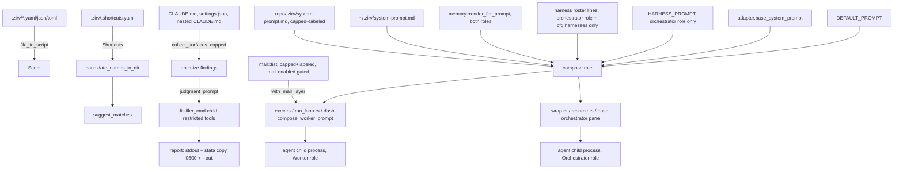

# Utilities

## Quick Reference

- **Files:** `src/utils.rs`; also covers `src/commands/ctx/optimize.rs` (the `zirv ctx optimize` verb) and `src/commands/ctx/prompt.rs` (the injected session prompt), since both build directly on `utils.rs` and share its trust-boundary conventions
- **Used by:** [[Script Runner]] (`file_to_script`/`parse_script_content` turn a `.zirv/` file into the `Script` it executes), [[Built-in Commands]] (`is_reserved_command` gates every user script/shortcut name, `candidate_names_in_dir`/`suggest_matches` power the "did you mean" error), [[Ctx Subsystem]] (`optimize` is a `ctx` verb; `prompt.rs` is called from every session-launching supervisor)
- **Depends on:** [[Ctx Adapters]] for `distiller_cmd` (the restricted-child mechanism `optimize.rs` reuses via `handoff::run_model`), `AgentAdapter::base_system_prompt` (the adapter layer `prompt.rs` splices in), and `adapters::harness_prompt_lines` (the derived roster layer `prompt.rs` folds in as data, never reading the adapter registry itself); [[Ctx Supervisors]] for `prompt::compose`'s callers (`exec.rs`, `wrap.rs`, `run_loop.rs`, `resume.rs`, `chat.rs`'s `dash_orchestrator_pane`, `dash/mod.rs`'s `compose_worker_prompt`)
- **Tests:** `src/utils.rs` has an inline `#[cfg(test)] mod tests` covering `levenshtein`, `truncate_bytes` (char-boundary safety), `suggest_matches` (ordering, distance cutoff, case-insensitivity, the O(n·m)-matrix short-circuit for a 400,000-char argv), and `candidate_names_in_dir` (scripts + shortcuts, `ctx.toml` exclusion, missing dir). `optimize.rs` has its own large `#[cfg(test)] mod tests`; the report-only guarantee is asserted by `the_verb_never_modifies_an_analysed_file`, which snapshots every file under the fixture repo and home directories before and after `run_with(...)` and asserts the snapshots are byte-identical (`tree_snapshot`, sorted `(path, contents)` pairs). `prompt.rs` has its own inline tests covering layer composition, the `--simple`/`enabled=false` opt-outs, and the adapter/repo/command-line splice order.
- **If changed:** [[Script Runner]], [[Built-in Commands]], [[Ctx Subsystem]], [[Ctx Adapters]], [[Ctx Supervisors]], [[Untrusted Configuration]], [[Script Files]], [[Shortcuts]], [[Context Management]], [[Decision Log]]
- **Gotchas:** `zirv ctx optimize` is report-only — it writes only to stdout, its own timestamped copy under the state dir, and an explicit `--out` path, both via `state::write_private` (on Unix this creates the file `0600` and re-asserts that mode even if the path already existed; on non-Unix, including this repo's own Windows dev environment, `write_private` is a plain `fs::write` with no permission restriction). It never edits `CLAUDE.md`, `settings.json`, or any other analysed file; a test proves it by hashing the repo and home trees before and after a run. Its judgment-model child goes through the same restricted `distiller_cmd` path as handoff distillation (see [[Ctx Adapters]]) — not a separate, looser code path — because the prompt it builds embeds untrusted repo `CLAUDE.md` text. Separately, `prompt.rs`'s repo layer (`<repo>/.zirv/system-prompt.md`) cannot enable or widen itself: a repo `ctx.toml` that tries to set `prompt.enabled`, `prompt.repo_layer`, `prompt.max_repo_bytes`, or (2026-08-16) `prompt.harnesses` is a **hard config-load error**, not a silently-ignored one — only `~/.zirv/ctx.toml` or `ZIRV_CTX_PROMPT*` env vars (the operator) may set those keys. See [[Untrusted Configuration]].

## Purpose

`src/utils.rs` is the small, dependency-light layer everything else in the CLI leans on: turning a script file into a `Script`, deciding whether a name collides with a built-in, and fuzzy-matching a mistyped command name against what's actually in a `.zirv/` directory. Two `ctx` modules extend the same "treat repo content as untrusted, cap what you read, never surprise the user" posture at larger scale: `optimize.rs` (an analysis-only verb) and `prompt.rs` (the text injected into every zirv-launched agent session).

## How It Works — `utils.rs`

**Parsing.** `SUPPORTED_EXTENSIONS` is `["yaml", "yml", "json", "toml"]`. `file_to_script` reads a path, lowercases its extension, and hands off to `parse_script_content`, which dispatches to `serde_yaml_ng`, `serde_json`, or `toml` to deserialize into a `Script` (see [[Script Runner]] for that type's shape). An unrecognized extension is a plain `Err`, not a panic.

**Reserved names.** `SCRIPT_DIR_NAME` is `.zirv`. `RESERVED_COMMANDS` lists the built-in top-level names and short aliases handled in `main.rs` before any script lookup: `help`/`h`, `version`/`v`, `init`/`i`, `create`/`c`, `ctx`, `chat`, `agent`. `is_reserved_command` compares case-insensitively (`eq_ignore_ascii_case`, mirroring `is_reserved_zirv_file` below) rather than exact membership: NTFS/APFS resolve a script file case-insensitively, so `Chat.yaml` is exactly as unreachable as `chat.yaml` would be, even though only the lowercase spelling is literally intercepted as the `chat` alias in `main.rs`. Because these are intercepted first, a `.zirv/ctx.yaml` or a shortcut named `help` can never be reached — see [[Built-in Commands]].

**Shortcuts.** `Shortcuts` is `{ shortcuts: HashMap<String, String> }`, deserialized from a directory's `.shortcuts.yaml` (short alias → script filename). See [[Shortcuts]].

**Home directory.** `home_dir()` tries `$HOME` then `%USERPROFILE%`, so it resolves on both Unix and Windows.

**"Did you mean" suggestions.** `levenshtein` computes char-based (not byte-based) edit distance so non-ASCII names compare correctly. `suggest_matches(target, candidates)` scores every candidate, skips exact matches and duplicates, applies a length-scaled threshold (`max_suggestion_distance`: 1 for names ≤3 chars, 2 for 4-5, 3 beyond) with a cheap length-difference short-circuit *before* running the O(n·m) matrix — this matters because a mistyped multi-hundred-thousand-character argv must not be diffed character-by-character against every script name — and returns up to 3 matches, closest first, ties broken alphabetically. `candidate_names_in_dir(dir)` gathers the invocable names in a `.zirv/` directory: the file stem of every file with a supported extension (excluding `RESERVED_ZIRV_FILES`), plus every shortcut key; a missing or unreadable directory yields an empty list rather than an error. Together these power the not-found error in `Input::get_file_path`.

**`RESERVED_ZIRV_FILES`.** `[".shortcuts.yaml", "ctx.toml", ".settings.toml"]` — zirv's own configuration files inside a `.zirv/` directory, never invocable scripts. `is_reserved_zirv_file(name)` compares against this list with `eq_ignore_ascii_case`, not exact equality: NTFS (and APFS by default) resolve a file case-insensitively, so `Path::exists` finds `.Settings.toml` when asked for `.settings.toml`, and the guard has to agree or a differently-cased reserved file would be honored by `AgentGate`/`CtxConfig` while still being listed as an invocable script and resolvable as one. This is deliberately stricter than every filesystem requires — on ext4, `CTX.toml` is a distinct, ordinary file from `ctx.toml`, and the guard excludes it anyway — because the goal is one rule that behaves the same everywhere zirv runs, not the minimum each platform demands. Used by `candidate_names_in_dir` here, by `help.rs`'s script listing, and by `input.rs`'s `find_script_in_dir` (so a literal `zirv .settings` cannot resolve `.settings.toml` as a script).

**Shared helper.** `truncate_bytes(text, cap)` truncates a `String` to at most `cap` bytes, backing off to the nearest earlier char boundary so the result is always valid UTF-8 (an `Option<usize>` cap of `None` means unlimited). It's the one place `optimize.rs`, `prompt.rs`, and `mail.rs` (both the per-message cap in `store` and the whole-delivered-batch cap in `with_mail_layer`) cap untrusted or semi-trusted text, so all three cap the same way.

## How It Works — `zirv ctx optimize` (`optimize.rs`)

`optimize` is an analysis verb: it reads the configuration surfaces that steer a session, looks for friction in recent transcripts, optionally asks a small model to judge the surfaces, and prints a report. It never edits anything it analyses.

**Surfaces collected** (`collect_surfaces`, capped at `MAX_SURFACES = 40`, each file capped at `cfg.optimize.max_surface_bytes`, default 200,000 bytes): global `CLAUDE.md` (`~/CLAUDE.md` and `~/.claude/CLAUDE.md`), the repo's own `CLAUDE.md`, every nested `CLAUDE.md` up to `MAX_NESTED_DEPTH = 4` directories deep (symlinked directories are skipped so a link can't walk the scan outside the repository), and user/project/local `settings.json`. Settings-layer surfaces are flagged `is_settings()` and their values are never sent to the judgment model verbatim, since an `env` block routinely holds secrets.

**Evidence collected**: the newest sampled sessions' transcripts (`cfg.optimize.sessions_sampled`, default 10, overridable with `--sessions`), parsed through the same `AgentAdapter` the other ctx verbs use, plus recent lines from zirv's own decision log (`LOG_LINES_SAMPLED = 500`) — both read-only.

**Findings** come from three deterministic linters (`lint_redundancy`, `lint_dead_references`, `friction_findings`) plus, unless `--no-model` is passed, one call to a judgment/distiller model built from `judgment_prompt(surfaces, evidence, ...)`. That call goes through `handoff::run_model`, which builds its child process via `adapter.distiller_cmd(model)` — the same tool-restricted command builder handoff distillation uses (see [[Ctx Adapters]]), not a separate path — which matters because the prompt embeds raw repo `CLAUDE.md` text that must be treated as untrusted (see [[Untrusted Configuration]]). A failed or unavailable model degrades the report to deterministic findings only; it never fails the run.

**Output, and the report-only guarantee**: the rendered report is written to stdout, and best-effort to a timestamped copy under the state dir (`<state>/optimize-reports/<repo-slug>/<epoch>-report.md`, with a numeric suffix if two runs land in the same wall-clock second — `unique_report_path`) via `state::write_private`. On Unix that helper creates the file mode `0600` and re-sets that mode even if a file already existed at the path, rather than leaving whatever a prior `touch` left behind; on non-Unix it's a plain `fs::write`. If `--out <path>` is given, the same helper writes the report there too. No other write happens. This is exercised directly by `the_verb_never_modifies_an_analysed_file`, which snapshots the full fixture repo tree and home tree (every file's path and contents) before calling `run_with(...)` and asserts both snapshots are unchanged afterward — including the global `CLAUDE.md` layer.

Args (`OptimizeArgs`): `--agent` (adapter override), `--no-model` (skip the judgment call), `--sessions <n>` (override the sample size), `--out <path>` (extra write target).

## How It Works — the injected session prompt (`prompt.rs`)

`prompt::compose(home, repo, simple, cfg: &PromptConfig, role: PromptRole, memory: &[MemoryLine], memory_cap: usize, harness_lines: &[String])` builds the text zirv injects as the agent's system prompt for a launched session, or returns `None` when nothing should be injected (`simple` — e.g. `--simple` — or `cfg.enabled == false` both suppress it entirely, including the shipped default). `role` is `PromptRole::Orchestrator` for `zirv ctx chat`'s own `wrap`/dashboard-orchestrator launch and `PromptRole::Worker` for every other caller — it gates the Harness and Harnesses-roster layers below, the mechanism that keeps a delegated worker from being taught to delegate further (see [[Ctx Supervisors]], [[Context Management]]). `memory`/`memory_cap` are the repo's memory bank, already rendered by the caller (`memory::render_for_prompt`); `harness_lines` is the derived per-adapter roster, already rendered by the caller (`adapters::harness_prompt_lines`) — `compose` itself stays free of both the memory store and the adapter registry it would otherwise need to read.

**Layers, in fixed order** (`v5` as of 2026-08-16; `v2` added the Adapter layer, `v3` added Harness, `v4` added Memory, `v5` added the Harnesses roster), each separated by a `---` divider — Mail and Command-line are not part of `compose` itself, added afterward by separate calls (see below):

1. **Default** — `DEFAULT_PROMPT`, a zirv-authored, deliberately short, five-rule floor, `(v2)` as of 2026-08-17 (follow the repo's own conventions and let a repository instruction file win over these defaults; prefer deterministic tool use; report failures honestly rather than describing unverified work as done; verify once then trust the result instead of re-checking; keep scope to what was asked and prefer the simplest solution). For an adapter with no system-prompt mechanism (codex), `task_prompt_with_conventions_fallback` appends this same layer onto a headless worker's task prompt text — applied before the mail and report-back fallbacks at all six finalization sites, and unlike mail it respects `--simple` (conventions are zirv guidance; mail would otherwise be destroyed). See [[Ctx Adapters]] for the delivery-channel table.
2. **Adapter** (spliced in right after Default, by `with_adapter_layer`, called from the supervisor after the adapter is known — `compose` itself doesn't see the adapter) — `AgentAdapter::base_system_prompt()`, agent-specific text naming that agent's own tools, so only that agent ever gets it. `None` by default; only the claude adapter currently overrides it.
3. **Harness** (`HARNESS_PROMPT`, orchestrator only — `compose` inserts this itself, immediately after Default, when `role == PromptRole::Orchestrator`) — deterministic, agent-agnostic teaching about zirv as a meta-harness: self-initiative guidance (delegate via `zirv ctx agent`, poll `zirv ctx status`/`inbox` at checkpoints, steer via `send`/`nudge`, persist via `remember`/`recall`), exchanging notes via `zirv ctx send`/`inbox`, and zirv's own bounded cross-harness review policy. A `PromptRole::Worker` session never gets this layer, which is what keeps a delegated run from being taught to delegate further.
4. **Harnesses** (the derived roster, orchestrator only, immediately after Harness — `PromptSource::Harnesses`, added 2026-08-16) — one line per registered adapter (`harness_lines`, rendered by the caller via `adapters::harness_prompt_lines`; see [[Ctx Adapters]]) naming whether each is enabled+ready and how to reach it with `zirv agent <name> "<prompt>"`, installed-but-not-ready, or disabled-and-where. Gated on both `role == Orchestrator` and `cfg.harnesses`, and a no-op when the rendered slice is empty.
5. **Memory** (`with_memory_layer`, folded inside `compose` itself right after the Harness/Harnesses layers — `PromptSource::Memory`, added `v4`) — durable repository facts from the memory bank (`memory::render_for_prompt`), goes to **both** roles (unlike Harness/Harnesses), empty when `cfg.memory.enabled` is false. See [[Ctx Subsystem]]'s "Sessions and Memory" section.
6. **User** — `~/.zirv/system-prompt.md`, read uncapped (the operator's own file).
7. **Repo** — `<repo>/.zirv/system-prompt.md`, read only when `cfg.repo_layer` is true and truncated to `cfg.max_repo_bytes` (default 4096) via `truncate_bytes`. It is explicitly labeled in the composed text as coming from the repository checkout and told it does not override anything above it and grants no permissions — the same "capped, labeled, can't enable itself" treatment `CLAUDE.md` gets in `optimize.rs`'s judgment prompt.
8. **Mail** (`with_mail_layer`, a separate function called after `compose` returns, by `exec.rs`/`run_loop.rs` and the dashboard's own worker-pane composition (`dash/mod.rs::compose_worker_prompt`) — never by `wrap.rs`/`resume.rs`/the dashboard's orchestrator pane) — unread mail for the repo (`mail::list`), capped as a whole batch to `cfg.mail.max_delivered_bytes` and labeled the same way the repo layer is, gated by `cfg.mail.enabled`. See [[Untrusted Configuration]]'s "Mail" section and [[Ctx Supervisors]].
9. **Command-line** — the operator's own `--system-prompt`/equivalent flag value, added last as the highest-priority layer, by `merge_command_line_prompt`.

`PromptConfig` (`src/commands/ctx/config.rs`) has four fields: `enabled` (default `true`), `repo_layer` (default `true`), `max_repo_bytes` (default `4096`), and `harnesses` (default `true`, added 2026-08-16 — the roster layer's own on/off switch). All four are on the `REPO_FORBIDDEN` list in `config.rs`, alongside `mail.enabled`/`mail.max_delivered_bytes` and `chrome.events` (same rationale, extended to the Mail layer, the announcement channel, and now the roster layer): if a repository's own `.zirv/ctx.toml` sets any of them, `CtxConfig::load` returns a hard error naming the key and where it belongs instead (`~/.zirv/ctx.toml` or the corresponding `ZIRV_CTX_*` env var) — a repo checkout cannot raise its own cap, turn its own layer on, or re-enable/silence something the operator decided, and the failure mode is loud rather than a silently-clamped value.

**Injection point**: `compose` is called from every session-launching verb — `exec.rs` (twice: initial launch and nudge relaunch), `wrap.rs`, `run_loop.rs`, `resume.rs`, `chat.rs`'s `dash_orchestrator_pane`, and the dashboard's own `dash/mod.rs::compose_worker_prompt` (all under `src/commands/ctx/`) — each of which resolves `cfg.prompt`, calls `compose` with its own `PromptRole` and rendered memory/roster lines, splices in the adapter layer once the adapter is chosen, and delivers the composed text to the child process via the adapter's system-prompt mechanism (a file-flag or inline-flag argv, per `AgentAdapter::system_prompt_file_flag`/`user_system_prompt_flag`). `exec.rs`/`run_loop.rs`/`compose_worker_prompt` additionally call `with_mail_layer` before delivery. `ComposedPrompt::describe()` produces a one-line `"<version> layers: default+adapter+harness+...+mail+..."` summary that gets attributed in the decision log, so a transcript can be traced back to exactly which layers shaped it.

## Data Flow

